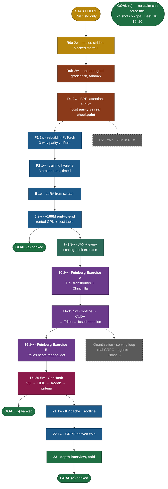

# COURSE_MAP.md — the 0 → frontier-lab arc

> **The spine.** Progress is measured in **claims**, not modules. Phases survive as groupings; claims are the rows.
>
> Read alongside: [DECISIONS.md](DECISIONS.md) · [CONVENTIONS.md](CONVENTIONS.md) · [RESOURCES.md](RESOURCES.md) · [MENTOR.md](../MENTOR.md) · [frontier-lab.md](../frontier-lab.md).
>
> Per-claim status lives in [PROGRESS.md](PROGRESS.md). This file shows the *shape* of the arc.

---

## North star (don't lose this)

The endpoint is **frontier-lab readiness** as defined in `frontier-lab.md`: mathematical maturity + a public artifact that proves a specific skill the lab needs, lived out at the **edges** of the stack (kernels below, agent loops above). The capstone signals are concrete: a 10M-param JAX transformer doing digit addition on a TPU you derived Chinchilla laws for, a Pallas kernel that beats `ragged_dot`, **a GenHash benchmark putting a reproduced HiFiC against JPEG XL on Kodak with your own plots and an honest read on where the field actually is**, and a public repo with handwritten derivations and recorded build sessions backing it all up.

Everything below routes toward that endpoint.

---

## CHECKPOINT — April 2027 (EF / founding-engineer readiness)

**Set 2026-08-05. 34 weeks out. 12–15 hrs/week ⇒ ~410–512 hours. Budget: 32 claim-weeks + 2 weeks slack.**

Frontier-lab-ready is a **superset** of founding-engineer-ready. This checkpoint is not a smaller goal substituted for the north star — it is what must already be **banked partway along the same arc**. By April 2027 the following must be **provably true**, on disk, not in intention:

**(a) A small LLM (~100M params) trained end-to-end on my own implementation.**
Committed loss curves, a written failure-mode log (what diverged, what I changed, what it cost me), and an itemized dollar cost. Banked by **Claim 6**.

**(b) GenHash capstone complete.**
HiFiC reproduced at small scale, benchmarked against JPEG XL on Kodak with LPIPS/SSIM/FID and my own plots, plus an honest "here's where the field actually is" writeup positioning it against Control-GIC and the VQ-codec literature. Banked by **Claims 17–20**.

**(c) At least one public artifact that a recognizable ML person shared unprompted.**
This one cannot be forced by a claim — nobody can be made to share your work. It is structured as ~24 shots on goal: every claim ships an artifact. The three highest-probability shots are **Claim 10** (Feinberg Exercise A), **Claim 16** (Feinberg Exercise B), and **Claim 20** (the GenHash benchmark writeup).

**(d) I can pass a founding-engineer depth interview at a serious AI company cold.**
Rederive backprop, attention, Chinchilla and a roofline on demand with no notes; defend the 100M run's failure modes; defend the GenHash benchmark; whiteboard the fused-attention kernel. Graded honestly against an unseen mock. Banked by **Claim 23**, fed continuously by `REVIEW.md`.

**Honest read on the budget.** Three capstone-grade artifacts (Exercise A, Exercise B, GenHash) plus a 100M scale-up in 32 claim-weeks is aggressive. The compressible block is kernels-core (Claims 11–15); if the schedule slips, that descopes first and Exercise B goes with it. Goals (a) and (b) both need paid compute — order a few hundred dollars of A100 time. Goal (a) asks for documented cost, so this is a deliverable, not a hidden problem.

---

## What a claim is

A claim is **not** a topic. "Understand attention" is not a claim. "I can implement KV-cache inference from scratch matching HuggingFace token-for-token" is.

Every claim has four parts, and all four are fixed **before** work starts:

1. **One falsifiable capability statement** — phrased "I can …", and it must be possible to be wrong.
2. **An acceptance test named up front** — a parity test, a benchmark, a reproduction target, or a cold rederivation. Named before the work, never retrofitted to what happened to get built.
3. **A timebox of 1–2 weeks.** If a claim would take longer, it is split. Not extended.
4. **A terminal event: a shipped public artifact** — post, plot, benchmark, or writeup derived from the work. Max ~1 extra hour. Raw and honest; no polish pass. **A claim without its artifact is not done.**

---

## Current position (honest, 2026-08-05)

Phase 0 is **scaffolded, not proven**. Every module has prose, starter, solution, parity test, and `hand_math/` + `evidence/` READMEs. What does **not** exist:

- No parity test has been run in a venv by me. The torch assertions are written and spot-verified numpy-side only — **unverified**.
- No `hand_math/` derivation exists. The folders hold "what goes here" READMEs and nothing else.
- No `evidence/` output exists. Same.
- The cold quiz (`REVIEW.md` R-001 … R-008) was posed and **paused**. Never taken.

So: nothing in Phase 0 is proven — and per **D-0009 (2026-08-10) it is not going to be closed in Python.** Because Phase 0 was only ever scaffolded, nothing is lost by rebuilding it, so the from-scratch core is being rebuilt in **Rust with `std` only** — strictly deeper on the axis the north star cares about. The Python `phase0/` tree is retained untouched as trail: superseded, not deleted.

**The active claim is R0a — the strided tensor and the blocked matmul.** Everything downstream is `⬜ not started`.

Status legend: ⬜ not started · 🟨 in progress · ✅ proven (test run, quiz passed, artifact shipped).

---

## The claim ladder

`CP` = on the CHECKPOINT path (required for April 2027). `CONT` = continuation, post-checkpoint.
One paper per week, every week, matched to the active claim. Log format: [`papers/READING_LOG.md`](papers/READING_LOG.md).

### The whole ladder, in one picture

**Colour key.** 🟫 Rust, `std` only · 🟦 PyTorch · 🟩 JAX/TPU · 🟪 kernels · 🟥 GenHash · ⬜ dashed = CONTINUATION, after April 2027.

---

### Phase 0–1 — GPT-2 in Rust, from nothing (replaces old Claims 1–4, per D-0009)

Full day-by-day design, verification strategy and constraint rulings: [`RUST_PHASE_0_1.md`](RUST_PHASE_0_1.md).
Constraint: Rust `std` + toolchain only. No ndarray, nalgebra, candle, burn, tch, tokenizers, BLAS, or autodiff crate.

| # | Claim | Acceptance test | Box | Artifact | Path | Paper |
|---|---|---|---|---|---|---|
| **R0a** | I can implement a strided, broadcasting tensor library in Rust with a cache-blocked multithreaded matmul, and prove it correct with no reference implementation. | Property tests green (permute round-trip, broadcast scaling, matmul associativity, `(AB)ᵀ=BᵀAᵀ`); `blocked_matches_naive` at non-multiple-of-block sizes; committed GFLOP/s table vs. block size and thread count, with measured % of the M4's ~550 GFLOP/s peak. | 2w | Post: the blocking result — same FLOPs, same output, N× faster — with the roofline arithmetic. | **CP** | Attention Is All You Need — re-read with my own attention code open in the other tab. |
| **R0b** | I can implement reverse-mode autodiff over that library, unaided, and prove every gradient correct with no reference implementation. | `all_ops_gradchecked` passes for **every** op (central-difference in `f64`, rel. err < 1e-5) **and has been watched to fail** under an injected bug; the projected variant catches a sign flip the plain sum misses; two-spiral MLP >99% train acc. on my own AdamW; loss curve in `evidence/`. | 2w | Post: the tape-vs-`Rc<RefCell>` design story + the gradient-checker-that-catches-its-own-bugs. | **CP** | AdamW (Loshchilov & Hutter 2017). |
| **R1** | I can load OpenAI's published GPT-2 124M checkpoint into my own Rust implementation and reproduce its output token-for-token. | max \|logit_mine − logit_ref\| < 1e-3 over the full 50257 vocab for 3 fixed prompts; 20-token greedy decode **byte-identical** to the HF reference string; `tiktoken_parity` 200/200; `param_count_is_124m` = 124,439,808. `evidence/parity.md` committed. | 2w | Post + terminal recording: my Rust GPT-2 emitting the same 20 tokens as OpenAI's. | **CP** | GPT-2 (Radford 2019) — read for the architecture deltas I had to implement. |

### Phase 1 — Real training & fine-tuning → banks goal (a)

| # | Claim | Acceptance test | Box | Artifact | Path | Paper |
|---|---|---|---|---|---|---|
### The PyTorch block — libraries allowed, theory already banked (per D-0010)

Everything above is `std` only. **This block reverses the constraint on purpose.** The Rust work proves the theory; this block buys the tool everyone actually trains in. It closes the training gap that R0a/R0b/R1 leave open, and Claims 5–6 need PyTorch fluency regardless. **pandas is not in scope — it does nothing for language-model work.**

| # | Claim | Acceptance test | Box | Artifact | Path | Paper |
|---|---|---|---|---|---|---|
| **P1** | I can rebuild GPT-2 in PyTorch and show it agrees with my Rust implementation numerically. | GPT-2 124M rebuilt with `torch.nn`. **3-way parity:** my Rust ↔ my PyTorch ↔ HuggingFace, max logit delta < 1e-4 on the same 3 prompts. NumPy/PyTorch drills passed (broadcasting, `einsum`, in-place vs. autograd traps). A written list of every place the framework does something my Rust does not. | 1w | Post: what a framework actually buys you, measured — lines of code, wall-clock, and the 3-way parity table. | **CP** | GPT-2 (Radford 2019) — re-read now that I have implemented it twice. |
| **P2** | I can train a GPT with real hygiene and diagnose a broken run from loss / grad-norm / param-norm alone in under 15 minutes. | Warmup + cosine LR, grad clipping, bf16, eval intervals, checkpoint/resume on tinyshakespeare → ≤1.4 nats, each choice defended against an ablation. Then **3 deliberately broken runs (bad LR, missing LayerNorm, masking bug), each diagnosed timed under 15 min, without reading the diff.** Logged to `evidence/debug_log.md`. | 1w | Post: the three failure signatures, with the curves. | **CP** | AdamW (Loshchilov & Hutter 2017) → Chinchilla (Hoffmann 2022) — **derive N:D ≈ 1:20 by hand.** `hand_math/` gate. |

> **R2 (train the ~20M in Rust) moved to CONTINUATION by D-0010.** It is the purer artifact but it does not serve the checkpoint: goal (a) is a ~100M PyTorch run on rented GPU. Keeping both cost ~4 extra weeks and would have made kernels-core the near-certain descope. The Rust engine stays capable of it — Phase 2 is a config-and-compute problem, which was the design goal all along.
| **5** | I can implement LoRA from scratch and show ~1% trainable params measurably changes behavior. | No `peft`. Low-rank decomposition written by hand; trainable-param fraction reported; eval improvement on a target style over the base. | 1w | Post: before/after generations + the parameter-count math. | **CP** | LoRA (Hu 2021). |
| **6** | **I can train a ~100M-param LM end-to-end on my own implementation, and account for its loss curve, failure modes, and dollar cost.** | ~100M model trained to a pre-committed target loss on my own model code (PyTorch as tensor backend; architecture and training loop mine — not HF `Trainer`). Loss curves + failure-mode log + **itemized cost table** committed. Generations sampled. | 2w | Post: the full run writeup — including every divergence and what it cost. | **CP → (a)** | GPT-3 (Brown 2020) — read for the scale framing, not the results. |

### JAX + scaling (was Phase 3's primer; Phase 3 as a standalone phase is dissolved)

| # | Claim | Acceptance test | Box | Artifact | Path | Paper |
|---|---|---|---|---|---|---|
| **7** | I can write pure-functional JAX and explain what `jit`/`grad`/`vmap` do to the trace. | J1 drills pass; I can read a printed jaxpr cold and say what each line came from. | 1w | Post: the jaxpr walkthrough. | **CP** | Autodidax / *Compiling ML programs via high-level tracing* (Frostig 2018). |
| **8** | I can rebuild the Phase 0 GPT in JAX/Flax/Optax and match PyTorch forward to 1e-4. | Parity test, JAX vs PyTorch reference, same seed, 1e-4. (Collapses old 3.J2–J4.) | 1w | Post: the port diff + the parity numbers. | **CP** | *How to Scale Your Model*, ch. 1–3. |
| **9** | I can roofline any op cold, and I've done **every** exercise in *How to Scale Your Model*. | All exercises done in pencil, photographed to `hand_math/`. Then: roofline an op I haven't seen before, cold, on a whiteboard, correctly. | 2w | Post: one fully worked roofline + the exercise photo set. | **CP** | *How to Scale Your Model*, remaining chapters. **Phase-4 prerequisite.** |

### Phase 4 — Kernels: below the stack

| # | Claim | Acceptance test | Box | Artifact | Path | Paper |
|---|---|---|---|---|---|---|
| **10** | **I can build a 10M-param JAX transformer on free Colab TPU that learns 3-digit addition, and derive its Chinchilla scaling laws by hand for dense and MoE.** *(Feinberg Exercise A)* | Trains to ≥99% on held-out addition. `hand_math/chinchilla_dense_moe.md` committed. Build **screen-recorded**. `jax + flax + optax` only. | 2w | The repo + the recording + a post walking the derivation. | **CP → (c)** | Switch Transformer (Fedus 2021) — for the MoE half of the derivation. |
| **11** | I can write CUDA-C and explain the memory hierarchy from registers to HBM without notes. | Vector-add kernel runs; memory-hierarchy diagram drawn cold; measured bandwidth compared against spec. | 1w | Post: the diagram + measured-vs-spec bandwidth. | **CP** | PMPP ch. 1–4 *(book, not a paper — logged the same way)*. |
| **12** | I can write a tiled shared-memory matmul that beats naive by ≥5× and explain the speedup from the roofline. | Measured ≥5× on a T4; roofline computed **before** optimizing predicts the direction of the win. | 1w | Post: the benchmark + the roofline that called it. | **CP** | *Anatomy of High-Performance Matrix Multiplication* (Goto & van de Geijn 2008). |
| **13** | I can implement online softmax and a fused LayerNorm/RMSNorm kernel. | Numerical parity with PyTorch to 1e-5; single-pass online softmax verified against the naive three-pass version. | 1w | Post: why one pass is possible at all. | **CP** | *Online normalizer calculation for softmax* (Milakov & Gimelshein 2018). |
| **14** | I can profile naive attention to find the HBM bottleneck, then write a fused attention kernel that beats it by ≥3× on a T4. | Profiler output showing the bottleneck **before** the fix; measured ≥3× after; roofline explaining the cause in one paragraph. | 2w | Post: the profile, the fix, the number. | **CP** | FlashAttention v1 (Dao 2022) — find the one sentence that motivates the whole paper. |
| **15** | I can write the same fused attention in Triton and in Pallas. | Both match the CUDA version numerically; all three benchmarked side by side. | 1w | Post: three implementations, one table. | **CP** | Triton (Tillet 2019). |

### Phase 5 — Quantization

| # | Claim | Acceptance test | Box | Artifact | Path | Paper |
|---|---|---|---|---|---|---|
| **16** | **I can write a Pallas kernel that beats `jax.lax.ragged_dot` for `F > D` by fusing up/down projections, and explain why the speedup exists.** *(Feinberg Exercise B)* | A setting with a **measured** forward-pass speedup, committed to `evidence/`, plus a one-paragraph cause-of-speedup explanation that survives being questioned. | 2w | The kernel + the benchmark + the explanation post. | **CP → (c)** | MegaBlocks (Gale 2022) — MoE kernel framing. |
| — | INT8 from scratch; LLM.int8() outlier reproduction *(old 5.1, 5.2)* | — | — | — | **CONT** | first up post-checkpoint |
| — | QuIP / QuIP# / QTIP 2-bit reproduction; AQLM + PV-Tuning *(old 5.3, 5.4)* | — | — | — | **CONT** | — |

### GenHash — capstone track → banks goal (b)

**Reproduction-first. Novelty claims are banned until Claim 19's benchmark exists.** Sequenced here deliberately: after real training skills (Phase 1) and after the VQ / perceptual-loss prerequisite, not before.

| # | Claim | Acceptance test | Box | Artifact | Path | Paper |
|---|---|---|---|---|---|---|
| **17** | I can implement VQ-VAE with a straight-through estimator and an LPIPS perceptual loss, matching reference reconstruction quality. | Trained on a small image corpus; reconstruction LPIPS within a pre-committed margin of the reference implementation; codebook collapse checked for and reported either way. | 2w | Post: reconstructions + the codebook-usage histogram. | **CP** | VQ-VAE (van den Oord 2017). |
| **18** | I can reproduce HiFiC at small scale — generative compression that beats a classical codec at low bitrate on my own eval. | HiFiC repro trained; rate–distortion–perception curve produced on a held-out set; beats JPEG at matched bitrate on LPIPS. | 2w | Post: the RDP curve + honest sample comparisons. | **CP** | HiFiC (Mentzer 2020). |
| **19** | I can benchmark my codec against JPEG XL on Kodak with LPIPS, SSIM and FID, on my own plots. | Full Kodak sweep, all 3 metrics, plots generated by my own script, reproducible end-to-end from a committed command. | 1w | The plots + the reproduction script. | **CP** | JPEG XL (Alakuijala 2019). |
| **20** | I can position my result honestly against Control-GIC and the VQ-codec literature — **including where I lose.** | A writeup that names where the field actually is, what my repro does not match, and which of my numbers are not comparable. Survives an adversarial read. | 1w | **The writeup — the terminal artifact for goal (b).** | **CP → (b)(c)** | Control-GIC (2024). |

### Phase 6 — Inference engine: above the stack pt 1

| # | Claim | Acceptance test | Box | Artifact | Path | Paper |
|---|---|---|---|---|---|---|
| **21** | I can add a KV cache to my GPT and explain the prefill/decode roofline split. | Measured tokens/sec speedup; both phases rooflined separately; greedy decode matches the uncached path token-for-token. | 1w | Post: the two rooflines, and why they differ. | **CP** | PagedAttention / vLLM (Kwon 2023). |
| — | Paged attention; continuous batching; nano-vLLM reproduction; SnapKV *(old 6.3–6.6)* | — | — | — | **CONT** | — |

### Phase 2 — Reasoning & RL

| # | Claim | Acceptance test | Box | Artifact | Path | Paper |
|---|---|---|---|---|---|---|
| **22** | I can derive the GRPO objective cold and explain why advantage normalization stabilizes it versus vanilla policy gradient. | Derived on a whiteboard with no notes, including the KL-to-reference term. Toy GRPO run on my own model with a synthetic reward, showing the reward move. | 1w | Post: the derivation + the toy run. | **CP** | DeepSeekMath / GRPO (Shao 2024). |
| — | REINFORCE → PPO from scratch; real GRPO on a small base (GSM8K-tier); reward-shaping failure catalog *(old 2.1, 2.2, 2.4, 2.5)* | — | — | — | **CONT** | — |

### The checkpoint gate

| # | Claim | Acceptance test | Box | Artifact | Path | Paper |
|---|---|---|---|---|---|---|
| **23** | **I can pass a founding-engineer depth interview at a serious AI company cold.** | An unseen mock, no notes: rederive backprop, attention scaling, Chinchilla, and a roofline on demand; defend the 100M run's failure modes; defend the GenHash benchmark against a skeptic; whiteboard the fused-attention kernel. Graded honestly — a pass claimed without a real mock is not a pass. | 1w | Post: what I could not answer. | **CP → (d)** | Reader's choice — fill the gap the mock exposes. |

**Claim-weeks on the CHECKPOINT path: 32.** Slack: 2 weeks.

### CONTINUATION — the rest of the frontier-lab arc

Sequenced after April 2027, in dependency order. Not lesser work — later work.

| Block | What | Why it is post-checkpoint |
|---|---|---|
| Phase 5 quantization proper | INT8 → LLM.int8() → QuIP/QuIP#/QTIP → AQLM + PV-Tuning | Not required by (a)–(d). First up post-checkpoint — highest interview value of the remainder. |
| Phase 6 back half | Paged attention → continuous batching → nano-vLLM → SnapKV | Claim 21 banks the interview-relevant core; the serving loop is a multi-week build with no checkpoint dependency. |
| Phase 2 back half | REINFORCE → PPO → real GRPO on a base model → reward-hacking catalog | Claim 22 banks the derivation, which is what (d) needs. Real GRPO on a GSM8K-tier task is a compute-heavy multi-week run. |
| Phase 7 — agents | The full hypothesis-driven measured experiment, ADRS-style writeup | Track 2 of `frontier-lab.md`. Genuinely valuable, entirely independent of (a)–(d). |
| **Phase 8 — build your own PyTorch** | 8.1 core → 8.2 training → 8.3 kernels → 8.4 inference → 8.5 train a 12M LM → 8.6 publish | 3–4 months on its own. Its 12M model proves *the framework*, not *scale* — so it cannot serve goal (a), and pulling it before April would consume the entire budget. See [PHASE8_FRAMEWORK.md](PHASE8_FRAMEWORK.md) and [D-0007](DECISIONS.md). |

---

## The weekly paper track

**One paper per week, every week.** Not a phase, not a block — a constant. Chosen to match the active claim wherever possible: attention papers during attention claims, compression papers during GenHash claims.

Every paper gets one entry in [`papers/READING_LOG.md`](papers/READING_LOG.md), fixed format, **≤1 page**:

1. **Claim it supports / why this paper now**
2. **The core result, reconstructed** — code, rederivation, or hand-drawn figure
3. **What I'd have to build to reimplement this**
4. **What clicked / what is still confusing** — honest, and "still confusing" is expected to be non-empty
5. **One spaced-repetition question added to `REVIEW.md`**

*How to Scale Your Model* keeps its special status: **every exercise**, in pencil, as the Phase-4 prerequisite (Claim 9).

---

## Session protocol

**At session start, the mentor states:**

1. The **active claim** and its exact acceptance test.
2. **Days remaining** in its timebox.
3. **This week's paper.**
4. **Weeks remaining to the April 2027 checkpoint.**

Then, per `MENTOR.md` Parts D/E: reads `PROGRESS.md`, `SKILLS.md`, `REVIEW.md`, `MENTOR_LOG.md`, `DECISIONS.md`, `RESOURCES.md`, `JOURNEY.md` in full; **quizzes me cold** on any `REVIEW.md` items due today plus the central concept of the prior session; asks how much time I have; scopes the session to **one concrete completable deliverable** against the active claim.

**At session end:**

1. Update `PROGRESS.md` **at claim granularity** — what is *proven*, not what is scaffolded.
2. Update the other memory files.
3. Write the devlog entry in my voice (`MENTOR.md` Part F).
4. Add at least one new spaced-repetition question to `REVIEW.md`.
5. Commit + push.
6. State the single most important thing to remember.

**Enforcement** — the full rules live in [`../CLAUDE.md`](../CLAUDE.md). The short version: no new claims while one is open; a claim past its timebox gets **split or descoped, never silently extended**; artifact-before-done, no exceptions; no meta-work unless I ask for it.

---

## Realistic expectations (from `frontier-lab.md`, in case I forget)

> Doing these exercises is a strong **start**, not a shortcut past the years of signaling a traditional path provides. The realistic payoff is real skills + a public repo that demonstrates something useful and adopted — after which the choice of where to work becomes mine.

Believe this. The arc is longer than 34 weeks and that is fine — the checkpoint is a waypoint on it, not a replacement for it. What the checkpoint buys is that the waypoint is **dated** and the claims are falsifiable, so drifting cannot be mistaken for progress.
