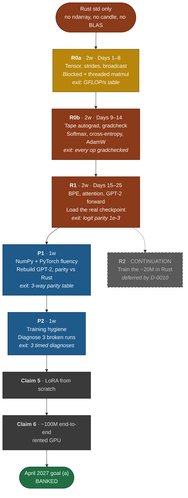
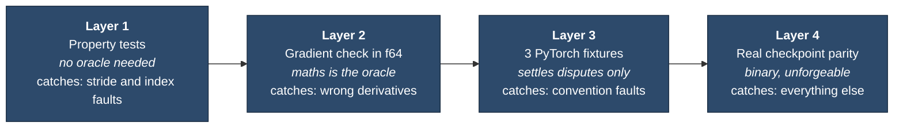
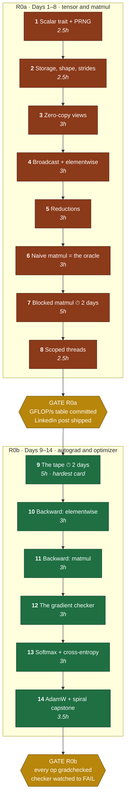
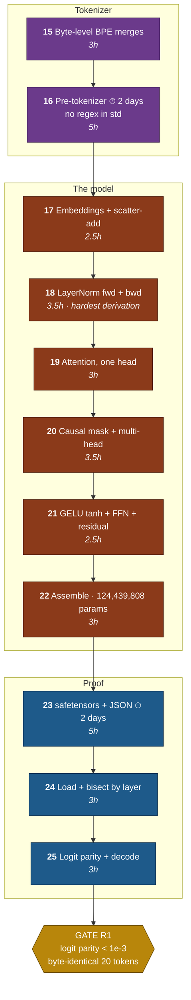

# GPT-2 in Rust, from nothing — Phase 0 and Phase 1

> Written in [Simplified Technical English](.claude/skills/simple-english/SKILL.md) (ASD-STE100). Sentences are short by rule. The **LinkedIn hook** lines are the one exception: STE deletes persuasion by design, so those stay in my own voice.

**Replaces Claims 1–4** of the ladder in [`COURSE_MAP.md`](COURSE_MAP.md). See `DECISIONS.md` D-0009 and D-0010.
**Budget:** 2–3 hours per day, 6 days per week. This is about 15 hours per week.
**Honest estimate: 5 weeks (29 working days, about 72 hours). The 2-week budget is wrong.** Section 3 gives the reason.

---

## The whole track, in one picture



**Sources.** Raschka, *Build a Large Language Model (From Scratch)* — every `Prereq reading` page number below comes from its table of contents. Blandy, Orendorff and Tindall, *Programming Rust* — every Rust section reference is a real page from its table of contents. Raschka's [video playlist](https://www.youtube.com/watch?v=Xpr8D6LeAtw&list=PLPTV0NXA_ZSgsLAr8YCgCwhPIJNNtexWub) follows the book chapter for chapter. Use the book first. Use the videos when a page does not make the idea clear. **Copy no code from any source. Adapt every idea to Rust.**

### Three Rust reference projects, and what each one is worth

I checked all three. **Not one of them meets your constraint.** This is useful, not disappointing.

| Project | Dependencies | What it gives you | What it cannot give you |
|---|---|---|---|
| [tekaratzas/RustGPT](https://github.com/tekaratzas/RustGPT) | `ndarray`, `rand` | The closest reference. It writes its own backpropagation and gradient clipping over `ndarray`. 3 transformer blocks, pre-train then instruction-tune. | `ndarray` **is** the tensor and stride layer. That layer is your Days 2–8. Read it after Day 8, never before. |
| [nerdai/llms-from-scratch-rs](https://github.com/nerdai/llms-from-scratch-rs) | `candle` (Hugging Face) | Chapter-for-chapter map of Raschka's book to Rust. Good for sequencing checks. | `candle` hides tensors, autograd and kernels. It answers none of your hard questions. |
| [Reddit: LLM in Rust with just ndarray](https://www.reddit.com/r/rust/comments/1nguv1a/i_built_an_llm_from_scratch_in_rust_just_ndarray/) | `ndarray` | A build log with real failure modes. | Same limit as RustGPT. |

**Rule for all three: read them only after your own version of that component passes its test.** Read early and you import their design decisions before you understand the problem those decisions solve. `ndarray` starts where your Day 8 ends, so your project is strictly larger than all three.

---

## 1. The split, defended in two sentences

**Phase 0 is every part that a physics simulator also needs.** It holds the strided tensor, broadcast, matmul, reverse-mode autodiff, and an optimizer. **Phase 1 is the first part that only a language model needs.** It holds byte-pair encoding, attention, and the GPT-2 forward pass.

I put the line there for one reason. Each half gets its own falsifiable exit test. Phase 0 proves itself with property tests and gradient checks. Phase 1 proves itself with logit parity. A split at "attention" gives Phase 0 the exit test "the code compiles", which proves nothing.

---

## 2. The claims

### R0 — the numerical substrate. Split into R0a and R0b.

Phase 0 is 16 working days. That breaks the 1–2 week rule of the ladder. The split point is the **Day 8 / Day 9 boundary**. This is the seam between correct fast arithmetic and the derivatives of that arithmetic. Both halves get a falsifiable exit.

**R0a — tensor and matmul (Days 1–8, 2 weeks)**
> I can write a strided, broadcast tensor library in Rust with a cache-blocked multithreaded matmul. I can prove it correct with no reference implementation.

*Exit test.* Property tests pass: permute round-trip on data and strides, broadcast scaling, `(AB)C ≈ A(BC)`, `(AB)ᵀ = BᵀAᵀ`. `blocked_matches_naive` passes at sizes that are **not** multiples of the block size. `parallel_matches_blocked` gives bit-identical output at 1, 2, 4 and 8 threads.
*Exit artifact.* A GFLOP/s table against block size and thread count. It states the measured percent of the ~550 GFLOP/s peak of the M4. Write the predicted best block size **before** you measure.

**R0b — autograd and optimizer (Days 9–14, 2 weeks)**
> I can write reverse-mode automatic differentiation over that library. I can prove every gradient correct with no reference implementation.

*Exit test.* `grad_check` passes for **every** op in the library, not a subset. It runs in `f64` at relative error below 1e-5. **You have watched it fail** after you injected a bug. The projected variant catches a sign flip that the plain sum misses.
*Exit artifact.* An MLP that your own AdamW trains. It separates a two-spiral dataset above 99 percent. Commit the loss curve.

### R1 — the first real LLM component (Days 15–25, 2 weeks)

> I can load the published GPT-2 124M checkpoint of OpenAI into my own Rust code. I can reproduce its output token for token.

*Exit test.* Maximum absolute logit difference stays below 1e-3 across all 50257 entries, for 3 fixed prompts. A 20-token greedy decode gives a **byte-identical** string against the HuggingFace reference. `tiktoken_parity` passes 200 of 200. `param_count_is_124m` equals 124,439,808.
*Exit artifact.* A terminal recording. It shows my Rust GPT-2 that emits the same 20 tokens as OpenAI.

**A claim without its artifact is not done.** That rule does not change.

---

## 3. Where the 5 weeks go

You budgeted 2 weeks. This table gives the honest account. The extra 3 weeks live in four places.

| Cost centre | Days | Why it does not compress |
|---|---|---|
| **Autograd against the borrow checker** | 3 | The hardest design problem in the project. Python builds a cyclic object graph. Rust rejects that graph. Section 5 gives the fix. |
| **BPE pre-tokenizer with no regex crate** | 2 | `std` has no regex. *Programming Rust* p. 424 confirms this. The GPT-2 pre-tokenizer needs a hand-written state machine to match `tiktoken`. |
| **safetensors and a JSON parser** | 2 | Weight loading carries the whole verification plan. No serde, so the header parser is yours. |
| **Matmul performance work** | 2 | Blocking, cache analysis, threads, benchmarks. This sits on the kernel track. |
| The language model itself | 20 | Tokenizer, embeddings, LayerNorm, attention, GELU, blocks, assembly, parity. |

**29 working days at 6 days per week is 4.8 weeks.** Four cards take 2 days each: Days 7, 9, 16 and 23. If each lands in 1 day, the total is 4 weeks.

I will not give you 14 one-day cards. That plan hides the autograd cost until day 9. The estimate is part of the deliverable.

---

## 4. Constraint rulings

You asked me to flag each constraint that costs a week and teaches nothing. You told me to argue, not to relax the rule in silence. Here are five rulings.

### 4.1 KEEP the pre-tokenizer. Reduce its scope.
A general Unicode regex engine costs about 1 week and teaches nothing about language models. **You do not need a regex engine. You need one specific GPT-2 pattern as a state machine.** That costs about 1.5 days. It teaches you what the pre-tokenizer does. Most people who use `tiktoken` never learn this. `char::is_alphabetic` and `char::is_numeric` in `std` know Unicode (*Programming Rust* p. 395), so the work is possible. **Verdict: in scope, with tight limits.**

### 4.2 EXCEPTION: use safetensors. Never use `pytorch_model.bin`.
The `.bin` format is Python pickle. Pickle is a stack virtual machine. A pickle interpreter costs about 1 week and teaches nothing.

> **CAUTION: Do not write a pickle parser. Pickle can execute arbitrary code.** Download the safetensors file instead.

The safetensors format is an 8-byte little-endian length, then JSON, then raw bytes. That parser costs 3 hours and teaches binary format work. **Verdict: safetensors only. If you insist on the harder path, I will push back hard.**

### 4.3 EXCEPTION: write no threadpool.
A work-stealing scheduler is beautiful and unrelated to language models. `std::thread::scope` with manual row chunks costs 1 hour. It gives the full 4× on your performance cores. **Verdict: scoped threads on Day 8.** Return to schedulers only if a profile proves that load imbalance costs you time. See *Programming Rust* p. 459.

### 4.4 DEFER explicit NEON SIMD.
`core::arch::aarch64` sits in `std`, so hand-written NEON is inside your constraint. It is also the kernel-track lesson. But it is the Phase 2 lesson. In Phase 0 the transferable idea is **blocking and cache awareness**. That idea gives most of the speed. LLVM auto-vectorizes a good blocked kernel. The interesting number is the gap between auto-vectorized and hand-written NEON. You cannot measure that gap before the blocked version exists. **Verdict: build blocked first. Measure. Then decide from data.**

### 4.5 KEEP your own PRNG.
`std` has no random number generator. This constraint carries weight. **Reproducible gradient checks are impossible without a seeded PRNG that you control.** xorshift64* is 15 lines. Day 1.

---

## 5. The design decision I want to change before you build it

You will want to translate micrograd directly. That design is a `Value` struct that holds `Rc<RefCell<Node>>`, with `prev: Vec<Rc<RefCell<Node>>>`. **Do not build it.** It compiles. Then it gives you runtime `already borrowed` panics that the type system was supposed to prevent. It also leaks every graph, because the references form cycles.

**Build a tape instead. A tape is an arena of nodes that you index by `usize`.**

```
Tape<T> { nodes: Vec<Node<T>>, values: Vec<Buffer<T>> }
Node<T> { op: Op, inputs: [Option<NodeId>; 2], ... }
NodeId(usize)   // a plain Copy index. No Rc. No RefCell. No lifetimes.
```

Three reasons make this correct, not merely easier:

1. **A tape is what reverse-mode AD is.** PyTorch autograd, JAX tracing and compiler SSA form are all arenas with indices. Rust points at the correct design here.
2. **Backward becomes a reverse loop over a `Vec`.** You need no graph walk and no visited set. Construction order is already topological order.
3. **The layout is cache-friendly and easy to serialize.** This matters when you profile in Phase 2.

The cost is real. You will pass a `&mut Tape` into every op. That feels clumsy at first. The clumsiness is the honest price of explicit ownership. It disappears after you wrap it.

If you disagree, build the `Rc<RefCell<_>>` version and hit the wall. That is a valid way to learn it and it costs 1 extra day. I want you to know that the wall is there.

---

## 6. Verification

You have no numpy and no PyTorch. **Four independent layers cover this.** Each layer catches faults that the others miss.



### Layer 1 — property tests. No oracle needed.

| Property | Catches |
|---|---|
| `permute(p).permute(p⁻¹)` gives identity on data **and** strides | stride arithmetic |
| `reshape` on contiguous data keeps linear index order | contiguity assumptions |
| `broadcast(a, shape).sum() == a.sum() × factor` | broadcast expansion |
| `(A·B)·C ≈ A·(B·C)` inside tolerance | matmul indexing |
| `(A·B)ᵀ == Bᵀ·Aᵀ` | transpose and matmul together |
| `A · I == A` | loop bounds |

**The most valuable trick in this project:** write the most naive correct matmul, a triple loop with no blocking and no threads. **Keep it forever.** Test every optimized version against it. You now own a permanent oracle for the most bug-prone code in the library. It costs nine lines.

### Layer 2 — numerical gradient check. This is the autograd oracle.

Central difference. The error is O(h²):

```
∂f/∂xᵢ ≈ [ f(x + h·eᵢ) − f(x − h·eᵢ) ] / 2h
```

Four details decide whether this works:

1. **Run it in `f64`, not `f32`.** In `f32` with `h = 1e-3` you keep about 3 significant digits. You cannot separate a real fault from float noise. This is why the `Scalar` trait lands on Day 1. **You cannot add it later.** If you get this wrong, you rewrite the library in week 3.
2. **Use relative error:** `|analytic − numeric| / max(|analytic|, |numeric|, 1e-8) < 1e-5`.
3. **Check the gradient of a random projection of the output.** Use `(out * r).sum()` for a fixed random `r`. A plain sum hides sign errors that cancel across elements. This fault appears in real frameworks.
4. **Pick test points away from kinks.** ReLU at 0 and GELU near its inflection fail a finite-difference check even when the code is correct. Sample a well-behaved range. Say so in the test name.

### Layer 3 — the golden-file question. Both sides.

**For committed PyTorch fixtures.** Per-op fixtures localize a fault. A wrong LayerNorm found on Day 18 costs an hour. The same fault found on Day 25 through wrong logits costs three days. Fixtures are test *data*, not a dependency. The shipped binary still has zero crates. "From scratch" describes your implementation, not your oracle.

**Against them.** PyTorch is not installed on this machine. Each fixture needs a Colab round trip. That loop is slow enough that you will want to skip it, and skipping is the worst outcome. **Fixtures also encode the conventions of PyTorch, not only its mathematics.** You can match a fixture and still not understand the convention behind it. That understanding is what five weeks buys. Layers 1, 2 and 4 already cover most faults.

**Recommendation: a narrow yes. Three fixtures, not a fixture suite.** Commit reference values for the three places where hand-derivation is ambiguous and a fault costs days:

1. **GELU, tanh approximation.** 100 sampled `(x, gelu_new(x))` pairs. It catches the tanh-against-erf trap at once. That trap gives logits that look correct.
2. **LayerNorm forward** at one shape with `eps = 1e-5`. It settles biased against unbiased variance.
3. **Softmax with cross-entropy** at one shape. It settles the log-sum-exp shift and the reduction axis.

One Colab session. Three small files. **Commit the generator script beside them.** A fixture with no reproducible origin is folklore, not evidence.

**The rule that keeps this honest.** Add a fixture only **after** you hand-derive the value and disagree with yourself. Fixtures settle disputes. They never replace derivation.

> **NOTE:** "Three fixtures" counts op-level oracles only. Days 16, 24 and 25 also need checkpoint reference data: 200 `tiktoken` pairs, per-block hidden-state statistics, and reference logits for 3 prompts. Those are Layer 4 oracles. The rule above does not apply, because you cannot hand-derive the layer-7 activations of GPT-2. Generate all of it in the same Colab session with one committed script. Do this before Day 21.

### Layer 4 — "is my GPT-2 correct?" Use both signals, in this order.

**Logit parity comes first. Loss-curve shape is a weak oracle. Do not trust it for architectural correctness.**

The reason is specific. A model with a wrong causal mask, a transposed weight, or erf-GELU instead of tanh-GELU **still trains. It still gives a smooth falling loss curve.** It is quietly worse, and you never learn by how much. Loss curves catch catastrophic faults. They are blind to subtle faults. Subtle faults are the entire risk here.

Logit parity is **binary**. Load the real weights. Feed a fixed prompt. Your logits match to 1e-4, or they do not. There is no partial credit.

**The bisection staircase.** This is the debugging method, not a formality:

1. Load the weights. Run the **embedding layer only**. Compare the mean and the standard deviation of the hidden state.
2. Run **one transformer block**. Compare.
3. If block 12 is wrong and block 1 is correct, **binary-search the layers.**
4. Inside the bad block, bisect by sub-module: `ln_1`, `attn`, `ln_2`, `mlp`.
5. Compare full-model logits for a fixed prompt. Compare the top-5 tokens and their values.
6. Greedy-decode 20 tokens. Match the output **string**.

Step 6 is your artifact.

**Three traps go into the acceptance tests now. A retrofit costs a week.**

- **GPT-2 uses tanh-approximated GELU** (`gelu_new`), not exact erf-GELU. The wrong choice gives logits that look almost correct.
- **The `Conv1D` of HuggingFace stores weights transposed** against a standard `Linear`. The shape is `[in, out]`, not `[out, in]`.
- **LayerNorm `eps` is 1e-5. The variance is biased.** Divide by `n`, not `n−1`.

**Loss curves become correct for the training phase.** By then you know the architecture is right. A bad curve then means a fault in the training path: optimizer, schedule, data loader, or loss reduction. That search space is far smaller.

One number beats any curve. **An untrained GPT-2 with vocab 50257 must give step-0 loss near ln(50257) ≈ 10.82.** If it does not, you have a fault before you spend an hour of compute. Assert it.

---

# PHASE 0 — the numerical substrate

**14 cards. 16 working days.**



---

### Day 1 — The `Scalar` trait and a PRNG you own

**Concept.** Every numeric routine must run in `f32` and in `f64`. `f32` is what you ship. `f64` is what you test gradients in. `std` holds no numeric tower, and `num-traits` is a crate. So you define the abstraction: a trait that bounds the operations your library needs. `std` also ships no random number generator. Gradient checks need reproducible initialization, so a seeded PRNG comes first.

**Rust you need.** Trait definition with supertraits. Associated constants. Generic functions with trait bounds. Operator traits as bounds, such as `Add<Output=Self>`. *Programming Rust*: "Defining and Implementing Traits" p. 245, "Subtraits" p. 250, "Static Methods" p. 251, "Reverse-Engineering Bounds" p. 260, "Arithmetic and Bitwise Operators" p. 266.

**Prereq reading (25 min).** *Programming Rust* pp. 235–252. Skim only.

**Build.**
```rust
// src/scalar.rs
pub trait Scalar:
    Copy + PartialOrd + std::fmt::Debug
    + std::ops::Add<Output = Self> + std::ops::Sub<Output = Self>
    + std::ops::Mul<Output = Self> + std::ops::Div<Output = Self>
    + std::ops::Neg<Output = Self>
{
    const ZERO: Self;
    const ONE:  Self;
    fn from_f64(x: f64) -> Self;
    fn to_f64(self) -> f64;
    fn sqrt(self) -> Self;
    fn exp(self)  -> Self;
    fn ln(self)   -> Self;
    fn tanh(self) -> Self;
    fn abs(self)  -> Self;
    fn max(self, other: Self) -> Self;
}
impl Scalar for f32 { /* todo!() */ }
impl Scalar for f64 { /* todo!() */ }

// src/rng.rs
pub struct Rng { state: u64 }
impl Rng {
    pub fn seed(s: u64) -> Self;                 // reject state == 0
    pub fn next_u64(&mut self) -> u64;           // xorshift64*
    pub fn uniform<T: Scalar>(&mut self) -> T;   // [0, 1)
    pub fn normal<T: Scalar>(&mut self) -> T;    // Box-Muller
}
```
**Tests it must pass.**
- `same_seed_same_sequence` — two `Rng::seed(42)` give identical first 1000 draws.
- `uniform_in_range` — 100k draws stay in `[0, 1)`.
- `normal_moments` — 1M draws give mean inside 0.01 of 0, and standard deviation inside 0.01 of 1.
- `scalar_generic_compiles` — a `fn mean<T: Scalar>(xs: &[T]) -> T` builds for `f32` and for `f64`.

**Self-check.**
1. Box-Muller gives `z = sqrt(-2 ln u₁) · cos(2π u₂)`. **Derive by hand** why this is standard normal. Start from the joint density of two independent normals in polar coordinates.
2. Why does the trait need `from_f64` **and** `to_f64` instead of a `From`/`Into` bound? Think about the cost at the precision boundary. Think about who owns that impl.

**Stuck-signal.** If you fight `the trait bound X is not satisfied` on one generic function for more than 40 minutes, ask. That is a bounds-design problem, not a syntax problem.

**Time.** 2.5 hours.

**LinkedIn hook.** Rust has no `Float` trait in the standard library — so before I could write a single line of tensor code, I had to decide exactly what "a number" means to my library. That list turned out to be shorter than I expected, and writing it down told me more about numerical code than any tutorial had.

---

### Day 2 — Storage, shape, strides

**Concept.** A tensor is not a nested array. It is a flat buffer plus an interpretation. The shape gives the element count along each axis. The stride vector gives the buffer step for one position along each axis. Every reshape, transpose and slice is arithmetic on those two vectors. The buffer never moves. Correct strides on Day 2 make multi-head attention four lines on Day 20 instead of four hundred.

**Rust you need.** Structs with named fields. `impl` blocks. `Rc<T>` for shared immutable buffers. `Vec<T>` indexing. Slices. *Programming Rust*: "Named-Field Structs" p. 193, "Defining Methods with impl" p. 198, "Generic Structs" p. 202, "Rc and Arc: Shared Ownership" p. 90, "Vectors" p. 59.

**Prereq reading (20 min).** *Programming Rust* pp. 57–63 and pp. 90–92.

**Build.**
```rust
// src/tensor.rs
#[derive(Clone)]
pub struct Tensor<T: Scalar> {
    data:    Rc<Vec<T>>,   // shared, immutable. Views alias it.
    shape:   Vec<usize>,
    strides: Vec<usize>,   // in elements, not bytes
    offset:  usize,
}

impl<T: Scalar> Tensor<T> {
    pub fn zeros(shape: &[usize]) -> Self;
    pub fn from_vec(data: Vec<T>, shape: &[usize]) -> Self;   // panic on length mismatch
    pub fn shape(&self) -> &[usize];
    pub fn numel(&self) -> usize;
    pub fn is_contiguous(&self) -> bool;
    fn phys_index(&self, idx: &[usize]) -> usize;   // the core: index to buffer position
    pub fn get(&self, idx: &[usize]) -> T;
}

pub fn contiguous_strides(shape: &[usize]) -> Vec<usize>;   // row-major
```
**Tests it must pass.**
- `strides_row_major` — `contiguous_strides(&[2,3,4])` equals `vec![12, 4, 1]`.
- `phys_index_matches_manual` — for shape `[2,3,4]`, `phys_index(&[1,2,3])` equals `1*12 + 2*4 + 3*1`, which is 23.
- `from_vec_rejects_bad_len` — `#[should_panic]` on `from_vec(vec![0.0; 5], &[2,3])`.
- `numel_is_shape_product`.

**Self-check.**
1. **Trace by hand.** Take a tensor of shape `[2,3,4]`. Write the strides. Which buffer index holds element `[1,0,2]`? Now write the strides after you transpose the last two axes. Confirm that the buffer does not change.
2. Why `Rc<Vec<T>>` and not `Vec<T>`? Why not `Rc<RefCell<Vec<T>>>`? State what each choice makes impossible.

**Stuck-signal.** If you want to write `data: Vec<Vec<T>>`, stop. That is the Python model. It makes every later op much harder. Ask before you commit to it.

**Time.** 2.5 hours.

**LinkedIn hook.** A transpose doesn't move any data. It permutes three numbers in a metadata vector — and once that clicked, half of what I thought was "tensor manipulation" turned out to be arithmetic on a list the length of the rank.

---

### Day 3 — Zero-copy views: reshape, permute, transpose, slice

**Concept.** Shape and strides are interpretation, so many operations give a new view over the same buffer at zero cost. One case is subtle. `reshape` on a non-contiguous tensor has no stride expression. It must copy, or it must refuse. Today you decide which. Return a `Result` instead of a silent copy.

**Rust you need.** `Result<T, E>` and custom error types. The `?` operator. Return of `Self`. *Programming Rust*: "Result" p. 148, "Declaring a Custom Error Type" p. 157, "Propagating Errors" p. 152.

**Prereq reading (20 min).** *Programming Rust* pp. 148–158.

**Build.**
```rust
#[derive(Debug)]
pub enum ShapeError { NotContiguous, BadRank { got: usize, want: usize }, SizeMismatch, OutOfBounds }

impl<T: Scalar> Tensor<T> {
    pub fn reshape(&self, shape: &[usize]) -> Result<Self, ShapeError>;
    pub fn permute(&self, order: &[usize]) -> Result<Self, ShapeError>;
    pub fn transpose(&self, a: usize, b: usize) -> Result<Self, ShapeError>;
    pub fn slice(&self, axis: usize, start: usize, end: usize) -> Result<Self, ShapeError>;
    pub fn contiguous(&self) -> Self;    // the only method that can copy
    pub fn to_vec(&self) -> Vec<T>;      // logical order. Walks strides.
}
```
**Tests it must pass.**
- `permute_roundtrip` — `t.permute(&[2,0,1])?.permute(&[1,2,0])?` equals `t` in `shape` and in `to_vec()`.
- `transpose_is_zero_copy` — `Rc::ptr_eq` holds on the two buffers.
- `reshape_noncontiguous_errors` — transpose, then reshape, gives `Err(NotContiguous)`.
- `contiguous_then_reshape_ok` — the same call succeeds after `.contiguous()`.
- `slice_bounds` — `slice(0, 2, 1)` gives `Err`. An out-of-range end gives `Err`.

**Self-check.**
1. **Trace by hand.** Shape `[2,3]`, contiguous, buffer `[0,1,2,3,4,5]`. Transpose to `[3,2]`. Write the new strides. Write the logical elements in row-major reading order. Show why a plain `reshape` to `[6]` gives the wrong sequence.
2. Why must `reshape` return `Result` instead of a silent `contiguous()` call? Answer with the cost of a hidden copy inside an attention loop.

**Stuck-signal.** If `permute` passes on shape `[2,3]` and fails on `[2,3,4]`, ask. That is a rank-generality fault in the index permutation.

**Time.** 3 hours.

**LinkedIn hook.** `reshape` failing on a transposed tensor isn't a limitation — it's the library refusing to hide a memory copy from you. PyTorch calls this `.contiguous()` and most people learn it as a magic incantation; writing it yourself turns it into an obvious consequence.

---

### Day 4 — Broadcast and elementwise ops

**Concept.** Broadcast is stride manipulation. It duplicates no data. An axis of size 1 gets **stride 0**, so every index along that axis reads the same element. Two shapes are compatible when, aligned from the trailing axis, each pair is equal or one of them is 1. This trick makes `x + bias` work with no copy of `bias` per row. It also makes the backward pass of broadcast a sum-reduction. Day 10 covers that.

**Rust you need.** Iterators and adapters. `zip` and `rev`. Closures as parameters with `impl Fn`. *Programming Rust*: "Iterator Adapters" p. 330, "zip" p. 342, "Function and Closure Types" p. 308, "Using Closures Effectively" p. 319.

**Prereq reading (25 min).** *Programming Rust* pp. 303–312 and pp. 330–344.

**Build.**
```rust
pub fn broadcast_shapes(a: &[usize], b: &[usize]) -> Result<Vec<usize>, ShapeError>;

impl<T: Scalar> Tensor<T> {
    pub fn broadcast_to(&self, shape: &[usize]) -> Result<Self, ShapeError>;  // the stride-0 trick
    pub fn map(&self, f: impl Fn(T) -> T) -> Self;
    pub fn zip_with(&self, other: &Self, f: impl Fn(T, T) -> T) -> Result<Self, ShapeError>;
}
// then: add, sub, mul, div, neg, exp, ln, sqrt, tanh, relu. All from the two methods above.
```
**Tests it must pass.**
- `broadcast_shapes_table` — `([3,1],[1,4])` gives `[3,4]`. `([5],[3,5])` gives `[3,5]`. `([2,3],[3,2])` gives `Err`.
- `broadcast_uses_stride_zero` — the broadcast axis has stride 0 and `Rc::ptr_eq` holds.
- `broadcast_sum_scales` — for `a` of shape `[1,4]`, `a.broadcast_to(&[3,4])?.sum()` is near `a.sum() * 3`.
- `elementwise_against_manual` — `add` on two 2×3 tensors matches a hand-written `Vec`.

**Self-check.**
1. **Derive.** Take shapes `[8, 1, 6]` and `[7, 1]`. What is the broadcast result? Write both stride vectors of the broadcast views.
2. A stride-0 view has a `numel()` larger than its buffer length. Which of your Day 2 and Day 3 methods break now? Which ones did you already guard?

**Stuck-signal.** If `to_vec()` on a broadcast view gives the correct length but repeats the wrong elements, ask. Your stride walk is correct. Your shape alignment from the trailing axis is off by one.

**Time.** 3 hours.

**LinkedIn hook.** Broadcasting a `[1,4]` tensor to `[3,4]` allocates nothing. It sets one stride to zero, so three different indices read the same memory — and that one trick is the difference between a bias add costing nothing and costing a full matrix copy.

---

### Day 5 — Reductions

**Concept.** A reduction collapses axes by a fold: sum, mean or max. Two decisions define the API. First, the reduced axis disappears or stays as size 1. That is `keepdim`. Second, the accumulation order. The second decision is not cosmetic. Floating-point addition is **not associative**. A naive sequential sum over 50,000 elements loses precision that pairwise summation keeps. Softmax needs `max` along an axis. Cross-entropy needs `sum`. Both must be correct.

**Rust you need.** `fold`. Nested iteration over multi-dimensional indices. `Ordering` and `partial_cmp` for floats. *Programming Rust*: "fold" p. 349, "Simple Accumulation" p. 345, "max_by, min_by" p. 346, "Implementing Your Own Iterators" p. 354.

**Prereq reading (20 min).** *Programming Rust* pp. 345–354.

**Build.**
```rust
impl<T: Scalar> Tensor<T> {
    pub fn sum_axis(&self, axis: usize, keepdim: bool) -> Result<Self, ShapeError>;
    pub fn mean_axis(&self, axis: usize, keepdim: bool) -> Result<Self, ShapeError>;
    pub fn max_axis(&self, axis: usize, keepdim: bool) -> Result<Self, ShapeError>;
    pub fn sum_all(&self) -> T;      // pairwise, not sequential
}
```
**Tests it must pass.**
- `sum_axis_shapes` — `[2,3,4]` reduced on axis 1 gives `[2,4]` at `keepdim=false`, and `[2,1,4]` at `keepdim=true`.
- `sum_axis_values` — hand-computed values on a 2×3 tensor, on both axes.
- `sum_all_precision` — a sequential sum of `1e8` copies of `1.0f32` gives a visibly wrong answer. Your pairwise `sum_all` stays inside 1 ULP of `1e8`. **This test is the lesson.**
- `max_axis_handles_negatives` — an all-negative input does not return 0.

**Self-check.**
1. **Numerical trace.** In `f32`, start an accumulator at `1.6e7`. Add `1.0`. What happens? Work out the exponent and the 24-bit mantissa. Then explain why pairwise summation of 10⁸ ones survives.
2. Why does softmax need `max_axis`? Write the identity that shows `softmax(x) == softmax(x − c)` for any scalar `c`.

**Stuck-signal.** If your reduction is correct for `axis=0` and wrong for the last axis, ask. The fault is the multi-index iteration order, not the fold.

**Time.** 3 hours.

**LinkedIn hook.** Summing a hundred million `1.0`s in `f32` sequentially gives you about 16.7 million. The accumulator gets so large that adding one stops changing it — and this is why every serious library uses pairwise summation and nobody mentions it.

---

### Day 6 — The naive matmul, and the oracle discipline

**Concept.** Matrix multiplication builds everything else. It also takes more than 95 percent of your runtime. Today you write the slowest correct version: three nested loops and no cleverness. Its value is not speed. **It stays in the repository through week five as the reference for every optimized kernel.** A correct slow version that you keep is the cheapest oracle in the project.

**Rust you need.** Nested loops with explicit bounds. `debug_assert!`. `#[cfg(test)]` module layout. Unit tests against integration tests. *Programming Rust*: "Loops" p. 130, "Tests and Documentation" p. 178, "Integration Tests" p. 180.

**Prereq reading (15 min).** *Programming Rust* pp. 178–182.

**Build.**
```rust
// src/matmul.rs
/// Reference implementation. NEVER optimise this. It is the oracle.
pub fn matmul_naive<T: Scalar>(a: &Tensor<T>, b: &Tensor<T>) -> Result<Tensor<T>, ShapeError>;

/// Batched: [..., M, K] x [..., K, N] -> [..., M, N]. Broadcasts the batch dims.
pub fn matmul<T: Scalar>(a: &Tensor<T>, b: &Tensor<T>) -> Result<Tensor<T>, ShapeError>;
```
**Tests it must pass.**
- `matmul_2x3_3x2_by_hand` — a hand-computed 2×3 by 3×2 product.
- `matmul_identity` — `A · I == A`, element by element.
- `matmul_transpose_identity` — `(A·B)ᵀ == Bᵀ·Aᵀ` inside 1e-5.
- `matmul_associative` — `(A·B)·C ≈ A·(B·C)` inside 1e-4 for random 8×8 inputs.
- `matmul_batched_shapes` — `[2,3,4] x [2,4,5]` gives `[2,3,5]`. `[1,3,4] x [2,4,5]` gives `[2,3,5]`.
- `matmul_dim_mismatch_errors`.

**Self-check.**
1. **Derive.** For `[M,K] · [K,N]`, count the FLOPs. Count the minimum bytes that must move in `f32`. Compute arithmetic intensity in FLOP per byte at M=N=K=512. A machine gives ~500 GFLOP/s and ~100 GB/s. Is this compute-bound or memory-bound?
2. Your naive loop is `i, j, k`. Six orderings exist. Which one gives the best cache behaviour for row-major storage? Write your prediction down. You measure it tomorrow.

**Stuck-signal.** If batched matmul passes for equal batch sizes and fails when one is 1, ask. The fault is the batch-stride computation. Do not add a special case.

**Time.** 3 hours.

**LinkedIn hook.** I wrote the slowest matrix multiply I could and committed it with a comment saying never optimise this. With no numpy to check against, a correct-and-stupid implementation you keep forever is the only oracle you get — and it's caught three bugs already.

---

### Day 7 — Blocked matmul, and the measured gap ⏱ **2-day card**

**Concept.** The naive loop is memory-bound. It streams `B` from RAM for every row of `A`, so it reloads the same data thousands of times. Blocking restructures the loops. A small tile of each operand stays in L1 or L2 while the code reuses it. The arithmetic intensity of the algorithm does not change. The intensity of the traffic that reaches DRAM does change. This is the roofline lesson in its clearest form. It gives more speed per hour than any other day in Phase 0.

**Rust you need.** `criterion` for benchmarks. Your constraints allow it as a dev-dependency. `--release` and build profiles. `black_box`. Slice chunks. *Programming Rust*: "Build Profiles" p. 164, "Attributes" p. 175, "Splitting" p. 368, "Sorting and Searching" p. 370.

**Prereq reading (20 min).** *Programming Rust* pp. 161–165. Then skim "Getting Started" of criterion.

**Build.**
```rust
/// Cache-blocked. Must match matmul_naive inside 1e-4.
pub fn matmul_blocked<T: Scalar>(a: &Tensor<T>, b: &Tensor<T>, block: usize)
    -> Result<Tensor<T>, ShapeError>;
```
**Tests it must pass.**
- `blocked_matches_naive` — random 1×1, 7×13 by 13×5, 64×64, and 129×257 by 257×63. Blocking faults live at sizes that are not multiples of the block. Tolerance 1e-4.
- `blocked_matches_naive_f64` — the same set in `f64`, tolerance 1e-10.
- Benchmark deliverable: a committed table of GFLOP/s against block size in {8, 16, 32, 64, 128} at N in {128, 512, 1024}.

**Self-check.**
1. **Derive.** For block size `b`, how many bytes of `A`, `B` and `C` stay live in the innermost blocked loop? Set that equal to your L1 size. The M4 performance core has 128 KB L1D. Solve for the largest `b` that fits three `f32` tiles. Does your measured best match your predicted best? Write both numbers. If they disagree, state why.
2. What percent of the ~550 GFLOP/s fp32 peak of the M4 did you reach? If it is below 15 percent, name the next bottleneck. Can blocking fix that bottleneck at all?

**Stuck-signal.** If blocked runs slower than naive, ask. The cause is almost always one of three: a benchmark in debug mode, a block larger than L1, or a bounds check in the inner loop. Do not rewrite first.

**Time.** 5 hours across 2 days.

**LinkedIn hook.** Same FLOPs, same output, 8× faster. The naive matmul wasn't slow because of arithmetic — it was reloading the same matrix from RAM thousands of times, and all "optimisation" did was change which memory it touched next.

---

### Day 8 — Parallelism with scoped threads

**Concept.** Your M4 has 4 performance cores. A single-threaded matmul wastes 4×. The output matrix partitions cleanly by rows. Each thread writes a disjoint slice of `C`. Each thread only reads `A` and `B`. The work is parallel with no synchronization. `std::thread::scope` lets threads borrow stack data. It guarantees at compile time that they join before the borrow ends. That guarantee is why you need no `Arc` here.

**Rust you need.** `std::thread::scope`. `chunks_mut`. `Send` and `Sync`. Why immutable `&` sharing across threads needs no lock. *Programming Rust*: "Fork-Join Parallelism" p. 459, "spawn and join" p. 461, "Sharing Immutable Data Across Threads" p. 464, "Thread Safety: Send and Sync" p. 479.

**Prereq reading (30 min).** *Programming Rust* pp. 457–466. Read the Rayon section to learn what you leave out, and why.

**Build.**
```rust
pub fn matmul_parallel<T: Scalar + Send + Sync>(
    a: &Tensor<T>, b: &Tensor<T>, block: usize, threads: usize,
) -> Result<Tensor<T>, ShapeError>;
```
**Tests it must pass.**
- `parallel_matches_blocked` — bit-identical to `matmul_blocked`. Row partitions keep the accumulation order per output element. If the output is not identical, you partitioned along `K` by mistake.
- `parallel_thread_count_invariant` — the same output at 1, 2, 4 and 8 threads.
- Benchmark deliverable: speedup against thread count at N=1024, committed. State where scaling stops. State whether the cause is the P-core and E-core split, or memory bandwidth.

**Self-check.**
1. Why is a partition of the output **by rows** safe with no `Mutex`? Why is a partition along **K** not safe? Answer with which threads write which bytes.
2. You have 4 performance cores and 6 efficiency cores. Predict the speedup at `threads=10` against `threads=4`. Write the prediction down. Then measure. Explain the gap.

**Stuck-signal.** If the compiler says a closure `may outlive the current function`, check which function you called. Those are `thread::spawn` semantics, not `thread::scope`. If `scope` still rejects the closure, ask.

**Time.** 2.5 hours.

**LinkedIn hook.** Four threads writing to the same output matrix, no mutex, no atomics, and the compiler proved it was safe. The trick isn't clever locking — it's partitioning the problem so no two threads ever touch the same byte.

---

> ### GATE R0a — do not start Day 9 until all four are true
> - [ ] Property tests pass. `blocked_matches_naive` passes at non-multiple sizes.
> - [ ] `parallel_matches_blocked` is bit-identical and thread-count invariant.
> - [ ] The GFLOP/s table is committed. It states percent of peak and predicted-against-measured block size.
> - [ ] The R0a LinkedIn post is shipped.

---

### Day 9 — The tape: autograd architecture ⏱ **2-day card. The hardest one.**

**Concept.** Reverse-mode automatic differentiation records the forward computation as a linear sequence of primitive operations. That sequence is a tape. The backward pass walks the tape in reverse. It applies the chain rule and accumulates a gradient for each node. The tape is already in topological order, because construction built it that way. So the graph walk is a reverse `for` loop. Ownership is the whole difficulty. Nodes that hold references to parents create cycles, and Rust rejects them. Nodes reference each other by **index into an arena** instead.

**Rust you need.** Enums with data as a closed operation set. Newtype indices. The arena pattern. `Vec` as an arena. Why `Rc<RefCell<_>>` is the wrong tool. *Programming Rust*: "Enums with Data" p. 214, "Rich Data Structures Using Enums" p. 216, "Tuple-Like Structs" p. 196, "Interior Mutability" p. 205, and "Taking Arms Against a Sea of Objects" p. 121. **Read p. 121 twice. It describes this exact problem.**

**Prereq reading (30 min).** *Programming Rust* pp. 114–122 and pp. 211–218.

**Build.**
```rust
// src/autograd.rs
#[derive(Clone, Copy, PartialEq, Eq, Debug)]
pub struct NodeId(usize);

pub enum Op {
    Leaf,
    Add(NodeId, NodeId),
    Mul(NodeId, NodeId),
    MatMul(NodeId, NodeId),
    Sum { input: NodeId, axis: usize, keepdim: bool },
    Broadcast { input: NodeId, from: Vec<usize> },
    Exp(NodeId), Ln(NodeId), Tanh(NodeId), Neg(NodeId),
    // extended on Days 13, 18, 21
}

pub struct Tape<T: Scalar> {
    ops:      Vec<Op>,
    values:   Vec<Tensor<T>>,          // forward value of each node
    grads:    Vec<Option<Tensor<T>>>,  // backward() fills this
    requires: Vec<bool>,
}

impl<T: Scalar> Tape<T> {
    pub fn new() -> Self;
    pub fn leaf(&mut self, t: Tensor<T>, requires_grad: bool) -> NodeId;
    pub fn push(&mut self, op: Op, value: Tensor<T>) -> NodeId;
    pub fn value(&self, id: NodeId) -> &Tensor<T>;
    pub fn grad(&self, id: NodeId) -> Option<&Tensor<T>>;
    pub fn backward(&mut self, root: NodeId);   // root must be scalar
    pub fn zero_grad(&mut self);
}
```
Today build the tape, `leaf`, `push`, and forward `add` and `mul`. Leave `backward` as `todo!()` until tomorrow.

**Tests it must pass.**
- `tape_records_in_order` — after `a+b` and then `*c`, `ops.len()` is 5. The `Mul` node inputs point at the `Add` node and at the `c` leaf.
- `nodeid_is_copy` — a compile-time test. `NodeId` works twice with no move error.
- `value_roundtrip` — `tape.value(tape.leaf(t, false))` equals `t`.

**Self-check.**
1. **Derive.** Write the tape for `f = (a + b) * a` with `a=2` and `b=3`. Write every node, its op, its inputs and its forward value. Then compute `∂f/∂a` two ways: symbolically, and by a backward walk of your tape. Both give 7. Keep the paper. It is tomorrow's first test.
2. Why can `backward` require a scalar root? What does differentiation of a vector-valued output mean? What must you supply instead?

**Stuck-signal.** If you spent an hour on `Rc<RefCell<Node>>` and you now hit `already mutably borrowed`, stop. That is the wall in Section 5. Switch to the arena, or ask. I will give you the shape of the fix, not the code.

**Time.** 5 hours across 2 days. Spend the whole first day on design, not on typing.

**LinkedIn hook.** Rust refused to let me build the object graph every autograd tutorial builds. Fighting it for a day taught me that reverse-mode autodiff isn't a graph at all — it's a tape, in construction order, and the "graph" was always an implementation detail Python let me get away with.

---

### Day 10 — Backward for elementwise and broadcast

**Concept.** The backward pass walks the tape in reverse. Each op contributes a vector-Jacobian product. Given the gradient into its output, it computes the gradient into each input. For elementwise ops this is a local multiply. **The backward of broadcast is a sum-reduction over the broadcast axes.** An element read N times in the forward pass accumulates N contributions in the backward pass. A wrong version gives gradients with the correct shape and a factor-of-N error.

**Rust you need.** Reverse iteration over indices. `Option<Tensor<T>>` accumulation. Pattern matching on enums with bindings. *Programming Rust*: "Patterns" p. 221, "Tuple and Struct Patterns" p. 225, "Matching Multiple Possibilities" p. 229, "Reversible Iterators and rev" p. 339.

**Prereq reading (20 min).** *Programming Rust* pp. 221–233.

**Build.** Implement `Tape::backward` for `Leaf`, `Add`, `Mul`, `Neg`, `Exp`, `Ln`, `Tanh`, `Sum` and `Broadcast`. Gradient accumulation uses `+=`, never `=`. A node used twice receives two contributions.

**Tests it must pass.**
- `backward_matches_paper` — the `f = (a+b)*a` case from yesterday. `∂f/∂a` is 7. `∂f/∂b` is 2.
- `diamond_accumulates` — for `let y = x*x; let z = y + x;`, `∂z/∂x` is `2x + 1`. **This test catches `=` instead of `+=`.**
- `broadcast_backward_sums` — a `[1,4]` tensor broadcast to `[3,4]` and then summed gives gradient `[3,3,3,3]`, not `[1,1,1,1]`.
- `zero_grad_clears`.

**Self-check.**
1. **Derive on paper.** Take `y = broadcast([b₁,b₂], [3,2])` and `L = sum(y)`. Compute `∂L/∂b₁` from first principles. Write all six terms of `L`. Then state the general broadcast-backward rule in one sentence.
2. Why must gradients accumulate instead of assign? Draw the smallest graph where assignment gives the wrong answer. State the wrong answer.

**Stuck-signal.** If `diamond_accumulates` fails with exactly `2x` or exactly `1`, you found the `=` against `+=` fault. Fix that one yourself. If it fails with any other value, ask.

**Time.** 3 hours.

**LinkedIn hook.** The backward pass of "broadcasting" is a sum. If a value gets read three times going forward, three gradients come back to it — and that symmetry, once you see it, makes every other backward rule feel derivable instead of memorised.

---

### Day 11 — Backward for matmul

**Concept.** For `C = A·B` the gradients are `∂L/∂A = ∂L/∂C · Bᵀ` and `∂L/∂B = Aᵀ · ∂L/∂C`. Do not memorize this. **Rederive it from shapes in ten seconds.** Only one arrangement of transposes makes the dimensions agree. That shape-driven derivation pays for years, in every framework and in every interview.

**Rust you need.** Composition of methods that return `Result` inside a `match` arm. The `?` operator in a function that returns `Result`. Nothing new. Today is easy Rust and hard mathematics.

**Prereq reading (20 min).** Raschka section 3.4, pp. 64–70. Read it for the shapes. Ignore the PyTorch.

**Build.** Add the `MatMul` arm to `Tape::backward`. Make it batched. Handle broadcast batch dimensions. Their gradient is summed, by the Day 10 rule.

**Tests it must pass.**
- `matmul_backward_shapes` — for `[2,3]·[3,4]`, `grad_a` is `[2,3]` and `grad_b` is `[3,4]`.
- `matmul_backward_2x2_by_hand` — a hand-computed 2×2 case, checked to 1e-6.
- `matmul_backward_batched` — `[2,3,4]·[2,4,5]`, and the broadcast case `[1,3,4]·[2,4,5]` where `grad_a` sums back to `[1,3,4]`.

**Self-check.**
1. **Derive from shapes only.** `A` is `[M,K]`. `B` is `[K,N]`. `∂L/∂C` is `[M,N]`. Write every way to multiply two of these three and get shape `[M,K]`. Show that exactly one works. You just rederived the rule with no calculus.
2. Now derive it properly. Write `Cᵢⱼ = Σₖ Aᵢₖ Bₖⱼ`. Apply the chain rule for `∂L/∂Aᵢₖ`. Show the result equals the matrix expression from question 1.

**Stuck-signal.** If shapes are correct, values are wrong, and a transpose makes a different test fail, ask. You have a batch-dimension fault, not a transpose fault.

**Time.** 3 hours.

**LinkedIn hook.** You don't need to memorise the matmul gradient. Given the shapes of the inputs and the incoming gradient, there's exactly one way to arrange the multiplication that type-checks — the calculus just confirms what the dimensions already forced.

---

### Day 12 — The gradient checker

**Concept.** You have no PyTorch, so this is the only oracle for your autograd. It works because the derivative has a definition that does not depend on your code. The central difference `[f(x+h) − f(x−h)] / 2h` converges as O(h²). Precision is the trap. In `f32`, the subtraction of two near-equal numbers destroys most significant digits, so a correct gradient and a faulty one look the same. **The `Scalar` trait from Day 1 exists for this day.**

**Rust you need.** Generic test helpers. Closures that capture `&mut Tape`. `assert!` with messages that print the real numbers. *Programming Rust*: "FnMut" p. 314, "Formatting Values" p. 413, "Dynamic Widths and Precisions" p. 420.

**Prereq reading (15 min).** *Programming Rust* pp. 312–319.

**Build.**
```rust
// src/gradcheck.rs — f64 only, by construction
pub struct GradCheckReport { pub max_rel_err: f64, pub worst_index: Vec<usize>, pub passed: bool }

/// `build` constructs the graph and returns the scalar output node.
/// Perturbs each input element, recomputes, compares to the analytic gradient.
pub fn grad_check(
    build: impl Fn(&mut Tape<f64>, &[NodeId]) -> NodeId,
    inputs: &[Tensor<f64>],
    h: f64,          // 1e-5 suits f64
    tol: f64,        // 1e-5 relative
) -> GradCheckReport;

/// Projects the output onto a fixed random vector before it reduces to a scalar.
/// Catches sign errors that cancel under a plain sum.
pub fn grad_check_projected(/* same, plus seed: u64 */) -> GradCheckReport;
```
**Tests it must pass.**
- `gradcheck_passes_for_correct_ops` — every op so far: add, mul, matmul, exp, ln, tanh, sum, broadcast.
- `gradcheck_catches_injected_bug` — a deliberately wrong `mul` backward that returns `grad` instead of `grad * other` **is detected**. A checker that never fails is not a checker. Prove that yours fails.
- `gradcheck_projected_catches_sign_flip` — a backward that negates the gradient passes the plain sum check and fails the projected check. **This test justifies two checkers.**

**Self-check.**
1. **Derive.** Expand `f(x+h)` and `f(x−h)` to third order. Show the central difference has error O(h²). Show the forward difference `[f(x+h) − f(x)]/h` has error O(h). Total error is about `O(h²) + ε/h` for machine epsilon `ε`. Minimize it. What is the best `h` for `f64` at `ε ≈ 2.2e-16`? What is it for `f32` at `ε ≈ 1.2e-7`? Compare the achievable accuracy. **This calculation is the reason Day 1 exists.**
2. Write a wrong backward that passes `grad_check` on `out.sum()` and fails `grad_check_projected`. Why does the projection catch it?

**Stuck-signal.** If the check fails near 1e-3 relative error, the cause is usually a saturated `tanh` or `exp`, or a test point at a kink. Print the worst index and the input value there. Then ask.

**Time.** 3 hours.

**LinkedIn hook.** I built the gradient checker and my first act was to deliberately break the autograd to make sure the checker noticed. A test suite that has never failed isn't evidence of correctness — it's evidence you haven't tested the test.

---

### Day 13 — Softmax and cross-entropy

**Concept.** Softmax exponentiates, so a logit of 800 overflows `f32` at once. The fix is the identity `softmax(x) = softmax(x − max(x))`. That identity is exact, not an approximation. Cross-entropy then takes `−log(softmax(x)[target])`. Computed directly, it loses precision twice. The stable form uses log-sum-exp: `logsumexp(x) = max(x) + ln Σ exp(x − max(x))`, then `loss = logsumexp(x) − x[target]`. Their combined gradient collapses to `softmax(x) − onehot(target)`. That form is faster and more stable than two separate backward passes.

**Rust you need.** Fusion of two ops into one tape node. Enum variants that carry extra data, such as target indices. *Programming Rust*: "Enums with Data" p. 214, "Generic Enums" p. 218.

**Prereq reading (25 min).** Raschka section 5.1.2, pp. 132–140.

**Build.**
```rust
// Extend Op:
//   LogSumExp { input: NodeId, axis: usize }
//   CrossEntropy { logits: NodeId, targets: Vec<usize> }   // fused fwd+bwd

pub fn softmax<T: Scalar>(tape: &mut Tape<T>, x: NodeId, axis: usize) -> NodeId;
pub fn log_softmax<T: Scalar>(tape: &mut Tape<T>, x: NodeId, axis: usize) -> NodeId;
/// Fused. Backward is softmax(logits) - onehot(targets), scaled by 1/batch.
pub fn cross_entropy<T: Scalar>(tape: &mut Tape<T>, logits: NodeId, targets: &[usize]) -> NodeId;
```
**Tests it must pass.**
- `softmax_sums_to_one` — along the reduced axis, to 1e-6.
- `softmax_overflow_safe` — input `[1000.0, 1001.0, 1002.0]` gives finite correct output. Naive `exp` gives `inf`. Yours must not.
- `softmax_shift_invariant` — `softmax(x)` equals `softmax(x + 500.0)` to 1e-6.
- `cross_entropy_uniform_is_ln_n` — uniform logits over `n` classes give loss `ln(n)` to 1e-6. **This assertion saves you in Phase 2.**
- `cross_entropy_gradcheck` — passes at 1e-5. Also confirm the analytic gradient equals `softmax − onehot` directly.
- Fixture test against the committed reference values. See Section 6, Layer 3.

**Self-check.**
1. **Derive on paper.** Start from `L = −log(softmax(x)[t])`. Compute `∂L/∂xᵢ` for `i == t` and for `i ≠ t`. Show both cases collapse to `softmax(x)ᵢ − 1[i == t]`. This is the most important derivation in Phase 0. Do it with no notes.
2. GPT-2 has a vocab of 50257. What is the expected cross-entropy of an untrained model? Compute it. Why is this number the most valuable assertion in a training loop?

**Stuck-signal.** If `cross_entropy_gradcheck` fails by a constant factor on every element, the cause is batch-mean normalization. Fix that one yourself. If the factor varies, ask.

**Time.** 3 hours.

**LinkedIn hook.** Softmax and cross-entropy have an ugly gradient each, and a beautiful one together: `softmax(x) − onehot(target)`. Fusing them isn't an optimisation — it's the algebra telling you they were always one operation.

---

### Day 14 — Optimizers, and the Phase 0 capstone

**Concept.** An optimizer maps gradients to parameter updates. SGD steps down the gradient. AdamW keeps per-parameter first and second moment estimates. It normalizes the step by the second moment, so rarely-updated parameters still move. It corrects both moments for initialization bias. The "W" applies weight decay to the **parameters**, not to the gradient. That is a different update, and it is why AdamW beats Adam with L2. Bias correction matters most in the first few hundred steps. That is where you watch the loss curve for signs of life.

**Rust you need.** Trait objects against generics for the optimizer interface. `Box<dyn Trait>`. Mutable state across calls. *Programming Rust*: "Trait Objects" p. 238, "Which to Use" p. 243, "Default Methods" p. 246, "Drop" p. 282.

**Prereq reading (20 min).** *Programming Rust* pp. 237–245.

**Build.**
```rust
pub trait Optimizer<T: Scalar> {
    fn step(&mut self, tape: &Tape<T>, params: &mut [(NodeId, Tensor<T>)]);
    fn zero_grad(&mut self, tape: &mut Tape<T>) { tape.zero_grad() }
}
pub struct Sgd<T: Scalar>   { pub lr: T, pub momentum: T, /* velocity buffers */ }
pub struct AdamW<T: Scalar> { pub lr: T, pub beta1: T, pub beta2: T,
                              pub eps: T, pub weight_decay: T, step: u64, /* m, v */ }

// src/nn.rs
pub struct Linear<T: Scalar> { pub w: Tensor<T>, pub b: Option<Tensor<T>> }
impl<T: Scalar> Linear<T> {
    pub fn new(in_f: usize, out_f: usize, bias: bool, rng: &mut Rng) -> Self;  // Kaiming init
    pub fn forward(&self, tape: &mut Tape<T>, x: NodeId) -> NodeId;
}
```
**Tests it must pass.**
- `sgd_descends_quadratic` — on `f(x) = (x − 3)²` from `x=0`, reaches 3.0 inside 1e-4 in fewer than 200 steps.
- `adamw_bias_correction_first_step` — the first AdamW step has magnitude near `lr`, at any gradient scale. Confirm by hand for one scalar parameter.
- `adamw_weight_decay_is_decoupled` — at zero gradient and non-zero decay, the parameter shrinks by exactly `lr * wd * param`.
- **`spiral_classification`** — a two-spiral dataset. A 2→64→64→2 MLP with tanh, trained by your AdamW, reaches above 99 percent train accuracy in fewer than 2000 epochs. Write the loss curve to `evidence/phase0_spiral_loss.csv`.
- **`all_ops_gradchecked`** — a test that enumerates every `Op` variant and asserts a passing gradient check for each. **This is the R0b acceptance test. It must fail when you add an op and forget its check.**

**Self-check.**
1. **Trace by hand.** Do one AdamW step for one parameter. Use `g = 0.1`, `m₀ = v₀ = 0`, `β₁ = 0.9`, `β₂ = 0.999`, `lr = 1e-3`, `eps = 1e-8`, `wd = 0`. Compute `m₁`, `v₁`, the corrected `m̂₁` and `v̂₁`, and the final update. Show the update is near `lr`. State in one sentence why that is by design.
2. Why is decoupled weight decay different from `wd * param` added to the gradient? Write both updates. Name the term that differs. Consider what the `v̂` denominator does to an L2 gradient.

**Stuck-signal.** If the spiral loss falls and then stops at about `ln(2) ≈ 0.693`, the model predicts 50/50. Gradcheck passes, so this is a dead-gradient problem, not an autograd fault. The cause is saturated tanh from bad init, or a learning rate that is too high. If an lr sweep does not fix it, ask.

**Time.** 3.5 hours.

**LinkedIn hook.** AdamW's first step has magnitude ≈ the learning rate no matter how large or small the gradient is. That's not an accident — the bias correction terms exist precisely so step one isn't a coin flip, and working through the arithmetic by hand made every hyperparameter I'd been copy-pasting for years suddenly mean something.

---

> ### GATE R0b — do not start Phase 1 until all four are true
> - [ ] `cargo test --release` is fully green.
> - [ ] `all_ops_gradchecked` passes, and **you watched it fail** after you injected a fault.
> - [ ] `evidence/phase0_spiral_loss.csv` and the plot are committed.
> - [ ] The R0b LinkedIn post is shipped.

---

# PHASE 1 — the first real LLM component

**11 cards. 13 working days.**



---

### Day 15 — Byte-level BPE: the merge algorithm

**Concept.** Byte-pair encoding starts with a vocabulary of the 256 bytes. It repeatedly finds the most frequent adjacent pair in the corpus, merges it into a new token, and records the merge. Work on **bytes, not characters**. That choice makes the encoding lossless for any Unicode input with a fixed 256-symbol base. You never need an unknown token. The learned artifact is an **ordered** merge list. Encoding replays the merges in order. The order carries meaning, because merge 500 applied before merge 3 gives a different tokenization.

**Rust you need.** `HashMap` and `BTreeMap`. The entry API. Sort by value. `&[u8]` against `&str`. *Programming Rust*: "HashMap and BTreeMap" p. 378, "Entries" p. 381, "Sorting and Searching" p. 370, "Byte Strings" p. 65, "Accessing Text as UTF-8" p. 409.

**Prereq reading (30 min).** Raschka section 2.5, pp. 33–35. Then *Programming Rust* pp. 378–384.

**Build.**
```rust
// src/bpe.rs
pub struct Bpe {
    merges: Vec<(u32, u32)>,               // ordered. Index is merge rank.
    ranks:  HashMap<(u32, u32), u32>,      // pair -> rank, for fast encode
    vocab:  Vec<Vec<u8>>,                  // token id -> byte sequence
}
impl Bpe {
    pub fn train(corpus: &[u8], vocab_size: usize) -> Self;
    pub fn encode_bytes(&self, bytes: &[u8]) -> Vec<u32>;   // no pre-tokenizer yet
    pub fn decode(&self, ids: &[u32]) -> Vec<u8>;
}
```
**Tests it must pass.**
- `roundtrip_ascii` — `decode(encode_bytes(s)) == s` for 1000 random ASCII strings.
- `roundtrip_unicode` — the same for emoji, CJK and combining accents. **Byte-level BPE must be lossless here. A failure means you work on chars.**
- `train_learns_frequent_pair` — on corpus `"abababab"`, the first merge is `(a, b)`.
- `vocab_size_respected` — `train(corpus, 300)` gives exactly 300 entries: 256 bytes and 44 merges.
- `merge_order_matters` — a reversed merge list changes the encoding of at least one test string.

**Self-check.**
1. **Trace by hand.** Corpus `"aaabdaaabac"`, target vocab 259. Do three merges on paper. Write the pair counts each round, the winner, and the resulting sequence. Name the three merges.
2. Why byte-level and not character-level? Give one concrete input where character-level BPE needs an `<UNK>` token and byte-level does not.

**Stuck-signal.** If training is correct and takes minutes on a 1 MB corpus, the cause is an O(n²) recount after every merge. Correct and slow is acceptable now. Write a note and continue. Ask only if the delay blocks you.

**Time.** 3 hours.

**LinkedIn hook.** BPE on bytes instead of characters means there is no such thing as an unknown token — every possible input is representable, because you started from all 256 bytes. One design choice eliminates an entire category of bug that plagued NLP for a decade.

---

### Day 16 — The GPT-2 pre-tokenizer, by hand ⏱ **2-day card**

**Concept.** Raw BPE merges across word and punctuation boundaries. It then makes `"dog."` and `"dog,"` unrelated entries and wastes vocabulary. GPT-2 applies a **pre-tokenizer** first. A fixed pattern splits text into chunks: contractions, a leading space with letters, a digit run, punctuation, and whitespace. BPE merges only **inside** a chunk. This is why `" the"` with its leading space is one token and `"the"` is another. That fact explains many tokenizer surprises. `std` has no regex (*Programming Rust* p. 424), so write a state machine.

**Rust you need.** `char` classification. `char_indices`. Peekable iterators. A hand-written scanner. *Programming Rust*: "Characters (char)" p. 394, "Classifying Characters" p. 395, "Iterating over Text" p. 403, "peekable" p. 337, "Conventions for Searching and Iterating" p. 401.

**Prereq reading (25 min).** *Programming Rust* pp. 391–397 and pp. 403–406.

**Build.** The GPT-2 pattern, as a state machine, in this priority order:
```
1. contractions:  's  't  're  've  'm  'll  'd
2. optional single leading space, then one or more letters
3. optional single leading space, then one or more digits
4. optional single leading space, then one or more non-letter non-digit non-space
5. whitespace run not followed by a non-space
6. whitespace run
```
```rust
pub fn pretokenize(s: &str) -> Vec<&str>;    // borrows. No allocation.

impl Bpe {
    pub fn encode(&self, s: &str) -> Vec<u32>;    // pretokenize, then BPE per chunk
    pub fn load_gpt2(vocab_json: &[u8], merges_txt: &[u8]) -> Self;   // official files
}
```
**Tests it must pass.**
- `pretokenize_table` — hand-verified splits:
  - `"Hello world"` gives `["Hello", " world"]`
  - `"don't"` gives `["don", "'t"]`
  - `"a1b"` gives `["a", "1", "b"]`
  - `"  hello"` gives `[" ", " hello"]`
  - `"Hello, world!"` gives `["Hello", ",", " world", "!"]`
- `leading_space_is_separate_token` — `encode(" the")` differs from `encode("the")`.
- **`tiktoken_parity`** — against a committed file of 200 `(string, token_ids)` pairs from real `tiktoken`, **all 200 match exactly.** This is the first hard gate of Phase 1.
- `roundtrip_after_pretokenize` — `decode(encode(s)) == s` on the full test corpus.

**Self-check.**
1. **Trace by hand.** Run your state machine on `"I don't  know, do you?"`. Write every chunk in order. Name the rule that fired. Show where each leading space went.
2. Why does GPT-2 attach the leading space to the **following** word and not the preceding one? What breaks at generation time under the other choice?

**Stuck-signal.** If 195 of 200 tiktoken pairs pass, inspect the 5 failures. The pattern is whitespace runs or contractions. If the pattern is not clear inside 30 minutes, ask.

**Time.** 5 hours across 2 days.

**LinkedIn hook.** `"the"` and `" the"` are different tokens, and that one space explains a startling number of prompt-engineering superstitions. I found out by hand-writing GPT-2's pre-tokenizer as a state machine, because the standard library has no regex.

---

### Day 17 — Embeddings and the scatter-add gradient

**Concept.** A token embedding is a lookup. Given `[batch, seq]` integer ids, it gathers rows from a `[vocab, d_model]` matrix. In mathematics it is a one-hot matmul. A `[batch, seq, 50257]` one-hot is absurd to materialize, so the code uses an index. **That makes the backward pass a scatter-add.** Each embedding row accumulates gradient from every position where its token appeared. A token that appears five times receives five contributions. GPT-2 adds a separate **learned** positional embedding of shape `[n_ctx, d_model]`. The two are summed.

**Rust you need.** Index with `usize` slices. Accumulate into a zeroed buffer. Enum variants that carry `Vec<usize>`. Today is easy Rust.

**Prereq reading (25 min).** Raschka section 2.7, pp. 41–43, and section 2.8, pp. 43–49.

**Build.**
```rust
// Extend Op: Embedding { weight: NodeId, ids: Vec<usize>, out_shape: Vec<usize> }

pub struct Embedding<T: Scalar> { pub weight: Tensor<T> }   // [vocab, d_model]
impl<T: Scalar> Embedding<T> {
    pub fn new(vocab: usize, d_model: usize, rng: &mut Rng) -> Self;   // N(0, 0.02)
    pub fn forward(&self, tape: &mut Tape<T>, ids: &[usize], shape: &[usize]) -> NodeId;
}
```
**Tests it must pass.**
- `embedding_forward_is_row_lookup` — `forward(&[3])` equals row 3 of the weight, exactly.
- `embedding_shape` — ids `[2,4]` at `d_model=8` gives `[2,4,8]`.
- **`embedding_backward_scatter_adds`** — ids `[1, 1, 2]` with an all-ones incoming gradient. Row 1 gets `2.0`. Row 2 gets `1.0`. Every other row gets `0.0`. **This is the real test of the day.**
- `embedding_gradcheck` — passes at 1e-5.
- `token_plus_positional_shapes` — `[B,S,D] + [S,D]` broadcasts to `[B,S,D]`.

**Self-check.**
1. **Derive.** Write the lookup as a one-hot matmul `E = onehot(ids) · W`. Apply the Day 11 matmul-backward rule for `∂L/∂W`. Show that `onehot(ids)ᵀ · ∂L/∂E` **is** a scatter-add. You derived the sparse rule from the dense one.
2. GPT-2 uses learned positional embeddings, capped at 1024 positions. What happens at position 1025? Why is this a hard architectural limit and not a tunable one?

**Stuck-signal.** If the gradient check passes for unique ids and fails when an id repeats, the fault is `=` instead of `+=` in the scatter. That is the Day 10 fault in a new costume. Fix it yourself.

**Time.** 2.5 hours.

**LinkedIn hook.** An embedding layer is a one-hot matmul you're not allowed to actually compute — and once you write its backward pass, the "sparse gradient" everyone mentions turns out to be nothing more exotic than `+=` in a loop.

---

### Day 18 — LayerNorm, forward and backward

**Concept.** LayerNorm normalizes each position to zero mean and unit variance **across the feature dimension**. It does not depend on the batch, so it works for variable-length sequences where BatchNorm does not. It then applies a learned per-feature scale `γ` and shift `β`. The backward pass is the hardest derivation in the model. The mean and the variance both depend on **every** element of the input. So each input element affects the output through three paths: directly, through `μ`, and through `σ²`. A version that differentiates only one path gives a gradient that training partly compensates for. A loss curve hides that fault.

**Rust you need.** Careful axis handling from Day 5. No new Rust.

**Prereq reading (25 min).** Raschka section 4.2, pp. 99–105.

**Build.**
```rust
// Extend Op: LayerNorm { input: NodeId, gamma: NodeId, beta: NodeId, eps: f64 }

pub struct LayerNorm<T: Scalar> { pub gamma: Tensor<T>, pub beta: Tensor<T>, pub eps: T }
impl<T: Scalar> LayerNorm<T> {
    pub fn new(d_model: usize) -> Self;   // gamma = 1, beta = 0, eps = 1e-5
    pub fn forward(&self, tape: &mut Tape<T>, x: NodeId) -> NodeId;  // normalises last axis
}
```
**Tests it must pass.**
- `layernorm_output_moments` — output mean is near 0 and variance is near 1 along the last axis, to 1e-5.
- `layernorm_variance_is_biased` — it divides by `n`, not `n−1`. Assert against a hand-computed value on a 4-element vector where the two differ visibly.
- `layernorm_gamma_beta_applied` — `γ=2` and `β=1` scale and shift as expected.
- `layernorm_gradcheck` — for `x`, `γ` and `β` separately, at 1e-5. **The `x` gradient is the one that fails.**
- Fixture test against the committed reference. See Section 6, Layer 3.

**Self-check.**
1. **Derive the full backward on paper.** Use `μ = (1/n)Σxᵢ`, `σ² = (1/n)Σ(xᵢ−μ)²`, `x̂ᵢ = (xᵢ−μ)/√(σ²+ε)`, `yᵢ = γᵢx̂ᵢ + βᵢ`. Compute `∂L/∂xᵢ`. Account for all three paths. The result has three terms. Write them. Allow one hour. Do this before you write code.
2. Why LayerNorm and not BatchNorm for a language model? Give two separate reasons. Make at least one of them about inference, not training.

**Stuck-signal.** If `γ` and `β` gradient checks pass and `x` fails by about a constant factor, you have one of the three paths. The missing one is usually the `σ²` dependency. Redo the derivation on paper. If the paper disagrees with your code, ask.

**Time.** 3.5 hours.

**LinkedIn hook.** LayerNorm's backward pass has three terms because every input element affects the output three ways: directly, through the mean, and through the variance. Miss one and the model still trains — just worse, silently, forever.

---

### Day 19 — Scaled dot-product attention, one head

**Concept.** Attention computes a weighted average of value vectors for each query position. The weights come from softmaxed similarities between that query and every key. The formula is `softmax(QKᵀ/√d_k)·V`. The `√d_k` scale has a specific reason. If `Q` and `K` hold unit-variance entries, the dot product of two `d_k`-dimensional vectors has variance `d_k`. With no scale, the softmax inputs grow with dimension, saturate, and give near-zero gradients. Everything you built now serves this one line.

**Rust you need.** Composition of tape ops into a function. Transpose of the last two axes of a batched tensor. No new Rust.

**Prereq reading (30 min).** Raschka sections 3.3 and 3.4, pp. 55–74. Read section 3.3.1 on p. 56 with care. It states what attention is before the projections hide it.

**Build.**
```rust
// src/attention.rs
pub fn scaled_dot_product_attention<T: Scalar>(
    tape: &mut Tape<T>,
    q: NodeId, k: NodeId, v: NodeId,   // each [B, S, Dk]
    mask: Option<&Tensor<T>>,          // additive: 0.0 keeps, -inf masks
) -> NodeId;                           // [B, S, Dv]
```
**Tests it must pass.**
- `attention_shapes` — `[2,5,8]` q, k and v give `[2,5,8]`.
- `attention_weights_sum_to_one` — expose the intermediate weights in a test helper. Each row sums to 1.
- **`attention_uniform_when_q_is_zero`** — at `Q = 0` all scores are 0, softmax is uniform, and the output is the **mean of V** along the sequence. Assert this exactly. It is a closed-form check that needs no reference implementation.
- `attention_identity_v` — with one-hot `V` and a peaked `Q·K`, the output selects the expected row.
- `attention_gradcheck` — through q, k and v at 1e-5.

**Self-check.**
1. **Derive.** Let `q, k ∈ ℝ^{d_k}` hold i.i.d. entries with mean 0 and variance 1. Show `Var(q·k) = d_k`. Then explain why you divide by `√d_k` and not by `d_k`. What happens to the softmax and to its gradient with no scale at `d_k = 64`?
2. In `[B, S, D]`, what does each axis mean? Which axis does the softmax reduce over? State why in one sentence. A wrong answer here is the most common attention fault.

**Stuck-signal.** If shapes are correct and gradcheck passes and `attention_uniform_when_q_is_zero` fails, you softmax over the wrong axis. Check the axis argument first.

**Time.** 3 hours.

**LinkedIn hook.** The `√d_k` in attention isn't a tuning constant. The dot product of two d-dimensional random vectors has variance d — so without that division, softmax saturates harder the wider your model gets, and gradients vanish exactly as you scale up.

---

### Day 20 — Causal masking and multi-head

**Concept.** A language model must not see the future. Position `i` attends only to positions at or before `i`. Add `−∞` to the upper triangle of the score matrix **before** the softmax. Those weights then become exactly zero. Masking is additive, not multiplicative, so softmax normalization stays correct. Multi-head attention splits `d_model` into `n_head` subspaces of size `d_head`. It runs attention in each and concatenates. Different heads then specialize. The split is a **reshape and a permute**. Day 3 pays for itself here.

**Rust you need.** The reshape and permute work from Day 3, now under load.

**Prereq reading (30 min).** Raschka section 3.5, pp. 74–80, and section 3.6, pp. 82–91.

**Build.**
```rust
pub fn causal_mask<T: Scalar>(seq_len: usize) -> Tensor<T>;   // 0.0 / -inf, [S, S]

pub struct MultiHeadAttention<T: Scalar> {
    pub c_attn: Linear<T>,   // [d_model, 3*d_model]  fused Q,K,V. NOTE: HF stores [in, out]
    pub c_proj: Linear<T>,   // [d_model, d_model]
    pub n_head: usize,
}
impl<T: Scalar> MultiHeadAttention<T> {
    pub fn forward(&self, tape: &mut Tape<T>, x: NodeId) -> NodeId;   // [B,S,D] -> [B,S,D]
}
```
The head split: `[B, S, 3D]` → split 3 → `[B, S, D]` → reshape `[B, S, H, Dh]` → permute `[B, H, S, Dh]`.

**Tests it must pass.**
- `causal_mask_shape_and_values` — the strict upper triangle is `−inf`. The rest is `0`.
- **`causal_attention_ignores_future`** — change the token at position 4. Outputs at positions 0 to 3 stay **bit-identical**. This test proves causality. A mask that looks correct proves nothing.
- `multihead_shape_roundtrip` — `[2,5,64]` at `n_head=8` returns `[2,5,64]`.
- `multihead_equals_single_when_h_is_1` — at `n_head=1` the output matches the Day 19 function exactly.
- `head_split_is_zero_copy_until_matmul` — the reshape and permute chain calls `contiguous()` no more than once.
- `multihead_gradcheck` — at 1e-5.

**Self-check.**
1. **Trace by hand.** Take `[B=1, S=3, D=4]` at `n_head=2`. Write the index map from `[1,3,4]` to `[1,2,3,2]` after reshape and permute. Which original element lands at `[0,1,2,0]`?
2. Why additive `−inf` masking and not a multiply of post-softmax weights by 0? Show what the multiply does to the row sums. State why that is wrong.

**Stuck-signal.** If `causal_attention_ignores_future` fails and every other test passes, ask. Your mask applies after the softmax, or it broadcasts along the wrong axis. This fault is easy to get subtly wrong.

**Time.** 3.5 hours.

**LinkedIn hook.** Testing that a causal mask works isn't checking the mask matrix — it's changing a future token and asserting the past outputs don't move by a single bit. One is a code review; the other is a proof.

---

### Day 21 — GELU, the feed-forward block, and residuals

**Concept.** GELU gates an input by the probability that a standard normal falls below it: `x·Φ(x)`. It is smooth everywhere. ReLU has a kink, and smoothness matters for gradient flow in deep stacks. **GPT-2 does not use exact GELU.** It uses the tanh approximation `0.5x(1 + tanh[√(2/π)(x + 0.044715x³)])`. erf-GELU gives logits that look correct and are not. The feed-forward block expands `d_model` to `4·d_model` and back. The residual connection `x + f(x)` gives the gradient an identity path to every earlier layer. That path is why a 12-layer stack trains at all.

**Rust you need.** No new Rust. `tanh` is already on your `Scalar` trait from Day 1.

**Prereq reading (25 min).** Raschka section 4.3, pp. 105–109, and section 4.4, pp. 109–113.

**Build.**
```rust
// Extend Op: Gelu(NodeId)  — tanh approximation, NOT erf

pub fn gelu<T: Scalar>(tape: &mut Tape<T>, x: NodeId) -> NodeId;

pub struct Mlp<T: Scalar> {
    pub c_fc:   Linear<T>,   // [d_model, 4*d_model]
    pub c_proj: Linear<T>,   // [4*d_model, d_model]
}
impl<T: Scalar> Mlp<T> {
    pub fn forward(&self, tape: &mut Tape<T>, x: NodeId) -> NodeId;
}
```
**Tests it must pass.**
- `gelu_at_zero` — `gelu(0)` is exactly 0.
- `gelu_large_positive_is_identity` — `gelu(10.0)` is near 10.0 to 1e-6.
- `gelu_large_negative_is_zero` — `gelu(-10.0)` is near 0.0 to 1e-6.
- **`gelu_matches_tanh_fixture`** — all 100 committed reference points to 1e-6. **erf-GELU fails this test. That is the purpose of the fixture.**
- `gelu_gradcheck` — at 1e-5, sampled away from the inflection.
- `mlp_shape` — `[2,5,64]` gives `[2,5,64]` at expansion 4.
- `residual_gradient_is_identity_plus` — for `y = x + f(x)`, `∂y/∂x` holds an exact `1.0` identity contribution. Confirm on a scalar.

**Self-check.**
1. **Compare numerically.** Compute exact GELU `0.5x(1+erf(x/√2))` and tanh-GELU at `x` in {−2, −1, −0.5, 0, 0.5, 1, 2}. Tabulate both and the absolute difference. Where is the difference largest? Would a difference of that size appear in a loss curve? This is the argument for parity tests over curve watching.
2. Write the gradient of `y = x + f(x)` against `x`. Explain in one sentence why this form lets gradients reach layer 1 of a 12-layer stack.

**Stuck-signal.** If `gelu_matches_tanh_fixture` is off by about 1e-3 everywhere, check `0.044715` and `√(2/π)`. Also confirm you did not use `erf`. Check these yourself first.

**Time.** 2.5 hours.

**LinkedIn hook.** GPT-2 doesn't use GELU. It uses a tanh approximation of GELU, and the two differ by about 0.003 — small enough that a loss curve will never tell you which one you implemented, and large enough that your logits won't match the real checkpoint.

---

### Day 22 — Assembling the model

**Concept.** A GPT-2 block is `x = x + attn(ln_1(x))` and then `x = x + mlp(ln_2(x))`. This is pre-norm. LayerNorm comes **before** each sublayer, not after. The order matters. Pre-norm keeps a clean unnormalized residual path from input to output. That path is why pre-norm transformers train with no learning-rate warmup, and post-norm needs one. The full model is embeddings, `n_layer` blocks, a final LayerNorm, and a projection to vocabulary logits. GPT-2 **ties** that final projection to the input embedding matrix. Tying saves 38M parameters at 124M scale.

**Rust you need.** Struct composition. `Vec<Block>`. A config struct with `Default`. *Programming Rust*: "Default" p. 293, "Generic Structs" p. 202, "Deriving Common Traits" p. 204.

**Prereq reading (30 min).** Raschka sections 4.5 and 4.6, pp. 113–122.

**Build.**
```rust
// src/gpt2.rs
#[derive(Clone, Debug)]
pub struct GptConfig {
    pub vocab_size: usize, pub n_ctx: usize, pub d_model: usize,
    pub n_layer: usize, pub n_head: usize, pub layer_norm_eps: f64,
}
impl GptConfig {
    pub fn gpt2_124m() -> Self;   // 50257, 1024, 768, 12, 12, 1e-5
    pub fn tiny_20m()  -> Self;   // 8192, 256, 512, 6, 8, 1e-5
}

pub struct Block<T: Scalar> { ln_1: LayerNorm<T>, attn: MultiHeadAttention<T>,
                              ln_2: LayerNorm<T>, mlp: Mlp<T> }

pub struct Gpt2<T: Scalar> {
    wte: Embedding<T>, wpe: Embedding<T>,
    blocks: Vec<Block<T>>, ln_f: LayerNorm<T>,
    cfg: GptConfig,
    // lm_head is wte transposed. The weights are TIED, not a separate parameter.
}
impl<T: Scalar> Gpt2<T> {
    pub fn new(cfg: GptConfig, rng: &mut Rng) -> Self;
    pub fn forward(&self, tape: &mut Tape<T>, ids: &[usize], batch: usize) -> NodeId; // [B,S,V]
    pub fn num_params(&self) -> usize;
}
```
**Tests it must pass.**
- **`param_count_is_124m`** — `Gpt2::new(gpt2_124m()).num_params()` equals **124,439,808**. An architectural off-by-one appears here, before you spend a day on weight loading.
- `forward_shape` — ids `[1, 8]` give `[1, 8, 50257]`.
- `block_is_pre_norm` — a structural test. `ln_1` runs before `attn`, not after.
- **`untrained_loss_is_ln_vocab`** — random init and random targets give cross-entropy near `ln(50257) ≈ 10.82`, inside 0.2. **This is the most valuable assertion in the project.**
- `tiny_config_gradcheck` — a full forward and backward gradient check on `tiny_20m` at `n_layer=1`, `d_model=8`, `seq=4`, at 1e-4. It is slow. Mark it `#[ignore]` and run it on purpose.

**Self-check.**
1. **Compute by hand.** Derive 124,439,808 from the config. Add embeddings (`50257×768` and `1024×768`). Then per block add `c_attn` `768×2304` with bias, `c_proj` `768×768` with bias, two LayerNorms at `2×768` each, `c_fc` `768×3072` with bias, and `mlp.c_proj` `3072×768` with bias. Multiply by 12. Add the final LayerNorm. Show that weight tying is necessary to reach the published number.
2. Why does pre-norm train more stably than post-norm? Trace the gradient path from the loss back to layer 1 in each arrangement. State the difference.

**Stuck-signal.** If the parameter count is off by a few thousand, diff your per-component counts against the hand calculation in self-check 1. The arithmetic finds it faster than the code does.

**Time.** 3 hours.

**LinkedIn hook.** Before loading a single weight, I asserted my model had exactly 124,439,808 parameters. It didn't — I'd forgotten that GPT-2 ties the output projection to the input embeddings, which is 38 million parameters hiding in plain sight.

---

### Day 23 — safetensors and a JSON parser ⏱ **2-day card**

**Concept.** The `model.safetensors` format is simple by design. It holds 8 bytes of little-endian `u64` for the header length. Then it holds that many bytes of UTF-8 JSON. The JSON maps tensor names to `{dtype, shape, data_offsets}`. Then it holds the raw tensor bytes, contiguously. A parser needs a JSON reader, and `std` has none. The header JSON is a small defined subset: objects, strings, integers and arrays. A recursive-descent parser costs a few hundred lines and teaches real work.

> **CAUTION: Do not support `pytorch_model.bin`.** That format is Python pickle, a stack virtual machine. A parser costs about 1 week, teaches nothing, and can execute arbitrary code. Section 4.2 gives the full ruling.

**Rust you need.** `File`, `BufReader`, `Read` and `Seek`. `from_le_bytes`. Recursive-descent parsing. `&[u8]` slicing. *Programming Rust*: "Readers and Writers" p. 432, "Buffered Readers" p. 435, "Files" p. 441, "Seeking" p. 441, "Binary Data, Compression, and Serialization" p. 444.

**Prereq reading (30 min).** *Programming Rust* pp. 431–445.

**Build.**
```rust
// src/json.rs — minimal. Exactly what safetensors headers need.
#[derive(Debug, Clone)]
pub enum Json { Null, Bool(bool), Num(f64), Str(String), Arr(Vec<Json>), Obj(Vec<(String, Json)>) }
pub fn parse_json(bytes: &[u8]) -> Result<Json, JsonError>;

// src/safetensors.rs
pub struct TensorInfo { pub dtype: String, pub shape: Vec<usize>, pub offsets: (usize, usize) }
pub struct SafeTensors { header: Vec<(String, TensorInfo)>, data: Vec<u8> }
impl SafeTensors {
    pub fn open(path: &Path) -> Result<Self, LoadError>;
    pub fn names(&self) -> Vec<&str>;
    pub fn tensor<T: Scalar>(&self, name: &str) -> Result<Tensor<T>, LoadError>;  // F32 -> T
}
```
**Tests it must pass.**
- `json_primitives` — numbers, negatives, exponents, escaped strings (`\"`, `\\`, `\n`, `\uXXXX`), nested objects and arrays.
- `json_rejects_malformed` — trailing commas, unterminated strings and bare identifiers all give `Err`.
- `safetensors_header_length_roundtrip` — on a 3-tensor file that the test builds itself.
- **`load_gpt2_names`** — the real checkpoint gives `wte.weight`, `wpe.weight`, `h.0.ln_1.weight` through `ln_f.bias`, at the expected count.
- **`load_gpt2_shapes`** — `wte.weight` is `[50257, 768]`. **`h.0.attn.c_attn.weight` is `[768, 2304]`, which is `[in, out]` and transposed against a standard `Linear`.** Assert this. A test documents the convention better than a comment.

**Self-check.**
1. **Trace by hand.** Take the first 16 bytes of a safetensors file as hex. Compute the header length. State where the JSON starts and ends. Which byte order? How do you detect a reversed reading?
2. The `Conv1D` of HuggingFace is `[in, out]`. Your `Linear` is `[out, in]`. You can transpose at load time or at multiply time. Pick one. Justify it with memory layout and the transpose cost in the inference hot loop.

**Stuck-signal.** If JSON parses and `\uXXXX` escapes give wrong characters, ask. The cause is UTF-16 surrogate pair handling. Real vocab files contain these.

**Time.** 5 hours across 2 days.

**LinkedIn hook.** Loading GPT-2's weights meant writing a JSON parser first, because the standard library doesn't have one. Two hundred lines later I understood the checkpoint format better than I understand the ones I've been loading with one function call for years.

---

### Day 24 — Weight loading and layer-by-layer bisection

**Concept.** You now hold a correct architecture and real weights. The connection will not work on the first try. **Bisection is the discipline that matters.** Do not stare at wrong logits. Compare intermediate activations layer by layer against reference statistics. Isolate the first place your model diverges. A 12-layer, 124-million-parameter problem then becomes at most four binary-search steps. Almost every fault here is one of three: a transposed weight, a wrong LayerNorm epsilon, or the GELU variant.

**Rust you need.** `HashMap` lookups with good error messages. A CLI with `std::env::args`. *Programming Rust*: "Handling Command-Line Arguments" p. 12, "Printing Errors" p. 150, "Working with Multiple Error Types" p. 153.

**Prereq reading (25 min).** Raschka section 5.5, pp. 160–168. Read it for the name mapping. Ignore the PyTorch.

**Build.**
```rust
impl Gpt2<f32> {
    pub fn load_safetensors(path: &Path, cfg: GptConfig) -> Result<Self, LoadError>;
    /// Returns (mean, std, min, max) of the hidden state after `n` blocks. The bisection tool.
    pub fn forward_upto(&self, tape: &mut Tape<f32>, ids: &[usize], n: usize) -> NodeId;
}
```
Add a `--debug-layer N` CLI flag that prints those statistics.

**Tests it must pass.**
- `load_all_weights_consumed` — every tensor in the file maps to a parameter. **An unmapped tensor gives an error, not a warning.** This catches silent name-mapping faults, which are the worst kind.
- `embedding_output_stats` — after `wte + wpe` for a fixed prompt, mean and standard deviation match committed references to 1e-4.
- `block_0_output_stats`, `block_5_output_stats`, `block_11_output_stats` — the bisection ladder, each against committed references.
- `ln_f_output_stats`.

**Self-check.**
1. Block 0 statistics match. Block 1 statistics do not. List every hypothesis that fits this evidence. Rank them by test cost. **Practise saying this out loud.** A founding-engineer interview asks you to narrate exactly this reasoning.
2. Why compare mean and standard deviation instead of element-wise values at intermediate layers? What fault class does element-wise comparison catch that statistics miss? Is that trade correct at this stage?

**Stuck-signal.** If block 0 diverges and the embedding is correct, check three things in order: the `c_attn` transpose, the GELU variant, the LayerNorm eps. If all three are correct and it still diverges, ask. You found something more interesting.

**Time.** 3 hours.

**LinkedIn hook.** My GPT-2 loaded and produced garbage. Instead of reading code, I compared the mean and standard deviation of the hidden state after each of the 12 blocks — four comparisons later I had the bug pinned to one transposed matrix.

---

### Day 25 — Logit parity and greedy decoding · **PHASE 1 EXIT**

**Concept.** This is the acceptance test of the claim, and it is binary. Given real weights and a fixed prompt, your logits match the reference or they do not. There is no partial credit. Greedy decoding then takes the argmax repeatedly and appends. It gives you a **string** to compare. A string is the most legible proof that the whole stack is correct. Temperature and top-k add three lines. Add them, because generation is the artifact people respond to.

**Rust you need.** `argmax` over a slice with `partial_cmp`. `String` building. Write to stdout and flush. *Programming Rust*: "max_by_key, min_by_key" p. 347, "Appending and Inserting Text" p. 399, "Writers" p. 439.

**Prereq reading (25 min).** Raschka section 5.3, pp. 151–159.

**Build.**
```rust
pub struct GenerateConfig { pub max_tokens: usize, pub temperature: f32,
                            pub top_k: Option<usize>, pub seed: u64 }
impl Gpt2<f32> {
    pub fn generate(&self, bpe: &Bpe, prompt: &str, cfg: &GenerateConfig) -> String;
    pub fn logits_for(&self, ids: &[usize]) -> Vec<f32>;   // final position only
}
```
**Tests it must pass. These are the R1 acceptance test.**
- **`logit_parity_three_prompts`** — for `"The capital of France is"`, `"Hello, my name is"` and `"import numpy as"`, the maximum absolute difference against committed reference logits stays **below 1e-3 across all 50257 entries.**
- **`greedy_decode_matches_reference`** — 20 greedy tokens per prompt, **byte-identical** to the HuggingFace output as a decoded string.
- `top5_tokens_match` — the top-5 token ids and their order match for all three prompts.
- `temperature_zero_is_greedy` — sampling as `T` approaches 0 reproduces greedy decode exactly.
- `generation_is_deterministic_given_seed`.

**Self-check.**
1. Your maximum logit difference is 4e-4. Is that a fault, or is it `f32` accumulation across 12 layers? Estimate the accumulated rounding error for about 10⁵ dependent floating-point operations per output element. Decide whether 4e-4 fits. Then name the number that **does** worry you.
2. Greedy decode matches for 20 tokens. What makes you confident it matches for 200? Is 20 sufficient evidence? Consider when two near-identical distributions diverge in argmax, and how that probability compounds.

**Stuck-signal.** If logits match to 1e-3 and greedy decode diverges at token 14, two logits are nearly tied there. Tiny numerical differences flip the argmax. That is expected, not a fault. Confirm it: check whether the top-2 gap at that position is smaller than your logit error. Write the finding in `parity.md`.

**Time.** 3 hours.

**LinkedIn hook.** Five weeks, zero dependencies, and my Rust GPT-2 just produced the exact same twenty tokens as OpenAI's. Not a similar-looking sentence — the same tokens, because the logits agree to four decimal places. That's the only kind of "it works" I trust now.

---

> ### GATE R1 — Phase 1 exit
> - [ ] `logit_parity_three_prompts` passes below 1e-3.
> - [ ] `greedy_decode_matches_reference` gives byte-identical strings.
> - [ ] `evidence/parity.md` is committed with the maximum logit deltas.
> - [ ] A terminal recording of generation is committed.
> - [ ] The R1 LinkedIn post is shipped.

---

## 7. What comes next, and what is not planned

**Next: the PyTorch block, claims P1 and P2.** See [`COURSE_MAP.md`](COURSE_MAP.md). You rebuild GPT-2 in PyTorch, run a 3-way parity check against your Rust version, and then learn training hygiene. D-0010 records the reason. Two facts make that block cheap: you already know the theory, and you need PyTorch fluency for Claims 5 and 6 anyway.

**Not planned here, by instruction.** Naming the boundary keeps the architecture honest:

- **Training the ~20M Rust model** (`GptConfig::tiny_20m`). D-0010 moved this to CONTINUATION. The arithmetic: `6 × 20e6 × 400e6` is about `4.8e16` FLOPs. On your M4 that is **2 to 6 days of wall clock, decided entirely by your matmul.** Day 7 is not academic. It is the difference between a 3-day run and a 3-week run.
- KV caching, gradient accumulation, checkpointing, learning-rate schedules, and data loading at scale.
- Explicit NEON SIMD (Section 4.4). Any GPU backend.

None of these change one line of the Phase 0 or Phase 1 design. That fact is the test of whether the architecture was correct.

---

## 8. Teaching protocol

- **You get no working function bodies.** You get types, traits, module boundaries and failing tests. If you attempt a function and then ask, I give the body.
- **Hints escalate only when you ask:** (1) the concept that applies, (2) the shape of the solution, (3) the code.
- **When you are wrong, I state what is wrong and why. Then you fix it.** I hand you no patch.
- **"How do I do X in Rust" gets** the concept, a *Programming Rust* page, and a minimal example on unrelated data. Never on your code.
- **I argue against your API before you build on it.** Section 5 is the first instance. More will follow.
