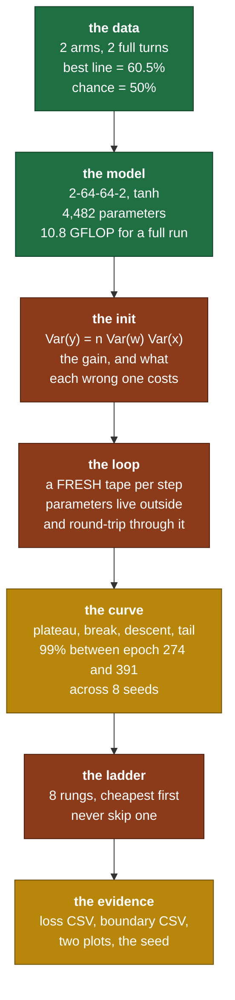
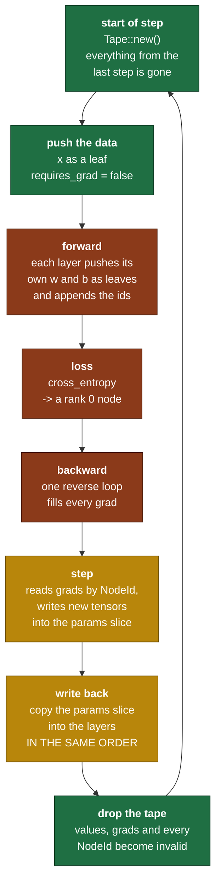

# Capstone R0b — the two-spiral problem

> **This file is the depth behind [`days/DAY_14.md`](../days/DAY_14.md).**
> The day lesson has 3.5 hours to teach AdamW *and* run the capstone. This file
> is the capstone on its own, with no time limit on it.
> Read it the evening before Day 14. Keep it open while you build.
> Tick your boxes in [`RUST_TRACKER.md`](../RUST_TRACKER.md). This file holds no checkboxes.
>
> Written in [Simple English](../.claude/skills/simple-english/SKILL.md) (ASD-STE100), pragmatic mode.
> **Every number in this file is measured, not estimated.** Section 14 says how each one was produced.

**Claim: R0b. Test: `spiral_classification` in `rust/tests/day14.rs`.**
**Evidence: `evidence/phase0_spiral_*.csv` and the plots.**
**Tools in this folder: `plot_loss.py`, `render_boundary.py`. Both are mine. The model is yours.**

---

## Contents

| § | What it covers |
|---|---|
| 1 | Why this capstone exists, and the exact line it breaks on for each of Days 1 to 13 |
| 2 | The dataset, and the measurement that says it is hard enough |
| 3 | The model, and the reason for every number in `2 → 64 → 64 → 2` |
| 4 | The training loop, and the three ways it fails silently |
| 5 | Initialisation, derived and then measured |
| 6 | What the loss curve must look like, with landmarks |
| 7 | **The diagnostic ladder.** The most useful section. Read it before you need it. |
| 8 | Hyperparameters, with measured working ranges |
| 9 | The evidence protocol |
| 10 | The tools in this folder |
| 11 | Self-checks. Posed, never answered. |
| 12 | What not to do |
| 13 | The gate, and what this becomes in Phase 1 and Phase 2 |
| 14 | How every number here was produced |

---

## 1. Why this capstone exists

### 1.1 The one idea

Every test before today checked **one thing in isolation**. `matmul_backward_2x2_by_hand` proves one arm of one `match`. `gradcheck_passes_for_correct_ops` proves each rule on its own, on random inputs, with no optimizer and no second step.

A working autograd is not a set of working rules. It is a set of working rules that **compose, in sequence, thousands of times, while the values underneath them move**.

The spiral is the smallest problem that tests the composition. It runs in seconds, it needs no download, and it is impossible for anything linear. If your library trains it, the library works. If it does not, you have a fault that no unit test in this repo can see.

### 1.2 What breaks the capstone, day by day

This is the table that makes the capstone worth its afternoon. Each row is a real fault that **passes every earlier test** and stops here.

| Day | The fault | Why the earlier tests miss it | How it shows up here |
|---|---|---|---|
| 1 | `Rng::normal` has the wrong variance | `normal_moments` uses a loose tolerance | Every layer's init is off by a constant. Section 5's measured std does not match. |
| 2 | `phys_index` is wrong for one stride pattern | Day 2 tests a handful of shapes | A wrong forward value at one layer, and a loss that never leaves `ln(2)` |
| 3 | `contiguous` copies in logical order but writes in physical order | Only tested through `to_vec` | The second layer reads a transposed weight. Loss falls to about 0.5 and stops. |
| 4 | Broadcast alignment is off by one axis | Day 4 tests shapes, not a bias add inside a model | The bias adds to the wrong feature. Accuracy sticks near 0.5. |
| 5 | `sum_all` is a sequential fold, not pairwise | 200 values is far too few to lose precision | Nothing here. **This capstone does not test Day 5's precision work.** Say so honestly. |
| 6 | `matmul` batch-stride fault | Only tested at equal batch sizes | Nothing here: this model is rank 2 throughout. **Also not tested.** |
| 9 | `requires` is not propagated through `push` | Day 9 tests it on a two-node graph | The backward loop skips a whole layer. That layer's weights never move, and the loss plateaus above chance. |
| 10 | `=` instead of `+=` in one arm | `diamond_accumulates` covers `Mul` and `Add` | A residual-free MLP has little reuse, so this one can pass. **Weak coverage.** Day 10's test is the real defence. |
| 10 | Broadcast backward does not sum | `broadcast_backward_sums` catches it | Every bias gradient is wrong by 200. AdamW normalises the magnitude away, so the **direction** is still wrong and training is slow and wrong. |
| 11 | A transpose on the wrong operand | Day 11 uses non-square shapes | Layer 2 is 64 by 64 and **square**, so the fault survives to here. Layer 1 is 2 by 64 and fails loudly. |
| 12 | The checker never fails | Nothing tests the tester | Every gradient is wrong and every test is green. The capstone is the first thing that notices. |
| 13 | The `1/B` factor is missing | `cross_entropy_gradcheck` catches a constant factor | The effective learning rate is 200 times too large. Loss goes to `NaN` in a few steps. |
| 13 | Softmax reduces the wrong axis | `softmax_sums_to_one` catches it | Loss sits exactly at `ln(2)` and never moves at all. |
| 14 | Bias correction on one moment only | `adamw_bias_correction_first_step` catches it | The first hundred steps take near-zero steps, then it recovers. The curve has a long flat head. |
| 14 | Parameters written back in the wrong order | Nothing tests it | **The single most likely new fault today.** Section 4.3. The loss falls a little and then rises. |

Read the `5`, `6` and `10` rows again. **A capstone that claims to test everything is lying.** This one tests the composition of the forward and backward paths under a moving optimizer. It does not test numerical summation at scale, and it does not test batched matmul. Those stay covered by their own days.

### 1.3 Why a spiral

Four candidate problems, and why this one:

| Problem | Why not |
|---|---|
| XOR, 4 points | One hidden layer of 2 units solves it. It does not need depth, and it converges before a bug has time to show. |
| A linear separation | A model with no hidden layer solves it. It tests nothing you built after Day 9. |
| MNIST | Needs a download, needs 784-wide inputs, and one epoch on a scalar-loop autograd takes minutes. The debugging loop becomes too slow to use. |
| **Two spirals** | 200 points, no download, seconds per run, and **the best possible straight line scores 60.5 percent.** |

That last number is measured, not asserted. Section 2.3 says how.

### 1.4 The map



---

## 2. The dataset

### 2.1 The parametrization

Each class is one arm of an Archimedean spiral. In an Archimedean spiral the radius grows in proportion to the angle, so the arms stay a constant distance apart. That constant spacing is what makes the problem uniformly hard at every radius, instead of hard only near the centre.

For class `c` in `{0, 1}` and point `i` of `n`:

```text
   frac    =  i / n                      in [0, 1)
   radius  =  0.1 + frac                 in [0.1, 1.1)
   theta   =  frac * TURN  +  c * pi  +  noise
   x       =  radius * sin(theta)
   y       =  radius * cos(theta)

   TURN  = 4 * pi     (two full turns)
   noise ~ Normal(0, 1) * 0.05           radians, not units of distance
```

Three things to notice.

- **The two classes are the same curve, rotated by `pi`.** At any radius, the two arms are diametrically opposite. That symmetry is what makes the problem clean to reason about and impossible for a line.
- **The noise is on the angle, not on the position.** So the spread of a point is proportional to its radius: `0.05 * radius` in distance. Points near the centre are tightly placed, points at the rim are loose. That is realistic and it is the reason the boundary near the centre must be sharper.
- **`radius` starts at 0.1 and not at 0.** A zero radius puts both classes at exactly the same point, which is an unlearnable contradiction sitting in your training set.

### 2.2 The geometry

At `TURN = 4*pi` each arm wraps twice. Here is the shape, with class 0 as `.` and class 1 as `o`:

```text
                      . . . . .
                  . .           . .
              o o o o o o o o o     .
            o                   o o   .
          o       . . . . .         o  .
         o     . .         . .       o  .
        o    .     o o o o    .       o  .
       o    .    o         o   .       o  .
       o   .    o    . . .   o   .      o  .
       o   .   o   .      .   o   .     o  .
       o   .   o  .   x    .  o   .     o  .          x = the origin
       o   .   o   .      .   o  .      o  .
       o   .    o   . . .    o   .      o  .
       o    .    o         o   .       o  .
        o    .     o o o o    .       o  .
         o     . .         . .      o   .
          o       . . . . .        o   .
            o o                  o    .
              o o o o o o o o o o    .
                  . .            . .
                      . . . . . .

   Follow one arm from the centre outward. It passes BETWEEN the two
   arms of the other class twice. No straight line separates them.
```

### 2.3 The measurement: how hard is it really

An assertion that a spiral "is not linearly separable" is worth nothing without a number, because a spiral with a quarter turn is very nearly separable.

So the number was measured. Every direction from 0 to 180 degrees was tried in half-degree steps, and for each direction every possible threshold was tried. That is the exact optimum over all linear classifiers, not a fitted approximation.

| `TURN` | turns | **best possible straight line** | MLP reaches 99 percent at epoch |
|---|---|---|---|
| 3.5 rad | 0.56 | **93.0 percent** | 3 to 28 |
| 5.0 rad | 0.80 | 76.5 percent | 22 to 28 |
| 6.5 rad | 1.03 | 68.0 percent | 83 to 112 |
| 8.0 rad | 1.27 | 64.0 percent | 100 to 127 |
| **4·pi = 12.57 rad** | **2.00** | **60.5 percent** | **274 to 391** |

Read the first row. **The original setting of this fixture was 3.5 radians, and it was wrong.** A linear model scores 93 percent on it, and the network passes the 99 percent bar in as few as 3 epochs. A test that passes in 3 epochs proves that the first gradient step pointed downhill, and nothing more.

At `4*pi` the bar means something:

```text
   chance                                  50.0 percent
   the best straight line that exists      60.5 percent
   the capstone bar                        99.0 percent
```

The gap between 60.5 and 99 is the part of the problem that only a non-linear model can reach. That gap is what your autograd has to earn.

### 2.4 What the noise buys

Set the noise to zero and the two arms become exact curves with a clean gap. A large enough network memorises the 200 points with a boundary that is not smooth, and it passes.

With noise, adjacent points of opposite classes come close near the rim, so the boundary has to be genuinely smooth to get them all. It also means **the training set is not guaranteed separable**, which is honest: a 99 percent bar on 200 points allows two mistakes.

`0.05` radians is about 2.9 degrees. It is small enough to keep the arms distinct and large enough to stop memorisation from being trivial.

### 2.5 Class balance, and the number you assert at step 0

`n` points per class, 2 classes, so the classes are exactly balanced. A model that has learned nothing gives every class probability `1/2`, and the cross-entropy of that model is

```text
   loss  =  -ln(1/2)  =  ln(2)  =  0.693147...
```

This is the Day 13 `ln(n)` assertion at `n = 2`. **It is the first thing your training loop must print, and the first thing you check.** A step-0 loss that is not near 0.693 means a fault in the forward pass or the initialisation, and no amount of tuning fixes it.

In practice the measured step-0 loss is a little above `ln(2)`, near 0.70 to 0.76, because the initial logits are small but not exactly zero. A value of 1.5 means the init is far too large. A value of exactly 0.693147 to fifteen digits means your logits are exactly zero, which means a layer is not connected.

---

## 3. The model

### 3.1 The architecture, with shapes

```text
   input          [200,  2]      x and y
     |
     |  Linear 1  w [2, 64]  b [64]
     v
   pre-act        [200, 64]
     |  tanh
     v
   hidden 1       [200, 64]
     |
     |  Linear 2  w [64, 64]  b [64]
     v
   pre-act        [200, 64]
     |  tanh
     v
   hidden 2       [200, 64]
     |
     |  Linear 3  w [64,  2]  b [2]
     v
   logits         [200,  2]      NO activation here
     |
     |  cross_entropy(logits, targets)   targets: 200 class indices
     v
   loss           rank 0        one number
```

**There is no activation after the last layer.** The logits go straight into `cross_entropy`, which does its own stable log-sum-exp internally. A `tanh` or a `softmax` before the loss is the most common wiring mistake in this shape, and it caps your logits so the loss cannot reach zero.

### 3.2 The parameter count

Count it now, because section 11 asks you to count it by hand and compare.

```text
   layer 1    w [2, 64]  =   128    b  64    ->     192
   layer 2    w [64,64]  =  4096    b  64    ->    4160
   layer 3    w [64, 2]  =   128    b   2    ->     130
                                                --------
   total                                          4,482
```

**Layer 2 holds 93 percent of the parameters.** That single fact explains why the middle layer is where init faults and transpose faults do their damage, and why it is the layer to instrument first.

### 3.3 Why 64 wide

A `tanh` unit is a soft half-plane: on one side it saturates near `+1`, on the other near `-1`, and between them it turns over. The first hidden layer is therefore 64 soft half-planes at 64 different angles and offsets. The layers above combine them.

The decision boundary for two spirals of two turns is a curve that has to wrap twice. Wrapping a curve out of half-planes needs many of them, and the count grows with the number of turns. 64 is comfortably more than enough at two turns, which is what you want in a capstone: **the test must fail for a bug, not for a lack of capacity.**

8 units is genuinely marginal at this turn count, and a failure at 8 units teaches you nothing about your library.

### 3.4 Why two hidden layers

One hidden layer is a universal approximator in the limit, so depth is not about what is possible. It is about how many units it takes.

With one hidden layer, each unit contributes one half-plane and the output sums them. With two, the second layer combines the first layer's outputs, so it can build features that are already curved. In practice a curved, wrapping boundary needs far fewer units per layer at depth 2 than at depth 1.

There is a second reason, and it is the one that matters for this repo. **Depth 1 does not test gradient propagation.** With one hidden layer, every gradient path is two matmuls long. A fault in how gradients flow through a chain shows up only when there is a chain. Two hidden layers is the smallest network with a middle to get lost in.

### 3.5 Why `tanh` and not `relu`

Both train this dataset. `tanh` is chosen for a reason specific to your project.

`relu` has a kink at zero. A finite-difference gradient check straddling that kink disagrees with any analytic value your code returns, and neither is wrong. Day 12 section 2.6 covers it. Since you gradient-check the **whole model** as rung 2 of the diagnostic ladder, a smooth activation keeps that rung clean.

`tanh` also has the saturation behaviour that section 5 is about, and it is the activation whose derivative you already derived on Day 10, so its backward is code you have already gradient-checked.

### 3.6 Why two logits and cross-entropy

You can do binary classification with one output and a squared error. Do not.

```text
   1 output + MSE            2 outputs + cross-entropy

   gradient vanishes when    gradient is  p - onehot,  which is
   the output saturates      large exactly when the model is
                             confidently wrong

   no calibrated             the outputs are a probability
   probability               distribution, so ln(2) is assertable

   does not generalise       generalises to 50257 classes with
   to many classes           no change at all
```

The last row is the real reason. The loss you build here is the loss GPT-2 uses on Day 25. A different loss for the capstone tests code you are about to throw away.

### 3.7 The cost, and a check on the `6ND` rule

Day 11 derived that a forward pass costs about `2P` FLOPs per example and a forward-plus-backward costs about `6P`. Apply it here.

```text
   P = 4,482 parameters        N = 200 examples per step

   forward           2 * 4,482 * 200  =    1,792,800 FLOPs
   forward+backward  6 * 4,482 * 200  =    5,378,400 FLOPs per step

   2,000 steps                          10,756,800,000  =  10.8 GFLOP
```

**10.8 GFLOP is the whole capstone.** Now use your Day 7 and Day 8 numbers. At a measured 20 GFLOP/s the run is under a second of arithmetic. At the 0.3 GFLOP/s that a debug build gives, it is 36 seconds of arithmetic plus the interpreter-like overhead of unoptimised generic code, which is why the test runs with `--release`.

Section 11 asks you to compare that prediction against your real wall-clock. The gap between them is a measurement of everything the `6PN` rule leaves out, and knowing its size on a machine you own is worth more than the rule.

---

## 4. The training loop

### 4.1 The lifecycle



### 4.2 What survives a step, and what does not

This is the part of the design that feels strange until you see it laid out.

| Lives across steps | Dies at the end of every step |
|---|---|
| The 6 parameter tensors, owned by the layers | The `Tape`, and every node in it |
| The optimizer's `m` and `v` buffers | Every forward value, including the activations |
| The optimizer's step counter `t` | Every gradient |
| The dataset | **Every `NodeId`** |
| Your loss history | |

**The last row of the right column is the trap.** A `NodeId` is an index into one specific tape. Keep one across a step boundary and it silently indexes a different node on the next tape, or panics if the new tape is shorter. Nothing in the type system stops you, because a `NodeId` is a plain `Copy` number by design.

The rule: **build the `params` list fresh, inside the step, every step.** If you find yourself storing a `Vec<NodeId>` as a field somewhere, stop.

### 4.3 The parameter round-trip

Six tensors go around a loop every step, and the loop has four legs. Get the order wrong on any leg and the optimizer applies layer 3's state to layer 1's weights.

```text
   slot   what it is        leg 1: forward appends      leg 2: backward fills
   ----   ----------------  --------------------------  ---------------------
    0     layer 1  w        (id_0, w1.clone())          grads[id_0]
    1     layer 1  b        (id_1, b1.clone())          grads[id_1]
    2     layer 2  w        (id_2, w2.clone())          grads[id_2]
    3     layer 2  b        (id_3, b2.clone())          grads[id_3]
    4     layer 3  w        (id_4, w3.clone())          grads[id_4]
    5     layer 3  b        (id_5, b3.clone())          grads[id_5]

   leg 3: opt.step reads grads[id_k] and OVERWRITES params[k].1
          The optimizer's m[k] and v[k] are indexed by k, the SLOT NUMBER.

   leg 4: you copy params[k].1 back into the layer it came from,
          walking the layers in the same order forward walked them.
```

**Three invariants, and each one is a real bug if it breaks.**

1. **The order is the same on every step.** The optimizer's `m[2]` is layer 2's weight momentum, forever. Reorder the layers between steps and the momentum from one tensor is applied to another. The symptom is a loss that falls for a few steps and then rises steadily.
2. **The write-back walks the same order.** Skip the bias when a layer has none, or the slots shift by one from that layer onward.
3. **`params` is rebuilt each step, never reused.** See section 4.2.

### 4.4 The plan

Written as steps, with no bodies. This is what your loop does, in this order.

```text
   before the loop:
     1.  build the dataset once. It does not change.
     2.  construct the three layers with a seeded Rng.
     3.  construct the optimizer.
     4.  open the loss CSV and write its header.

   for each epoch:
     5.  tape = Tape::new()
     6.  x = tape.leaf(features, requires_grad = false)
             the data is not a parameter, so it needs no gradient
     7.  params = an empty Vec
     8.  h = x
         for each layer, in order:
             h = layer.forward(&mut tape, h, &mut params)
             apply tanh to h, EXCEPT after the last layer
     9.  loss_node = cross_entropy(&mut tape, h, &targets)
    10.  read the loss value out BEFORE backward. It is your log line.
    11.  if this is epoch 0, assert the loss is near ln(2). Stop if it is not.
    12.  assert the loss is finite. Stop at the first NaN, not the hundredth.
    13.  tape.backward(loss_node)
    14.  optimizer.step(&tape, &mut params)
    15.  copy params back into the layers, in the same order as step 8
    16.  compute accuracy from the logits you already have
    17.  append (epoch, loss, accuracy) to the CSV
    18.  drop the tape. It happens on its own at the end of the scope.

   after the loop:
     19. run one final forward on a grid, and write the boundary CSV.
     20. write the metadata file: seed, hyperparameters, machine, date.
```

Step 10 is placed there for a reason. **Read the loss before `backward`, not after.** After `backward` the value is still there, but reading it first means your log line is the loss of the parameters you are about to change, which is what a loss curve means.

Step 12 is cheap and it saves an hour. A `NaN` at epoch 4 that you notice at epoch 2000 costs you the whole run and tells you nothing about where it started.

### 4.5 The three silent failures

None of these panic. None fail a unit test. All three produce a curve that looks nearly reasonable.

**One: the data leaf requires a gradient.** Set `requires_grad = true` on `x` and everything still runs. The backward pass computes a gradient for the input, which is wasted work, and if you then include `x` in `params` by accident the optimizer starts editing your dataset. The loss falls beautifully. The model has learned nothing, and the data has moved to fit it.

**Two: `tanh` after the last layer.** The logits are then bounded in `[-1, 1]`, so the largest probability the model can express is `e^1 / (e^1 + e^-1) = 0.881`, and the lowest reachable loss is about `0.127`. The curve falls, flattens near 0.13, and looks like a converged model that has hit its capacity. Accuracy still reaches 100 percent, so **the capstone still passes**, and the test never tells you. The check is that a converged run reaches a loss below 0.01.

**Three: the write-back is skipped.** Omit step 15 and the optimizer updates its copies while the layers keep their initial weights. The loss is computed from the untouched layers, so it stays flat at `ln(2)` forever. This looks exactly like a dead-gradient problem, and section 7 rung 5 separates them in thirty seconds.

---

## 5. Initialisation

### 5.1 The forward condition

One layer computes `y_i = sum_j w_ij x_j` over `n = fan_in` inputs. Take the weights and inputs as independent with zero mean. The variance of a sum of independent terms is the sum of the variances, and the variance of a product of independent zero-mean variables is the product of the variances:

```text
   Var(y_i)  =  sum over j of  Var(w_ij * x_j)
             =  n * Var(w) * Var(x)
```

So each layer multiplies the activation variance by `n * Var(w)`. That factor compounds with depth, and compounding is unforgiving:

```text
   factor 0.5    after  3 layers  0.125          after 12 layers  0.000244
   factor 1.0    after  3 layers  1.0            after 12 layers  1.0
   factor 2.0    after  3 layers  8.0            after 12 layers  4096
```

Set the factor to 1 and solve: `Var(w) = 1 / fan_in`. That is the LeCun rule.

### 5.2 The backward condition, and why the two disagree

The same argument runs backward. A gradient passing down through the layer is multiplied by `w` transposed, so:

```text
   forward  wants   Var(w) = 1 / fan_in       to hold the activation scale
   backward wants   Var(w) = 1 / fan_out      to hold the gradient scale
```

**Both hold only when `fan_in == fan_out`.** For every other layer you choose one or compromise. Xavier's compromise is the harmonic-mean-shaped

```text
   Var(w)  =  2 / (fan_in + fan_out)
```

For this network the two rules give noticeably different numbers only at the ends, where the fan counts are 2 and 2:

| layer | fan_in | fan_out | LeCun std (with tanh gain) | Xavier std (with tanh gain) |
|---|---|---|---|---|
| 1 | 2 | 64 | 1.1785 | 0.2901 |
| 2 | 64 | 64 | 0.2083 | 0.2083 |
| 3 | 64 | 2 | 0.2083 | 0.2901 |

Layer 1 differs by a factor of four. Both train this problem. Pick one, write it in the commit message, and be able to say which condition you chose to satisfy.

### 5.3 The gain, derived

The variance argument above is for a **linear** layer. `tanh` shrinks its input, so a network of `tanh` layers loses variance at every step even with `Var(w) = 1/fan_in`.

Correct for it by measuring how much `tanh` shrinks a unit-variance input:

```text
   for x ~ Normal(0, 1),   E[tanh(x)^2]  =  0.394294        (measured, §14)

   to restore unit variance, multiply the weights by

        gain  =  1 / sqrt( E[tanh(x)^2] )  =  1 / sqrt(0.394294)  =  1.5925
```

**PyTorch uses `5/3 = 1.6667` for `tanh`.** That is the same constant, rounded to a memorable fraction. Now you know where it comes from instead of copying it.

The other two you will meet:

```text
   linear / identity     gain = 1
   relu                  gain = sqrt(2) = 1.4142     (relu zeroes half the units,
                                                      so it halves the variance)
   tanh                  gain = 5/3    = 1.6667
```

**And now the honest part about the card.** The Day 14 card says Kaiming init, whose gain is `sqrt(2)`, and this network uses `tanh`, whose gain is `5/3`. The ratio is only `1.1785`, so the variance is off by `1.389` per layer. Over this network's 3 layers that is a factor of 2.7, which section 5.4 shows does not matter. **Over GPT-2's 12 layers it is a factor of 51.5, which does.**

So the right answer today is "either works, and I chose X because Y". The right answer on Day 22 is not.

### 5.4 What each choice actually costs, measured

Each row is a real run: the same seed, the same data, 2000 epochs, only the init gain changed. `std` is the standard deviation of the pre-activation at step 0, per layer. "saturated" is the fraction of layer-2 units with `|tanh| > 0.99`, where the derivative `1 - y^2` is below 0.02.

| gain | std L1 / L2 / L3 | saturated | best accuracy | reached 99 percent |
|---|---|---|---|---|
| 0.1, far too small | 0.04 / 0.00 / 0.00 | 0.0 % | **67.5 %** | **never** |
| 1.0, linear | 0.43 / 0.35 / 0.23 | 0.0 % | 100 % | epoch 437 |
| 1.4142, relu | 0.60 / 0.62 / 0.46 | 0.0 % | 100 % | epoch 318 |
| **1.6667, tanh** | **0.71 / 0.80 / 0.62** | **0.2 %** | **100 %** | **epoch 301** |
| 5.0, far too large | 2.13 / 3.72 / 2.64 | **46.6 %** | 100 % | epoch 455 |

Three readings, and the third is the one people get wrong.

- **Too small is fatal.** At gain 0.1 the signal is gone by layer 2, the std is 0.00 to two places, and the model never leaves 67.5 percent. This is the dead-gradient failure, and no learning rate fixes it.
- **The correct gain is the fastest**, and the margin over its neighbours is small: 301 against 318 against 437 epochs.
- **Too large is survivable here, and that is misleading.** At gain 5.0, 46.6 percent of layer-2 units are saturated at step 0, and the model still gets there, 50 percent slower. At three layers a network recovers from a bad init. At twelve it does not. **Do not conclude from this table that init does not matter.** Conclude that this network is too shallow to punish you for it.

### 5.5 The instrumentation to write, that almost nobody does

Print the standard deviation of every layer's pre-activation at step 0, once, behind a flag.

```text
   epoch 0  pre-activation std:  L1 0.71   L2 0.80   L3 0.62
   epoch 0  layer 2 saturated (|tanh| > 0.99):  0.2 %
```

Reading it against the table in 5.4 turns "the model does not train" from a guess into a measurement, in ten seconds. It is the highest value-per-line diagnostic in this whole document.

The targets, for this network:

```text
   healthy      every layer's pre-act std in 0.4 to 1.2
                saturated fraction under 5 percent

   too small    any std under 0.1, or a std that FALLS sharply with depth
   too large    any std over 2.0, or a saturated fraction over 20 percent
```

---

## 6. What the loss curve must look like

### 6.1 The four phases, with landmarks

A healthy run at the default settings, measured:

```text
   epoch     1   loss 0.7581   acc 0.470     <- phase 1: the plateau
   epoch     2   loss 0.7160   acc 0.500
   epoch     3   loss 0.7296   acc 0.450
   epoch   100   loss 0.5987   acc 0.530
   epoch   200   loss 0.5222   acc 0.670     <- phase 2: the break
   epoch   300   loss 0.1958   acc 0.990     <- phase 3: the descent
   epoch   400   loss 0.0330   acc 1.000
   epoch   500   loss 0.0127   acc 1.000     <- phase 4: the tail
   epoch  1000   loss 0.0018   acc 1.000
```

```text
   loss
   0.8 |***
       |   ****                              phase 1  the plateau
   0.6 |       *******                       the model finds the easy
       |              *****                  half of the problem, and
   0.4 |                   ***               accuracy barely moves
       |                     **
   0.2 |                      *              phase 2  the break, ~epoch 200-300
       |                      *              a boundary that wraps appears
   0.0 |                       *********     phase 3  the descent, very fast
       +---------------------------------->  phase 4  the tail, log-slow
       0     200    400    600    800  1000
```

**Phase 1 is long, and it is not a failure.** For 200 epochs the loss falls from 0.76 to 0.52 and accuracy goes from 0.47 to 0.67, which is roughly what the best straight line achieves. The model is learning the linear part of the problem. The wrap comes later and comes fast.

If you stop the run at epoch 150 because "it is not learning", you will have thrown away a working library. **Let it run the full 2000.**

**Plot the loss on a log y axis.** Phase 4 spans 0.03 down to 0.0018, which is invisible on a linear axis, and phase 4 is where you see whether the model is still improving or has stopped.

### 6.2 The gallery of bad curves

```text
   A) flat at 0.693 forever          B) NaN within a few steps
      0.7 |*****************            0.7 |**
          |                                 |  *
          |                                 |   |
      0.0 +------------------           NaN +---x-------------

      the gradient never reaches        the effective learning rate is
      the parameters. Causes:           enormous. Causes: the 1/B factor
      the write-back is missing         is missing (200x too large), lr
      (§4.5 three), requires is         is far too high, or a softmax
      not propagated (§1.2 Day 9),      with no max-shift overflowed.
      or softmax reduces the wrong      Check step 12 of the plan: stop
      axis (§1.2 Day 13).               at the FIRST NaN and print the step.

   C) falls to ~0.5 and stops        D) falls, then rises steadily
      0.7 |**                           0.7 |**              ****
          |  ****                           |  ****      ****
      0.5 |      ***********                |      ******
      0.0 +------------------           0.0 +------------------

      the model learned the linear     the optimizer state is misaligned
      part and stopped. This is the    with the parameters. Cause: the
      60.5 percent boundary. Causes:   write-back order (§4.3). Or the
      dead gradients from a bad init   learning rate is just past stable.
      (§5.4 row 1), or a fault in      Distinguish: halve the lr. If it
      the second layer's gradient.     still rises, it is the order.

   E) noisy, no trend                F) reaches 0.13 and flattens
      0.7 |* * * *  *  * * *            0.7 |**
          | *  * *** *  *  *                |  ***
          |* *   *  *  * *  *           0.13|     ************
      0.0 +------------------           0.0 +------------------

      lr far too high but not          a tanh sits after the last layer,
      quite divergent. Divide by 10.   so the logits are capped at +-1.
      Full batch has NO gradient       See §4.5 two. Accuracy still hits
      noise, so a noisy curve is       100 percent, so the capstone PASSES
      always the step size.            and the model is still wrong.
```

### 6.3 Loss and accuracy move at different times

Between epoch 200 and 300 the loss falls by 0.33 and accuracy jumps from 0.67 to 0.99. Between epoch 400 and 1000 the loss falls by another 0.031 and accuracy does not change at all.

Accuracy is a step function of the logits, so it only moves when a point crosses the boundary. Loss is continuous, so it keeps improving as the model grows more confident about points it already gets right.

**Log both.** Accuracy tells you whether the boundary is right. Loss tells you whether the optimizer is still working. A run where accuracy is stuck and loss is falling is refining confidence on the wrong shape.

---

## 7. The diagnostic ladder

When the capstone does not train, the temptation is to change the learning rate, then the width, then the init, in some order, until something moves. That is a search over a large space with no feedback, and it takes days.

The ladder is an ordered protocol. **Each rung is cheap, and each rung rules out a whole class of causes.** Never skip a rung, and never move up until the current one is green.

```text
   rung 8   change the architecture                      hours     LAST RESORT
   rung 7   remove weight decay, remove momentum         minutes
   rung 6   learning-rate sweep, decade by decade        minutes
   rung 5   overfit 4 points                             seconds   <- the pivot
   rung 4   gradient norms per layer at step 0           seconds
   rung 3   activation std per layer at step 0           seconds
   rung 2   gradient-check the WHOLE model               seconds
   rung 1   step-0 loss is near ln(2)                    instant
   rung 0   cargo test passes for Days 1 to 13           you already ran it
```

### Rung 0 — the unit tests

If any test from Days 1 to 13 is red, stop. The capstone cannot tell you anything a focused test has already told you.

### Rung 1 — the step-0 loss

Print it. It must be near `0.693`.

```text
   0.69 to 0.80    healthy
   exactly 0.693147 to 15 digits   your logits are exactly zero.
                                   A layer is not connected, or a weight
                                   is all zeros.
   1.2 and above   the init is far too large. Go to rung 3.
   not finite      go to rung 2. This is not a tuning problem.
```

**This rung costs nothing and it catches every forward-pass and loss fault.** If it is wrong, no rung above it can help you, because everything above assumes the forward pass is right.

### Rung 2 — gradient-check the whole model

Days 12 and 13 checked ops. Check the composition.

Build a tiny version: 4 data points, a `2 → 3 → 3 → 2` network, `f64`, and run your Day 12 `grad_check` over the whole thing including the loss. Use the projected variant as well.

```text
   passes    the autograd is correct through a real composition.
             Every remaining cause is optimization or data. Go to rung 3.

   fails     you have an autograd bug that Days 10 to 13 did not catch.
             STOP. Do not tune anything. Shrink the network until the
             check passes, and the layer you removed holds the fault.
```

This rung is the reason Day 12 exists, and it is the single most valuable thing in this document. **A model that fails a gradient check will never train, and a training run is an extremely slow way to discover that.**

### Rung 3 — activation statistics

Section 5.5. Print the pre-activation std per layer and the saturated fraction, at step 0.

```text
   any std under 0.1      the signal dies. Raise the init gain.
   any std over 2.0       units are saturated. Lower the init gain.
   healthy                go to rung 4.
```

### Rung 4 — gradient norms per layer

At step 0, print the norm of each parameter's gradient.

```text
   healthy      the ratio between the largest and smallest layer norm
                is within about 100x

   ratio 1e4 or more, shrinking with depth    vanishing gradients.
                                              Go back to rung 3.

   any layer exactly 0.0                      that layer is disconnected
                                              from the loss, or `requires`
                                              did not propagate. This is
                                              an autograd fault: rung 2.
```

A layer whose gradient is exactly zero is the fingerprint of the Day 9 `requires` fault, and it is invisible at every rung below this one.

### Rung 5 — overfit four points. This is the pivot of the whole ladder.

Take four points, two per class, far apart. Train the same network on just those four, with no weight decay, for 500 epochs.

**Any correct network memorises four points. The loss must go below 0.001.**

```text
   it works     your library is correct and your optimizer works.
                The problem is optimization difficulty or data.
                Go to rung 6, and expect to find it there.

   it fails     you have a BUG, not a tuning problem.
                Go back to rung 2 and look harder. Nothing above this
                rung will help you, and every hour spent on the learning
                rate from here is wasted.
```

This one test splits the entire remaining search space in two, in seconds. **It is the rung people skip and the one they most need.**

### Rung 6 — the learning-rate sweep

Run 300 epochs at each of `1e-5, 1e-4, 1e-3, 3e-3, 1e-2, 3e-2, 1e-1`. Record the final loss. Measured, on a correct implementation:

| lr | final loss at 2000 epochs | best accuracy | reached 99 percent |
|---|---|---|---|
| 1e-5 | 0.6710 | 60.0 % | never — too slow |
| 1e-4 | 0.5755 | 59.5 % | never — too slow |
| 1e-3 | 0.0018 | 100 % | epoch 558 |
| **3e-3** | **0.0004** | **100 %** | **epoch 301** |
| 1e-2 | 0.0002 | 100 % | epoch 256 |
| 3e-2 | 0.0002 | 100 % | epoch 182 |
| 1e-1 | 0.0004 | 100 % | epoch 193 |

**The working range spans two and a half decades.** That is what a correct AdamW looks like: it is famously insensitive to the learning rate, because the second moment normalises the step size.

That fact is a diagnostic in itself. **If your model works at exactly one learning rate and fails a factor of three either side, the fault is not the learning rate.** Go back to rung 5.

### Rung 7 — remove the extras

Set `weight_decay = 0`. Set momentum to zero, or swap AdamW for plain SGD. If plain SGD trains it and AdamW does not, the fault is in your AdamW, and Day 14's three optimizer tests tell you which part.

### Rung 8 — only now, the architecture

Widen to 128. Add a layer. Change the activation. These are the last things to try, not the first, because a change here alters the problem instead of diagnosing it.

---

## 8. Hyperparameters

Every "working range" below was measured on a correct implementation. Use them as a sanity check on your own sweep, never as a substitute for running it.

| Knob | Default | Working range | Too low | Too high |
|---|---|---|---|---|
| `lr` | `3e-3` | `1e-3` to `1e-1` | never breaks the plateau. At `1e-4`, 59.5 % after 2000 epochs | noisy curve, then divergence |
| `beta1` | `0.9` | `0.8` to `0.95` | jumpier steps | slow to change direction |
| `beta2` | `0.999` | `0.99` to `0.9999` | the scale estimate is jumpy | the first steps need bias correction more |
| `eps` | `1e-8` | `1e-10` to `1e-6` | huge steps for tiny gradients | the normalisation stops working, and AdamW becomes SGD |
| `weight_decay` | `1e-4` | `0` to `1e-2` | nothing, at this size | the boundary over-smooths and accuracy caps below 99 % |
| epochs | `2000` | at least `600` | phases 3 and 4 never happen | costs seconds |
| width | `64` | `32` to `256` | not enough half-planes for two turns | slower, no benefit |
| depth | 2 hidden | 2 to 4 | depth 1 needs far more width | init faults compound |
| `TURN` | `4*pi` | `2*pi` to `6*pi` | linear models pass, so the test proves nothing | needs more width and more epochs |
| seed | fixed | any | — | — |

**One honest note about full-batch training.** All 200 points go through every step, so the gradient is exact and deterministic, with no mini-batch noise at all. AdamW's `beta2` exists to smooth a noisy scale estimate, and here there is nothing to smooth. The optimizer still works, and bias correction still matters, but **you are not testing the property AdamW was designed for.** Phase 2 is where mini-batches arrive and where `beta2` starts to earn its place. Section 11 asks you to reason about what `v_hat` converges to under an exact gradient.

---

## 9. The evidence protocol

A claim without its artifact is not done. Four files.

### 9.1 `evidence/phase0_spiral_loss.csv`

```text
   epoch,loss,train_accuracy
   0,0.75810000,0.470000
   1,0.71600000,0.500000
   ...
```

Write every epoch, or every tenth plus every epoch where accuracy crosses 0.99. Do not write only the last row: the shape of the curve is the evidence.

### 9.2 `evidence/phase0_spiral_data.csv`

The dataset itself, so the plot is reproducible without rerunning your Rust.

```text
   x,y,label
   0.00000000,0.10000000,0
   ...
```

### 9.3 `evidence/phase0_spiral_boundary.csv`

After training, run one final forward pass over a grid and write the model's probability for class 1 at each grid point. **This is the artifact that makes the LinkedIn post good**, because it shows the wrapped boundary your network learned.

```text
   x,y,p1
   -1.30000000,-1.30000000,0.02341000
   ...
```

Use a grid from `-1.3` to `1.3` in both axes, 200 steps per axis. That is 40,000 forward points in one batch, which your matmul handles in one call.

### 9.4 `evidence/phase0_spiral.md`

The write-up. Without it the CSVs are numbers with no provenance.

```text
Capstone R0b — two spirals
Date:            <date>
Machine:         <chip, cores, rustc version>
Build:           cargo test --release --test day14
Seed:            <the exact seed>
Dataset:         200 points, 100 per class, TURN = 4*pi, noise 0.05
                 best possible straight line on this data: <your measurement> %
Model:           2 -> 64 -> 64 -> 2, tanh, <N> parameters   <- count it yourself
Init:            <LeCun or Xavier>, gain <value>, and one sentence on why
Optimizer:       AdamW, lr <x>, betas <b1> <b2>, eps <e>, wd <w>
Epochs run:      <n>

Step-0 loss:               <value>    (ln 2 = 0.693147)
Pre-activation std at 0:   L1 <x>  L2 <x>  L3 <x>
Reached 99% at epoch:      <n>
Final loss:                <value>
Final train accuracy:      <value>

Predicted FLOPs (6*P*N*steps):  <value>
Measured wall clock:            <value>
Implied GFLOP/s:                <value>
Against the Day 8 table:        <same, or the reason it differs>

What the diagnostic ladder found, if anything: <rung, cause, fix>
```

The last three lines of the numbers block are the ones that connect this capstone back to Days 7 and 8. They are also section 11's first self-check.

---

## 10. The tools in this folder

Both are mine to write, per `CLAUDE.md`: plotting and benchmark utilities are the mentor's, the model is yours. They read the CSVs above and write PNGs. They need `numpy` and `matplotlib`, which are already in `requirements.txt`, and they never touch the Rust crate.

```bash
# from course/
python3 capstone_r0b/plot_loss.py evidence/phase0_spiral_loss.csv
# -> evidence/phase0_spiral_loss.png     two panels, log-y loss and accuracy

python3 capstone_r0b/render_boundary.py \
    evidence/phase0_spiral_data.csv \
    evidence/phase0_spiral_boundary.csv
# -> evidence/phase0_spiral_boundary.png  the learned boundary under the data

# and the honest baseline, which needs only the data file:
python3 capstone_r0b/render_boundary.py evidence/phase0_spiral_data.csv --best-line
# -> prints the best possible straight-line accuracy on YOUR data
```

Run the third one. It recomputes the 60.5 percent from section 2.3 on the exact points your Rust generated, so the number in your write-up is yours and not mine.

---

## 11. Self-check — on paper, before you close the laptop

**I answer none of these.** They go in `hand_math/`, and they are separate from Day 14's two.

1. **Predict the wall clock, then measure it.** Count the parameters by hand and check against what your code reports. Compute the FLOPs for one forward-plus-backward step from `6 * P * N`, then for the whole run. Divide by the GFLOP/s you measured on Day 8 and write down the predicted wall-clock time. Then run it and measure. State the ratio between predicted and measured, and name the three largest things the `6PN` rule left out.

2. **Count the pieces of the boundary.** A `tanh` unit is one soft half-plane. Layer 1 has 64 of them. Reason about how many distinct regions 64 half-planes can cut the plane into, and how many the two-turn spiral boundary actually needs. Then look at the picture `render_boundary.py` produces and say whether the network used the capacity you predicted. Where the two disagree, say which of your assumptions was wrong.

3. **Full-batch AdamW.** The gradient here is exact and deterministic, with no mini-batch noise. Under a gradient that changes slowly, what does `v_hat` converge to after many steps? Substitute that into the update rule and describe, in one sentence, what the update becomes. Then say which of AdamW's five hyperparameters still does real work in this run and which are along for the ride.

4. **The step-0 loss, three ways.** Section 7 rung 1 calls a step-0 loss of exactly `0.693147` to fifteen digits a bug, and a loss of `0.76` healthy. Explain both. Then work out what step-0 loss an init gain of 5.0 produces, given the layer-3 pre-activation std of 2.64 from the table in section 5.4, and say whether the capstone's step-0 assertion catches it.

---

## 12. What not to do

- **Do not add a learning-rate schedule, warmup, or gradient clipping.** None are on the card. Every one of them hides a bug you have not found yet. Write them in `whats_next.md` and take them in Phase 2 with a measured reason.
- **Do not add mini-batching.** Full batch is deterministic, and determinism is what makes a bug reproducible. Mini-batches arrive in Phase 2 with a real dataset.
- **Do not lower the 99 percent bar because your run reaches 97.** Measured across 8 seeds the bar is reached between epoch 274 and 391, in a 2000 budget. A run that stalls at 97 has a cause, and section 7 finds it.
- **Do not raise `TURN` to make it more impressive.** The current setting is chosen from the sweep in section 2.3. A harder problem tests your patience, not your library.
- **Do not skip the boundary plot because the test already passes.** It is the artifact that makes the claim legible to somebody who is not you, and it is 20 lines of grid forward pass.
- **Do not tune before rung 5.** Read section 7 once more.

---

## 13. The gate, and what this becomes

### 13.1 Gate R0b

| Gate item | What in this document satisfies it |
|---|---|
| `cargo test --release` fully green | rungs 0 to 8 |
| `all_ops_gradchecked` passes, **and you watched it fail** | Day 14 order of work, step 14 |
| `evidence/phase0_spiral_loss.csv` and the plot committed | section 9 |
| The R0b LinkedIn post is shipped | the boundary plot from section 9.3 |

### 13.2 What this code becomes

Nothing here is thrown away.

| This capstone | Where it goes |
|---|---|
| The training loop shape | Day 22's model, and every Phase 2 run |
| `Linear` | the attention projections and the feed-forward block, Days 19 and 21 |
| `cross_entropy` | the GPT-2 loss, unchanged, at vocab 50257 |
| `AdamW` | the Phase 2 training runs, unchanged |
| The `ln(n)` step-0 assertion | the first line of every training run you ever write |
| The diagnostic ladder | **this is the transferable part.** It is the same ladder for a 124M model, with slower rungs. |

The last row is the point. The spiral is a toy. The protocol for debugging it is not, and on Day 25 you will run the same eight rungs against a model with 124 million parameters, where each rung costs an hour instead of a second.

---

## 14. How every number in this file was produced

Numbers in a document are claims. Here is where each one came from, so you can check any of them.

| Number | How |
|---|---|
| 4,482 parameters | Counted from the layer shapes. Section 3.2 shows the arithmetic. |
| 10.8 GFLOP for a full run | `6 * 4482 * 200 * 2000`, the Day 11 rule. |
| `E[tanh(x)^2] = 0.394294` | Numeric integration against the standard normal density, 2,000,001 points from `-12` to `12`. |
| gain `1.5925`, and `5/3` | `1 / sqrt(0.394294)`. |
| variance ratio `51.5` over 12 layers | `((5/3) / sqrt(2))^24`. |
| best straight line, per `TURN` | Exhaustive search: 721 directions from 0 to 180 degrees, and every threshold along each. This is the exact optimum over linear classifiers, not a fit. |
| MLP epochs to 99 percent | A NumPy reference model with the same architecture, the same init rule and the same AdamW, run to 2000 epochs. |
| the 8-seed range, 274 to 391 | The same reference model, seeds 1 to 8, default settings. |
| the init gain table | The same model, one run per gain, same seed and data. |
| the learning-rate table | The same model, one run per learning rate, same seed and data. |
| the loss-curve landmarks | The same model, seed 1, default settings. |

**The reference model is a check on the test, not a substitute for your work.** It exists so that the 99 percent bar and the 2000-epoch budget are known to be reachable before you spend an afternoon against them. Your Rust is the deliverable. If your run disagrees with these numbers by a lot, section 7 is why this file exists.
