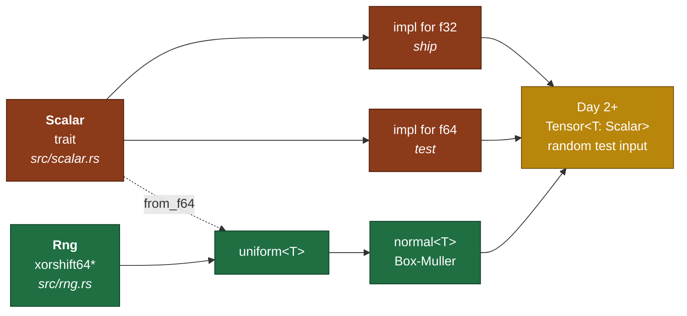

# Day 1 — The `Scalar` trait and a PRNG you own

> **Read this file. It replaces the book for today.**
> The page numbers stay as optional depth. This lesson teaches the same material in my own words.
> Tick your boxes in [`RUST_TRACKER.md`](../RUST_TRACKER.md). This file holds no checkboxes, so one file owns the ticks.
> The short card is [`RUST_PHASE_0_1.md` Day 1](../RUST_PHASE_0_1.md#day-1--the-scalar-trait-and-a-prng-you-own).

**Time: 2.5 hours. Claim: R0a. Files you create: `src/scalar.rs`, `src/rng.rs`.**
**Your tests are already written and red: `rust/tests/day1.rs`.**

---

## 1. Why this day exists

Your library must run every routine in two precisions.

- `f32` is what you ship. It is fast, and it is what GPT-2 weights use.
- `f64` is what you test in. The gradient checker on Day 12 needs it. In `f32` the checker gives false failures.

Python hides this behind `dtype`. Rust does not. Rust has no numeric tower in `std`. There is no `Float` trait. `num-traits` is a crate, and crates are banned for R0a.

So you define the abstraction yourself. You write down the exact list of operations that a "number" must support. That list is your `Scalar` trait.

The list is shorter than you expect. That is the lesson. A tensor library needs about twelve operations from a number, and no more.

The PRNG comes on the same day for one reason. Every test after today needs random input. A random test that you cannot repeat is not a test. So you need a seeded generator before you need tensors.



---

## 2. Traits — the whole idea in one page

A trait is a list of things a type can do. A type gets that list when you write an `impl` block for it.

Java calls this an interface. C++ calls it a concept. Rust calls it a trait, and Rust checks it at compile time.

### 2.1 Declare and implement

```rust
// A trait declares the list. It writes no bodies.
pub trait Shape {
    fn area(&self) -> f64;
    fn perimeter(&self) -> f64;
}

pub struct Square { side: f64 }
pub struct Circle { radius: f64 }

// One impl block per (trait, type) pair.
impl Shape for Square {
    fn area(&self) -> f64 { self.side * self.side }
    fn perimeter(&self) -> f64 { 4.0 * self.side }
}

impl Shape for Circle {
    fn area(&self) -> f64 { std::f64::consts::PI * self.radius * self.radius }
    fn perimeter(&self) -> f64 { 2.0 * std::f64::consts::PI * self.radius }
}
```

The trait must be in scope where you call its methods. This is why a `use` line for a trait looks unused and is not.

### 2.2 Default bodies

A trait can give a body. The `impl` then overrides it or accepts it.

```rust
pub trait Shape {
    fn area(&self) -> f64;
    fn describe(&self) -> String {          // default body
        format!("a shape of area {:.2}", self.area())
    }
}
```

Your `Scalar` trait uses no default bodies. Every method differs between `f32` and `f64`.

### 2.3 Associated constants

A constant belongs to the type, not to a value. Declare it in the trait. Fill it in each impl.

```rust
pub trait Shape {
    const SIDES: u32;
    fn area(&self) -> f64;
}

impl Shape for Square {
    const SIDES: u32 = 4;
    fn area(&self) -> f64 { self.side * self.side }
}
```

Read it back as `Square::SIDES`, or as `S::SIDES` inside a generic function.

Your trait declares `const ZERO: Self` and `const ONE: Self`. `Self` means "the type that implements this trait". So `f32::ZERO` is an `f32`, and `f64::ZERO` is an `f64`.

**Why constants and not a `zero()` method?** A constant is a compile-time value. The compiler puts it straight in the machine code. A method call needs a function, even when that function returns a literal. The optimiser usually removes the call, but the constant needs no optimiser.

### 2.4 Associated functions — the ones with no `self`

A method takes `self`. An associated function does not. You call it on the type.

```rust
pub trait Shape {
    fn unit() -> Self;               // no self: a constructor
    fn area(&self) -> f64;           // method: needs a value
}

let s = Square::unit();              // call on the type
let a = s.area();                    // call on the value
```

Your trait needs one of each kind:

- `fn from_f64(x: f64) -> Self` takes no `self`. It builds a number from an `f64`.
- `fn to_f64(self) -> f64` takes `self` by value. `Copy` makes that free.

### 2.5 Supertraits — a requirement, not inheritance

A supertrait says: "to implement me, you must first implement that."

```rust
use std::fmt::Debug;

pub trait Drawable: Shape + Debug {
    fn draw(&self);
}
```

`Drawable` inherits no code. It states a requirement. Now every function that takes a `Drawable` can also call `area()` and can print with `{:?}`.

Your trait declares this set of supertraits, and each one buys you something specific:

| Supertrait | What it buys you | What breaks without it |
|---|---|---|
| `Copy` | Assignment copies the value. No moves. | Every tensor read moves the element out. |
| `PartialOrd` | `<`, `>`, `partial_cmp` | `max_axis` on Day 5 cannot compare. |
| `Debug` | `{:?}` and `assert_eq!` failure output | Test failures print nothing useful. |
| `Add`, `Sub`, `Mul`, `Div`, `Neg` with `Output = Self` | `a + b` inside generic code | `zip_with` on Day 4 cannot add. |

**Why `PartialOrd` and not `Ord`?** Floats hold `NaN`. `NaN < 1.0` is false, and `NaN >= 1.0` is also false. That breaks the total order that `Ord` promises, so Rust refuses `Ord` for `f32` and `f64`. You get `PartialOrd`, and you handle `NaN` yourself. Day 5 makes this concrete in `max_axis`.

### 2.6 Operator traits are ordinary traits

`a + b` compiles to `Add::add(a, b)`. The operator is syntax for a trait method.

```rust
use std::ops::Add;

#[derive(Copy, Clone, Debug, PartialEq)]
struct Cents(i64);

impl Add for Cents {
    type Output = Cents;                       // an associated type
    fn add(self, other: Cents) -> Cents {
        Cents(self.0 + other.0)
    }
}

assert_eq!(Cents(150) + Cents(99), Cents(249));
```

`Output` is an associated type. It says what the sum is. `Add` alone permits `Cents + Cents = f64`, which is legal and useless.

This is why the bound in your trait reads `Add<Output = Self>` and not `Add`. You demand that a sum of two numbers is a number of the same type. Without `Output = Self`, generic code cannot chain `a + b + c`.

### 2.7 Generic functions, and what the compiler does with them

```rust
fn total_area<S: Shape>(shapes: &[S]) -> f64 {
    let mut acc = 0.0;
    for s in shapes {
        acc += s.area();
    }
    acc
}
```

`<S: Shape>` reads: "for any type `S` that implements `Shape`". The compiler then does **monomorphization**. It writes one copy of the function for each concrete type you use.

`total_area::<Square>` and `total_area::<Circle>` become two separate functions in the binary. Each one calls `area()` directly. There is no lookup table, and there is no indirect call. Generic code in Rust costs nothing at run time.

This is the whole reason your library is generic over `T: Scalar`. You write `matmul` once. The compiler writes it twice, once for `f32` and once for `f64`, with no shared cost.

The `where` clause is the same thing with better formatting:

```rust
fn compare<A, B>(a: &[A], b: &[B]) -> bool
where
    A: Shape + Copy,
    B: Shape + Debug,
{ /* ... */ }
```

### 2.8 Generics against `dyn` — and why you use generics

Rust has a second way to accept "any shape": a trait object.

```rust
fn total_area_dyn(shapes: &[Box<dyn Shape>]) -> f64 { /* ... */ }
```

`dyn Shape` picks the method at run time through a pointer table. It gives you one copy of the function, and it costs one indirect call per method.

You use generics, not `dyn`, for three reasons. Speed is the obvious one. The second is that a trait with associated constants cannot become a trait object, because `Self::ZERO` has no size until the type is known. The third is `Copy`, which is not object-safe either.

You will meet the words "object safe" in a compiler error one day. Today you avoid the whole subject by staying generic.

### 2.9 The orphan rule, and why `impl Scalar for f32` is legal

Rust permits an `impl` when you own the trait, or you own the type. It forbids the case where you own neither.

- `impl Scalar for f32` — legal. You wrote `Scalar`.
- `impl std::ops::Add for Cents` — legal. You wrote `Cents`.
- `impl std::fmt::Display for f32` — illegal. You wrote neither.

Without this rule, two crates could give `f32` two different `Display` impls, and the linker could not choose. The rule is why Rust needs no `num-traits` for you to proceed. You define the trait, so you may implement it for the primitives.

**Book cross-reference for section 2:** *Programming Rust* pp. 235–252, plus "Reverse-Engineering Bounds" p. 260 and "Arithmetic and Bitwise Operators" p. 266. Read them after you finish today. They add detail. They add no step.

---

## 3. Pseudorandom numbers, and why you write your own

A pseudorandom generator is a deterministic state machine. It holds a number. Each call mixes that number and returns a piece of it.

Deterministic is the point. Same seed, same sequence, every run, every machine. A gradient check that fails only sometimes teaches you nothing.

### 3.1 The shape of xorshift64\*

The generator keeps one `u64` of state. Each step does three shift-and-xor operations, then returns the state times one large odd constant.

- The **shifts** mix bits from high positions into low positions. One shift alone leaves obvious structure. Three shifts, in the published directions, remove it.
- The **multiply** fixes the low bits. Raw xorshift output has weak low-order bits. A multiply by a large odd constant spreads that weakness across the word.

The published parameters, from Vigna's 2016 paper on xorshift generators:

| Part | Value |
|---|---|
| shift 1 | right 12 |
| shift 2 | left 25 |
| shift 3 | right 27 |
| multiplier | `0x2545F4914F6CDD1D` |

Copy those four numbers. They are a published standard, and they are not the lesson. The lesson is in the next two subsections.

### 3.2 Why a seed of 0 is a bug and not a value

Run the state machine on state 0. Shift 0 to the right and you get 0. Xor 0 with 0 and you get 0. Multiply by anything and you get 0.

State 0 is a fixed point. The generator returns 0 for ever, and every test that uses it passes for the wrong reason.

So `Rng::seed(0)` must not build a working generator. Your test `seed_zero_is_rejected` expects a panic. A panic is the honest answer, because a caller who passes 0 has a bug in the caller. Argue for a remap if you disagree, and delete the test if you win the argument.

### 3.3 The `u64` to `[0, 1)` conversion — this is the real trap

The obvious line is wrong:

```rust
let x = raw as f64 / u64::MAX as f64;     // WRONG. Do not ship this.
```

Two faults sit in that line.

**Fault one: the divisor is not exact.** `u64::MAX` is 2^64 − 1. An `f64` holds 53 significand bits. So `u64::MAX as f64` rounds up to exactly 2^64. The divisor is not the number you wrote.

**Fault two: the result reaches 1.0.** Large values of `raw` round upward in the cast. The quotient then equals 1.0. Your range is `[0, 1)`, and `uniform_in_range` fails. Worse, Day 5 takes `ln(1.0 - x)` in some formulas, and Box-Muller takes `ln(u1)`.

The correct method drops the bits the format cannot hold:

> Take the top `k` bits of the `u64`, where `k` is the number of significand bits. Divide by 2^k.
> For `f64`, `k` is 53. For `f32`, `k` is 24.

Every value in the result is then exactly representable, and the maximum is `(2^k − 1) / 2^k`, which is below 1.0.

You build the `f64` first and then call `T::from_f64`. That keeps one code path for both precisions. The `f32` case loses bits in the cast, and it loses them in a controlled way.

**Think about this before you write it:** a shift by 11 gives you the top 53 bits of a 64-bit word. Work out why 11, and write the number 2^53 as a float literal without an integer overflow.

### 3.4 Box-Muller, in mechanics only

Box-Muller turns two uniform draws into two independent standard normal values.

```text
u1, u2  ~ Uniform(0, 1)
r     = sqrt(-2 * ln(u1))
z0    = r * cos(2 * PI * u2)
z1    = r * sin(2 * PI * u2)
```

Three practical points, and one question I do not answer.

1. `ln(0)` is negative infinity. Your `uniform` returns `[0, 1)`, so `u1` reaches 0. Handle it. Redraw, or shift the interval, and write down which you chose.
2. The transform produces **two** values. You need one per call. Cache the second one, or discard it. Cache costs one `Option<T>` field and gives twice the speed. Discard costs nothing and is simpler. Pick one, and say why in your commit message.
3. `sqrt`, `ln`, `cos` and `sin` are inherent methods on `f32` and `f64` in `std`. Your `Scalar` trait declares `sqrt`, `exp`, `ln` and `tanh`. It declares no `cos`. Decide whether you compute the transform in `f64` and convert once, or you extend the trait. **The first choice is the smaller one. Defend whichever you pick.**

**The derivation is yours.** The self-check asks why this formula gives a normal distribution. Do not read the answer anywhere. Start from two independent standard normals, write their joint density, change to polar coordinates, and watch what the radius does. That derivation goes in `hand_math/`, on paper, today.

---

## 4. What you build today

The signatures come from the day card. The bodies are yours. I write no body for these, today or ever.

```rust
// src/scalar.rs
pub trait Scalar:
    Copy + PartialOrd + std::fmt::Debug
    + std::ops::Add<Output = Self> + std::ops::Sub<Output = Self>
    + std::ops::Mul<Output = Self> + std::ops::Div<Output = Self>
    + std::ops::Neg<Output = Self>
{
    const ZERO: Self;
    const ONE:  Self;
    fn from_f64(x: f64) -> Self;
    fn to_f64(self) -> f64;
    fn sqrt(self) -> Self;
    fn exp(self)  -> Self;
    fn ln(self)   -> Self;
    fn tanh(self) -> Self;
    fn abs(self)  -> Self;
    fn max(self, other: Self) -> Self;
}

// src/rng.rs
pub struct Rng { /* your state */ }

impl Rng {
    pub fn seed(s: u64) -> Self;                 // reject 0
    pub fn next_u64(&mut self) -> u64;           // xorshift64*
    pub fn uniform<T: Scalar>(&mut self) -> T;   // [0, 1)
    pub fn normal<T: Scalar>(&mut self) -> T;    // Box-Muller
}
```

`src/lib.rs` needs two lines:

```rust
pub mod scalar;
pub mod rng;
```

---

## 5. The tests, and the trap in each one

`rust/tests/day1.rs` is written and committed. Do not edit the assertions. Argue with me instead if one is wrong.

| Test | What it traps |
|---|---|
| `scalar_generic_compiles` | Wrong bounds. It calls `ZERO`, `+`, `/` and `from_f64` inside one generic function. A missing `Output = Self` fails here first. |
| `same_seed_same_sequence` | A generator that ignores its seed. The second half proves that seed 43 differs from seed 42. A constant generator passes the first half. |
| `uniform_in_range` | The `u64::MAX` division fault, in both precisions. The third block proves that draws touch both halves of the interval. |
| `normal_moments` | A wrong constant in Box-Muller. One million draws give a standard error near 0.001, so the 0.01 band is ten sigma wide. It is tight enough to catch a missing factor of 2, and loose enough to never flake. |
| `seed_zero_is_rejected` | The fixed point at state 0. |

Run one test while you work:

```bash
cargo test --test day1 same_seed_same_sequence
```

---

## 6. Order of work

1. Create `src/scalar.rs` and `src/rng.rs`. Add the two `pub mod` lines to `src/lib.rs`.
2. Copy the trait declaration from section 4. Run `cargo test --test day1`. The error list gets shorter. That is progress.
3. Write `impl Scalar for f32`. Use the inherent `f32` methods for `sqrt`, `exp`, `ln`, `tanh` and `abs`.
4. Write `impl Scalar for f64`. Copy the shape, change the type.
5. Make `scalar_generic_compiles` pass. Stop. Commit.
6. Write the `Rng` struct and `seed`. Make `seed_zero_is_rejected` pass.
7. Write `next_u64`. Make `same_seed_same_sequence` pass.
8. Write `uniform`. Apply section 3.3. Make `uniform_in_range` pass.
9. Write `normal`. Apply section 3.4. Make `normal_moments` pass.
10. Run `cargo clippy`. Fix every warning, or tell me why a warning is wrong.
11. Do the self-check on paper. Photograph it into `hand_math/`.
12. Post the day hook. Tell me when the day is done, and I update the files and commit.

Steps 5 and 9 are the two natural stopping points. Step 3 is where the compiler fights you.

---

## 7. Compiler errors you will meet today

| Error | What it means | Where to look |
|---|---|---|
| `E0277: the trait bound X: Y is not satisfied` | Generic code uses an operation you did not demand in the bounds. | The `where` clause or the supertrait list. |
| `E0599: no method named sqrt found` | The trait is not in scope at the call site, or the bound is missing. | Add `use crate::scalar::Scalar;`. |
| `E0308: mismatched types` | An `f64` met an `f32`, or `Self` met a concrete type. | The conversion boundary in `uniform`. |
| `E0507: cannot move out of borrowed content` | A value moved where `Copy` is missing. | Iterate with `for &x in xs`, not `for x in xs`. |
| `E0790: cannot refer to the associated constant on a trait without specifying the type` | You wrote `Scalar::ZERO` instead of `T::ZERO`. | The generic function body. |
| `attempt to multiply with overflow` | A `u64` operation ran in debug mode. | Use `wrapping_mul` for the xorshift multiply. |

That last row saves you twenty minutes. Debug builds check integer overflow, and a PRNG overflows on purpose.

---

## 8. Self-check — on paper, before you close the laptop

I answer neither of these. Both go in `hand_math/`.

1. **Derive Box-Muller.** Show why `z = sqrt(-2 ln u1) * cos(2 PI u2)` is standard normal. Start from the joint density of two independent standard normals. Change to polar coordinates. Explain what happens to the radius and to the angle separately.
2. **Argue the trait design.** Your trait declares `from_f64` and `to_f64` as its own methods. State why a `From<f64>` and `Into<f64>` bound is worse. Answer with two things: who is permitted to write the impl, and what the conversion costs at the precision boundary.

The second question is now `R-011` in [`REVIEW.md`](../REVIEW.md). I ask it cold at the start of Day 2.

---

## 9. Stuck-signals — the points where you ask

- One generic function fights `E0277` for **40 minutes**. That is a bounds-design problem. Asking costs you nothing, and grinding teaches you nothing.
- `normal_moments` gives a mean near 0 and a standard deviation near 0.7 or near 1.41. You have a factor of `sqrt(2)` in the wrong place. Ask, or re-derive.
- You want to add a crate. Stop. The answer is no. The banned list is in [`CLAUDE.md`](../../CLAUDE.md).

---

## 10. The post

The hook is at the end of the [Day 1 card](../RUST_PHASE_0_1.md#day-1--the-scalar-trait-and-a-prng-you-own), written in your voice. Use it, or rewrite it. Ship it today, not on Sunday.

---

## 11. Done means all five

1. `cargo test --test day1` passes, with all five tests green.
2. `cargo clippy` gives no warnings.
3. One hand-derivation sits in `hand_math/`.
4. The post is public.
5. `PROGRESS.md` records what is proven, and it names nothing else.
