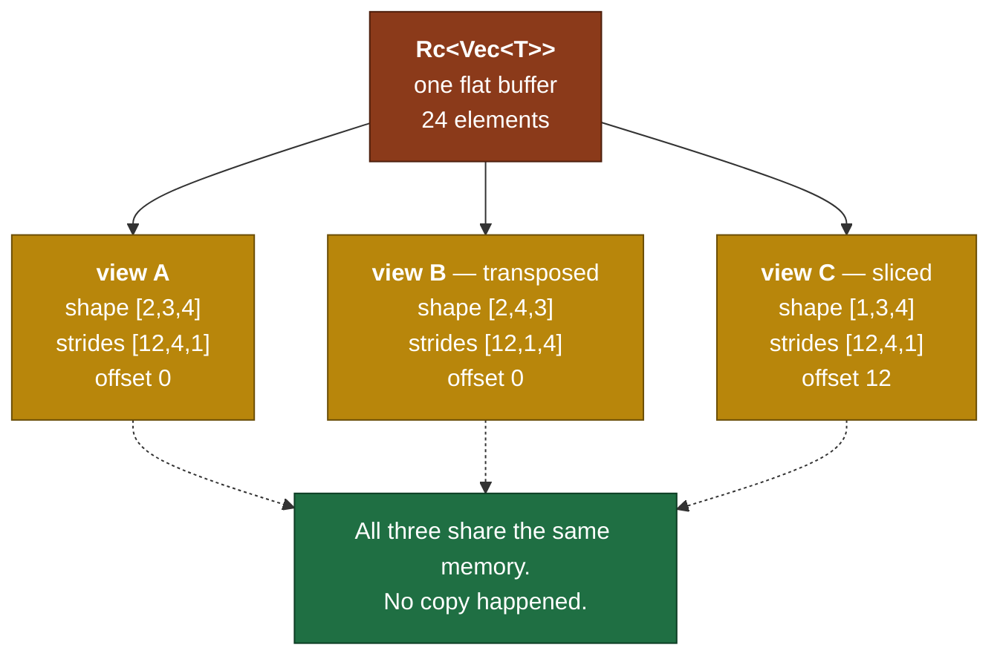

# Day 2 — Storage, shape, strides

> **Read this file. It replaces the book for today.**
> The page numbers stay as optional depth. This lesson teaches the same material in my own words.
> Tick your boxes in [`RUST_TRACKER.md`](../RUST_TRACKER.md). This file holds no checkboxes.
> The short card is [`RUST_PHASE_0_1.md` Day 2](../RUST_PHASE_0_1.md#day-2--storage-shape-strides).

**Time: 2.5 hours. Claim: R0a. File you create: `src/tensor.rs`.**
**Your tests are already written and red: `rust/tests/day2.rs`.**

---

## 1. Why this day exists

A tensor is not a nested array. A tensor is a **flat buffer plus an interpretation**.

The buffer is one `Vec<T>`, laid out end to end in memory. The interpretation is two short vectors: the shape and the strides.

Every reshape, every transpose, every slice, and every head split in attention is arithmetic on those two short vectors. **The buffer never moves.**

This is the single most important design decision in the whole library. Get it right today and multi-head attention on Day 20 is four lines. Get it wrong today and it is four hundred lines, and you rewrite Days 3 to 19 to fix it.

The wrong model is `Vec<Vec<T>>`. It looks like Python, and it fails for three reasons:

1. Each inner `Vec` is a separate allocation, in a separate place in memory. The CPU prefetcher cannot follow it.
2. A transpose must copy every element, because the rows are physically separate.
3. A three-dimensional tensor becomes `Vec<Vec<Vec<T>>>`, and rank-generic code becomes impossible.



---

## 2. Row-major layout, seen once and never forgotten

Take a 3-row, 4-column grid of characters. This is unrelated data, and the arithmetic is identical.

```text
logical grid            flat buffer, row-major
  c0 c1 c2 c3
r0  a  b  c  d          index: 0 1 2 3 4 5 6 7 8 9 10 11
r1  e  f  g  h          value: a b c d e f g h i j  k  l
r2  i  j  k  l
                        row 0 -> 0..4   row 1 -> 4..8   row 2 -> 8..12
```

**Row-major** means the last axis is the fastest. Neighbours along the last axis sit next to each other in memory. `b` follows `a`. Neighbours along the first axis sit one full row apart. `e` is four positions after `a`.

The **stride** of an axis is the number of buffer positions you step to move one position along that axis.

- axis 0 (rows): step 4. One row down is four positions along.
- axis 1 (columns): step 1. One column right is one position along.

So `shape = [3, 4]` and `strides = [4, 1]`.

### 2.1 The rule for contiguous strides

A contiguous tensor has one stride vector, and you compute it by walking the shape from the back.

> The stride of an axis is the product of all the shape entries **after** it.
> The last axis always has stride 1.

Check it on `[2, 3, 4]`:

| Axis | Shape entry | Shapes after it | Stride |
|---|---|---|---|
| 0 | 2 | 3 × 4 | **12** |
| 1 | 3 | 4 | **4** |
| 2 | 4 | — (empty product) | **1** |

So `contiguous_strides(&[2,3,4])` gives `[12, 4, 1]`. Your first test asserts exactly this.

Read it in words: to step one position along axis 0, you skip a whole 3-by-4 plane, which is 12 elements. To step one position along axis 1, you skip a row of 4.

### 2.2 The index formula

```text
buffer_position = offset + sum over i of ( index[i] * stride[i] )
```

That one line is `phys_index`. It is the core of the library. Every read, every write, and every kernel goes through it.

Check it on `[2,3,4]` with strides `[12,4,1]` and offset 0. Element `[1, 2, 3]`:

```text
1*12 + 2*4 + 3*1  =  12 + 8 + 3  =  23
```

The buffer holds 2 × 3 × 4 = 24 elements, so 23 is the last one. Correct.

### 2.3 Why `offset` exists

`offset` is the buffer position of logical element `[0, 0, ..., 0]`.

A fresh tensor has offset 0. A slice does not. When you take row 1 of the grid above, the view starts at buffer position 4. The shape becomes `[4]`, the stride stays `[1]`, and the offset becomes 4. No element moves.

You add `offset` on Day 3. You put the field in the struct **today**, because adding a field later means touching every method you already wrote.

### 2.4 The transpose, and why it costs nothing

Transpose swaps two axes. It swaps the two shape entries, and it swaps the two stride entries. It touches no data.

```text
before:  shape [3,4]   strides [4,1]
after:   shape [4,3]   strides [1,4]
```

Read element `[2, 1]` of the transposed view: `2*1 + 1*4 = 6`. The buffer holds `g` at position 6. In the original grid, `g` sits at row 1, column 2. That is exactly what a transpose promises.

**Now look at what broke.** The transposed strides are `[1, 4]`. The last axis has stride 4, not 1. The tensor is no longer contiguous. A `reshape` on it has no correct stride expression, and that is the whole subject of Day 3.

### 2.5 The cache, mentioned once and cashed in on Day 7

The CPU reads memory in cache lines of 64 bytes. That is 16 `f32` values.

Walk along the last axis of a contiguous tensor and you use all 16. Walk along the first axis and you use 1 of every 16, and you pay for the other 15.

This fact decides the loop order of your matmul on Day 6, and it decides your block size on Day 7. Today it decides one thing only: your `to_vec` walks the strides in logical order, not the buffer in physical order.

---

## 3. The Rust you need today

### 3.1 Structs with named fields

```rust
pub struct Bookshelf {
    title_count: usize,     // private by default
    pub label: String,      // pub makes it visible outside the module
}

impl Bookshelf {
    pub fn new(label: String) -> Self {      // associated function: a constructor
        Bookshelf { title_count: 0, label }  // field init shorthand
    }
    pub fn count(&self) -> usize {           // method: borrows self
        self.title_count
    }
    pub fn add(&mut self) {                  // method: borrows self mutably
        self.title_count += 1;
    }
}
```

Three receiver forms, and you use all three in this project:

| Receiver | Meaning | Use it when |
|---|---|---|
| `&self` | Read the value. | `shape()`, `numel()`, `get()` |
| `&mut self` | Change the value. | An in-place operation. You write few of these. |
| `self` | Take the value. | `to_f64` on a `Copy` type. |

Fields are private outside the module unless you write `pub`. Keep `data`, `shape`, `strides` and `offset` private. Outside code reads them through methods. This lets you change the layout later without breaking callers.

### 3.2 Generic structs with a bound

```rust
pub struct Pair<T: Copy> {
    a: T,
    b: T,
}

impl<T: Copy> Pair<T> {
    pub fn first(&self) -> T { self.a }
}
```

Note the shape of the `impl` line. `impl<T: Copy> Pair<T>` declares the parameter, then names the type. A missing `<T>` after `impl` gives error `E0412`.

### 3.3 `&[usize]` in the signature, `Vec<usize>` in the struct

```rust
pub fn zeros(shape: &[usize]) -> Self;      // borrow: the caller keeps ownership
```

`&[usize]` is a slice. It is a pointer and a length. It borrows.

`Vec<usize>` owns a heap allocation.

Take `&[usize]` as a parameter and store `Vec<usize>` in the struct. The caller then passes `&[2, 3, 4]` with no allocation on their side, and you call `.to_vec()` once when you store it. A `&Vec<usize>` parameter also works, and it forces every caller to own a `Vec` first. Take the slice.

Return `&[usize]` from `shape()`. The caller reads the shape and copies nothing.

### 3.4 Ownership and borrowing, in six lines

1. Every value has exactly one owner.
2. When the owner goes out of scope, the value is dropped.
3. Assignment moves the value, unless the type is `Copy`.
4. `&x` borrows. Many shared borrows are permitted at once.
5. `&mut x` borrows exclusively. One at a time, and no shared borrow beside it.
6. A borrow never outlives the value it points at.

Rule 4 and rule 5 are the reason your buffer is immutable and shared. Two views on one buffer are two shared borrows, and Rust permits that with no complaint.

### 3.5 `Rc<T>` — shared ownership

`Rc` stands for reference counted. It puts a value on the heap with a counter beside it. Every clone adds one to the counter. Every drop takes one away. The value dies at zero.

```rust
use std::rc::Rc;

let cities = Rc::new(vec![String::from("Delhi"), String::from("Pune")]);
let a = Rc::clone(&cities);          // counter goes to 2. No data copied.
let b = Rc::clone(&cities);          // counter goes to 3.

assert_eq!(Rc::strong_count(&cities), 3);
assert!(Rc::ptr_eq(&a, &b));         // same allocation
assert_eq!(a[0], "Delhi");           // read through Deref
```

Three facts you use today and tomorrow:

- `Rc::clone(&x)` copies a pointer and adds one to a counter. It never copies the buffer. Write `Rc::clone(&x)` and not `x.clone()`, because the explicit form tells the reader that the cost is small.
- `Rc::ptr_eq(&a, &b)` answers "same allocation?". Your Day 3 test `transpose_is_zero_copy` uses it. It is how you **prove** the copy did not happen.
- `Rc<T>` gives you shared **read** access. It gives no write access. That is the correct default for this library.

`Rc` is single-thread. Its counter uses plain arithmetic. `Arc` is the thread-safe version, and it pays for an atomic counter. Day 8 launches threads over `&` borrows with `std::thread::scope`, so you need no `Arc` at all. Keep `Rc`.

### 3.6 `derive(Clone)` on the tensor

```rust
#[derive(Clone)]
pub struct Tensor<T: Scalar> { /* ... */ }
```

The derived `clone` calls `clone` on every field. On `Rc<Vec<T>>`, that adds one to the counter. On the two `Vec<usize>` fields, it copies a few integers.

So a cloned tensor is a **new view over the same data**, and it costs almost nothing. This is the behaviour you want. `contiguous()` on Day 3 is the one method that copies the buffer, and you write that one by hand.

### 3.7 Panic against `Result`

Today you panic. Tomorrow you return `Result`.

- `from_vec` panics on a length mismatch. The test uses `#[should_panic]`.
- `get` panics on an out-of-range index, the same way `Vec` does.

The split is deliberate. A wrong length in `from_vec` is a bug in the caller's code. A non-contiguous `reshape` on Day 3 is a legitimate state that a caller must handle. Bugs panic. States return `Result`.

Use `debug_assert!` for checks that cost real time in a hot loop. It runs in debug builds and disappears in release builds.

**Book cross-reference:** *Programming Rust* pp. 57–63 (vectors and slices) and pp. 90–92 (`Rc` and `Arc`). Also "Named-Field Structs" p. 193, "Defining Methods with impl" p. 198, and "Generic Structs" p. 202.

---

## 4. What you build today

Signatures from the day card. The bodies are yours.

```rust
// src/tensor.rs
use std::rc::Rc;
use crate::scalar::Scalar;

#[derive(Clone)]
pub struct Tensor<T: Scalar> {
    data:    Rc<Vec<T>>,   // shared, immutable. Views alias it.
    shape:   Vec<usize>,
    strides: Vec<usize>,   // in elements, not bytes
    offset:  usize,
}

impl<T: Scalar> Tensor<T> {
    pub fn zeros(shape: &[usize]) -> Self;
    pub fn from_vec(data: Vec<T>, shape: &[usize]) -> Self;   // panic on length mismatch
    pub fn shape(&self) -> &[usize];
    pub fn numel(&self) -> usize;
    pub fn is_contiguous(&self) -> bool;
    fn phys_index(&self, idx: &[usize]) -> usize;             // private. The core.
    pub fn get(&self, idx: &[usize]) -> T;
}

pub fn contiguous_strides(shape: &[usize]) -> Vec<usize>;     // row-major
```

Add `pub mod tensor;` to `src/lib.rs`.

Two design points to decide, and to write down in the commit message:

1. **`is_contiguous` on a rank-0 or empty tensor.** A shape of `[]` has no axes. State your answer and defend it.
2. **`numel` on a shape with a zero entry.** `[2, 0, 4]` holds no elements. Confirm that the product rule gives the right answer with no special case.

---

## 5. The tests, and the trap in each one

`rust/tests/day2.rs` is written and committed. Do not edit the assertions. Argue with me instead if one is wrong.

| Test | What it traps |
|---|---|
| `strides_row_major` | The stride rule from section 2.1. It runs at rank 1, 2, 3 and 4, so a rule written for rank 3 and stopped there fails. It also covers a zero shape entry. |
| `phys_index_matches_manual` | The index formula from section 2.2. It checks **every** element of a `[2,3,4]` tensor, so two axes swapped cannot hide. |
| `from_vec_rejects_bad_len` | A silent size mismatch. It uses `#[should_panic]`. |
| `numel_is_shape_product` | The empty-product and zero-entry cases, and a `zeros` that never filled its buffer. |

### 5.1 How the test reaches a private function

`phys_index` is private, and `tests/day2.rs` is an **integration test**. An integration test is a separate crate, so it sees the public API only. It cannot call `phys_index`, and it must not.

The test reaches the function through `get`, with one trick: the buffer holds `data[i] == i`. So `get` returns the buffer position that it read, and the index formula is visible in the output.

Keep `phys_index` private. A test that needs a private function is a test that guessed the wrong seam.

Run one test while you work:

```bash
cargo test --test day2 phys_index_matches_manual
```

---

## 6. Order of work

1. Create `src/tensor.rs`. Add `pub mod tensor;` to `src/lib.rs`.
2. Run `cargo test --test day2`. Watch it fail to compile. That failure is the red, and the compiler tells you what to build.
3. Write `contiguous_strides`. Make `strides_row_major` pass.
4. Write the struct, `zeros` and `from_vec`. Make `from_vec_rejects_bad_len` pass.
5. Write `shape`, `numel` and `is_contiguous`. Make `numel_is_shape_product` pass.
6. Write `phys_index`, then `get`. Make `phys_index_matches_manual` pass.
7. Run `cargo clippy`. Fix every warning.
8. Do the self-check on paper. Photograph it into `hand_math/`.
9. Post the day hook. Tell me when the day is done.

Step 3 is small, and it unblocks everything else. Start there.

---

## 7. Compiler errors you will meet today

| Error | What it means | Where to look |
|---|---|---|
| `E0412: cannot find type T in this scope` | The `impl` line is missing its `<T>`. | `impl<T: Scalar> Tensor<T>` |
| `E0507: cannot move out of index of Vec<T>` | You read an element without `Copy` in scope. | Your `Scalar` bound gives `Copy`. Check the bound. |
| `E0596: cannot borrow as mutable` | A method takes `&self` and tries to change a field. | The receiver on the method. |
| `E0106: missing lifetime specifier` | A returned reference has no source. | `shape()` returns `&[usize]` from `&self`. Add no lifetime by hand. |
| `index out of bounds: the len is N but the index is M` | The index formula, or a missing rank check. | `phys_index`. Print the shape, strides and index. |
| `E0382: borrow of moved value` | A `Vec` moved into the struct, and the caller used it after. | `from_vec` takes ownership on purpose. |

---

## 8. Self-check — on paper, before you close the laptop

I answer neither of these. Both go in `hand_math/`.

1. **Trace by hand.** Take shape `[2,3,4]`. Write the strides. Find the buffer index of element `[1,0,2]`. Now transpose the last two axes. Write the new shape and the new strides. Confirm that the buffer contents did not change. Then find element `[1,2,0]` of the transposed view, and confirm that it is the same buffer position as `[1,0,2]` of the original.
2. **Argue the storage choice.** State why the field is `Rc<Vec<T>>` and not `Vec<T>`. State why it is not `Rc<RefCell<Vec<T>>>`. For each of the three choices, name one operation that it makes impossible.

---

## 9. Stuck-signals — the points where you ask

- You want to write `data: Vec<Vec<T>>`. **Stop and ask.** Section 1 says why. This is the one decision today that is expensive to undo.
- The borrow checker rejects a method for more than **30 minutes**. That is an ownership-design problem, not a syntax problem.
- `phys_index` works for rank 2 and fails for rank 3. Check the iteration order over the index and the strides. Do not add a special case for rank 3.

---

## 10. The post

The hook is at the end of the [Day 2 card](../RUST_PHASE_0_1.md#day-2--storage-shape-strides), written in your voice. Ship it today.

---

## 11. Done means all five

1. `cargo test` passes, with Day 1 and Day 2 green.
2. `cargo clippy` gives no warnings.
3. One hand-derivation sits in `hand_math/`.
4. The post is public.
5. `PROGRESS.md` records what is proven, and it names nothing else.
