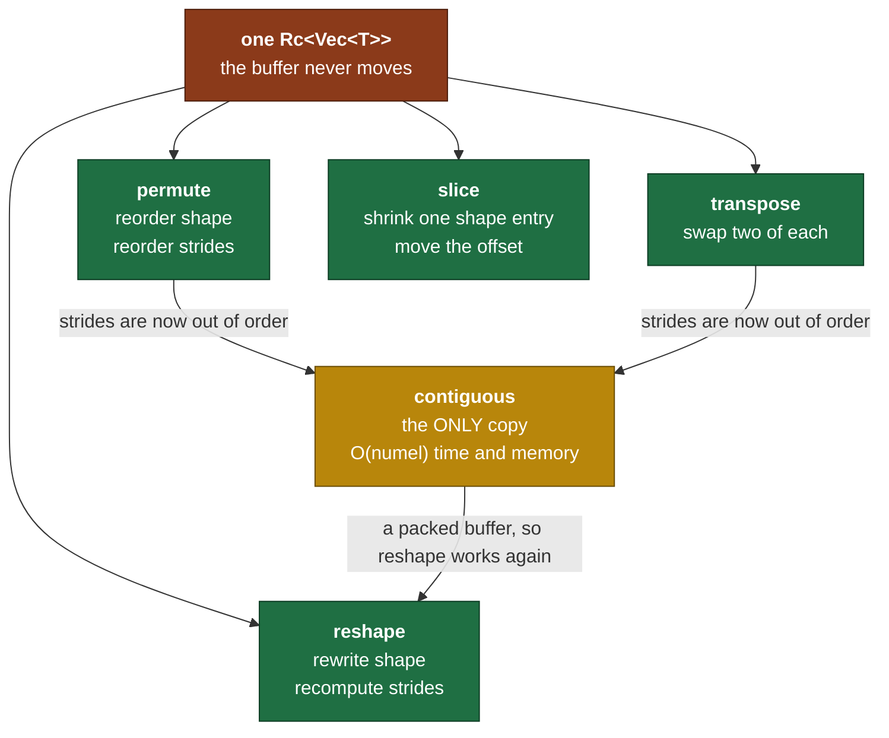

# Day 3 — Zero-copy views: reshape, permute, transpose, slice

> **Read this file. It replaces the book for today.**
> The page numbers stay as optional depth. This lesson teaches the same material in my own words.
> Tick your boxes in [`RUST_TRACKER.md`](../RUST_TRACKER.md). This file holds no checkboxes.
> The short card is [`RUST_PHASE_0_1.md` Day 3](../RUST_PHASE_0_1.md#day-3--zero-copy-views-reshape-permute-transpose-slice).

**Time: 3 hours. Claim: R0a. File you extend: `src/tensor.rs`.**
**Your tests are written: move `rust/tests/pending/day3.rs` to `rust/tests/day3.rs` at the start of the session.**

---

## 1. Why this day exists

Yesterday you built one fact: a tensor is a flat buffer plus an interpretation. Today you cash that fact in.

Shape and strides are interpretation. So a large family of operations changes the interpretation and leaves the buffer alone. Those operations cost a few integer writes. They do not scale with the data.

Today you write five of them, and you find the one case where the trick fails.

### 1.1 What breaks later if you get this wrong

Every one of these is a view operation. Each row is a real line in the GPT-2 forward pass.

| Model step | The view op it needs | Day |
|---|---|---|
| Split one attention projection into 12 heads | `reshape` then `permute` | 20 |
| Give each head its own `[seq, head_dim]` matrix | `slice` or a batch axis | 20 |
| Compute `Q · Kᵀ` | `transpose` on the last two axes | 19 |
| Join the 12 head outputs back into one vector | `permute` then `reshape` | 20 |
| Read the last token's logits | `slice` on the sequence axis | 25 |

Multi-head attention on Day 20 is four lines when today is right. It is four hundred lines when today is wrong, because every one of those steps becomes a copy loop that you write and debug by hand.

### 1.2 The map of today



Four operations are free. One costs. The whole day is about knowing which is which, and about refusing to hide the difference from the caller.

---

## 2. Views, from first principles

### 2.1 A view is three numbers and a pointer

A view is the answer to one question: **where in the buffer does logical element `[i, j, k]` live?**

```text
buffer_position = offset + i*stride[0] + j*stride[1] + k*stride[2]
```

That is the Day 2 formula with `offset` now doing real work. A view is:

- `data` — a shared pointer to the buffer. Views share it and never write to it.
- `shape` — how many positions each axis has.
- `strides` — how far to step in the buffer for one position along each axis.
- `offset` — the buffer position of logical element `[0, 0, ..., 0]`.

Change the last three and you get a different tensor over the same bytes. That is the whole idea.

### 2.2 The running example

One buffer of six numbers, and every figure below uses it.

```text
buffer:   index  0   1   2   3   4   5
          value  0   1   2   3   4   5

view A:   shape [2,3]   strides [3,1]   offset 0

    logical                 which buffer index
      j=0 j=1 j=2             j=0 j=1 j=2
i=0    0   1   2       i=0     0   1   2
i=1    3   4   5       i=1     3   4   5
```

Read `A[1][2]`: `0 + 1*3 + 2*1 = 5`. The buffer holds 5 at position 5.

### 2.3 Transpose — swap two entries in each list

Transpose exchanges two axes. It exchanges their shape entries, and it exchanges their stride entries. Nothing else happens.

```text
before:  shape [2,3]   strides [3,1]   offset 0
after:   shape [3,2]   strides [1,3]   offset 0

    logical                 which buffer index
      j=0 j=1                 j=0 j=1
i=0    0   3           i=0     0   3
i=1    1   4           i=1     1   4
i=2    2   5           i=2     2   5

buffer:   index  0   1   2   3   4   5      <- unchanged
          value  0   1   2   3   4   5      <- unchanged
```

Read `Aᵀ[2][1]`: `0 + 2*1 + 1*3 = 5`. Same buffer position as `A[1][2]`, which is what a transpose promises.

**Now look at what broke.** The strides are `[1, 3]`. The last axis has stride 3, not 1. Read the logical elements in reading order and you get `0, 3, 1, 4, 2, 5`. That is not the buffer order. Section 2.6 is the consequence.

### 2.4 Permute — the general case

`permute` reorders every axis at once. `transpose` is the special case that touches two.

**The convention, stated once.** `order[i]` names the **source** axis that becomes the new axis `i`.

```text
new_shape[i]   = old_shape[order[i]]
new_strides[i] = old_strides[order[i]]
```

This is what NumPy and PyTorch do. There is a second reading of the same list: "axis `i` moves to position `order[i]`". That reading gives the inverse permutation. Both are self-consistent, and mixing them gives code that works on a symmetric shape and fails on every other one. Pick the one above.

Worked example, on shape `[2,3,4]` with strides `[12,4,1]`:

```text
order = [2, 0, 1]

new axis 0  <- old axis 2 :  shape 4,  stride 1
new axis 1  <- old axis 0 :  shape 2,  stride 12
new axis 2  <- old axis 1 :  shape 3,  stride 4

result: shape [4,2,3]   strides [1,12,4]
```

Check one element. Old `[1, 2, 3]` sits at `1*12 + 2*4 + 3*1 = 23`. Under the map, that element is new `[3, 1, 2]`. Read it: `3*1 + 1*12 + 2*4 = 3 + 12 + 8 = 23`. Same position.

**The inverse.** `permute` is a relabelling, so it has an inverse, and the inverse is another permutation. Your test applies `[2,0,1]` and then `[1,2,0]` and expects the original back. Work out on paper why those two are inverses under the convention above. If you use the other convention, the pair is not an inverse pair and the test fails.

**Validity.** An order is valid when it is a permutation of `0..rank`. Two things make it invalid: a wrong length, and a repeated or out-of-range axis. Your test wants an `Err` for both, and it wants `BadRank` for the wrong length.

### 2.5 Slice — the operation that moves the offset

A slice narrows one axis to a range. Three things happen, and only three:

1. `shape[axis]` becomes `end - start`.
2. `offset` grows by `start * strides[axis]`.
3. **`strides` does not change.**

Point 3 surprises people. The step between neighbours along an axis does not depend on where you started walking.

```text
view A:  shape [2,3]  strides [3,1]  offset 0
slice axis 0, 1..2:

         shape [1,3]  strides [3,1]  offset 3
                                     ^^^^^^^^
                              0 + 1*3, the start of row 1

    logical            which buffer index
      j=0 j=1 j=2        j=0 j=1 j=2
i=0    3   4   5   i=0    3   4   5
```

Slices compose. Slice a slice and the offsets add, because each one adds its own `start * stride`.

```text
buffer  0   1   2   3   4   5   6   7   8   9  10  11
        |-------------------------------------------|   offset 0, shape [12]
                    |---------------------------|       offset 4, shape [8]
                            |-----------|               offset 6, shape [4]
```

Three edge cases to decide today, and your test fixes the third one:

- `start > end` is an error.
- `end` past the axis length is an error.
- `start == end` gives an axis of length 0. NumPy allows it. Your test allows it. Argue if you disagree.

### 2.6 Reshape — where the trick fails, and why

This section is the mathematics of the day. Read it twice.

**What reshape means.** Keep the elements in reading order, and put a different grid over them. A reshape from `[2,3]` to `[3,2]` must give the reading sequence `0, 1, 2, 3, 4, 5` a new grid, and it must not reorder anything.

**Why it works on a contiguous tensor.** Reading order and buffer order are the same thing when the tensor is contiguous. So a reshape recomputes `contiguous_strides(new_shape)` and changes nothing else. The buffer already holds the elements in the order the new shape wants.

**Why it fails on a strided view.** Take the transposed view from section 2.3.

```text
Aᵀ:  shape [3,2]  strides [1,3]  offset 0

logical reading order:   0, 3, 1, 4, 2, 5
buffer order:            0, 1, 2, 3, 4, 5
```

Now ask for `reshape(&[6])`. A rank-1 view has one stride, call it `s`, and one offset, call it `o`. Element `[m]` sits at `o + m*s`. So the six positions the view can produce are:

```text
o, o+s, o+2s, o+3s, o+4s, o+5s
```

That is an **arithmetic progression**. Six numbers with a constant gap. The sequence you need is `0, 3, 1, 4, 2, 5`. Its gaps are `+3, -2, +3, -2, +3`. No constant `s` produces it.

**There is no stride expression. This is not a limitation of your code. It is arithmetic.**

So `reshape` has exactly three honest choices:

| Choice | What it costs | What it hides |
|---|---|---|
| Copy the data silently | O(numel) time and memory, on a call the caller believes is free | Everything. This is the wrong one. |
| Return `Err(NotContiguous)` | Nothing. The caller decides. | Nothing. |
| Panic | The caller cannot recover | The fact that this is a legitimate state, not a bug |

You return `Err`. PyTorch made the same call and gave the two paths two names: `view` refuses, and `reshape` copies. When a PyTorch error says *"use .reshape(...) or .contiguous().view(...)"*, this is the arithmetic behind it. Most people learn that message as a magic incantation. You now know why it exists.

**The rule from Day 2, applied again.** A bug in the caller panics. A legitimate state returns `Result`. A non-contiguous reshape is legitimate. A caller can hit it with correct code and reasonable data, so it must be handled, not asserted away.

### 2.7 `is_contiguous` — the exact test

A tensor is contiguous when its strides are the strides a fresh tensor of that shape gets:

```text
is_contiguous  <=>  strides == contiguous_strides(shape)
```

Two questions the definition raises, and both are yours:

1. Does `offset` matter? A slice of axis 0 has an offset and still steps through memory the same way. Your test asserts that such a slice reshapes correctly, so decide and defend it.
2. What about an axis of length 1? Its stride multiplies an index that is always 0, so the value cannot be observed. Write down whether you compare it or skip it. This one returns on Day 4, because broadcast produces exactly these axes.

### 2.8 `contiguous` — the one method that copies

`contiguous()` builds a new buffer that holds the logical elements in reading order, and it returns a fresh tensor over that buffer with offset 0.

It is the only method in the library allowed to allocate a new data buffer. Every other method returns a view. That rule is worth writing on the wall, because a library that copies where you did not expect it is a library you cannot reason about.

Cost: one read and one write per element, plus one allocation.

### 2.9 `to_vec` — walking a multi-index

`to_vec` returns the elements in **logical** reading order, not buffer order. For a contiguous tensor those agree. For a view they do not, and the view's order is the correct one.

So `to_vec` must walk every logical index of the shape, in order. That walk is a mechanism you need today, on Day 4, on Day 5 and on Day 6. Here it is on unrelated data.

**A car odometer counts the same way.** Take a three-wheel odometer where the wheels hold 2, 3 and 4 positions.

```text
0 0 0  ->  0 0 1  ->  0 0 2  ->  0 0 3  ->  0 1 0  ->  0 1 1  -> ...
                                    ^^^ the last wheel wrapped, so the middle one advanced
```

The rule: add 1 to the last wheel. If it reaches its limit, set it to 0 and add 1 to the wheel on its left. Repeat leftwards. Stop when the leftmost wheel reaches its limit.

That is the whole algorithm, and the number of steps is `2*3*4 = 24`, which is `numel`.

**The cheap version.** Each step changes exactly one index by 1, most of the time the last one. Moving one position along the last axis moves `strides[last]` in the buffer. So you can carry the buffer position along with the odometer and adjust it, instead of recomputing the full dot product every step. You get to decide whether to do that today or to keep the simple version. Write down which one you chose and why. Day 7 measures whether it mattered.

---

## 3. The Rust you need today

### 3.1 `Result<T, E>` — errors as values

Rust has no exceptions. A function that can fail says so in its return type.

```rust
enum Result<T, E> {   // this is in std. You do not write it.
    Ok(T),
    Err(E),
}
```

`Result` is an ordinary enum. `Ok` and `Err` are its two variants, and each one carries a value. The caller cannot read the success value without dealing with the failure case, because the success value is inside a variant.

That property is the whole point. A failure that the compiler makes you look at is a failure you handle.

```rust
fn parse_port(text: &str) -> Result<u16, String> {
    if text.is_empty() {
        return Err(String::from("the port is empty"));
    }
    match text.parse::<u16>() {
        Ok(n) => Ok(n),
        Err(_) => Err(format!("{text} is not a number")),
    }
}
```

`#[must_use]` sits on `Result` in `std`, so ignoring one is a warning. That is deliberate.

### 3.2 Enums with data — your `ShapeError`

An enum variant can carry values, and different variants can carry different things.

```rust
#[derive(Debug)]
pub enum TicketError {
    SoldOut,                                  // unit variant: no data
    TooManySeats { asked: u32, left: u32 },   // struct variant: named fields
    BadDate(String),                          // tuple variant: positional
}
```

This is a **closed set**. The compiler knows every case, so a `match` over it is checked for completeness. Add a variant later and every `match` that forgot it fails to build. That is a feature.

Your enum uses two of the three forms:

```rust
#[derive(Debug)]
pub enum ShapeError {
    NotContiguous,
    BadRank { got: usize, want: usize },
    SizeMismatch,
    OutOfBounds,
}
```

`#[derive(Debug)]` gives you `{:?}`. Without it, `unwrap()` on a `Result<_, ShapeError>` does not compile, because `unwrap` prints the error when it panics.

**Why a struct variant for `BadRank`.** `BadRank { got: 2, want: 3 }` names its numbers. `BadRank(2, 3)` does not, and half the readers will assume the other order. Two numbers of the same type in one variant is exactly when you pay for field names.

### 3.3 Reading a `Result`: `match`, `matches!` and `?`

```rust
// 1. match: the full form. Every case named.
match parse_port("8080") {
    Ok(p) => println!("port {p}"),
    Err(e) => println!("bad input: {e}"),
}

// 2. matches!: a boolean, when you only care about the shape.
assert!(matches!(parse_port(""), Err(_)));

// 3. if let: one case, ignore the rest.
if let Ok(p) = parse_port("8080") {
    println!("port {p}");
}
```

The `?` operator is the one you will use inside your own methods.

```rust
fn open_two() -> Result<(u16, u16), String> {
    let a = parse_port("8080")?;   // on Err, return that Err from open_two
    let b = parse_port("9090")?;   // on Ok, unwrap it into `a`
    Ok((a, b))
}
```

`x?` means: if `x` is `Ok(v)`, the expression evaluates to `v`. If `x` is `Err(e)`, the enclosing function returns `Err(e)` right there. It works only inside a function that returns `Result`.

Your `permute` calls your own validity check. Your `reshape` calls `is_contiguous`. Neither needs `?` today. Day 6 chains four fallible calls, and `?` is what keeps that readable.

### 3.4 Returning `Self` from a `&self` method

```rust
impl<T: Scalar> Tensor<T> {
    pub fn transpose(&self, a: usize, b: usize) -> Result<Self, ShapeError> { todo!() }
}
```

`&self` borrows. `Self` is the type, so you return a **new value** and the original is untouched. Inside, you build a new `Tensor` from `Rc::clone(&self.data)` and three new metadata values.

That signature is a promise: this method does not change the receiver. Your whole tensor API keeps it. No method on `Tensor` takes `&mut self` today, and none takes it on Day 4 or Day 5 either. An immutable API is what makes two views over one buffer safe with no runtime checks.

### 3.5 `Rc::clone` costs one increment

Day 2 section 3.5 covered this. One line to keep it in view:

```rust
let shared = Rc::clone(&self.data);   // +1 on a counter. No bytes are copied.
```

Write `Rc::clone(&x)` and not `x.clone()`. The explicit form tells a reader that the cost is one integer. `x.clone()` reads like a deep copy.

### 3.6 `macro_rules!`, because your test file uses one

Your Day 3 test file defines a small macro. Here is enough to read it.

```rust
macro_rules! twice {
    ($e:expr) => {
        ($e) + ($e)
    };
}

assert_eq!(twice!(3), 6);
```

A macro matches on **syntax**, before types exist. That is why it can do things a function cannot. The fragment specifier after the `$name:` says what kind of syntax to accept: `expr` for an expression, `pat` for a pattern, `ty` for a type, `ident` for a name.

Your test file needs `$variant:pat`, because a function cannot take `ShapeError::BadRank { .. }` as an argument. A pattern is not a value. A macro can take one, and that is the reason the macro exists.

You write no macros today. You only read one.

### 3.7 Panic against `Result`, the rule restated

| Situation | Answer | Why |
|---|---|---|
| `from_vec` gets a wrong length | panic | The caller wrote a bug. No correct caller reaches it. |
| `get` gets an index past the shape | panic | Same as `Vec`. A bug in the caller. |
| `reshape` on a strided view | `Err` | Correct code, correct data, a state to handle. |
| `slice` with `start > end` | `Err` | The caller can compute this from user input. |
| `permute` with a bad order | `Err` | Same reason. |

**Book cross-reference:** *Programming Rust* pp. 148–158 (`Result`, custom error types, propagating errors), "Enums" p. 211, "Enums with Data" p. 214, "Rich Data Structures Using Enums" p. 216, and "Patterns" p. 219. Read them after you finish. They add detail. They add no step.

---

## 4. What you build today

Signatures from the day card. The bodies are yours. I write none of them.

```rust
// src/tensor.rs

#[derive(Debug)]
pub enum ShapeError {
    NotContiguous,
    BadRank { got: usize, want: usize },
    SizeMismatch,
    OutOfBounds,
}

impl<T: Scalar> Tensor<T> {
    pub fn reshape(&self, shape: &[usize]) -> Result<Self, ShapeError>;
    pub fn permute(&self, order: &[usize]) -> Result<Self, ShapeError>;
    pub fn transpose(&self, a: usize, b: usize) -> Result<Self, ShapeError>;
    pub fn slice(&self, axis: usize, start: usize, end: usize) -> Result<Self, ShapeError>;
    pub fn contiguous(&self) -> Self;    // the only method that can copy
    pub fn to_vec(&self) -> Vec<T>;      // logical order. Walks the strides.
}
```

### 4.1 Two additions to the day card, and the argument for them

The card promises that `transpose` copies nothing. **A promise that no test can observe is not a promise.** `data` is private, so an integration test cannot reach the `Rc` and cannot call `Rc::ptr_eq`. So the tensor needs two more readers:

```rust
impl<T: Scalar> Tensor<T> {
    pub fn strides(&self) -> &[usize];
    pub fn shares_storage_with(&self, other: &Self) -> bool;
}
```

- `strides` mirrors `shape` from Day 2. It returns a borrow, so the caller copies nothing.
- `shares_storage_with` answers one question: same allocation? Its whole body is the `Rc::ptr_eq` call from Day 2 section 3.5.

PyTorch ships both, as `Tensor.stride()` and `Tensor.data_ptr()`. The zero-copy claim is the headline feature of the design, so the API has to let a caller check it.

If you disagree, say so at the start of the session. The alternative is a unit test inside `src/tensor.rs`, which can see private fields. That costs you a `#[cfg(test)]` module in the middle of the file you are writing.

### 4.2 Two design points to decide, and to record in the commit message

1. **Does `contiguous()` copy when the tensor is already contiguous?** A copy is simple and always correct. A shared view is free and correct here. Your test accepts either. Day 20 pays the bill.
2. **Does `is_contiguous` look at `offset`?** A slice on axis 0 has a non-zero offset and a packed layout. Your test reshapes exactly such a tensor, so answer this before you write it.

---

## 5. The tests, and the trap in each one

Move `rust/tests/pending/day3.rs` to `rust/tests/day3.rs` at the start of the session. Then run it and watch it fail.

```bash
mv tests/pending/day3.rs tests/day3.rs
cargo test --test day3
```

| Test | What it traps |
|---|---|
| `permute_roundtrip` | The wrong permute convention. It also traps a rank-2 special case, because it runs at rank 3 and checks the strides, not only the shape. |
| `transpose_is_zero_copy` | A transpose that copies. It also traps a `to_vec` that reads the buffer instead of walking the strides, and it holds the first non-contiguous tensor in the project. |
| `reshape_noncontiguous_errors` | A silent copy inside `reshape`, and a size fault reported as the wrong variant. |
| `contiguous_then_reshape_ok` | A `contiguous` that copies the buffer in buffer order instead of logical order. That version passes `is_contiguous` and gives the wrong numbers. |
| `slice_bounds` | An offset that is not multiplied by the stride. It also traps a slice that changes the strides, and it checks that two slices compose. |

The file also states the `permute` convention and the two API additions at the top. Read the header before the tests.

---

## 6. Order of work

1. Move the test file. Run `cargo test --test day3`. Read the error list. That is the red.
2. Write the `ShapeError` enum with `#[derive(Debug)]`. The error list gets shorter.
3. Write `strides()` and `shares_storage_with()`. Two lines each.
4. Write `to_vec`. Every later test reads its output, so it comes first. Use the odometer from section 2.9.
5. Write `transpose`. Make `transpose_is_zero_copy` pass. **Commit.**
6. Write `permute`. `transpose` is the two-axis case of it, so check whether one calls the other. Make `permute_roundtrip` pass.
7. Write `reshape`. Check the element count first, then contiguity, and return the matching variant. Make `reshape_noncontiguous_errors` pass.
8. Write `contiguous`. Make `contiguous_then_reshape_ok` pass. **Commit.**
9. Write `slice`. Make `slice_bounds` pass.
10. Run `cargo clippy`. Fix every warning, or tell me why a warning is wrong.
11. Do the self-check on paper. Photograph it into `hand_math/`.
12. Post the day hook. Tell me when the day is done, and I update the files and commit.

Steps 5 and 8 are the natural stopping points. Step 4 is the one that unblocks everything else, so do not leave it for later.

---

## 7. Compiler errors you will meet today

| Error | What it means | Where to look |
|---|---|---|
| `E0308: mismatched types, expected Result<Tensor<T>, ShapeError>, found Tensor<T>` | A method returns `Result` and the body returns a bare value. | Wrap the last expression in `Ok(...)`. |
| `E0277: the ? operator can only be used in a function that returns Result` | `?` sits in a function that returns `Self`. | `contiguous` and `to_vec` return no `Result`. Handle the error there. |
| `E0599: no method named unwrap found for enum ShapeError` | You called `unwrap` on the error instead of on the `Result`. | The parentheses in the call chain. |
| `E0004: non-exhaustive patterns` | A `match` on `ShapeError` misses a variant. | Add the arm, or add `_ => ...` and think about whether you want it. |
| `E0507: cannot move out of self.shape which is behind a shared reference` | You returned `self.shape` from a `&self` method. | Return `&self.shape`, or call `.to_vec()` to copy it. |
| `E0106: missing lifetime specifier` | A returned reference has no source. | `strides()` returns `&[usize]` from `&self`. Write no lifetime by hand. |
| `attempt to subtract with overflow` | A `usize` went below zero. | `end - start` when `start > end`. Check the order **before** you subtract. |

That last row is the one that costs you time. `usize` does not go negative. It wraps to a number near 18 quintillion, and in a debug build it panics instead. Validate first, subtract second.

---

## 8. Self-check — on paper, before you close the laptop

I answer neither of these. Both go in `hand_math/`.

1. **Trace by hand.** Shape `[2,3]`, contiguous, buffer `[0,1,2,3,4,5]`. Transpose to `[3,2]`. Write the new strides. Write the logical elements in row-major reading order. Then show why a plain `reshape` to `[6]` gives the wrong sequence. Show it with the arithmetic, not with a sentence.
2. **Argue the API.** Why must `reshape` return `Result` instead of calling `contiguous()` for the caller? Answer with the cost of a hidden copy inside an attention loop. Use real numbers: a `[1, 12, 1024, 64]` tensor in `f32`, and one hidden copy per layer across 12 layers.

---

## 9. Stuck-signals — the points where you ask

- `permute` passes on shape `[2,3]` and fails on `[2,3,4]`. That is a rank-generality fault in the index permutation, and it is usually the convention from section 2.4. **Ask after 20 minutes.**
- `to_vec` gives the right length and the wrong values. Your odometer carries in the wrong direction. **Ask after 20 minutes.**
- The borrow checker rejects one method for **30 minutes**. That is an ownership-design problem, not a syntax problem.
- You want to make `reshape` call `contiguous()` "just for now". Stop. That is the one decision today that is expensive to undo, because every caller you write afterwards assumes reshape is free.

---

## 10. The post

The hook is at the end of the [Day 3 card](../RUST_PHASE_0_1.md#day-3--zero-copy-views-reshape-permute-transpose-slice), written in your voice. Use it, or rewrite it. Ship it today, not on Sunday.

---

## 11. Done means all five

1. `cargo test` passes, with Day 1, Day 2 and Day 3 green.
2. `cargo clippy` gives no warnings.
3. One hand-derivation sits in `hand_math/`.
4. The post is public.
5. `PROGRESS.md` records what is proven, and it names nothing else.
