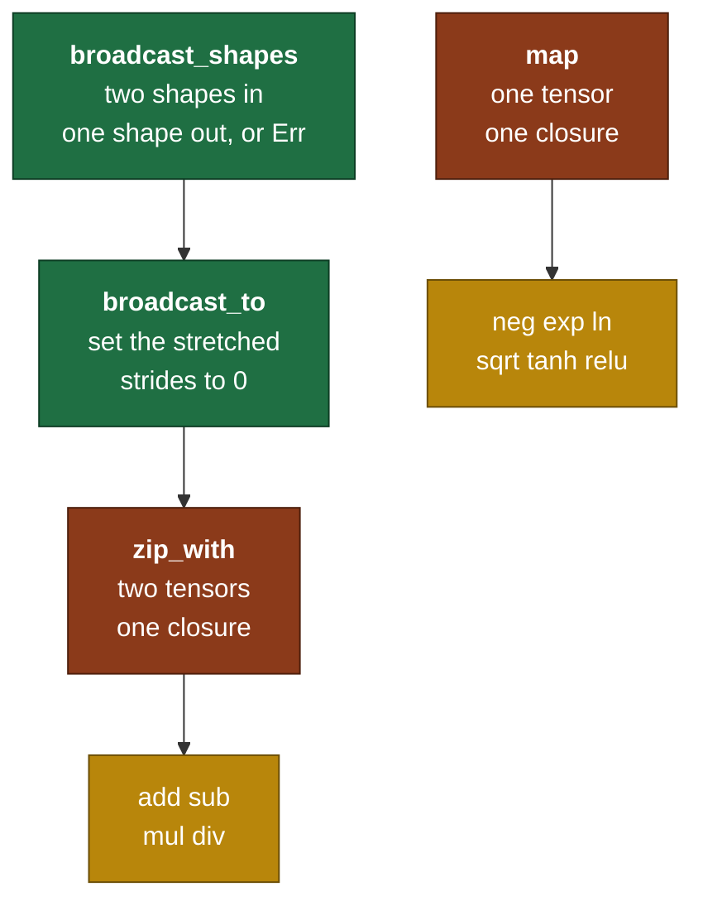

# Day 4 — Broadcast and elementwise ops

> **Read this file. It replaces the book for today.**
> The page numbers stay as optional depth. This lesson teaches the same material in my own words.
> Tick your boxes in [`RUST_TRACKER.md`](../RUST_TRACKER.md). This file holds no checkboxes.
> The short card is [`RUST_PHASE_0_1.md` Day 4](../RUST_PHASE_0_1.md#day-4--broadcast-and-elementwise-ops).

**Time: 3 hours. Claim: R0a. File you extend: `src/tensor.rs`.**
**Your tests are written: move `rust/tests/pending/day4.rs` to `rust/tests/day4.rs` at the start of the session.**

---

## 1. Why this day exists

A neural network layer computes `y = x·W + b`.

`x·W` has shape `[tokens, features]`. `b` has shape `[features]`. Those are different shapes, and you have to add them.

The obvious fix is to copy `b` once per row. For GPT-2 at 1024 tokens and 3072 features, that is 3 million copied floats, per bias add, and GPT-2 does 48 bias adds per forward pass. 150 million pointless writes for a value that never changes.

**Broadcast is the fix, and it costs nothing.** It sets one stride to 0. Every index along that axis then reads the same element. No data moves.

Today you build broadcast, and then you build every elementwise operation on top of it, out of two primitives.

### 1.1 What breaks later if you get this wrong

| Model step | The broadcast it needs | Day |
|---|---|---|
| Add the bias after every linear layer | `[1024, 3072] + [3072]` | 21, 22 |
| Subtract the mean in LayerNorm | `[1024, 768] - [1024, 1]` | 18 |
| Divide by the standard deviation | `[1024, 768] / [1024, 1]` | 18 |
| Add the causal mask to the attention scores | `[12, 1024, 1024] + [1, 1024, 1024]` | 20 |
| Divide the scores by `sqrt(d_k)` | a rank-0 scalar against rank 3 | 19 |
| Subtract the row max before softmax | `[..., 1024] - [..., 1]` | 13 |

Every one is a stride-0 read. Not one of them copies.

### 1.2 The map of today



Ten operations. Two primitives. One rule. That ratio is the design, and it is why the backward pass on Day 10 is short.

---

## 2. Broadcast, from first principles

### 2.1 Start with the problem, not the rule

You have a matrix and a row. You want to add the row to every row of the matrix.

```text
x = [[1, 2, 3],        bias = [100, 200, 300]
     [4, 5, 6]]

want = [[101, 202, 303],
        [104, 205, 306]]
```

`x` has 6 elements. `bias` has 3. An elementwise add needs the same count on both sides. So something has to give.

**The copy answer.** Build a `[2,3]` tensor that holds `bias` twice. Now both sides have 6 elements. It works, and it allocates 6 floats to store 3 distinct values.

**The stride answer.** Leave `bias` where it is. Build a **view** of it with shape `[2,3]` and strides `[0, 1]`. Read element `[i, j]`:

```text
buffer_position = 0 + i*0 + j*1 = j
```

The `i` term vanishes, because its stride is 0. So `[0,0]`, `[1,0]` and `[57,0]` all read buffer position 0. Two logical rows, one physical row, zero allocation.

```text
bias buffer:      100  200  300           <- 3 elements, and this is all there is

logical view, shape [2,3], strides [0,1]:

         j=0   j=1   j=2
  i=0    100   200   300     -> reads buffer 0, 1, 2
  i=1    100   200   300     -> reads buffer 0, 1, 2   (i*0 = 0)
         ^^^   ^^^   ^^^
         the same three bytes, read twice
```

**A stride of 0 is the whole of broadcasting.** Everything else on this page is bookkeeping around that one idea.

### 2.2 The compatibility rule

Two shapes broadcast when you can line them up and stretch. The rule has three parts, and you apply them in this order.

**Part 1 — align from the right.** Write the shapes with their **last** axes in the same column. Pad the shorter one on the left with 1s.

```text
       [8, 1, 6]                [8, 1, 6]
       [   7, 1]      ->        [1, 7, 1]
        ^ pad here               ^ a missing axis counts as 1
```

Why from the right? Because the last axis is the fastest one, and it is the one that carries the meaning. In `[tokens, features]` the features axis is last, and a `[features]` bias must line up with it. Alignment from the left lines the bias up with the tokens, and that is not what anybody means.

**Part 2 — check each column.** A column is compatible when the two entries are equal, or one of them is 1.

```text
column        entries      verdict
last          6 and 1      one is 1  -> stretch the 1 to 6
middle        1 and 7      one is 1  -> stretch the 1 to 7
first         8 and 1      one is 1  -> stretch the 1 to 8
```

**Part 3 — take the maximum in each column.** That is the result shape.

An incompatible pair looks like this:

```text
       [2, 3]
       [3, 2]

column        entries      verdict
last          3 and 2      not equal, and neither is 1  -> Err
```

`[2,3]` and `[3,2]` do not broadcast. This is worth knowing, because it is the shape pair that a wrong transpose produces, and the error message points you straight at it.

### 2.3 Building the broadcast view

`broadcast_to(&self, shape)` takes the target shape and builds the view. Three steps:

1. **Pad the rank.** The target has rank `R`. Your tensor has rank `r <= R`. Add `R - r` axes on the **left**, each with shape 1 and stride 0.
2. **Walk the axes.** For each axis, compare your shape entry against the target.
   - Equal: keep the stride.
   - Yours is 1 and the target is larger: set that stride to **0**.
   - Anything else: `Err`.
3. **Keep the data and the offset.** Nothing moves.

Worked example, `[2,1,3]` to `[2,4,3]` with strides `[3,3,1]`:

```text
axis    yours   target   action              new stride
 0        2       2      equal, keep         3
 1        1       4      stretch, zero it    0
 2        3       3      equal, keep         1

result: shape [2,4,3]   strides [3,0,1]   offset 0   same buffer
```

Read `[1, 3, 2]`: `1*3 + 3*0 + 2*1 = 5`. Read `[1, 0, 2]`: `1*3 + 0*0 + 2*1 = 5`. Same position. Correct.

**Broadcast never shrinks and never lowers the rank.** `[3,4]` does not broadcast to `[3,2]`, and `[3,4]` does not broadcast to `[4]`. Both are `Err`. Only a 1 stretches.

### 2.4 The strange thing you just built

A broadcast view has **more elements than its buffer holds**.

```text
row.numel()  = 4        buffer length = 4
big.numel()  = 12       buffer length = 4
```

Every invariant you wrote on Day 2 and Day 3 that assumed `numel() == data.len()` is now false. That is your self-check question 2, so go and find them. I name none of them here.

One consequence you can have for free: `map` and `zip_with` return a **fresh, packed, offset-0 tensor**. A stride-0 input axis becomes a real axis in the output, with real repeated values in a real buffer. The zero-stride trick lives on the read side only. The moment you write a result, the repeats become genuine data.

### 2.5 The mathematics: broadcast is an index map

Write it as a function and the pattern gets clear. For a rank-2 target:

```text
        y[i, j]  =  x[ i * s0 + j * s1 ]         with s = strides
```

A normal `[2,3]` tensor has `s = [3,1]`, so every `(i,j)` maps to a different buffer position. The map is **injective**: distinct indices, distinct memory.

A broadcast `[2,3]` view has `s = [0,1]`, so `(0,j)` and `(1,j)` map to the same position. The map is **not injective**: it is many-to-one.

That single word carries the consequences of the whole day.

- Reading is fine. Many readers of one value is safe, and it is why `Rc` with no `RefCell` was the right call on Day 2.
- Writing is a disaster. Two logical elements share one memory cell, so a write through one changes the other. Your API has no write path at all, so the problem cannot arise. That is not luck. It is the reason the API is shaped this way.

### 2.6 The gradient of a broadcast is a sum

This is the ML content of the day, and it is worth doing now while the picture is fresh.

Broadcasting `b` of shape `[3]` up to `[2,3]` means every entry of `b` is used **twice** in the forward pass:

```text
y[0,j] = x[0,j] + b[j]
y[1,j] = x[1,j] + b[j]
                  ^^^^ the same b[j], in two places
```

The chain rule for a variable that appears in several places says: **add the contributions**. In the notation of a loss `L`:

```text
   dL        dL     dy[0,j]        dL     dy[1,j]
------  =  ------ * -------  +  ------ * -------
 db[j]     dy[0,j]   db[j]      dy[1,j]   db[j]
```

Both partial derivatives of `y` with respect to `b[j]` equal 1, because `b[j]` enters as a plain sum. So:

```text
   dL        dL        dL
------  =  ------  +  ------
 db[j]     dy[0,j]    dy[1,j]
```

That is a **sum over the broadcast axis**. In general:

> The forward pass of broadcast copies along an axis.
> The backward pass of broadcast sums along that axis.

This is a specific case of a general fact: the backward pass of an operation is the transpose of its derivative, and the transpose of "copy" is "sum". You meet it again on Day 10 as `sum_to_shape`, and again on Day 17 as the scatter-add for embeddings, which is the same idea on an index lookup.

You write no backward pass today. You write the forward pass in a way that makes the backward pass short: the broadcast is a recorded shape change and not a silent copy, so Day 10 knows exactly which axes to sum over.

### 2.7 `map` and `zip_with`, and why only two

Look at the ten operations the card asks for:

```text
neg  exp  ln  sqrt  tanh  relu        one input,  one output
add  sub  mul  div                    two inputs, one output
```

Every one of them applies a scalar function at each position. They differ only in the function. So there are two shapes of code and not ten.

```text
map(f)          : out[idx] = f(self[idx])
zip_with(g, o)  : out[idx] = g(self[idx], o[idx])   after broadcasting both to the common shape
```

`add` is `zip_with(other, |a, b| a + b)`. `relu` is `map(|x| x.max(T::ZERO))`. Ten functions, two mechanisms, one traversal loop that you debug once.

**Why this matters more than it looks.** On Day 10 you write a backward pass for each operation. If the forward pass has ten hand-written loops, the backward pass has ten more. If the forward pass has two, the traversal is already proven and the backward work is about calculus and not about indices.

`zip_with` must broadcast. It takes two tensors of possibly different shapes, computes the common shape with `broadcast_shapes`, broadcasts both operands to it, and then walks the common shape. When the shapes do not broadcast, it returns `Err`.

---

## 3. The Rust you need today

### 3.1 Closures — a function with a memory

A closure is a function value written inline. It can **capture** variables from around it.

```rust
let tax_rate = 0.18;

let with_tax = |price: f64| price * (1.0 + tax_rate);   // captures tax_rate

assert!((with_tax(100.0) - 118.0).abs() < 1e-9);
```

The types are usually inferred, so `|price| price * 1.18` also works when the context says what `price` is.

**Every closure has its own anonymous type.** Two closures that look identical are two different types. That is why you cannot write `fn f() -> ClosureType`. You describe a closure by what it can do, and that is a trait.

### 3.2 The three closure traits

| Trait | The call takes | Use it when |
|---|---|---|
| `Fn` | `&self` | The closure only reads its captures. Callable many times. |
| `FnMut` | `&mut self` | The closure changes a capture. Callable many times. |
| `FnOnce` | `self` | The closure consumes a capture. Callable once. |

```rust
let base = 10;
let add_base = |x: i32| x + base;       // Fn:     reads base
let mut count = 0;
let mut tick = || count += 1;           // FnMut:  writes count
let name = String::from("Pune");
let take_name = move || name;           // FnOnce: gives name away
```

Your two methods take `impl Fn(T) -> T` and `impl Fn(T, T) -> T`. `Fn` is the right choice, and the reason is specific: you call the closure once per element, so it has to be callable many times. `FnOnce` compiles for a one-element tensor and fails for every other one.

### 3.3 `impl Trait` in argument position

```rust
pub fn map(&self, f: impl Fn(T) -> T) -> Self;
```

`impl Fn(T) -> T` means "some concrete type that implements `Fn(T) -> T`, chosen by the caller". It is short for a generic parameter:

```rust
pub fn map<F: Fn(T) -> T>(&self, f: F) -> Self;   // the same thing, written out
```

The compiler monomorphizes it, exactly as it does for `T: Scalar` from Day 1. `a.map(|x| x * x)` compiles to a loop with the multiply written inline. There is no function pointer, and there is no call at run time.

The alternative is `Box<dyn Fn(T) -> T>`, which puts the closure on the heap and calls it through a pointer, once per element. In a loop over 3 million elements, that difference is real. Stay with `impl Fn`.

### 3.4 Iterators, and why they cost nothing

An iterator is a value with a `next` method that returns `Option<Item>`.

```rust
pub trait Iterator {
    type Item;
    fn next(&mut self) -> Option<Self::Item>;
}
```

`None` means the sequence ended. Everything else in the iterator library is built on that one method.

**Adapters are lazy.** `map`, `filter`, `zip`, `rev`, `enumerate` and `take` all return a new iterator and do no work. Work happens when something consumes the iterator: a `for` loop, `collect`, `sum`, `fold`, `any`, `count`.

```rust
let prices = vec![120, 45, 300, 80];

// Nothing runs on this line. It builds a value.
let discounted = prices.iter().map(|p| p * 9 / 10);

// This line runs the whole chain, once, with no intermediate Vec.
let total: i32 = discounted.sum();
assert_eq!(total, 490);
```

Each adapter is a small struct with an inlined `next`. The optimiser flattens the chain into one loop. An iterator chain and a hand-written loop compile to the same machine code, and the chain is harder to get wrong.

### 3.5 `zip` and `rev`, the two you need today

```rust
let cities  = ["Pune", "Delhi", "Kochi"];
let states  = ["MH", "DL", "KL"];

for (c, s) in cities.iter().zip(states.iter()) {
    println!("{c} is in {s}");
}
```

`zip` stops at the **shorter** of the two. That is convenient and it is also a trap: a `zip` of a length-3 and a length-2 iterator silently gives you 2 pairs and no error. When two lengths must agree, assert it before you zip.

```rust
let shape = [8, 1, 6];
for (axis, n) in shape.iter().rev().enumerate() {
    println!("{n} is {axis} steps from the end");
}
```

`rev` walks backwards. It needs a `DoubleEndedIterator`, and slice iterators are one.

**`rev` is the tool for the alignment rule.** Section 2.2 aligns two shapes from the right. Two `rev()` iterators zipped together give you exactly the columns of that figure, in order, with no index arithmetic and no risk of an off-by-one on the padding. A version written with `len() - 1 - i` on both sides is correct and is the version people get wrong.

### 3.6 `Option`, one paragraph

`zip` on two `rev` iterators of different lengths stops early, and you need the short one to contribute a 1. `Iterator::next` returns `Option<T>`, which is the same enum idea as `Result` with no error payload:

```rust
enum Option<T> { Some(T), None }
```

You will reach for `None` meaning "this axis does not exist, so treat it as 1". Handle it explicitly. Do not call `unwrap`.

**Book cross-reference:** *Programming Rust* pp. 303–312 (closures and their types), "Function and Closure Types" p. 308, "Using Closures Effectively" p. 319, "Iterators" p. 323, "Iterator Adapters" p. 330, "zip" p. 342, "Simple Accumulation" p. 345.

---

## 4. What you build today

Signatures from the day card, with the return types fixed. The bodies are yours.

```rust
// src/tensor.rs

pub fn broadcast_shapes(a: &[usize], b: &[usize]) -> Result<Vec<usize>, ShapeError>;

impl<T: Scalar> Tensor<T> {
    pub fn broadcast_to(&self, shape: &[usize]) -> Result<Self, ShapeError>;
    pub fn map(&self, f: impl Fn(T) -> T) -> Self;
    pub fn zip_with(&self, other: &Self, f: impl Fn(T, T) -> T) -> Result<Self, ShapeError>;

    // two operands, so a shape can fail
    pub fn add(&self, other: &Self) -> Result<Self, ShapeError>;
    pub fn sub(&self, other: &Self) -> Result<Self, ShapeError>;
    pub fn mul(&self, other: &Self) -> Result<Self, ShapeError>;
    pub fn div(&self, other: &Self) -> Result<Self, ShapeError>;

    // one operand, so no shape can fail
    pub fn neg(&self)  -> Self;
    pub fn exp(&self)  -> Self;
    pub fn ln(&self)   -> Self;
    pub fn sqrt(&self) -> Self;
    pub fn tanh(&self) -> Self;
    pub fn relu(&self) -> Self;
}
```

**Read the split in the return types.** A one-operand op has one shape, so there is nothing to disagree about, and it returns `Self`. A two-operand op can be handed two shapes that do not broadcast, so it returns `Result`. The type carries the fact, and no comment has to.

Two design points to decide, and to record in the commit message:

1. **Does `broadcast_to` accept a target of lower rank?** Section 2.3 says no. State what a caller loses.
2. **Is `map` allowed to return a non-contiguous tensor?** Your test asserts the result is contiguous. Say why that is the right default, in one sentence, before you write the code.

---

## 5. The tests, and the trap in each one

```bash
mv tests/pending/day4.rs tests/day4.rs
cargo test --test day4
```

| Test | What it traps |
|---|---|
| `broadcast_shapes_table` | Alignment from the left instead of the right. It also covers rank 0, different ranks on both sides, and two genuinely incompatible pairs. |
| `broadcast_uses_stride_zero` | A broadcast that copies. It asserts the stride is exactly 0, that the storage is shared, and that a stretched middle axis works, not only a leading one. |
| `broadcast_sum_scales` | A `to_vec` that gives the right length and the wrong values. It checks the exact repeat pattern in both stretch directions. |
| `elementwise_against_manual` | Every one of the ten ops against hand-computed values, plus a bias add in both directions, plus a both-sides stretch, plus an op on a transposed view. |

The shapes from your self-check are deliberately **not** in the test table. Do that derivation on paper first.

---

## 6. Order of work

1. Move the test file. Run `cargo test --test day4`. That is the red.
2. Write `broadcast_shapes`. Use two `rev()` iterators. Make `broadcast_shapes_table` pass. **Commit.**
3. Write `broadcast_to`. Make `broadcast_uses_stride_zero` pass.
4. Run `broadcast_sum_scales`. If `to_vec` from Day 3 walks the strides correctly, this passes with no new code. If it does not, you found a Day 3 bug, and that is what a test suite is for.
5. Write `map`. Make the `map` block of the last test pass.
6. Write `zip_with`. It broadcasts both sides, then walks the common shape.
7. Write the ten ops. Each one is a single call to `map` or `zip_with`. If any one of them is longer than one line, stop and ask why. **Commit.**
8. Run `cargo clippy`. Fix every warning.
9. Do the self-check on paper. Photograph it into `hand_math/`.
10. Post the day hook. Tell me when the day is done.

Step 6 is the hard one. Steps 2 and 7 are the natural stopping points.

---

## 7. Compiler errors you will meet today

| Error | What it means | Where to look |
|---|---|---|
| `E0277: expected a closure that implements the Fn trait, but this closure only implements FnMut` | The closure changes a captured variable. | You are accumulating inside the closure. Accumulate outside it. |
| `E0308: mismatched types, expected T, found f64` | A literal met a generic. `2.0` is `f64` and `T` is not. | `T::from_f64(2.0)`, or use `T::ONE` and `T::ZERO`. |
| `E0599: no method named max found for type parameter T` | The trait is out of scope, or the bound is missing. | `use crate::scalar::Scalar;` at the top of the module. |
| `E0507: cannot move out of index` | An element moved where `Copy` was needed. | `Scalar: Copy` gives it. Check that your loop reads `self.get(...)` and not a borrow. |
| `E0382: use of moved value: f` | A closure parameter was used in two loops. | `impl Fn` is callable many times. Take it by reference inside a helper, or restructure. |
| `attempt to multiply with overflow` on `numel` | A stride-0 axis made `numel` larger than the buffer. | Section 2.4. This is your self-check question 2, arriving as a panic. |
| `index out of bounds: the len is 4 but the index is 7` | You walked `numel` positions into a buffer of 4. | The same cause. Your traversal reads the buffer, not the strides. |

The last two rows are today's signature failure. Both mean the same thing: some code still believes `numel() == data.len()`.

---

## 8. Self-check — on paper, before you close the laptop

I answer neither of these. Both go in `hand_math/`.

1. **Derive.** Take shapes `[8, 1, 6]` and `[7, 1]`. What is the broadcast result shape? Write **both** stride vectors of the two broadcast views, given that each input is contiguous to start with. Show the alignment columns.
2. **Audit.** A stride-0 view has a `numel()` larger than its buffer length. Go through every method you wrote on Day 2 and Day 3. Name the ones that break. Name the ones you already guarded, and state what guarded them. This is an audit of your own code, so write the method names down.

---

## 9. Stuck-signals — the points where you ask

- `to_vec()` on a broadcast view gives the correct length and repeats the wrong elements. Your stride walk is correct and your alignment from the trailing axis is off by one. **Ask after 20 minutes.**
- `broadcast_shapes` passes on equal ranks and fails on different ranks. That is the padding step, part 1 of section 2.2. **Ask after 20 minutes.**
- You are writing the tenth elementwise op by hand and it is not a one-line call. Stop. `zip_with` or `map` is not carrying enough, and rewriting the primitive is cheaper than writing eight more loops.
- You want to add a `set` or an `add_assign` method to make something easier. Stop and ask. The API has no write path on purpose, and section 2.5 is the reason.

---

## 10. The post

The hook is at the end of the [Day 4 card](../RUST_PHASE_0_1.md#day-4--broadcast-and-elementwise-ops), written in your voice. Ship it today.

---

## 11. Done means all five

1. `cargo test` passes, with Days 1 to 4 green.
2. `cargo clippy` gives no warnings.
3. One hand-derivation sits in `hand_math/`.
4. The post is public.
5. `PROGRESS.md` records what is proven, and it names nothing else.
