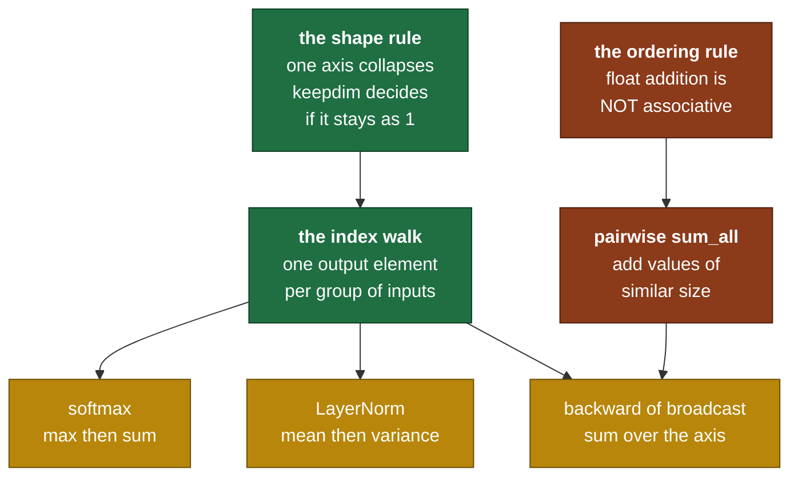

# Day 5 — Reductions

> **Read this file. It replaces the book for today.**
> The page numbers stay as optional depth. This lesson teaches the same material in my own words.
> Tick your boxes in [`RUST_TRACKER.md`](../RUST_TRACKER.md). This file holds no checkboxes.
> The short card is [`RUST_PHASE_0_1.md` Day 5](../RUST_PHASE_0_1.md#day-5--reductions).

**Time: 3 hours. Claim: R0a. File you extend: `src/tensor.rs`.**
**Your tests are written: move `rust/tests/pending/day5.rs` to `rust/tests/day5.rs` at the start of the session.**

---

## 1. Why this day exists

A reduction collapses an axis. Three values become one. Sum, mean, max.

The shape logic is easy, and you will have it working in forty minutes. The rest of the day is about the second decision, and that decision is the reason this card exists:

**In what order do you add the numbers?**

Floating-point addition is **not associative**. `(a + b) + c` and `a + (b + c)` give different answers. So "sum these 100 million numbers" is not one operation. It is a family of operations, and some members of that family are wrong by a factor of six.

Today you meet that fact with a test that fails loudly, and you fix it.

### 1.1 What breaks later if you get this wrong

| Model step | The reduction it needs | Day |
|---|---|---|
| Softmax: shift the logits so `exp` cannot overflow | `max_axis` with `keepdim` | 13, 19 |
| Softmax: divide by the sum of the exponentials | `sum_axis` with `keepdim` | 13 |
| Cross-entropy loss: one number from the whole batch | `sum_all` | 13 |
| LayerNorm: the mean of each token's features | `mean_axis` with `keepdim` | 18 |
| LayerNorm: the variance of each token's features | `mean_axis` of the squared difference | 18 |
| Backward of a broadcast: sum over the stretched axis | `sum_axis` with `keepdim` | 10 |
| Gradient norms during training | `sum_all` over millions of values | later |

Note the last row. A gradient norm sums every parameter in the model. In `f32`, over 124 million values, a naive fold gives you a number that is not close to the true one. Your training then clips at the wrong threshold and nothing works, and nothing tells you why.

### 1.2 The map of today



---

## 2. The shape rule

### 2.1 What a reduction does

Pick an axis. Every group of elements that differs **only** along that axis collapses to one value.

```text
t = [[1, 2, 3],
     [4, 5, 6]]         shape [2,3]

sum over axis 0:  the groups run down the columns
      column 0: 1 + 4 = 5
      column 1: 2 + 5 = 7
      column 2: 3 + 6 = 9        result [5, 7, 9]   shape [3]

sum over axis 1:  the groups run along the rows
      row 0: 1 + 2 + 3 = 6
      row 1: 4 + 5 + 6 = 15      result [6, 15]     shape [2]
```

Say it in one line and it stops being confusing:

> **The axis you name is the axis that disappears.**

People get this backwards because "sum over the rows" is ambiguous in English. The shape is not ambiguous. `[2,3]` reduced on axis 0 gives `[3]`, because the 2 is gone.

### 2.2 `keepdim`

`keepdim = false` removes the axis. `keepdim = true` leaves it there with size 1.

```text
shape [2,3,4], reduce axis 1

keepdim = false  ->  [2, 4]
keepdim = true   ->  [2, 1, 4]
```

The values are identical. Only the shape differs.

**Why the option exists.** With `keepdim = true`, the result broadcasts straight back against the input, because a size-1 axis stretches. That is the entire reason. Look at LayerNorm:

```text
x         shape [1024, 768]
mean      shape [1024,   1]       mean_axis(1, keepdim = true)
x - mean  shape [1024, 768]       broadcast on axis 1, stride 0, no copy
```

With `keepdim = false` the mean has shape `[1024]`, which aligns from the right against the **768** axis, and `768 != 1024`, so the subtraction is an error. You must then reshape it back. `keepdim` is that reshape, done at the source.

Every "subtract the row statistic" step in the model uses `keepdim = true`. Every "collapse to a smaller tensor" step uses `false`.

### 2.3 The index walk

For each output element, you walk one group of input elements.

```text
input  shape [2,3,4]        reduce axis 1        output shape [2,4]

output [i, k]  =  fold over j in 0..3  of  input[i, j, k]
                                ^ the reduced axis is the loop
                  ^ the other axes are the output index
```

Two things to notice, and both are where the bugs live.

1. The output index has one fewer entry than the input index. Building the input index means inserting `j` back at position `axis`. Off-by-one lives here.
2. The rule must not care which axis you named. Your test reduces rank 3 on axis 0, axis 1 and axis 2 with hand-computed values, because a walk written for the first axis usually fails on the last one.

`sum_all` is different. It folds everything and returns a scalar `T`, not a tensor. It has no shape logic at all, and it carries all of section 3.

---

## 3. Floating point, from first principles

This section is the mathematics of the day. Nothing here is optional.

### 3.1 What an `f32` actually is

A float is a number in scientific notation, in base 2, with a fixed budget of digits.

```text
value  =  (-1)^sign  x  1.mantissa  x  2^(exponent - 127)

f32 layout, 32 bits:

  bit 31   bits 30..23        bits 22..0
  +-----+--------------+------------------------+
  |  s  |   exponent   |        mantissa        |
  +-----+--------------+------------------------+
     1        8 bits           23 bits
```

The mantissa stores 23 bits. There is a 24th bit, and it is the leading `1` in `1.mantissa`. That bit is not stored, because a normalized number always has it. So:

> **`f32` carries 24 bits of significand: 23 stored and 1 implied.**
> **`f64` carries 53 bits: 52 stored and 1 implied.**

24 bits means `2^24 = 16,777,216` distinct significand values. That is the whole budget. Everything below follows from it.

### 3.2 The spacing between neighbours, and ULP

A float is not a point on a smooth line. It is a point on a ruler whose marks get further apart as you move right.

Between `2^e` and `2^(e+1)` there are exactly `2^23` evenly spaced `f32` values. So the gap between neighbours in that range is:

```text
ULP(x) = 2^(e - 23)        where 2^e <= x < 2^(e+1)      (for f32)
```

ULP means "unit in the last place". It is the distance to the next representable number.

```text
range                     e     ULP(f32)          what fits
1 .. 2                    0     0.00000012        very fine
1024 .. 2048             10     0.000122          fine
1,048,576 .. 2,097,152   20     0.125             eighths only
8,388,608 .. 16,777,216  23     1.0               integers only
16,777,216 .. 33,554,432 24     2.0               even integers only
67,108,864 .. 134,217,728 26    8.0               multiples of 8 only
```

Read the last three rows carefully. **Past `2^24`, an `f32` cannot hold an odd integer.** Past `2^25` it cannot hold a number that is not a multiple of 4.

This is not a rounding "error". It is the format working exactly as designed. There is no bit left to write the difference in.

### 3.3 What addition actually does

`a + b` in IEEE-754 is defined in two steps:

1. Compute the exact real sum `a + b`.
2. Round that real number to the nearest representable float. On a tie, round to the one with an even last bit.

Step 2 is where information goes. If the exact sum falls between two neighbours, one of them is returned and the difference is gone for ever.

Now the consequence that runs the rest of the day:

> **When `|b| < ULP(a) / 2`, the exact sum `a + b` is closer to `a` than to any other float.**
> **So `a + b` returns `a`, and `b` is discarded entirely.**

A worked example, on unrelated data. Take rupees in `f32`.

```text
account = 1.0f32                 ULP(1.0) = 2^-23 = 0.00000011920929
deposit = 0.00000001f32          smaller than half of one ULP

account + deposit  ==  1.0       exactly. The deposit is gone.
```

Add that deposit a hundred million times, one at a time, and the balance is still exactly 1.0.

**This is not a Rust problem.** It happens in Python, in C, in NumPy and on every GPU. NumPy hides it by using pairwise summation inside `np.sum`, and almost nobody who calls `np.sum` knows that.

### 3.4 Why a left fold over many small values fails

The naive sum is a left fold:

```text
acc = 0
acc = acc + x[0]
acc = acc + x[1]
...
```

The accumulator grows. The addend does not. So the **ratio** between them grows, and once the addend drops below half an ULP of the accumulator, every remaining addition does nothing.

```text
step                acc            ULP(acc)     does acc + 1.0 change acc?
early               1,000          0.0000610    yes, exactly
middle          1,000,000          0.125        yes, exactly
later           8,000,000          1.0          yes, exactly
...             ?                  ?            this is your self-check
much later     20,000,000          2.0          no
```

I left two cells empty on purpose. Your self-check asks you to fill in that row with the exponent and the 24-bit mantissa written out. Do it on paper before you write any code today. It takes ten minutes and you will never forget the result.

### 3.5 Pairwise summation

The fix does not change the numbers. It changes the **shape of the addition tree**.

A left fold is a maximally unbalanced tree, `n - 1` levels deep:

```text
sequential:                     pairwise:

 ((((1+1)+1)+1)+1)+1              ((1+1)+(1+1)) + ((1+1)+(1+1))

      +                                     +
     / \                                   / \
    +   1                                 /   \
   / \                                   +     +
  +   1                                 / \   / \
 / \                                   +   + +   +
1   1                                 /|   |\ |\  |\
                                     1 1   1 1 1  1 1 1

depth n-1                            depth log2(n)
one huge acc against one tiny value  every add is between similar sizes
```

The algorithm: split the range in half, sum each half by the same method, add the two results. Below some small block size, fall back to a plain loop.

Both trees do exactly `n - 1` additions. The FLOP count is identical. Only the pairing changes.

**Your self-check asks why that survives 10^8 ones, and I do not answer it.** Section 3.3 gives you the tool: the discard rule depends on the **ratio** of the two operands, not on their absolute size. Work out what the ratio is at every level of the pairwise tree, and the answer falls out in two lines.

**The practical shape.** A recursion in Rust costs one stack frame per level. Pairwise over 10^8 elements is 27 levels deep at most, so a plain recursive function is safe. A base-case block of 64 or 128 elements removes almost all of the call overhead and changes the accuracy by nothing you can measure. Pick a base size and write down why.

**What this is not.** Pairwise summation is not the most accurate method. Kahan compensated summation is more accurate and costs about four times the arithmetic. NumPy uses pairwise. You use pairwise. If a later day needs more, you will know where to look.

### 3.6 `max` and the `NaN` problem

`sum` folds with `+`. `max` folds with a comparison, and comparison on floats is not a total order.

```text
NaN <  1.0   is false
NaN >  1.0   is false
NaN == NaN   is false
```

All three at once. That is why Rust gives `f32` and `f64` a `PartialOrd` and refuses them an `Ord`, and it is why your `Scalar` trait from Day 1 bounds `PartialOrd`.

Two consequences for today:

1. **Seed the fold with the first element, not with zero.** A max seeded at `T::ZERO` returns 0 for an all-negative input. Attention scores after a causal mask are large and negative, so this bug hides until Day 20 and then destroys every row. Your test catches it now.
2. **Decide what `max` does with a `NaN` input.** Your `Scalar::max` calls `f32::max`, which returns the non-`NaN` operand. That is one reasonable answer. Write down that it is your answer, because Day 12's gradient checker produces `NaN` when something is wrong, and a `max` that swallows it silently costs you an afternoon.

### 3.7 The ML payoff: softmax needs both

Softmax turns a vector of scores into a probability distribution:

```text
softmax(x)[i]  =  exp(x[i]) / sum over j of exp(x[j])
```

Written that way it is unusable. GPT-2 logits reach into the hundreds, and `exp(1000)` overflows `f64` to infinity long before that. Infinity divided by infinity is `NaN`, and one `NaN` poisons every value downstream of it.

The standard fix subtracts the row maximum from every score before calling `exp`. Then the largest exponent is `exp(0) = 1`, and everything else is smaller, so nothing overflows.

**Your self-check asks you to write the identity that proves the answer is unchanged.** I do not write it here. It is two lines of algebra on the definition above, and you will meet it again on Day 13 when you differentiate softmax.

This is why the day card puts `max_axis` next to `sum_axis`. Softmax needs the max, then a subtract, then `exp`, then the sum, then a divide. Four of those five are operations you now own, and `keepdim = true` is what makes the subtract and the divide broadcast.

---

## 4. The Rust you need today

### 4.1 `fold` — the shape of every reduction

```rust
let prices = [120, 45, 300, 80];

let total = prices.iter().fold(0, |acc, p| acc + p);
assert_eq!(total, 545);
```

`fold(init, f)` carries an accumulator through the sequence. It is the general form. `sum`, `product`, `count`, `max` and `min` are all `fold` with a fixed `f`.

The order is fixed and left to right. That is exactly the order section 3.4 says is wrong for a long list of floats, so `sum_all` is the one place today where you do **not** reach for `fold`.

### 4.2 `max` on floats, and `Ordering`

```rust
let temps = [21.5f64, 19.0, 24.5, 22.0];

// This does not compile. f64 has no Ord.
// let hottest = temps.iter().max();

// This does. partial_cmp returns Option<Ordering>, and unwrap says
// "I promise there is no NaN here", which is a promise you must keep.
let hottest = temps.iter().copied().fold(f64::NEG_INFINITY, f64::max);
assert_eq!(hottest, 24.5);
```

`Ordering` is a three-way enum: `Less`, `Equal`, `Greater`. `partial_cmp` returns `Option<Ordering>`, and the `None` case is the `NaN` case.

`f64::total_cmp` exists in `std` and gives a real total order that puts `NaN` at one end. It is the honest tool when you must sort floats. You need no sort today.

### 4.3 Recursion, and the stack

```rust
fn count_down(n: u32) -> u32 {
    if n == 0 {
        return 0;
    }
    1 + count_down(n - 1)
}
```

Rust has no tail-call optimisation, so every level of recursion is a real stack frame. The default main-thread stack is 8 MB, and a test thread gets 2 MB by default.

Frames here are small, and pairwise depth over 10^8 elements is 27. You are nowhere near the limit. But know the number, because a recursion that splits into "one element and the rest" is depth `n`, not depth `log n`, and that one **does** overflow the stack. Split in half.

### 4.4 Slices, and splitting them

```rust
let names = ["Pune", "Delhi", "Kochi", "Surat"];
let (left, right) = names.split_at(2);
assert_eq!(left, ["Pune", "Delhi"]);
assert_eq!(right, ["Kochi", "Surat"]);
```

`split_at` gives two borrows of one array with no copy. `chunks(n)` gives an iterator of non-overlapping slices, and the last one is short when the length does not divide evenly.

Both are useful today, and both come back on Day 7 for the blocked matmul and on Day 8 for the thread partition.

### 4.5 Integer types in a float world

`mean_axis` divides by the group length, and the length is a `usize`.

```rust
let n: usize = 3;
// let m = total / n;                  // does not compile. T is not usize.
let m = total / T::from_f64(n as f64);  // this is the conversion you own
```

`usize as f64` is exact up to `2^53`, so it is safe here. Day 1's `from_f64` is the bridge, and this is the first time it earns its place in the trait.

**Book cross-reference:** *Programming Rust* pp. 345–354 ("Simple Accumulation" p. 345, `max_by` and `min_by` p. 346, `fold` p. 349, "Implementing Your Own Iterators" p. 354). For the float format, the reference is IEEE-754 and not the book. Everything you need is in section 3.

---

## 5. What you build today

Signatures from the day card. The bodies are yours.

```rust
// src/tensor.rs
impl<T: Scalar> Tensor<T> {
    pub fn sum_axis(&self, axis: usize, keepdim: bool) -> Result<Self, ShapeError>;
    pub fn mean_axis(&self, axis: usize, keepdim: bool) -> Result<Self, ShapeError>;
    pub fn max_axis(&self, axis: usize, keepdim: bool) -> Result<Self, ShapeError>;
    pub fn sum_all(&self) -> T;      // pairwise, not a left fold
}
```

Three design points to decide, and to record in the commit message:

1. **What is the mean of an empty axis?** Your test does not force this. `0/0` is `NaN`. State your answer.
2. **What is the max of an empty axis?** There is no first element to seed with. State your answer.
3. **Does `sum_axis` reduce pairwise as well, or only `sum_all`?** The groups are short in a reduction over one axis, and `sum_all` folds everything. State where the line is, and why.

---

## 6. The tests, and the trap in each one

```bash
mv tests/pending/day5.rs tests/day5.rs
cargo test --test day5
```

| Test | What it traps |
|---|---|
| `sum_axis_shapes` | `keepdim` handled for one value of the flag only. It also checks rank 1 reduced to rank 0, and it checks that a bad axis is an `Err` and not a panic. |
| `sum_axis_values` | The index walk. It runs at rank 3 on all three axes with hand-computed values, plus a transposed view and a broadcast view, because a reduction must read through strides. |
| `sum_all_precision` | **The lesson of the day.** A left fold in `f32` stops dead at 2^24. It also checks small odd-length inputs, which a pairwise split that drops the odd element gets wrong. |
| `max_axis_handles_negatives` | A fold seeded at zero. It then builds the softmax shift by hand and shows `exp` overflowing without it. |

`sum_all_precision` allocates 400 MB and dominates `cargo test` in a debug build. While you iterate:

```bash
cargo test --release --test day5
```

If the debug run takes more than a minute, that is information and not a fault. It says your traversal costs a lot per element. Write the number down. Do not optimise today. Day 7 is where speed becomes the subject.

---

## 7. Order of work

1. Move the test file. Run `cargo test --test day5`. That is the red.
2. Write `sum_axis` for `keepdim = false`. Make the shape half of `sum_axis_shapes` pass.
3. Add `keepdim = true`. It changes the output shape and no value.
4. Make `sum_axis_values` pass at rank 2, then at rank 3. **Commit.**
5. Write `mean_axis`. It is `sum_axis` and one division. Reuse, do not rewrite.
6. Write `max_axis`. Seed with the first element of the group. Make `max_axis_handles_negatives` pass. **Commit.**
7. Write `sum_all` as a plain left fold. Run `sum_all_precision`. **Watch it fail.** Write the wrong number down.
8. Rewrite `sum_all` as a pairwise split. Make the test pass. Write both numbers in the commit message.
9. Run `cargo clippy`. Fix every warning.
10. Do the self-check on paper. Photograph it into `hand_math/`.
11. Post the day hook. Tell me when the day is done.

**Step 7 is not optional and it is not a waste of ten minutes.** A test you never watched fail proves nothing. Seeing 16.7 million on your own screen, from your own code, is the point of the day.

---

## 8. Compiler errors you will meet today

| Error | What it means | Where to look |
|---|---|---|
| `E0369: binary operation > cannot be applied to type T` | You compared two `T` values with `>`. | `Scalar: PartialOrd` gives it. The trait is out of scope. Add the `use`. |
| `E0277: the trait bound T: Ord is not satisfied` | You called `Iterator::max` or `sort`. | Floats have no `Ord`. Fold with `Scalar::max` instead. |
| `E0308: mismatched types, expected T, found usize` | You divided a `T` by a length. | `T::from_f64(n as f64)`. |
| `E0502: cannot borrow as mutable because it is also borrowed as immutable` | You collected into a `Vec` while iterating a borrow of it. | Build the output into a separate `Vec`. |
| `index out of bounds` inside the reduction | The input index is built by inserting `j` at the wrong position. | Section 2.3, point 1. Print `axis`, the output index and the input index for one element. |
| `thread ... has overflowed its stack` | Your pairwise split takes one element off the front instead of splitting in half. | Section 4.3. Depth must be `log n`, not `n`. |
| `attempt to subtract with overflow` | `len - 1` on an empty group. | Design point 2 in section 5. |

---

## 9. Self-check — on paper, before you close the laptop

I answer neither of these. Both go in `hand_math/`.

1. **Numerical trace.** In `f32`, set an accumulator to `1.6e7`. Add `1.0`. What happens, exactly? Work out the exponent field and the 24-bit significand, and write the bits. Then state at which value the addition stops changing the accumulator, and why. Then explain why pairwise summation of 10^8 ones survives. Section 3.3 gives you the rule. The derivation is yours.
2. **The softmax identity.** Write the identity that shows `softmax(x) == softmax(x - c)` for any scalar `c`. Two lines of algebra on the definition. Then state why softmax needs `max_axis` and not, for example, `mean_axis`.

---

## 10. Stuck-signals — the points where you ask

- The reduction is correct for `axis = 0` and wrong for the last axis. The fault is the multi-index iteration order, not the fold. **Ask after 20 minutes.**
- `sum_all_precision` gives a mean near the right value and a wrong last digit. Read the assertion message. It prints both numbers. The gap tells you whether this is a real bug or your base-case block size.
- You want to write `sum_all` with `iter().sum()`. Stop. That is the left fold, and this day exists because it is wrong.
- Your pairwise version is slower than the fold by more than 3 times in release mode. Your base case is too small. That is a real finding, so measure it and tell me the number.

---

## 11. The post

The hook is at the end of the [Day 5 card](../RUST_PHASE_0_1.md#day-5--reductions), written in your voice. Ship it today.

---

## 12. Done means all five

1. `cargo test` passes, with Days 1 to 5 green.
2. `cargo clippy` gives no warnings.
3. One hand-derivation sits in `hand_math/`.
4. The post is public.
5. `PROGRESS.md` records what is proven, and it names nothing else.
