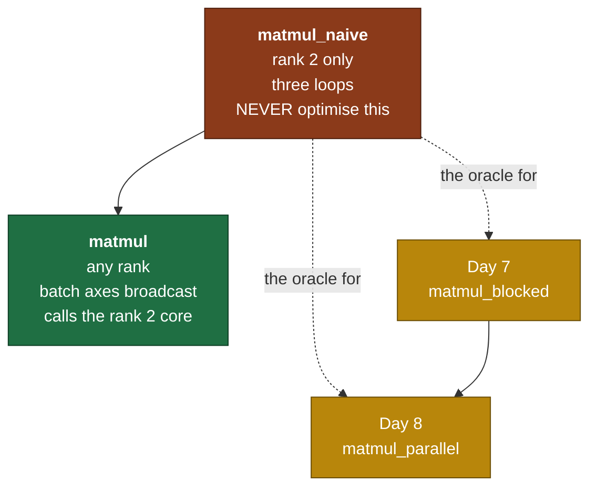

# Day 6 — The naive matmul, and the oracle discipline

> **Read this file. It replaces the book for today.**
> The page numbers stay as optional depth. This lesson teaches the same material in my own words.
> Tick your boxes in [`RUST_TRACKER.md`](../RUST_TRACKER.md). This file holds no checkboxes.
> The short card is [`RUST_PHASE_0_1.md` Day 6](../RUST_PHASE_0_1.md#day-6--the-naive-matmul-and-the-oracle-discipline).

**Time: 3 hours. Claim: R0a. File you create: `src/matmul.rs`.**
**Your tests are written: move `rust/tests/pending/day6.rs` to `rust/tests/day6.rs` at the start of the session.**

---

## 1. Why this day exists

Two reasons, and the second one is the one people skip.

**Reason one.** Matrix multiplication is where the time goes. In GPT-2, more than 95 percent of the arithmetic in both the forward and the backward pass is matmul. Everything else — the adds, the activations, the normalizations — is noise beside it. When you make matmul fast, the model is fast. When you do not, nothing else you do matters.

**Reason two.** You have no reference implementation. There is no NumPy in this project, and there is no BLAS. So when a matmul gives a wrong answer on Day 22, nothing tells you.

Today you fix that by writing the slowest correct version you can, and by **never touching it again**. It becomes the oracle: the thing you test the fast versions against for the next five weeks.

### 1.1 What breaks later if you get this wrong

| Model step | The matmul it is | Day |
|---|---|---|
| Every linear layer: `y = x·W + b` | `[tokens, in] · [in, out]` | 21, 22 |
| Attention scores: `Q·Kᵀ` | batched `[h, seq, dk] · [h, dk, seq]` | 19 |
| Attention output: `scores·V` | batched `[h, seq, seq] · [h, seq, dk]` | 19 |
| The language-model head | `[tokens, 768] · [768, 50257]` | 22, 25 |
| Backward of a linear layer | two more matmuls, with transposes | 11 |

Every one of those goes through the function you write today, or through a faster function that this one certifies.

### 1.2 The map of today



---

## 2. What a matmul is, from first principles

### 2.1 The definition

For `A` of shape `[M, K]` and `B` of shape `[K, N]`, the product `C` has shape `[M, N]` and:

```text
C[i][j]  =  sum over k in 0..K  of  A[i][k] * B[k][j]
```

That is the whole thing. One line. Three loops fall straight out of it: one for `i`, one for `j`, one for `k`.

**The inner dimension must agree.** `A` has `K` columns and `B` has `K` rows. That shared `K` disappears in the result, and the two outer dimensions survive. A useful way to remember it:

```text
   [M, K] · [K, N]  ->  [M, N]
       ^^^^^^^ these two must match, and they vanish
    ^^^         ^^^ these two survive
```

### 2.2 Three ways to read the same formula

The formula is one thing. Three readings of it are useful at different moments, and switching between them is most of what "understanding matmul" means.

**Reading one: a grid of dot products.**

```text
C[i][j] is the dot product of row i of A with column j of B.
```

```text
        B (K=3, N=2)
         [ 7   8]
         [ 9  10]
         [11  12]

A (M=2, K=3)          C (M=2, N=2)
[1  2  3]             [58   64]
[4  5  6]             [139 154]

C[0][0] = 1*7 + 2*9 + 3*11 = 58        row 0 of A, column 0 of B
```

**Reading two: a linear map.** `B` is a function that takes a `K`-vector and gives an `N`-vector. `A` holds `M` input vectors, one per row. `C` holds the `M` outputs. This is the reading that matters in the model, because a linear layer *is* a function applied to every token.

**Reading three: a sum of outer products.** Take column `k` of `A` and row `k` of `B`. Their outer product is a full `[M, N]` matrix. `C` is the sum of those `K` matrices. This reading is the one that makes the backward pass on Day 11 obvious, and it is why your test multiplies a column by a row and checks that the result is a 3-by-3 matrix.

### 2.3 Why a neural network layer is a matmul

A single artificial neuron computes a weighted sum of its inputs, plus a bias:

```text
out = w[0]*x[0] + w[1]*x[1] + ... + w[K-1]*x[K-1] + b
```

That is a dot product. A **layer** is `N` such neurons, all reading the same input, so it is `N` dot products, which is a vector times a matrix. A **batch** of `M` tokens through that layer is `M` of those, which is exactly `[M,K] · [K,N]`.

```text
   x        W          b            y
[M, K]  · [K, N]  +  [N]    ->   [M, N]
 tokens   weights    bias        one output vector per token
                     ^^^ Day 4 broadcast, stride 0, no copy
```

So the whole forward pass of a transformer is: matmul, add a bias, apply a nonlinearity, repeat. The interesting parts of the architecture are the shapes and the order. The arithmetic is this page.

### 2.4 The batched case

GPT-2 does not do one matmul. It does 12 attention heads at once, over a batch of sequences. That gives tensors of rank 4:

```text
Q     [batch, heads, seq, head_dim]
K^T   [batch, heads, head_dim, seq]
      ^^^^^^^^^^^^^  ^^^^^^^^^^^^^
      batch axes     the actual matrix
```

The rule generalizes cleanly:

> **The last two axes are the matrix. Every axis before them is a batch axis.**
> **Batch axes broadcast by the Day 4 rule.**

```text
[2, 3, 4] · [2, 4, 5]  ->  [2, 3, 5]        two independent 3x4 by 4x5 products
[1, 3, 4] · [2, 4, 5]  ->  [2, 3, 5]        one A, used for both batches, no copy
[2, 1, 3, 4] · [1, 5, 4, 6] -> [2, 5, 3, 6] batch axes [2,1] and [1,5] broadcast to [2,5]
```

The second line is why Day 4 came before today. A single shared weight matrix against a batch of inputs is exactly a broadcast batch axis, and it costs nothing.

### 2.5 Cost: FLOPs, bytes, and arithmetic intensity

A **FLOP** is one floating-point operation: one add, or one multiply. A multiply-and-add is 2 FLOPs.

**Arithmetic intensity** is the ratio that decides whether a kernel is limited by the processor or by memory:

```text
                       FLOPs performed
arithmetic intensity = ----------------
                       bytes moved from memory
```

Worked example on unrelated data. Take an elementwise vector add, `c[i] = a[i] + b[i]`, over `n` values of `f32`:

```text
FLOPs   = n                    one add per element
bytes   = 12n                  read 4 + read 4, write 4
intensity = n / 12n = 0.083 FLOP per byte
```

Now compare against a machine. Say it does 500 GFLOP/s and moves 100 GB/s. The **ridge point** is the intensity where the two limits cross:

```text
ridge = 500e9 FLOP/s / 100e9 B/s = 5 FLOP per byte
```

Below the ridge, the kernel is **memory-bound**: it waits for data, and a faster processor changes nothing. Above the ridge, it is **compute-bound**: the data arrives faster than the arithmetic units can use it.

The vector add sits at 0.083, which is sixty times below the ridge. It is memory-bound, and no amount of clever arithmetic helps it.

**Your self-check asks you to do this arithmetic for a matmul.** I have given you the definitions and one worked example on a different kernel. The matmul numbers are yours, and the answer decides what Day 7 is about.

### 2.6 The six loop orderings

The three loops `i`, `j` and `k` can be nested in six orders. All six compute the same `C`. They differ only in the order they touch memory.

```text
for i { for j { for k { C[i][j] += A[i][k] * B[k][j] } } }     i j k
for i { for k { for j { C[i][j] += A[i][k] * B[k][j] } } }     i k j
for j { for i { for k { ... } } }                              j i k
...and three more
```

Day 2 section 2.5 gave you the tool: in row-major storage, stepping along the **last** axis moves one position in memory, and stepping along the first axis skips a whole row. A cache line is 64 bytes, which is 16 `f32` values. So a loop that walks the last axis uses all 16 values it paid for. A loop that walks the first axis uses 1 of every 16.

Look at each of the three arrays in the inner loop and ask which index is changing. That tells you which of the three is walked contiguously and which is not.

**Write your prediction on paper today. Do not measure it today.** You measure it tomorrow, with a benchmark, and you compare it against what you wrote. A prediction you make after seeing the answer teaches you nothing.

### 2.7 The oracle discipline

This is the part of the day that is about engineering and not about mathematics.

**The problem.** You are going to write four versions of matmul: naive, blocked, parallel, and whatever Day 8 leaves you with. Three of them are complicated. How do you know they are right?

**The wrong answer:** read the code carefully. You wrote the code. You will read what you meant, not what you typed.

**The right answer: differential testing.** Keep one version so simple that it is obviously correct, and check every other version against it.

```text
      random inputs
            |
    +-------+-------+
    |               |
matmul_naive   matmul_blocked
    |               |
    +-------> == <--+        within a stated tolerance
```

That is why `matmul_naive` carries this comment, and why the comment is not a joke:

```rust
/// Reference implementation. NEVER optimise this. It is the oracle.
```

The moment you make the oracle clever, it can be wrong in the same way as the thing it certifies, and the whole scheme collapses. Slow is the feature.

**The second layer: property tests, which need no oracle at all.** Some facts are true of *any* correct matmul, so you can test them before you have anything to compare against:

| Property | The fact it uses | What a bug looks like |
|---|---|---|
| `A · I == A` | The identity is the identity | Off-by-one in the `k` loop, or `i` and `j` swapped |
| `(A·B)ᵀ == Bᵀ·Aᵀ` | Transpose reverses a product | Reading `B` by rows instead of columns |
| `(A·B)·C ≈ A·(B·C)` | Associativity | An accumulator reset in the wrong loop |
| A row times a column is 1 number, a column times a row is a matrix | The shape rule | `M` and `N` swapped |

These are the strongest tests in the file, because they need no correct answer to be known in advance. You will use exactly this technique on Day 12, where the property is "the analytic gradient matches the numerical one".

---

## 3. The Rust you need today

### 3.1 Nested loops and ranges

```rust
for i in 0..3 {          // 0, 1, 2. The end is excluded.
    for j in 0..2 {
        println!("{i},{j}");
    }
}
```

`0..n` is a `Range`, and a `Range` is an iterator. `for x in 0..n` compiles to the same machine code as a C `for` loop.

Two habits worth forming now:

- Name the bounds once. `let (m, k) = (a.shape()[0], a.shape()[1]);` beats `a.shape()[0]` written nine times, and it makes the shape check obvious.
- Do the shape validation **before** the loops, not inside them. A check inside the inner loop runs `M*N*K` times to answer a question that does not change.

### 3.2 `debug_assert!`

```rust
debug_assert!(k > 0, "the inner dimension must be positive");
```

`debug_assert!` runs in a debug build and vanishes in a release build. `assert!` runs in both.

Use `debug_assert!` for invariants inside a hot loop. Use `assert!` for facts a caller can break. The matmul inner loop is the hottest code in the whole project, so anything you put there costs you real time on Day 7.

### 3.3 Unit tests against integration tests

Two places a test can live, and they see different things.

```rust
// src/matmul.rs
#[cfg(test)]
mod tests {
    use super::*;                 // sees everything, including private items

    #[test]
    fn a_private_helper_works() { /* ... */ }
}
```

```rust
// tests/day6.rs                  a separate crate. Sees the public API only.
use rustgpt::matmul::matmul_naive;
```

`#[cfg(test)]` means the module is compiled only when testing, so it costs nothing in the shipped library.

The day files are integration tests on purpose. They exercise the API a caller sees, and they cannot reach a private helper. If you find yourself wanting a private function to be public "just for the test", the seam is in the wrong place.

### 3.4 Bounds checks, and what the compiler removes

Every `v[i]` in Rust checks `i < v.len()` and panics if not. In a loop the optimiser usually proves the check is unnecessary and deletes it. Usually.

You are not calling `v[i]` today. You are calling `self.get(&[i, k])`, which walks the index formula. That is much slower than an indexed read, and it is the correct choice for the oracle: it is obviously right, and it handles strided views for free.

Speed is tomorrow. Write the obvious version.

### 3.5 `Vec::with_capacity` and building the output

```rust
let mut out = Vec::with_capacity(m * n);
for _ in 0..(m * n) {
    out.push(0.0);
}
```

`with_capacity` allocates once. `Vec::new` followed by pushes reallocates as it grows, roughly `log2(n)` times, and copies the contents each time. For a 512-by-512 output that is a real cost for no reason.

`vec![T::ZERO; m * n]` does the same thing in one line and is what you want here.

**Book cross-reference:** *Programming Rust* pp. 178–182 ("Tests and Documentation" p. 178, "Integration Tests" p. 180), "Loops" p. 130, "Attributes" p. 175.

---

## 4. What you build today

Signatures from the day card. The bodies are yours.

```rust
// src/matmul.rs
use crate::scalar::Scalar;
use crate::tensor::{ShapeError, Tensor};

/// Reference implementation. NEVER optimise this. It is the oracle.
/// Rank 2 only.
pub fn matmul_naive<T: Scalar>(a: &Tensor<T>, b: &Tensor<T>)
    -> Result<Tensor<T>, ShapeError>;

/// Batched: [..., M, K] x [..., K, N] -> [..., M, N].
/// The batch axes broadcast by the Day 4 rule.
pub fn matmul<T: Scalar>(a: &Tensor<T>, b: &Tensor<T>)
    -> Result<Tensor<T>, ShapeError>;
```

Add `pub mod matmul;` to `src/lib.rs`.

### 4.1 The rank split, fixed

`matmul_naive` takes **rank 2 only**. It is the reference, so it stays as simple as a thing can be. Any other rank is an `Err`.

`matmul` takes rank 2 or higher. It computes the broadcast batch shape, then runs one rank-2 product per batch position.

Whether `matmul` calls `matmul_naive` for each batch, or repeats the three loops itself, is your call. Reuse is the obvious answer and it costs one `slice` plus one `contiguous` per batch. Write down which you chose.

### 4.2 One design point to decide

**Does `matmul_naive` accept a non-contiguous input?** Your test feeds it a transposed view, so the answer is yes. The consequence is that you must read through `get` or through the index formula, and not through the raw buffer. Note in the commit message that this is a deliberate cost, and that Day 7 revisits it.

---

## 5. The tests, and the trap in each one

```bash
mv tests/pending/day6.rs tests/day6.rs
cargo test --test day6
```

The file uses `mod common;`, which pulls in `rust/tests/common/mod.rs`. Cargo does not build that file as its own test binary, because it is not named `main.rs`. It holds `randn`, `identity` and `assert_all_close`. Read its header once.

| Test | What it traps |
|---|---|
| `matmul_2x3_3x2_by_hand` | The core formula, against numbers you can check on paper. It also runs 1-by-1, a row times a column, and a column times a row, which traps `M` and `N` swapped. |
| `matmul_identity` | An off-by-one in the `k` loop. This one is **exact**, not approximate: every discarded term is `x * 0.0`, so no rounding happens. If it needs a tolerance, your accumulator is doing something unintended. |
| `matmul_transpose_identity` | A kernel that reads the buffer instead of the index formula. `transpose` gives a strided view, and this is the first test that feeds one in. |
| `matmul_associative` | An accumulator reset in the wrong loop. It runs square and non-square, and in both precisions. |
| `matmul_batched_shapes` | The batch-stride computation. It checks each batch against the rank-2 oracle, then a broadcast batch, then the rank-4 shape that Day 20 uses. |
| `matmul_dim_mismatch_errors` | A panic where an `Err` belongs. |

---

## 6. Order of work

1. Move the test file. Create `src/matmul.rs`. Add `pub mod matmul;` to `src/lib.rs`. Run `cargo test --test day6`. That is the red.
2. Write the shape check for `matmul_naive`. Make `matmul_dim_mismatch_errors` pass for the rank-2 cases.
3. Write the three loops. Make `matmul_2x3_3x2_by_hand` pass. **Commit.**
4. Run `matmul_identity` and `matmul_transpose_identity`. If step 3 read through the index formula, both pass with no new code.
5. Run `matmul_associative`. It needs `Rng` from Day 1 and nothing else.
6. Add the comment `/// Reference implementation. NEVER optimise this. It is the oracle.` **Commit here. This commit is the oracle.**
7. Write `matmul` for rank 2. It is a call through to the reference.
8. Add the batch loop. Compute the broadcast batch shape with `broadcast_shapes` from Day 4. Make `matmul_batched_shapes` pass.
9. Run `cargo clippy`. Fix every warning.
10. Do the self-check on paper. **Write the loop-order prediction down and date it.** You measure it tomorrow.
11. Post the day hook. Tell me when the day is done.

Step 6 is the important commit of the whole week. Step 8 is the hard one.

---

## 7. Compiler errors you will meet today

| Error | What it means | Where to look |
|---|---|---|
| `E0433: failed to resolve: use of undeclared crate or module matmul` | `pub mod matmul;` is missing from `src/lib.rs`. | `src/lib.rs`. |
| `E0603: enum ShapeError is private` | You did not write `pub` on the enum, or the `use` path is wrong. | `pub enum ShapeError` in `src/tensor.rs`. |
| `E0277: cannot add T to T` | A bound is missing on the free function. | `pub fn matmul_naive<T: Scalar>` and not `<T>`. |
| `E0499: cannot borrow out as mutable more than once` | You held two mutable borrows of the output buffer. | Accumulate into a local `T`, then write once per output element. |
| `E0308: mismatched types, expected T, found {float}` | A `0.0` literal met a generic. | `T::ZERO`. |
| The result is all zeros | The accumulator is reset inside the wrong loop. | The accumulator resets once per `(i, j)` and not once per `k`. |
| The result is right for square inputs and wrong otherwise | `M`, `K` and `N` are mixed up. | Print all three. `A.shape()[1]` must equal `B.shape()[0]`. |

The last two rows are logic faults and not compiler errors. They are here because they are the two you will hit.

---

## 8. Self-check — on paper, before you close the laptop

I answer neither of these. Both go in `hand_math/`.

1. **Derive the cost.** For `[M,K] · [K,N]`, count the FLOPs. Then count the minimum number of bytes that must move in `f32`, assuming every element is read at least once and written at least once. Then compute the arithmetic intensity in FLOP per byte at `M = N = K = 512`. A machine gives about 500 GFLOP/s and about 100 GB/s. Compute the ridge point and state whether this kernel is compute-bound or memory-bound. Section 2.5 has the definitions and a worked example on a different kernel.
2. **Predict the loop order.** Six orderings of `i`, `j`, `k` exist. For each of the three arrays, state which index changes in the inner loop and whether that walk is contiguous in row-major storage. Then name the ordering with the best cache behaviour. **Write the prediction down and date it. You measure it tomorrow.**

---

## 9. Stuck-signals — the points where you ask

- Batched matmul passes for equal batch sizes and fails when one is 1. The fault is the batch-stride computation. **Do not add a special case for 1.** Ask after 20 minutes.
- `matmul_transpose_identity` fails and everything above it passes. Your kernel reads the buffer directly. That is a real design question, so ask.
- You want to optimise `matmul_naive` because it feels slow. Stop. That is tomorrow, in a different function, and today's function is the thing that proves tomorrow's is right.
- You want to skip the property tests because the hand-computed one passes. Stop. The hand-computed test uses a 2-by-3 matrix. Half the bugs in a matmul cannot fit in a 2-by-3 matrix.

---

## 10. The post

The hook is at the end of the [Day 6 card](../RUST_PHASE_0_1.md#day-6--the-naive-matmul-and-the-oracle-discipline), written in your voice. Ship it today.

---

## 11. Done means all five

1. `cargo test` passes, with Days 1 to 6 green.
2. `cargo clippy` gives no warnings.
3. One hand-derivation sits in `hand_math/`, and it holds a dated loop-order prediction.
4. The post is public.
5. `PROGRESS.md` records what is proven, and it names nothing else.
