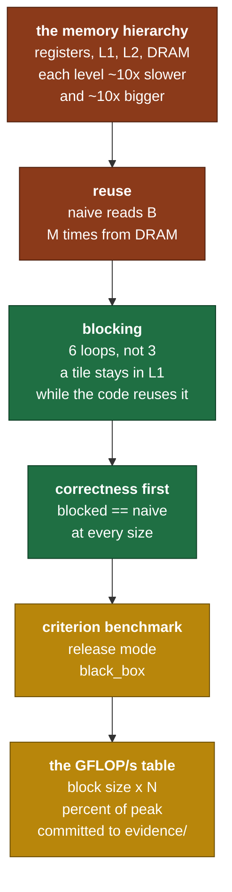

# Day 7 — Blocked matmul, and the measured gap ⏱ 2-day card

> **Read this file. It replaces the book for today.**
> The page numbers stay as optional depth. This lesson teaches the same material in my own words.
> Tick your boxes in [`RUST_TRACKER.md`](../RUST_TRACKER.md). This file holds no checkboxes.
> The short card is [`RUST_PHASE_0_1.md` Day 7](../RUST_PHASE_0_1.md#day-7--blocked-matmul-and-the-measured-gap--2-day-card).

**Time: 5 hours across 2 days. Claim: R0a. File you extend: `src/matmul.rs`.**
**Your tests are written: move `rust/tests/pending/day7.rs` to `rust/tests/day7.rs` at the start of the session.**
**Deliverable: a committed GFLOP/s table in `evidence/`. The table is part of the gate.**

---

## 1. Why this day exists

Yesterday's matmul does the right arithmetic. It also runs at a few percent of what your machine can do.

The gap is not the arithmetic. It is the memory. The naive loop asks for the same data from RAM thousands of times, and RAM is about two hundred times slower than the processor's own arithmetic units.

Today you change **which memory the code touches next**, and nothing else. Same FLOPs, same output, several times faster. This is the highest speed-per-hour day in Phase 0, and it is the one that decides whether training the 20M model later takes three days or three weeks.

The card gives it two days for a reason. Day one is the kernel and the correctness tests. Day two is the benchmark, the table, and the argument about what the numbers mean.

### 1.1 What breaks later if you get this wrong

Training cost for a transformer is roughly `6 * parameters * tokens` FLOPs. For a 20M-parameter model on 400M tokens:

```text
6 * 20e6 * 400e6  =  4.8e16 FLOPs
```

Divide that by your matmul throughput and you get the wall-clock time of the whole training run.

```text
at   5 GFLOP/s  ->  4.8e16 / 5e9   =  9.6e6 seconds  =  111 days
at  50 GFLOP/s  ->                     9.6e5 seconds =  11 days
at 200 GFLOP/s  ->                     2.4e5 seconds =  2.8 days
```

That table is the whole argument for today. Nothing else in Phase 0 moves a number by a factor of twenty.

### 1.2 The map of today



---

## 2. The memory hierarchy, from first principles

### 2.1 The pyramid

A modern processor has several levels of storage. Each level down is roughly ten times larger and roughly ten times slower.

```text
                          size            time to reach it
   +-----------+
   | registers |          ~1 KB           0 cycles      (they are the operands)
   +-----------+
   |    L1     |          128 KB          ~4 cycles
   +-----------+
   |    L2     |          ~4-16 MB        ~15 cycles
   +-----------+
   |   DRAM    |          8-64 GB         ~200-300 cycles
   +-----------+

Numbers above are the M4 order of magnitude. Check yours. The ratios
are what matters, and the ratios are the same on every machine built
in the last twenty years.
```

**Read the last line of the table again.** A DRAM access costs about 250 cycles. In 250 cycles the arithmetic unit can do hundreds of multiply-adds. So a kernel that waits for DRAM on every operation runs at a small fraction of the machine's arithmetic rate, however good the arithmetic is.

The processor does not fetch one number at a time. It fetches a **cache line**, which is 64 bytes on most machines, or 128 bytes on Apple silicon. At 4 bytes per `f32`, one 64-byte line holds 16 values.

```text
you ask for       a[0]
you receive       a[0] a[1] a[2] ... a[15]        one cache line
```

Two consequences, and they have names:

- **Spatial locality.** Use `a[1]` right after `a[0]` and it is already there, for free. Use `a[1000]` instead and you paid for 15 values you threw away.
- **Temporal locality.** Use `a[0]` again soon and it is still in cache. Use it again after touching a megabyte of other data and it has been evicted, so you pay full price again.

Blocking is a technique for buying temporal locality. That is the whole idea.

### 2.2 What the naive loop actually does to memory

Take the `i, j, k` ordering from Day 6 and follow the memory traffic for `A` of `[M,K]` and `B` of `[K,N]`.

```text
for i in 0..M          <- pick one row of A
  for j in 0..N        <- pick one column of B
    for k in 0..K      <- walk both
      C[i][j] += A[i][k] * B[k][j]
```

For each `i`, the two inner loops read **all of `B`**. So `B` is read from memory `M` times in total.

```text
B is [512, 512] f32   ->  1 MB
M is 512
total traffic for B   ->  512 MB, to compute a 1 MB result
```

`B` does not fit in L1 (128 KB), so most of those reads go at least to L2, and many go to DRAM. You are moving half a gigabyte to do two hundred megaflops of arithmetic. That ratio is the definition of memory-bound.

**And nothing in the arithmetic requires this.** Every element of `B` is genuinely needed `M` times. The question is whether you fetch it `M` times, or fetch it once and reuse it while it is close.

### 2.3 Blocking, the idea

Stop computing one output element at a time. Compute a **tile** of output at a time.

Split each matrix into square tiles of side `b`. Then:

```text
C tile [b x b]  +=  A tile [b x b]  ·  B tile [b x b]
```

While the code works on one triple of tiles, those three tiles are the only data it touches. If all three fit in L1, every read after the first is fast.

```text
        naive                              blocked
  (one output element at a time)     (one output tile at a time)

  +---+---------------+              +---+---------------+
  |   |               |              |###|               |
  |   |               |              |###|               |
  |   |               |              +---+---------------+
  |   |  reads all    |              |   |               |
  |   |  of B, M      |              |   | one tile of B |
  |   |  times        |              |   | stays in L1   |
  +---+---------------+              +---+---------------+

  B leaves cache between rows        B tile is reused b times
                                     before it is evicted
```

The loop structure goes from three loops to six: three that step over tiles, and three that step inside a tile.

```text
for ii in (0..M).step_by(b)          <- which tile row of C
  for jj in (0..N).step_by(b)        <- which tile column of C
    for kk in (0..K).step_by(b)      <- which pair of tiles to multiply
      for i in ii..min(ii+b, M)      <- inside the tile
        for j in jj..min(jj+b, N)
          for k in kk..min(kk+b, K)
            C[i][j] += A[i][k] * B[k][j]
```

**Look at the three `min` calls.** They handle the last tile in each direction, which is short when the size is not a multiple of `b`. That edge is where every blocking bug lives, and it is why your test uses 129 by 257 times 257 by 63 and not 512 by 512.

### 2.4 What changed and what did not

| Quantity | Naive | Blocked |
|---|---|---|
| FLOPs performed | `2MNK` | `2MNK`. Identical. |
| Output values | `MN` | The same values, to rounding. |
| Order of the additions | one order | a different order, so rounding differs |
| Bytes moved from DRAM | large | smaller by roughly the reuse factor |
| Arithmetic intensity **of the algorithm** | unchanged | unchanged |
| Arithmetic intensity **of the traffic that reaches DRAM** | low | higher |

The last two rows are the whole lesson, and the distinction is the one people miss. The mathematics of the operation did not change. What changed is how much of the traffic the cache absorbs before it reaches DRAM.

The third row is why your test compares with a tolerance and not with `==`. Float addition is not associative, and blocking changes the order of the additions. A different rounding is expected. A large difference is a bug.

### 2.5 The roofline, in one picture

Plot achievable performance against arithmetic intensity, on log axes, and every kernel lands under two straight lines.

```text
  GFLOP/s
    ^
550 |                    . . . . . . . . . . . . .  <- compute roof (peak FLOP/s)
    |                  /
    |                /
    |              /                                <- memory roof
    |            /                                     (slope = bandwidth)
    |          /
    |        /   * blocked
    |      /
    |    /  * naive
    +--/------------------------------------------->  FLOP per byte
       |          |
       low        ridge point

  ridge point = peak FLOP/s / peak bytes per second
```

Left of the ridge, you are memory-bound and the bandwidth line is your ceiling. Right of it, you are compute-bound and the flat line is your ceiling.

**Blocking does not raise either roof. It moves your kernel to the right along the x axis**, by cutting the denominator of the intensity ratio. That is the correct mental model, and it tells you when blocking stops helping: once you are past the ridge, more blocking buys nothing, because DRAM is no longer what you are waiting for.

### 2.6 Choosing the block size

Two forces pull in opposite directions.

- **Larger `b` gives more reuse.** Each element of a tile gets used `b` times before you move on.
- **Larger `b` needs more cache.** The three live tiles must fit in L1, or you have simply moved the problem.

So the working set of the innermost tile loop is what decides `b`. Your self-check asks you to write that working set down as a formula in `b`, set it equal to the 128 KB L1D of the M4 performance core, and solve. Do that on paper **before** you benchmark.

Then measure. Then compare. Then explain the gap, because there will be one, and the explanation is worth more than the number.

Two reasons the measured best usually differs from the predicted best, and neither is a mistake in your arithmetic:

- L1 also holds the stack, the loop counters and whatever else the code touches. Your tiles do not get all 128 KB.
- The hardware prefetcher is already fetching ahead for a predictable walk, so some traffic is hidden that your model counts as a cost.

### 2.7 The vocabulary of what comes next

Blocking is one technique out of several, and it is the first because it gives the most for the least. Here are the names of the others, so that you can recognize them. **Your self-check asks which one you hit next. I do not answer that.**

| Technique | What it targets |
|---|---|
| Loop ordering | which array is walked contiguously in the inner loop |
| Cache blocking | DRAM traffic. Today. |
| Register blocking | how many times a value is loaded from L1 into a register |
| SIMD | how many `f32` lanes one instruction operates on |
| FMA | whether a multiply and an add are one instruction or two |
| Packing | whether a tile is copied into a contiguous scratch buffer first |
| Multi-threading | how many cores are working. Day 8. |

Each one has its own roof. Section 4.4 tells you how to compute what fraction of the machine you reached, and that fraction is the evidence for which roof you are under.

---

## 3. Measuring, from first principles

### 3.1 Why a debug benchmark is worthless

`cargo test` builds with `opt-level = 0`. Nothing is inlined, bounds checks all remain, and every generic call is a real call.

`cargo bench` and `cargo build --release` use `opt-level = 3`. The difference on a numeric kernel is routinely 10 to 50 times.

**So a debug benchmark measures the compiler's warm-up settings, not your algorithm.** Worse, it can rank two algorithms in the wrong order, because the one that relies on inlining loses everything in debug.

Rule: correctness in debug, speed in release. Never mix them.

### 3.2 Why `black_box` exists

The optimiser is allowed to delete code whose result nobody uses.

```rust
// The optimiser can legally delete this whole loop and report 0.3 nanoseconds.
b.iter(|| expensive(&input));
```

`std::hint::black_box` is a function the optimiser is told nothing about. It cannot prove the value is unused, so it cannot remove the work.

```rust
use std::hint::black_box;

b.iter(|| black_box(expensive(black_box(&input))));
//      ^ hides the result                ^ hides the input,
//        so the call stays                 so it cannot be constant-folded
```

A benchmark that reports a suspiciously small number, such as under a nanosecond for real work, is almost always a missing `black_box`.

### 3.3 What criterion does

`criterion` is a statistical benchmark harness. It runs your closure many times, discards the warm-up, fits a line through the samples, and reports a confidence interval. It also stores the previous run and tells you whether the change is a real difference or noise.

That last part is why it is worth a dev-dependency. A single timing on a laptop is noise. Criterion tells you when a change is inside the noise, which stops you from believing a 3 percent "improvement" that is nothing.

It is a `[dev-dependencies]` entry, so it never ships in the library. That is why it is the one crate the constraint allows.

### 3.4 Converting time to GFLOP/s

```text
FLOPs for [M,K] · [K,N]   =   2 * M * N * K       (one multiply and one add per term)

                              FLOPs
GFLOP/s  =  ---------------------------------------
             seconds  *  1,000,000,000
```

Percent of peak is that number divided by the machine's peak `f32` rate. Use about 550 GFLOP/s for one M4 performance core running scalar `f32` code, and state the number you used in the table. A percent with no stated denominator is not evidence.

---

## 4. What you build today

### 4.1 The kernel

```rust
// src/matmul.rs
/// Cache-blocked. Must match matmul_naive inside 1e-4.
pub fn matmul_blocked<T: Scalar>(a: &Tensor<T>, b: &Tensor<T>, block: usize)
    -> Result<Tensor<T>, ShapeError>;
```

Rank 2 only, the same as the oracle. Batched blocking is not on this card.

One design point to decide, and to record in the commit message: **what does `block == 0` do?** It has no sensible meaning, and it makes `step_by(0)` panic. Choose an `Err`, a panic, or a fallback to unblocked, and defend the choice with the Day 2 rule about bugs against states.

### 4.2 The `Cargo.toml` stanza

```toml
[[bench]]
name = "matmul"
harness = false
```

`harness = false` turns off the built-in test harness for that target, so `criterion_main!` becomes the entry point. Without this line the benchmark does not run and gives no error that explains why.

### 4.3 The benchmark harness

Create `rust/benches/matmul.rs`. A benchmark harness is a measuring tool and not learning code, so this one is written out. The kernels it calls are yours.

```rust
use std::hint::black_box;

use criterion::{BenchmarkId, Criterion, Throughput, criterion_group, criterion_main};
use rustgpt::matmul::{matmul_blocked, matmul_naive};
use rustgpt::rng::Rng;
use rustgpt::tensor::Tensor;

fn square<T: rustgpt::scalar::Scalar>(rng: &mut Rng, n: usize) -> Tensor<T> {
    let data: Vec<T> = (0..n * n).map(|_| rng.normal()).collect();
    Tensor::from_vec(data, &[n, n])
}

fn bench_matmul(c: &mut Criterion) {
    let mut rng = Rng::seed(1234);

    for &n in &[128usize, 512, 1024] {
        let a: Tensor<f32> = square(&mut rng, n);
        let b: Tensor<f32> = square(&mut rng, n);

        let mut group = c.benchmark_group(format!("matmul_{n}"));
        // Criterion divides by this, so it prints FLOP/s directly.
        group.throughput(Throughput::Elements(2 * (n * n * n) as u64));

        // The oracle, for the baseline column. It is slow, so only at n = 128.
        if n == 128 {
            group.bench_function("naive", |bench| {
                bench.iter(|| matmul_naive(black_box(&a), black_box(&b)).unwrap());
            });
        }

        for &block in &[8usize, 16, 32, 64, 128] {
            group.bench_with_input(
                BenchmarkId::new("blocked", block),
                &block,
                |bench, &blk| {
                    bench.iter(|| matmul_blocked(black_box(&a), black_box(&b), blk).unwrap());
                },
            );
        }
        group.finish();
    }
}

criterion_group!(benches, bench_matmul);
criterion_main!(benches);
```

Run it with `cargo bench`. Criterion prints a time and a throughput per case.

**A warning about `n = 1024` with the naive kernel.** One naive 1024-cubed product is about 2.1 billion FLOPs, and criterion runs each case many times. Leave `naive` at `n = 128` only, as above, or the benchmark takes hours.

### 4.4 The deliverable table

Commit this to `evidence/`. It is part of Gate R0a, and a claim without its artifact is not done.

```text
Machine: <chip, cores, L1D size, L2 size>
Peak f32 used for the percent column: <number> GFLOP/s, and where it came from
Build: cargo bench, release, <rustc version>
Date: <date>

Predicted best block size from the L1 calculation: <b>       <- write this BEFORE measuring

| N    | block | time (ms) | GFLOP/s | % of peak |
|------|-------|-----------|---------|-----------|
| 128  | naive |           |         |           |
| 128  | 8     |           |         |           |
| ...  | ...   |           |         |           |
| 1024 | 128   |           |         |           |

Measured best block size: <b>
Predicted against measured: <same, or the reason they differ>
Speedup of the best blocked kernel against naive at N=128: <x>
Next bottleneck, and whether blocking can fix it: <your answer>
```

The last three lines are the ones a reader will care about. A table of numbers with no argument attached is data, not evidence.

---

## 5. The tests, and the trap in each one

```bash
mv tests/pending/day7.rs tests/day7.rs
cargo test --test day7
```

| Test | What it traps |
|---|---|
| `blocked_matches_naive` | The edge tile. It runs 6 shapes against 5 block sizes, and 129 by 257 times 257 by 63 is a multiple of no block size in the sweep. It also feeds in a transposed view and checks the shape errors. |
| `blocked_matches_naive_f64` | The same sweep at a tolerance 6 orders of magnitude tighter. It separates a real bug from a rounding difference. It also compares two block sizes against each other, which traps a bug you copied into both the kernel and your idea of the answer. |

**There is no timing test, and there must never be one.** A test that asserts a speed flakes on a busy machine and teaches you to ignore red. Speed is the benchmark, and the benchmark is a committed table that a human reads.

---

## 6. Order of work

**Day one — correctness.**

1. Move the test file. Run `cargo test --test day7`. That is the red.
2. Do the L1 calculation on paper. Write the predicted block size down and date it. **Before any code.**
3. Write `matmul_blocked` with the six loops from section 2.3. Get the `min` calls right on the first attempt by writing them first.
4. Make `blocked_matches_naive` pass at the sizes that are multiples of the block. **Commit.**
5. Make it pass at 129 by 257 times 257 by 63. This is where the edge bug shows.
6. Make `blocked_matches_naive_f64` pass.
7. Run `cargo clippy`. Fix every warning. **Commit.**

**Day two — measurement.**

8. Add the `[[bench]]` stanza to `Cargo.toml`. Create `benches/matmul.rs` from section 4.3.
9. Run `cargo bench`. Confirm the numbers are not absurd. Under a nanosecond means a missing `black_box`.
10. Fill in the table. Compute GFLOP/s and percent of peak yourself, from the formula in section 3.4.
11. Compare the measured best block size against your dated prediction. Write the explanation, whichever way it went.
12. Answer the second self-check with the numbers in front of you.
13. Commit the table to `evidence/`. Post the day hook.

**Do not swap the order of steps 2 and 9.** A prediction made after seeing the answer is not a prediction, and the gate asks for both numbers.

---

## 7. Compiler errors and measurement faults you will meet

| Symptom | What it means | Where to look |
|---|---|---|
| `E0433: failed to resolve: use of undeclared crate criterion` | `criterion` is missing, or it is under `[dependencies]` instead of `[dev-dependencies]`. | `Cargo.toml`. |
| The benchmark file compiles and never runs | `harness = false` is missing from the `[[bench]]` section. | `Cargo.toml`. |
| `attempt to subtract with overflow` in the tile bounds | `ii + block` went past `M` and then you subtracted. | Use `min(ii + block, M)` before any subtraction. |
| `index out of bounds` only at 129 by 257 | The edge tile is not clamped. | The three `min` calls in section 2.3. |
| Blocked matches naive at 64 and fails at 63 | The same cause. A test that only uses multiples of the block hides it. | The same three calls. |
| A benchmark result under 1 nanosecond | The optimiser deleted the work. | `black_box` on both the input and the result. |
| Blocked is **slower** than naive | One of three causes, in order of likelihood: the benchmark ran in debug, the block is larger than L1, or a bounds check sits in the inner loop. | Check the build profile first. Do not rewrite the kernel first. |
| Every block size gives the same time | The `block` parameter is not reaching the loops. | Print it inside the function once. |

---

## 8. Self-check — on paper, before you close the laptop

I answer neither of these. Both go in `hand_math/`.

1. **Derive the block size.** For block size `b`, how many bytes of `A`, `B` and `C` stay live in the innermost blocked loop? Write it as a formula in `b` for `f32`. Set it equal to the 128 KB L1D of the M4 performance core and solve for the largest `b` that fits. **Do this before you benchmark, and date it.** Then compare the predicted best against the measured best. If they disagree, state why. Section 2.6 names two common reasons, and a third one specific to your machine is worth finding.
2. **Account for the gap.** What percent of the roughly 550 GFLOP/s `f32` peak of the M4 did you reach? If it is below 15 percent, name the next bottleneck from the list in section 2.7 and give the evidence that points at it. Then state whether blocking can fix that bottleneck at all, and why.

---

## 9. Stuck-signals — the points where you ask

- Blocked runs slower than naive. Check the build profile, the block size against L1, and the inner loop, in that order. **Ask after 30 minutes.** Do not rewrite the kernel first.
- The edge case at 129 by 257 fails and every multiple-of-8 size passes. That is the clamp. **Ask after 20 minutes.**
- Criterion reports a time that does not change with the block size. The parameter is not reaching the loops, or the optimiser hoisted the call. **Ask after 20 minutes.**
- You want to add SIMD intrinsics, or a packing buffer, or threads. Stop. Threads are tomorrow. The rest is not on this card, and the gate asks for a measured table and an honest argument, not for the fastest kernel you can write.

---

## 10. The post

The hook is at the end of the [Day 7 card](../RUST_PHASE_0_1.md#day-7--blocked-matmul-and-the-measured-gap--2-day-card), written in your voice. Ship it on the second day, with the real speedup number in it.

---

## 11. Done means all six

1. `cargo test` passes, with Days 1 to 7 green.
2. `cargo clippy` gives no warnings.
3. The GFLOP/s table is committed to `evidence/`, with the machine, the peak used, and the date.
4. The table states the predicted block size, the measured best, and the reason for any gap.
5. The post is public.
6. `PROGRESS.md` records what is proven, and it names nothing else.
