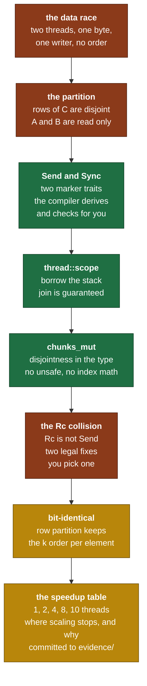

# Day 8 — Parallelism with scoped threads

> **Read this file. It replaces the book for today.**
> The page numbers stay as optional depth. This lesson teaches the same material in my own words.
> Tick your boxes in [`RUST_TRACKER.md`](../RUST_TRACKER.md). This file holds no checkboxes.
> The short card is [`RUST_PHASE_0_1.md` Day 8](../RUST_PHASE_0_1.md#day-8--parallelism-with-scoped-threads).

**Time: 2.5 hours. Claim: R0a. File you extend: `src/matmul.rs`.**
**Your tests are written: move `rust/tests/pending/day8.rs` to `rust/tests/day8.rs` at the start of the session.**
**Deliverable: a committed speedup table in `evidence/`. The table is part of the gate.**

---

## 1. Why this day exists

Yesterday you made one core fast. Your machine has ten.

A single-threaded kernel on an M4 leaves most of the chip idle. The fix is not a clever algorithm. The fix is a partition of the output that no two threads share.

The hard part is not the threads. The hard part is the proof that the partition is safe. In C you write the partition, you run it, and you hope. In Rust the compiler refuses to build a partition it cannot prove disjoint. Today you learn what that proof looks like, and you learn the exact place where your Day 2 storage decision collides with it.

That collision is the real lesson of Day 8. `Tensor<T>` holds an `Rc<Vec<T>>`. **`Rc` cannot cross a thread boundary.** You will meet that error inside the first ten minutes. Section 2.7 tells you why the rule exists, and section 4.2 gives you the two legal fixes with their costs.

### 1.1 What breaks later if you get this wrong

| If this is wrong | What breaks | Day |
|---|---|---|
| The output partition overlaps | Two threads write one byte. The result changes between runs. | today |
| You partition along `K` instead of rows | Two threads add into the same accumulator. The result is wrong and not repeatable. | today |
| The result is not bit-identical to `matmul_blocked` | You lost the oracle. Every later kernel has no reference. | Day 11 backward, Phase 2 |
| You reach for `Arc<Mutex<_>>` | The lock serializes the kernel. You pay thread overhead for no speed. | today |
| You do not record where scaling stops | Phase 2 profiling has no baseline, so no change is measurable. | Phase 2 |

The training-time table from Day 7 gets one more column today. Four cores that work is the difference between an 11-day training run and a 3-day one.

### 1.2 The map of today



---

## 2. Shared memory, from first principles

### 2.1 What a data race is, exactly

A data race needs all three of these at once:

```text
   1.  two or more threads touch the same memory location
   2.  at least one of them writes
   3.  no ordering relation exists between the accesses
```

Remove any one condition and the race is gone. That is the whole design space, and every concurrency tool is a way to remove one of the three.

| Tool | Which condition it removes |
|---|---|
| Immutable sharing (`&T`) | condition 2. Nobody writes. |
| A partition into disjoint pieces | condition 1. Nobody shares a location. |
| A `Mutex` | condition 3. It creates an order. |
| An atomic | condition 3, for one word at a time. |

**Today you use the first two and neither of the last two.** `A` and `B` are read and never written, so condition 2 is gone for them. `C` is split into pieces that no two threads share, so condition 1 is gone for it. No lock is needed, because there is nothing left to order.

A race is not "the answer comes out wrong sometimes". In Rust and in C++ a data race is **undefined behaviour**. The compiler is allowed to assume it never happens, so it optimises on that assumption. The observed result is then arbitrary, and it changes with the optimisation level. This is why the language treats it as a compile-time question and not a runtime one.

### 2.2 The partition that works

`C` is `[M, N]`. Give each thread a band of whole rows.

```text
  thread 0   +-------------------------+   rows 0..64      writes bytes 0 .. 64N
             |#########################|
  thread 1   +-------------------------+   rows 64..128    writes bytes 64N .. 128N
             |#########################|
  thread 2   +-------------------------+   rows 128..192   writes bytes 128N .. 192N
             |#########################|
  thread 3   +-------------------------+   rows 192..256   writes bytes 192N .. 256N
             |#########################|
             +-------------------------+

  Row-major storage puts a band of rows in one contiguous run of bytes.
  The four runs do not touch. No byte has two writers.
```

To compute its band, thread `t` needs the matching rows of `A` and **all** of `B`.

```text
  C[rows 64..128]  =  A[rows 64..128]  ·  B[all]
       write               read              read
```

That is the second half of the argument. Every thread reads all of `B`, and reading is not writing, so shared reads are free.

### 2.3 The partition that does not work

Split along `K` instead. Thread 0 takes `k` in `0..K/2` and thread 1 takes `k` in `K/2..K`.

```text
  C[i][j]  =  A[i][0..K/2] · B[0..K/2][j]     <- thread 0 adds into C[i][j]
           +  A[i][K/2..K] · B[K/2..K][j]     <- thread 1 adds into C[i][j]
                                                  THE SAME BYTE
```

Both threads write `C[i][j]`. Condition 1 is back, and condition 2 is back, so this is a race. A `Mutex` per element fixes the correctness and destroys the speed, because the lock traffic is larger than the arithmetic.

**Say this to yourself in bytes, not in words.** "Thread 0 and thread 1 both write the four bytes at `C + 4*(i*N+j)`." A partition argument made in bytes is checkable. A partition argument made in words is a feeling.

### 2.4 The two marker traits

Rust encodes the whole thread-safety question in two traits with no methods.

| Trait | Meaning | Read it as |
|---|---|---|
| `Send` | The type is safe to **move** to another thread. | "ownership can travel" |
| `Sync` | `&T` is safe to **share** with another thread. | "a reference can travel" |

The exact link between them is one line, and it is worth memorising: **`T` is `Sync` if and only if `&T` is `Send`.**

Both are auto traits. The compiler implements them for your type when every field implements them. You write nothing. You only meet them when one field does not implement them, and then the error names the field.

| Type | `Send` | `Sync` | Why |
|---|---|---|---|
| `f32`, `usize`, `[f32; 8]` | yes | yes | plain data, no interior state |
| `Vec<T>` where `T: Send` | yes | yes | owns its buffer |
| `&[T]` where `T: Sync` | yes | yes | shared read-only access |
| `&mut [T]` where `T: Send` | yes | yes | exclusive access, so no sharing at all |
| `Rc<T>` | **no** | **no** | see 2.7 |
| `Arc<T>` where `T: Send + Sync` | yes | yes | atomic count |
| `RefCell<T>` | yes | **no** | its borrow flag is a plain non-atomic counter |

Read the `RefCell` row twice. It is `Send` and not `Sync`. You can move one to another thread. You cannot let two threads hold `&RefCell<T>` at once, because the borrow flag itself races. That row is a preview of Day 9, where you reject `Rc<RefCell<_>>` for a different reason.

### 2.5 `spawn` against `scope`

`std::thread::spawn` has a bound that surprises everybody once.

```text
  spawn requires the closure to be 'static

  'static does not mean "lives forever".
  'static means "holds no borrow of anything shorter than the program".
```

The reason is plain. `spawn` returns a handle, and you are free to drop that handle and never join. So the thread can outlive the function that started it. If the closure borrowed a local, that local is gone and the borrow dangles. The `'static` bound removes the possibility.

That bound forces `Arc` and cloning for data you only wanted to read. `std::thread::scope` removes it.

```text
   thread::spawn                        thread::scope
   -------------------------            -------------------------
   fn f() {                             fn f() {
     let v = vec![1, 2, 3];               let v = vec![1, 2, 3];
     spawn(|| use(&v));   // ERROR        scope(|s| {
     // v drops here, thread live           s.spawn(|| use(&v));  // OK
   }                                      });   // <- joins here, always
                                          // v drops after the join
                                        }
```

`scope` takes a closure, gives it a spawner, and **joins every thread it started before it returns**. The join is not a convention that you remember. It is the body of the `scope` function, so the borrow checker knows the threads end inside the borrow. That is why the borrow of `v` is legal.

The guarantee holds even on a panic. `scope` joins the threads and then resumes the panic. There is no path where a scoped thread survives its scope.

### 2.6 `chunks_mut` carries the proof

You need four `&mut [T]` into one buffer at once. Written by hand with indices that is `unsafe`, because the borrow checker cannot see that `&mut c[0..64*n]` and `&mut c[64*n..128*n]` do not overlap.

The standard library already solved it.

```text
  let mut plates = vec![0u8; 12];

  plates.chunks_mut(3)   ->  an iterator of &mut [u8]

      +--------+--------+--------+--------+
      | 0 1 2  | 3 4 5  | 6 7 8  | 9 10 11|
      +--------+--------+--------+--------+
        chunk0   chunk1   chunk2   chunk3

  Each item is a &mut slice into the same Vec.
  They exist at the same time. They do not overlap.
  The signature of chunks_mut is the promise, and it is checked once
  inside the standard library, not once per use.
```

The final chunk is short when the length is not a multiple. `chunks_mut` does not pad and does not panic. It gives you a shorter last slice, and your loop must handle it. That is the same edge-tile trap as Day 7, in a new costume.

There is also `chunks_exact_mut`, which drops the remainder into a separate `.into_remainder()`. Use `chunks_mut` today. The remainder is real work, not something to drop.

### 2.7 The `Rc` collision, and why the rule exists

Your `Tensor<T>` holds `data: Rc<Vec<T>>`. That decision was correct on Day 2 and it is correct now. It also means `Tensor<T>` is neither `Send` nor `Sync`, so `&Tensor<T>` cannot enter a scoped thread.

Here is the reason, and it is not arbitrary.

```text
  Rc keeps a plain integer count next to the buffer.

  clone()  ->  count += 1
  drop()   ->  count -= 1 ; if count == 0 { free }

  "count += 1" in machine code is three steps:

        load  count -> register
        add   1
        store register -> count

  Two threads run those three steps with no order between them:

        thread A: load  (reads 2)
        thread B: load  (reads 2)
        thread A: add, store (writes 3)
        thread B: add, store (writes 3)          <- one increment is lost

  The count is now 2 with three owners. The second drop frees the buffer
  while the third owner still holds a pointer to it. That is a use after
  free, and it comes from an ordinary clone with no unsafe anywhere.
```

`Arc` is the same type with atomic increments, so the three steps become one indivisible instruction. The atomic costs roughly 10 to 20 cycles more per clone than the plain add.

**Rust does not detect this at runtime. It refuses to compile it.** `Rc<T>` has a hand-written `impl !Send` and `impl !Sync`, and every type that contains one inherits the refusal. The error you get today names `Rc<Vec<f32>>` and not your tensor, so read past the first line of it.

Section 4.2 gives the two legal fixes. Read it before you type anything.

### 2.8 Why the result is bit-identical, not merely close

Day 7 compared blocked against naive with a tolerance, because blocking changes the order of the additions and float addition is not associative.

Today the tolerance goes away. The test asserts exact equality, and that assertion is the point.

```text
  For one output element C[i][j], the sum over k runs in this order:

     blocked, single thread     k in tile kk=0, then kk=b, then kk=2b, ...
     parallel, thread t owns i  k in tile kk=0, then kk=b, then kk=2b, ...

  Identical. The thread partition chose which i, and nothing else.
  The same values arrive at the same accumulator in the same order,
  so the same rounding happens at every step.
```

**If your test fails with a small difference, you did not lose precision. You partitioned along `K`.** A small difference is the signature of a changed summation order, and the only way to change the order today is to split the `k` loop. Read the failure that way, and you find the bug in one minute instead of thirty.

### 2.9 Where the speedup stops

Perfect scaling never happens. Four things stop it, and your table must name which one you hit.

**1. Amdahl's law.** If a fraction `s` of the runtime is serial, the best speedup with `p` workers is

```text
                     1
   S(p)  =  --------------------
             s  +  (1 - s) / p


   s = 0.05, p = 4     ->  S = 1 / (0.05 + 0.2375)   = 3.5
   s = 0.05, p = 100   ->  S = 1 / (0.05 + 0.0095)   = 16.8
   s = 0.05, p = inf   ->  S = 1 / 0.05              = 20
```

Your serial part is the allocation of `C`, the shape checks, and the thread spawn. At `N = 1024` that part is tiny. At `N = 64` it is most of the runtime, and threads make the kernel slower. Measure both, and say so.

**2. Memory bandwidth.** Day 7 put your kernel on the roofline. Threads raise the compute roof by a factor of the core count. **Threads do not raise the memory roof, because all cores share one memory controller.** If blocking left you memory-bound, adding cores buys almost nothing, and that null result is a real finding for the table.

**3. Asymmetric cores.** An M4 has performance cores and efficiency cores. They are not the same speed. An equal split of rows gives every thread equal work, so the fast cores finish and wait for the slow ones.

```text
  equal row split, 4 P-cores + 6 E-cores, E is ~40 percent of P speed

  P0  |########----------------|  finishes at t=1.0, then idle
  P1  |########----------------|
  E0  |####################----|  finishes at t=2.5
  E1  |####################----|
                                 the wall clock is the slowest thread
```

The fix is smaller chunks than threads, taken from a shared queue. That is work stealing, it is what `rayon` does, and it is **not on this card**. Name the effect in your table. Do not build the fix.

**4. Thread start cost.** One `spawn` costs roughly 10 to 50 microseconds. At `N = 1024` the kernel runs for tens of milliseconds, so the cost disappears. At `N = 64` it dominates. This is why the benchmark uses large `N`.

---

## 3. The Rust you need today

Every example here is on data that has nothing to do with tensors.

### 3.1 A scope that borrows the stack

```rust
use std::thread;

fn count_long_names(cities: &[String]) -> usize {
    let mut totals = vec![0usize; 2];

    thread::scope(|s| {
        // split_at_mut gives two non-overlapping &mut slices, like chunks_mut
        let (left, right) = totals.split_at_mut(1);

        s.spawn(|| {
            left[0] = cities[..cities.len() / 2].iter().filter(|c| c.len() > 6).count();
        });
        s.spawn(|| {
            right[0] = cities[cities.len() / 2..].iter().filter(|c| c.len() > 6).count();
        });
    }); // both threads are joined here, always

    totals[0] + totals[1]
}

// let cities = vec!["Pune".to_string(), "Ahmedabad".to_string(),
//                   "Thiruvananthapuram".to_string(), "Delhi".to_string()];
// count_long_names(&cities)  ->  2
```

Three things to notice.

- `cities` is `&[String]`. Both closures capture it. **Two shared borrows of the same data in two threads are legal**, because neither writes.
- `left` and `right` are `&mut` into one `Vec`, and both live at once. `split_at_mut` is what makes that legal.
- No `move` keyword. `scope` lets the closures borrow, and that is the entire reason it exists.

### 3.2 Where `move` is still needed

A closure captures by reference when it can. Sometimes you want it to take ownership of a small value instead.

```rust
fn label_each(names: &[String]) -> Vec<String> {
    let mut out = vec![String::new(); names.len()];

    thread::scope(|s| {
        for (i, (name, slot)) in names.iter().zip(out.iter_mut()).enumerate() {
            // `move` takes ownership of `i`, `name` and `slot`, which are
            // per-iteration values. It does NOT copy the String data,
            // because `name` is a &String.
            s.spawn(move || {
                *slot = format!("{i}: {name}");
            });
        }
    });

    out
}
```

Without `move`, the closure borrows the loop variables, and they die at the end of the iteration. With `move`, each closure owns its own copy of the reference. `move` moves the **capture**, not the data behind it.

### 3.3 A type that is not `Send`, and the error it gives

```rust
use std::rc::Rc;
use std::thread;

fn broken() {
    let shelf = Rc::new(vec!["Ramayana", "Panchatantra"]);

    thread::scope(|s| {
        s.spawn(|| {
            println!("{}", shelf[0]);   // ERROR
        });
    });
}
```

```text
error[E0277]: `Rc<Vec<&str>>` cannot be shared between threads safely
   = help: within `Rc<Vec<&str>>`, the trait `Sync` is not implemented for `Rc<Vec<&str>>`
note: required because it appears within the type ...
```

The fix is one of two things, and the same two apply to your tensor.

```rust
// Fix A — swap the pointer. Arc is Send and Sync.
let shelf = std::sync::Arc::new(vec!["Ramayana", "Panchatantra"]);

// Fix B — do not send the pointer. Send a plain slice of the data.
let shelf = Rc::new(vec!["Ramayana", "Panchatantra"]);
let view: &[&str] = &shelf;          // &[T] is Send when T is Sync
thread::scope(|s| { s.spawn(|| { println!("{}", view[0]); }); });
```

Fix B works because the `Rc` itself stays on the parent stack. Only a plain shared slice crosses the boundary, and the parent is alive for the whole scope, so the count is never touched by a child.

### 3.4 `chunks_mut` and the short last chunk

```rust
fn stamp(tickets: &mut [u32], per_batch: usize) {
    for (batch_no, batch) in tickets.chunks_mut(per_batch).enumerate() {
        for t in batch.iter_mut() {
            *t += batch_no as u32 * 100;
        }
    }
}

// tickets = [0,0,0,0,0,0,0]  per_batch = 3
//   -> chunks are [0,0,0], [0,0,0], [0]     <- the last one is SHORT
//   -> result      [0,0,0, 100,100,100, 200]
```

`batch.len()` is not `per_batch` on the last iteration. Every loop bound inside must use `batch.len()`. This is the Day 7 edge tile again.

### 3.5 Book pages

*Programming Rust*: "Fork-Join Parallelism" p. 459, "spawn and join" p. 461, "Sharing Immutable Data Across Threads" p. 464, "Thread Safety: Send and Sync" p. 479. Read pp. 457–466 in full. Read the Rayon section after, to see what you leave out and why the card leaves it out.

---

## 4. What you build today

### 4.1 The kernel

```rust
// src/matmul.rs
/// Row-partitioned. Must be BIT-IDENTICAL to matmul_blocked at the same block size.
pub fn matmul_parallel<T: Scalar + Send + Sync>(
    a: &Tensor<T>, b: &Tensor<T>, block: usize, threads: usize,
) -> Result<Tensor<T>, ShapeError>;
```

Rank 2 only, the same as `matmul_blocked`. The bound gains `Send + Sync`, and section 2.4 says why: `&[T]` is `Send` only when `T` is `Sync`.

### 4.2 The `Rc` decision — make it before you type

`&Tensor<T>` cannot enter a scoped thread, because `Rc` is neither `Send` nor `Sync`. You have two legal fixes. **Pick one, write the reason in the commit message, and do not change your mind halfway.**

| | **Fix A — `Rc` becomes `Arc`** | **Fix B — extract plain slices first** |
|---|---|---|
| The change | One line in `src/tensor.rs`, plus the imports | Local to `matmul_parallel` |
| Inside the thread | `a.get(&[i, k])`, the normal API | index arithmetic on a `&[T]` |
| Cost you pay | An atomic add on every `Tensor::clone`, forever, on every thread including single-threaded code | One extra copy of `A` and `B` per call, when the input is not already contiguous |
| Cost you avoid | one copy per call | an atomic on every clone in the whole library |
| Risk | Touches a Day 2 decision that Days 3 to 7 all rest on | The extracted slice loses the stride metadata, so you carry shape and strides by hand |
| Later | Phase 2 threading gets easier everywhere | Every future threaded kernel repeats the extraction |

Fix B needs no new API. `contiguous()` and `to_vec()` are already public, and `Tensor::from_vec` builds the result.

**A warning about Fix B.** `to_vec()` allocates. If you call it inside the loop, you allocate per thread per tile, and the allocation costs more than the arithmetic you saved. Extract once, before `thread::scope`.

**A warning about Fix A.** `Arc<Vec<T>>` makes `Tensor<T>` `Sync`, and then `&Tensor<T>` crosses freely. It does not make `Tensor<T>` mutable across threads, and it never will. `Arc` gives shared ownership, not shared mutation. If you find yourself reaching for `Arc<Mutex<Tensor<T>>>` today, stop and re-read section 2.2.

The second design point, for the same commit message: **what does `threads == 0` mean?** It has no sensible reading, and `len / 0` panics. Choose an `Err`, a panic, or a fallback to 1, and defend the choice with the Day 2 rule about bugs against states.

### 4.3 The shape of the work

The partition is the whole design. Written as a plan, with no bodies:

```text
1.  Validate the shapes. Reuse the check from matmul_blocked. Fail early.
2.  Decide the row count per thread:  rows_per = M.div_ceil(threads)
       div_ceil, not `/`. Plain division loses the remainder rows.
3.  Allocate the output buffer once, as a flat Vec<T> of length M*N.
4.  Split it with chunks_mut(rows_per * N). Each chunk is a band of whole rows.
5.  thread::scope. Spawn one thread per chunk, not one per row.
6.  Inside thread t: compute the blocked product of A[row band] and B
       into its own chunk. Same six loops as Day 7.
7.  After the scope, wrap the buffer with Tensor::from_vec.
```

Step 2 is where the bug lives. Write `M.div_ceil(threads)` and check the arithmetic at `M = 10, threads = 4` on paper before you run it.

Step 5 says one thread per chunk. `chunks_mut(rows_per * N)` gives you at most `threads` chunks, and possibly fewer when `M < threads`. Let the iterator decide the count. Do not spawn a fixed number and then index.

### 4.4 The deliverable table

Commit this to `evidence/`. It is part of Gate R0a.

```text
Machine: <chip, P-core count, E-core count, L1D, L2>
Build: cargo bench, release, <rustc version>
Date: <date>
Rc decision: <Fix A or Fix B, and one sentence of why>

Predicted speedup at threads=10 against threads=4: <x>    <- write this BEFORE measuring

| N    | threads | block | time (ms) | GFLOP/s | speedup vs 1 thread | % of linear |
|------|---------|-------|-----------|---------|---------------------|-------------|
| 1024 | 1       |       |           |         | 1.00                | 100         |
| 1024 | 2       |       |           |         |                     |             |
| 1024 | 4       |       |           |         |                     |             |
| 1024 | 8       |       |           |         |                     |             |
| 1024 | 10      |       |           |         |                     |             |

Where scaling stops: <thread count>
The cause: <Amdahl, memory bandwidth, P/E asymmetry, or spawn cost>
The evidence for that cause: <the number that points at it>
Predicted against measured at 10 threads: <same, or the reason they differ>
Percent of a 4-core peak reached: <number>, with the peak you used
```

The last four lines are the deliverable. A speedup number with no named bottleneck is data. A speedup number with a named bottleneck and the evidence for it is a finding.

**Say which cause you rejected and why.** Two candidates always look the same from one number. If you claim memory bandwidth, the evidence is that a smaller `N` that fits in L2 scales better. If you claim P/E asymmetry, the evidence is that the speedup from 4 to 10 threads is far below `10/4`.

---

## 5. The tests, and the trap in each one

```bash
mv tests/pending/day8.rs tests/day8.rs
cargo test --test day8
```

| Test | What it traps |
|---|---|
| `parallel_matches_blocked` | The `K` partition. It asserts **exact** equality against `matmul_blocked`, so any change to the summation order fails it. It also runs 129 by 257 times 257 by 63, which makes both the row bands and the tiles short at the same time. |
| `parallel_thread_count_invariant` | Row-count arithmetic. It runs 1, 2, 4, 8 and 10 threads on a matrix with `M = 10`, so `M < threads` happens on purpose. A `M / threads` that loses the remainder drops rows and leaves them at zero. |

**There is no timing test, and there must never be one.** A speed assertion fails on a busy machine and teaches you to ignore red. Speed lives in the committed table.

---

## 6. Order of work

1. Move the test file. Run `cargo test --test day8`. That is the red.
2. Write the predicted 10-thread speedup on paper and date it. **Before any code.**
3. Write the shape check and the single-thread path. Make `parallel_thread_count_invariant` pass at `threads = 1` only. **Commit.**
4. Meet the `Rc` error. Read section 4.2. Choose Fix A or Fix B, and write the reason down.
5. Add `thread::scope` and `chunks_mut`. Make both tests pass at `threads = 2` and `threads = 4`.
6. Run at `threads = 10` with `M = 10`. This is where `div_ceil` shows.
7. Run `cargo clippy`. Fix every warning. **Commit.**
8. Extend `benches/matmul.rs` with a thread sweep at `N = 1024`. Reuse the Day 7 harness shape.
9. Run `cargo bench` in release. Fill in the table.
10. Compare the measured 10-thread number against your dated prediction. Name the bottleneck and give the evidence.
11. Commit the table to `evidence/`. Post the day hook.
12. Run the whole Gate R0a list. All four items, in one sitting.

The natural stopping point is after step 7. Correctness first, measurement second, and never in one session if you are tired.

---

## 7. Compiler errors you will meet today

| Symptom | What it means | Where to look |
|---|---|---|
| `E0277: Rc<Vec<f32>> cannot be shared between threads safely` | `Rc` is not `Sync`, so `&Tensor<T>` cannot enter a thread. | Section 4.2. Choose a fix. |
| `E0277: ... cannot be sent between threads safely` | The same cause. The closure captured by value instead of by reference. | The same fix. |
| `E0373: closure may outlive the current function` | You called `thread::spawn`, not `s.spawn` inside `thread::scope`. | The spawn call. Check which one it is. |
| `E0499: cannot borrow c as mutable more than once` | You wrote `&mut c[..]` twice by hand instead of using `chunks_mut`. | Section 2.6. |
| `E0502: cannot borrow c as immutable because it is also borrowed as mutable` | You read `c.len()` inside the scope while a chunk of `c` is borrowed. | Read the length before `thread::scope`. |
| `E0521: borrowed data escapes outside of closure` | You returned a reference out of a scoped thread. | Write into the chunk. Do not return from the closure. |
| **Not a compiler error:** the last rows of `C` are all zero | Integer division dropped the remainder rows. | `M.div_ceil(threads)`, not `M / threads`. |
| **Not a compiler error:** the result differs from blocked by about 1e-7 | You partitioned along `K`. That changed the summation order. | Section 2.8. |
| **Not a compiler error:** the result differs at every element | Each thread wrote from index 0 of the whole buffer, not of its chunk. | The row offset inside the thread. |
| **Not a compiler error:** parallel is slower at `N = 128` and faster at `N = 1024` | Correct behaviour. Spawn cost dominates at small `N`. | Section 2.9, cause 4. Put both numbers in the table. |

---

## 8. Self-check — on paper, before you close the laptop

I answer neither of these. Both go in `hand_math/`.

1. **Argue the partition in bytes.** Why is a partition of the output by rows safe with no `Mutex`? Why is a partition along `K` not safe? Answer by naming, for one output element `C[i][j]`, exactly which threads write which bytes in each scheme. Do not answer in words like "disjoint". Answer in byte offsets.
2. **Predict, then measure.** You have 4 performance cores and 6 efficiency cores. Predict the speedup at `threads = 10` against `threads = 4`. Write the prediction down and date it. Then measure. Explain the gap. Your explanation must name which of the four causes in section 2.9 it is, and give the number that rules the other three out.

---

## 9. Stuck-signals — the points where you ask

- The compiler says `may outlive the current function`. Check whether you called `thread::spawn` or `s.spawn`. **Ask after 10 minutes.** This one has a single cause.
- `Rc` blocks you and neither fix in section 4.2 compiles. **Ask after 30 minutes.** Bring the exact error and say which fix you tried.
- `parallel_matches_blocked` fails by a small amount. Read section 2.8 first. **Ask after 20 minutes.**
- `parallel_thread_count_invariant` passes at 4 threads and fails at 10. That is the row arithmetic at `M < threads`. **Ask after 20 minutes.**
- Four threads give a speedup under 1.5 and you cannot say which of the four causes it is. **Ask after 30 minutes.** Bring the table with `N = 128` and `N = 1024` in it, because the two rows together rule out two of the four.
- You want `rayon`, work stealing, a thread pool, or SIMD. Stop. None of those are on this card, and the gate asks for a measured table with an honest argument.

---

## 10. The post

The hook is at the end of the [Day 8 card](../RUST_PHASE_0_1.md#day-8--parallelism-with-scoped-threads), written in your voice. Ship it with the real speedup number in it, and with the bottleneck named.

---

## 11. Done means all six

1. `cargo test` passes, with Days 1 to 8 green.
2. `cargo clippy` gives no warnings.
3. `parallel_matches_blocked` asserts exact equality and passes.
4. The speedup table is committed to `evidence/`, with the machine, the date, and the `Rc` decision recorded.
5. The table names where scaling stops, the cause, and the evidence that rules out the other causes.
6. The post is public, and **all four Gate R0a boxes are ticked in `RUST_TRACKER.md`**.

> **Gate R0a closes today.** Do not open Day 9 until the four gate items are true. Day 9 is the hardest card in the project, and it starts with a day of design on paper.
