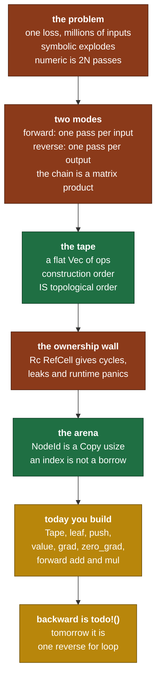

# Day 9 — The tape: autograd architecture ⏱ 2-day card. The hardest one.

> **Read this file. It replaces the book for today.**
> The page numbers stay as optional depth. This lesson teaches the same material in my own words.
> Tick your boxes in [`RUST_TRACKER.md`](../RUST_TRACKER.md). This file holds no checkboxes.
> The short card is [`RUST_PHASE_0_1.md` Day 9](../RUST_PHASE_0_1.md#day-9--the-tape-autograd-architecture--2-day-card-the-hardest-one).

**Time: 5 hours across 2 days. Claim: R0b. File you create: `src/autograd.rs`.**
**Your tests are written: move `rust/tests/pending/day9.rs` to `rust/tests/day9.rs` at the start of the session.**
**Spend day one on paper. Design first, type second. That instruction is on the card and it is not decoration.**

---

## 1. Why this day exists

Everything before today was arithmetic you can check by hand. Today you build the machine that computes derivatives of arithmetic you did not write down.

Two things make this the hardest card in the project.

**The mathematics is easy and unfamiliar.** Reverse-mode automatic differentiation is the chain rule plus bookkeeping. There is no hard theorem. There is a change of viewpoint, and until it lands the whole thing looks like magic.

**The data structure is where Rust says no.** Every autograd tutorial you have read builds a graph of nodes that point at their parents. In Python that is five lines. In Rust it is a cycle, and cycles are the one shape the ownership model refuses to make pleasant. You will want to fight it. **Do not fight it. Rust is right here, and the design it pushes you into is the design PyTorch actually uses.**

Today you build the structure and the forward path. `backward` stays `todo!()` until tomorrow. That split is deliberate: a tape whose shape is wrong makes tomorrow impossible, and a tape whose shape is right makes tomorrow a reverse `for` loop.

### 1.1 What breaks later if you get this wrong

| If this is wrong | What breaks | Day |
|---|---|---|
| Nodes hold `Rc<RefCell<_>>` parents | Runtime `already mutably borrowed` panics, and every graph leaks | today |
| The tape is not in construction order | `backward` needs a topological sort and a visited set | Day 10 |
| The tape does not store forward values | Every backward rule that needs its inputs is impossible | Day 10, Day 11 |
| `NodeId` is not `Copy` | Every op call moves its argument, so nothing composes | today |
| `Op` is not an exhaustive enum | `all_ops_gradchecked` cannot be made to fail when you add an op | Day 14 |
| Parameters cannot be re-fed into a fresh tape | The training loop has no shape | Day 14, Phase 2 |
| The tape holds tensors by value with no plan | A 124M GPT-2 forward pass exhausts memory | Day 22 |

### 1.2 The map of today



---

## 2. Reverse-mode differentiation, from first principles

### 2.1 The shape of the problem

Training needs one number for every parameter: how the loss changes when that parameter changes.

```text
   L  =  f(θ₁, θ₂, ..., θₙ)          one output, n inputs

   you need   ∂L/∂θ₁ , ∂L/∂θ₂ , ... , ∂L/∂θₙ       all n of them

   for GPT-2 small,  n = 124,000,000
```

Three methods exist. Two of them fail at this size.

| Method | How it works | Why it fails here |
|---|---|---|
| **Symbolic** | Build the algebraic expression for the derivative | The expression grows with every reused subterm. A 12-layer network gives an expression larger than memory. |
| **Numeric** | `[f(θ+h) − f(θ−h)] / 2h`, once per parameter | Two forward passes per parameter. 248 million forward passes for one gradient. Also inexact. |
| **Automatic** | Apply the chain rule to the recorded primitive steps | One forward pass, one backward pass, for **all** n at once. Exact to float precision. |

Automatic differentiation is not numeric differentiation, and it is not symbolic differentiation. It is a third thing, and the distinction matters: **AD differentiates the program, not the formula.** Day 12 builds the numeric method anyway, as an oracle, and never as the working method.

### 2.2 Two modes, and why one of them wins

Write your program as a chain of steps.

```text
   x  ──f₁──▶  a  ──f₂──▶  b  ──f₃──▶  L
```

Each step has a Jacobian: the matrix of partial derivatives of its outputs against its inputs.

```text
   J₁ = ∂a/∂x     shape [dim a, dim x]
   J₂ = ∂b/∂a     shape [dim b, dim a]
   J₃ = ∂L/∂b     shape [dim L, dim b]
```

The chain rule for the whole program is one matrix product.

```text
   ∂L/∂x  =  J₃ · J₂ · J₁
```

Matrix multiplication is associative, so the **value** does not depend on the order you evaluate it in. The **cost** depends on it completely. This is the matrix-chain problem, and the whole of automatic differentiation is the answer to it.

```text
   forward mode              reverse mode
   evaluate right to left    evaluate left to right

   (J₃ · (J₂ · J₁))          ((J₃ · J₂) · J₁)

   starts from a COLUMN      starts from a ROW
   one pass per column of    one pass per row of
   the input                 the output
```

Now count, for a network with `n` inputs and `m` outputs.

| | Forward mode | Reverse mode |
|---|---|---|
| Passes needed | `n`, one per input | `m`, one per output |
| For GPT-2 training, `n = 124e6`, `m = 1` | 124 million passes | **1 pass** |
| Memory | small, no history kept | the whole forward history |
| Good for | few inputs, many outputs | many inputs, few outputs |

**Machine learning always has one output.** The loss is a single number. That is the entire reason every framework uses reverse mode, and it is why you build a tape today and not a dual-number type.

The price is in the memory row. Reverse mode walks backwards, so every intermediate value from the forward pass must still exist when the backward pass reaches it. **That storage is the tape.**

The card's second self-check asks you what `backward` needs from you when the output is not a single number. Section 2.6 gives the mechanism. Answer it on paper, not here.

### 2.3 A tape is the program, written flat

Take an expression with three leaves and no reuse.

```text
   f  =  (x + y) * z          with  x = 2,  y = 5,  z = 4
```

Record every primitive step in the order it happens, and give each result a number.

```text
   id | op            | inputs | forward value
   ---+---------------+--------+---------------
    0 | Leaf          |   -    |  2      (x)
    1 | Leaf          |   -    |  5      (y)
    2 | Leaf          |   -    |  4      (z)
    3 | Add(0, 1)     |  0, 1  |  7
    4 | Mul(3, 2)     |  3, 2  | 28
```

That table is the tape. Five entries, one `Vec`, no pointers.

Three properties fall out of it at once, and each one removes work you must otherwise write.

- **It is already sorted.** Node 4 uses node 3, and 3 < 4. Section 2.4 proves this is always true.
- **It is not a tree.** It is a list. The "graph" is the pattern of the `inputs` column, and you never traverse it as a graph.
- **The values are kept.** Node 3 holds 7. When the backward pass reaches node 4 it needs the forward value of node 2 to compute the gradient into node 3. That value is right there.

### 2.4 Construction order is topological order

This is the property that makes `backward` a `for` loop, so it is worth a proof.

```text
   Claim:  if node j uses node i as an input, then i < j.

   Why:    you cannot pass a NodeId to push() before you have it.
           You get a NodeId only as the return value of leaf() or push().
           So node i was pushed, and returned its id, before node j was
           built. Push appends, so ids increase. Therefore i < j.
```

The claim holds by construction and needs no check at runtime. And its consequence is the whole design:

```text
   for id in (0..tape.len()).rev() { ... }
```

Walking the `Vec` backwards visits every node **after** every node that consumes it. That is exactly the condition a reverse topological order must satisfy. So:

- No sort. The order is free.
- No visited set. Each index appears once.
- No recursion. No stack depth limit at 12 layers times 1024 tokens.

**Compare that to the tutorial version.** A graph of nodes needs a depth-first search, a visited set, and a recursion that overflows the stack on a deep network. The tape deletes all three. That is not a convenience. It is evidence that the tape is the right shape for the problem.

### 2.5 The wall: why `Rc<RefCell<Node>>` fails

Every micrograd-style tutorial builds this:

```text
   struct Node { value: f64, grad: f64, prev: Vec<Rc<RefCell<Node>>> }
```

It compiles. Then two things go wrong, and neither is a beginner mistake.

**Fault one: cycles, so the memory never frees.**

```text
       +------------------+
       |  Node A          |  Rc count = 2
       |  prev: [ ------> |----+
       +------------------+    |
                               v
       +------------------+    |
       |  Node B          |<---+   Rc count = 2
       |  prev: [ ------> |----+
       +------------------+    |
              ^                |
              +----------------+

   You drop your last handle. Both counts fall to 1, not 0.
   Neither node frees. Rc has no cycle collector, by design.
   Every training step leaks a whole graph.
```

You avoid cycles only if you never let a child point back at a parent. Backward propagation wants exactly that pointer. So you keep two directions of edges, and then you own a consistency problem no type checks for you.

**Fault two: the borrow check moves to runtime, and then fails.**

`RefCell` does not remove the borrow rules. It moves them from compile time to runtime. `borrow_mut()` panics when another borrow is live.

```text
   node.borrow_mut().grad += contribution;
   //   ^ mutable borrow of node is live for this whole statement

   // now inside the contribution expression you read a parent, and the
   // parent is the same node through a different Rc. Second borrow.
   // Result: thread panicked at 'already mutably borrowed: BorrowError'
```

The aliasing that makes this happen is not visible in the source. It depends on the shape of the graph the user built. You get a panic that reproduces on one model and not another.

**The honest summary.** `Rc<RefCell<T>>` is the right tool when you need shared mutable state with a genuinely dynamic, acyclic shape. An autograd graph is neither acyclic in use nor dynamic in shape. It is a list. Reaching for `Rc<RefCell<_>>` here is choosing the tool that hides the list.

If you want to feel the wall, build it. It costs one day and you will never forget it. That is a legitimate choice, and the card says so. Say out loud which one you chose.

### 2.6 The arena, and why an index is not a borrow

Replace every pointer with a `usize` index into one `Vec`.

```text
   Tape                                   an Rc graph
   ------------------------------         ------------------------------
   ops:      [Leaf, Leaf, Add(0,1)]       Node -> Rc -> Node -> Rc -> ...
   values:   [ 2.0,  5.0,   7.0  ]
   grads:    [None, None,  None  ]        each Rc is 8 bytes plus 16
   requires: [true, true,  true  ]        bytes of counts, scattered
                                          across the heap

   one allocation per Vec                 one allocation per node
   contiguous, cache friendly             a pointer chase per edge
   NodeId(2) is 8 bytes and Copy          Rc<RefCell<Node>> is 8 bytes
                                          and Clone with a side effect
```

The key sentence: **an index is not a borrow.** `NodeId(3)` does not keep node 3 alive, does not stop node 3 from being mutated, and does not participate in the borrow check at all. It is a number. All the reference-counting problems disappear because there are no references.

Three real costs come with it, and you take them knowingly.

| Cost | What it looks like | Why you accept it |
|---|---|---|
| Every op needs `&mut Tape` | `add(&mut tape, x, y)` instead of `x + y` | The dependency was always there. The arena makes it visible. |
| An id from one tape can index another | `tape_b.value(id_from_tape_a)` gives garbage or panics | A newtype per tape is possible and not worth it. Document the rule. |
| Nothing is freed until the whole tape drops | Memory is the peak, not the average | You drop the tape after each step. Section 2.9. |

The first cost is the one you feel all week. It disappears once you wrap the ops in helper functions, and it never disappears fully. That clumsiness is the honest price of explicit ownership, and the card says so plainly.

### 2.7 Four parallel `Vec`s, not one `Vec` of structs

The card fixes the layout:

```text
   ops:      Vec<Op>                 what each node is
   values:   Vec<Tensor<T>>          the forward result of each node
   grads:    Vec<Option<Tensor<T>>>  filled by backward
   requires: Vec<bool>               does this node need a gradient
```

**The invariant: all four have the same length, and index `i` in each one describes node `i`.** Every method you write today either changes all four together or reads one. Write that sentence as a comment above the struct, because it is the thing a later reader needs.

The alternative is `Vec<Node<T>>` with four fields. Both work. The parallel form has two properties that matter here:

- `zero_grad` touches only `grads`. It never loads the values or the ops into cache.
- The backward loop reads `ops[i]` and `values[i]` and writes `grads[j]`. Splitting the borrows of three different `Vec`s is easier than splitting three fields of one element that you also index mutably. You meet this on Day 10, and section 3.5 previews it.

`Option<Tensor<T>>` for the gradient is a real choice and not a wrapper for tidiness. `None` means "no gradient has reached this node yet". `Some(zeros)` means "a gradient reached it and it summed to zero". Those are different states, and Day 10 needs to tell them apart to know whether it is starting an accumulation or continuing one.

### 2.8 `requires_grad`, and what it prunes

A leaf that is training data does not need a gradient. A leaf that is a parameter does.

```text
      x (data, requires=false)      w (param, requires=true)
              \                      /
               \                    /
                +----- MatMul -----+       requires = false OR true = true
                        |
                       Add  <---- b (param, requires=true)
                        |
                       Loss
```

The rule for a non-leaf node: **it requires a gradient when any input requires one.** Compute that at `push` time, once, and store it. Then the backward pass skips whole subtrees with one boolean test.

For your Phase 0 tests almost everything requires a gradient, so this saves nothing today. It pays at Day 22, where the token embeddings are data and the weights are parameters, and it pays again at inference, where nothing requires a gradient and the tape stops recording work it will never use.

### 2.9 What the tape costs

The tape holds every intermediate tensor. That is not a small number.

```text
   GPT-2 small forward pass, batch 1, sequence 1024:

     hidden state per layer     1024 x 768 x 4 bytes   =  3.1 MB
     a block keeps roughly 10 intermediates            = 31 MB
     12 blocks                                         = 375 MB
     the attention scores       12 heads x 1024 x 1024 x 4 = 50 MB per layer

   The tape is bigger than the parameters, and it grows with the batch
   size and with the square of the sequence length.
```

Two consequences you design for now, not later.

- **The tape is per step, not per model.** Build it, run forward, run backward, read the gradients, drop the whole thing. The next step builds a fresh one. This is why Day 14's optimizer takes parameters as tensors it owns and re-feeds them as leaves each step. That signature looks strange until you see this paragraph.
- **`values` is why gradient checkpointing exists.** Real frameworks throw intermediate values away and recompute them in the backward pass, trading time for memory. You do not build that. You now know the name of the thing you did not build, and why it exists.

### 2.10 The forward helpers

The tape is a recorder. It does not know what `add` means. The op helper does two things in order:

```text
   1. compute the forward value with the Day 4 tensor code you already have
   2. push (the Op, that value) onto the tape, and return the new NodeId
```

That split is the whole architecture. **The tensor library knows arithmetic and nothing about gradients. The tape knows gradients and nothing about arithmetic.** Keep it. The moment `Tensor` grows a `grad` field, you have merged two concerns that Day 12 needs separated, because the gradient checker builds tensors that must never record anything.

---

## 3. The Rust you need today

Every example is on data with no connection to tensors.

### 3.1 An enum with data is a closed set of shapes

```rust
#[derive(Debug, Clone, PartialEq)]
enum Delivery {
    Pending,                                   // no data
    Dispatched(u32),                           // tuple variant: a courier id
    Delivered { at_hour: u8, signed: bool },   // struct variant: named fields
}
```

Three facts that decide your `Op` design.

**One.** The size of the enum is the size of its largest variant plus a tag. `Delivery` is as big as `Delivered` plus a discriminant, even when the value is `Pending`. So one big variant makes every value big. Your `Op` has a `Sum { input, axis, keepdim }` and a `Broadcast { input, from: Vec<usize> }`. A `Vec` is 24 bytes, so that variant sets the floor for all of them.

**Two.** A `match` with no wildcard arm is checked for exhaustiveness. Add a variant and every such `match` fails to compile until you handle it.

```rust
fn status(d: &Delivery) -> &'static str {
    match d {
        Delivery::Pending => "waiting",
        Delivery::Dispatched(_) => "on the way",
        Delivery::Delivered { .. } => "done",
        // no `_ =>` arm. Add a variant and this function stops compiling.
    }
}
```

**Write down that this is a feature.** Day 14 needs a test that fails when you add an op and forget its gradient check. A wildcard arm in the backward pass destroys that guarantee silently. Never write `_ =>` in the backward match.

**Three.** Pattern matching binds the data out.

```rust
fn courier(d: &Delivery) -> Option<u32> {
    match d {
        Delivery::Dispatched(id) => Some(*id),        // `id` is &u32, so deref
        _ => None,
    }
}
```

### 3.2 A newtype index over a `Vec`

```rust
#[derive(Clone, Copy, PartialEq, Eq, Debug)]
struct TicketId(usize);

struct Counter {
    names:  Vec<String>,
    prices: Vec<u32>,
}

impl Counter {
    fn add(&mut self, name: &str, price: u32) -> TicketId {
        let id = TicketId(self.names.len());     // the id is the index it WILL have
        self.names.push(name.to_string());
        self.prices.push(price);
        id
    }

    fn price(&self, id: TicketId) -> u32 {
        self.prices[id.0]        // .0 reaches the inner usize
    }
}
```

Four things to copy into your design.

- **`Copy` is not optional.** Without it, `counter.price(id)` moves `id`, and the next line cannot use it. Every op takes ids and returns an id, so a non-`Copy` id makes composition impossible. The card lists `nodeid_is_copy` as a test for exactly this reason.
- **`Eq` gives you `==`.** The tests compare ids. `f64` cannot derive `Eq`, but `usize` can, so take it.
- **The id is computed before the push.** `self.names.len()` is the index the new item takes.
- **A newtype costs nothing at runtime.** `TicketId` compiles to a bare `usize`. You get the type safety of a distinct type for free, so a `TicketId` never gets used where a plain count was meant.

### 3.3 Why the inner field stays private

```rust
pub struct TicketId(usize);          // the field is private outside this module
pub struct TicketId(pub usize);      // the field is public. Now anyone can forge one.
```

Keep it private. Then the only source of a `NodeId` is your own `leaf` and `push`, and an id can only name a node that exists. Add a method when a test needs the number:

```rust
impl TicketId {
    pub fn index(self) -> usize { self.0 }    // read-only, and no way back
}
```

That is one-way. A test can read the number. Nobody can build a `TicketId` out of a number they invented.

### 3.4 A `Vec` is an arena

An arena is a region you allocate into and free all at once. `Vec` already is one.

```rust
let mut counter = Counter { names: Vec::new(), prices: Vec::new() };
let a = counter.add("Pune",      120);
let b = counter.add("Ahmedabad", 340);
// `a` and `b` are plain numbers. Neither keeps anything alive.
drop(counter);      // both Vecs free in one go. No counts, no cycles.
```

One trap comes with it, and it is the trap of the day:

```text
   `counter` grows. A push can reallocate the Vec and move every String.
   Any &String you held across that push is invalidated.

   The borrow checker catches this. It is the reason you index by number
   inside the loop instead of holding a reference across a push.
```

### 3.5 The borrow split you will meet tomorrow

Read this now. It arrives tomorrow and it costs an hour if it is a surprise.

```rust
struct Ledger { debits: Vec<u32>, credits: Vec<u32> }

impl Ledger {
    fn settle(&mut self) {
        for i in 0..self.debits.len() {
            // Two DIFFERENT fields. The compiler splits the borrow. This is fine.
            self.credits[i] += self.debits[i];
        }
    }

    fn broken(&mut self) {
        // ERROR: `self.debits` is borrowed immutably by the iterator,
        // and `self.credits` needs &mut self through a method call.
        for d in self.debits.iter() {
            self.bump(*d);           // <- takes &mut self, so the whole struct
        }
    }

    fn bump(&mut self, x: u32) { self.credits[0] += x; }
}
```

The rule: **the compiler splits borrows across fields, and never across a method call.** `self.credits[i] += self.debits[i]` works. `self.method()` inside a loop over `self.field` does not. Tomorrow's backward pass reads `values[i]` and writes `grads[j]` in the same statement, and the fix is field access, not a helper method that takes `&mut self`.

### 3.6 Book pages

*Programming Rust*: "Enums with Data" p. 214, "Rich Data Structures Using Enums" p. 216, "Tuple-Like Structs" p. 196, "Interior Mutability" p. 205, and "Taking Arms Against a Sea of Objects" p. 121.

**Read p. 121 twice.** It describes this exact problem, in the author's words, before you met it. Read pp. 114–122 and pp. 211–218 as the prereq.

---

## 4. What you build today

### 4.1 The structure, from the card

```rust
// src/autograd.rs
#[derive(Clone, Copy, PartialEq, Eq, Debug)]
pub struct NodeId(usize);

#[derive(Clone, Debug, PartialEq)]
pub enum Op {
    Leaf,
    Add(NodeId, NodeId),
    Mul(NodeId, NodeId),
    MatMul(NodeId, NodeId),
    Sum { input: NodeId, axis: usize, keepdim: bool },
    Broadcast { input: NodeId, from: Vec<usize> },
    Exp(NodeId), Ln(NodeId), Tanh(NodeId), Neg(NodeId),
    // extended on Days 13, 18, 21
}

pub struct Tape<T: Scalar> {
    ops:      Vec<Op>,
    values:   Vec<Tensor<T>>,
    grads:    Vec<Option<Tensor<T>>>,
    requires: Vec<bool>,
}

impl<T: Scalar> Tape<T> {
    pub fn new() -> Self;
    pub fn leaf(&mut self, t: Tensor<T>, requires_grad: bool) -> NodeId;
    pub fn push(&mut self, op: Op, value: Tensor<T>) -> NodeId;
    pub fn value(&self, id: NodeId) -> &Tensor<T>;
    pub fn grad(&self, id: NodeId) -> Option<&Tensor<T>>;
    pub fn backward(&mut self, root: NodeId);   // root must be scalar
    pub fn zero_grad(&mut self);
}
```

**Today: `new`, `leaf`, `push`, `value`, `grad`, `zero_grad`, and the forward `add` and `mul`. `backward` stays `todo!()`.**

### 4.2 Four additions the tests need, and the argument for each

The card's API is closed. A test can put nodes in and read values out, and it can observe nothing about the structure. So `tape_records_in_order` cannot be written. Five small additions fix that, and each one is defensible on its own.

| Addition | Why it is not test-only scaffolding |
|---|---|
| `pub fn len(&self) -> usize` | The node count is the size of the graph. Any profiler, any memory report and any debug print needs it. |
| `pub fn is_empty(&self) -> bool` | Clippy demands it beside `len`. Take the warning seriously and add it. |
| `pub fn op(&self, id: NodeId) -> &Op` | The tape is a record. A record you cannot read back is a write-only log. Day 14's `all_ops_gradchecked` enumerates ops through this. |
| `pub fn index(self) -> usize` on `NodeId` | The one-way door from section 3.3. A test prints an id, and nobody forges one. |
| `pub fn requires_grad(&self, id: NodeId) -> bool` | The `requires` rule in section 4.4 is computed, not given. A computed value nobody can read back is a value nobody can check. |

`Op` also derives `Debug`, `Clone` and `PartialEq`. `Debug` is needed by `assert_eq!`. `PartialEq` lets a test assert the wiring without a hand-written match.

**These are decisions, not facts.** If you argue one of them down, the test file changes with it, and that is the correct outcome. Say which one and why.

### 4.3 The forward helpers, and where they live

```rust
// Free functions, not methods on Tape. The tape records. It does not compute.
pub fn add<T: Scalar>(tape: &mut Tape<T>, x: NodeId, y: NodeId) -> NodeId;
pub fn mul<T: Scalar>(tape: &mut Tape<T>, x: NodeId, y: NodeId) -> NodeId;
```

Each one does the two steps from section 2.10: compute with the Day 4 tensor op, then `push`. Nothing else.

**One design point to decide and record in the commit message.** `Tensor::add` returns `Result<Tensor<T>, ShapeError>` because shapes can disagree. What does the tape helper do with that error?

```text
  option 1   add(...) -> Result<NodeId, ShapeError>    every op call needs a ?
  option 2   add(...) -> NodeId, and panic on a shape error
  option 3   push an error state onto the tape and carry it
```

Argue it with the Day 2 rule about bugs against states, and with this fact: a shape error inside a model is always a bug in the model definition, and it is never data-dependent. Whichever you pick, the whole file follows it.

**A second design point.** Does `push` compute the forward value, or take it? The card's signature takes it. That means `push` cannot be wrong about arithmetic, and it also means nothing stops a caller pushing an `Add` node with a value that is not a sum. Note the risk. Do not fix it today.

### 4.4 The `requires` rule

For a leaf, `requires` is the caller's argument. For any other node, it is `true` when any input has it `true`. Compute it inside `push` by reading the inputs out of the `Op`, so no caller can get it wrong.

That needs a way to list the inputs of an `Op`. A small private helper that matches on `Op` and returns the input ids is the natural shape, and Day 10 uses the same match for the backward rules. Write it once.

---

## 5. The tests, and the trap in each one

```bash
mv tests/pending/day9.rs tests/day9.rs
cargo test --test day9
```

| Test | What it traps |
|---|---|
| `tape_records_in_order` | Wiring. It builds two ops over three leaves, then asserts the node count and asserts that the second op's inputs name the first op's node and the right leaf. A tape that stores the values but drops the edges passes every other test and fails this one. |
| `nodeid_is_copy` | A missing `#[derive(Copy)]`. The test uses one id twice in a row. Without `Copy` it fails to compile, so this test is a compile-time assertion in the shape of a runtime one. |
| `value_roundtrip` | The offset between the id and the slot. It pushes several leaves and reads each one back, so an off-by-one in `leaf` cannot hide behind a single-element tape. It also checks `requires` propagation and `zero_grad` on a fresh tape. |

`backward` is `todo!()` today, so no test calls it. `todo!()` panics, and a test that touches it fails for the wrong reason.

---

## 6. Order of work

**Day one — paper. Write no code until step 5.**

1. Read section 2 end to end. Then close this file and write the tape for the expression in self-check 1 from memory. Every node, its op, its inputs, its value.
2. Do the backward walk of that tape by hand, with no code and no rules from tomorrow's lesson. Work out what each node contributes to each of its inputs. **This paper is tomorrow's first test.** Photograph it into `hand_math/`.
3. Write the `Op` enum on paper. For each variant, write which inputs it has and which forward values its gradient will need. That second column decides what `values` must store.
4. Decide the three open points: the `Result` question in 4.3, the `push` question in 4.3, and whether you want to build the `Rc<RefCell<_>>` version first to feel the wall. Write the decisions down.

**Day two — typing.**

5. Move the test file. Run `cargo test --test day9`. That is the red.
6. Create `src/autograd.rs`. Add `pub mod autograd;` to `src/lib.rs`.
7. Write `NodeId` with its derives, and `Op` with its derives. Make `nodeid_is_copy` pass. **Commit.**
8. Write `Tape` with the four `Vec`s and the invariant comment. Write `new`, `len`, `is_empty`.
9. Write `leaf`, `value`, `grad` and `op`. Make `value_roundtrip` pass.
10. Write the private input-listing helper, then `push` with the `requires` rule.
11. Write `add` and `mul`. Make `tape_records_in_order` pass. **Commit.**
12. Write `zero_grad`. Write `backward` as `todo!()` with a comment naming tomorrow.
13. Run `cargo clippy`. Fix every warning. `Default` beside `new` is one it will ask for. **Commit.**

**The natural stopping point is the end of day one.** If you have written the tape on paper and made the decisions, the day is a success even with zero lines of Rust. The card gives this two days for exactly that reason.

---

## 7. Compiler errors you will meet today

| Symptom | What it means | Where to look |
|---|---|---|
| `E0382: use of moved value: id` | `NodeId` is missing `Copy`. | The derive list on `NodeId`. |
| `E0369: binary operation == cannot be applied to type Op` | `assert_eq!` needs `PartialEq`. | The derive list on `Op`. |
| `E0277: Op doesn't implement Debug` | `assert_eq!` prints on failure, so it needs `Debug`. | The same derive list. |
| `E0499: cannot borrow *self as mutable more than once` | You called a `&mut self` method inside a loop that already borrows `self`. | Section 3.5. Use field access. |
| `E0502: cannot borrow self.values as immutable ...` | The same cause through an index. | Section 3.5. |
| `E0004: non-exhaustive patterns` | You added an `Op` variant and a `match` does not handle it. | This is the enum working. Handle the variant. Never add `_ =>`. |
| `E0507: cannot move out of index of Vec<Tensor<T>>` | You wrote `self.values[i]` where a value is needed. `Tensor` is not `Copy`. | Borrow it, or `.clone()` and say why. |
| `clippy: new without Default` | Clippy wants `impl Default for Tape`. | Add it. It is two lines and it is correct. |
| **Not a compiler error:** `tape_records_in_order` gives one node too many | `push` also pushed the inputs, or `leaf` was called twice for one tensor. | Count the `push` calls in `add`. There must be exactly one. |
| **Not a compiler error:** `requires` is false on a node with a parameter input | The `requires` rule reads the leaf flag and not the inputs. | Section 4.4. |
| **Runtime:** `not yet implemented` | Something called `backward`. It is `todo!()` until tomorrow. | The call site. No test calls it today. |

---

## 8. Self-check — on paper, before you close the laptop

I answer neither of these. Both go in `hand_math/`.

1. **Build and walk a tape by hand.** Write the tape for `f = (a + b) * a` with `a = 2` and `b = 3`. Write every node, its op, its inputs and its forward value. Then compute `∂f/∂a` two ways: symbolically from the algebra, and by a backward walk of your tape. Both give 7. **Keep this paper. It is tomorrow's first test**, and the value of node `a` being used twice is the whole point of choosing this expression.
2. **The scalar root.** Why can `backward` require its root to be a single number? What does differentiation of a vector-valued output even mean, written as a Jacobian? What must you supply to the backward pass instead, and what shape is it? Section 2.2 gives you the matrix-chain picture. Finish the argument yourself.

---

## 9. Stuck-signals — the points where you ask

- You spent an hour on `Rc<RefCell<Node>>` and now you hit `already mutably borrowed`. **Stop immediately.** That is the wall in section 2.5. Switch to the arena, or ask. I give you the shape of the fix, never the code.
- The borrow checker rejects `push` and every rearrangement fails. **Ask after 30 minutes.** Bring the exact error and the signature you tried.
- You cannot decide the `Result` question in section 4.3 after 20 minutes. **Ask.** State which option you lean to and what worries you about it. That question has no single right answer, and arguing it is the point.
- `tape_records_in_order` fails on the node count and you cannot see where the extra node comes from. **Ask after 20 minutes.**
- You want a `Tensor` with a `grad` field, or an operator overload so you can write `x + y`. Stop. Read section 2.10. The separation is load-bearing for Day 12, and operator overloading needs an ambient tape that Rust has no clean way to give you.
- **Day one ended and you have written no code.** That is not a stuck-signal. That is the plan.

---

## 10. The post

The hook is at the end of the [Day 9 card](../RUST_PHASE_0_1.md#day-9--the-tape-autograd-architecture--2-day-card-the-hardest-one), written in your voice. Ship it on the second day. The honest version of it names how long you spent on the design before you typed.

---

## 11. Done means all six

1. `cargo test` passes, with Days 1 to 9 green.
2. `cargo clippy` gives no warnings.
3. `backward` exists as `todo!()`, with a comment naming the day that fills it.
4. The hand-built tape for `f = (a + b) * a` is photographed into `hand_math/`, with the backward walk on it.
5. The commit message records the three design decisions from section 4.
6. The post is public, and `PROGRESS.md` records what is proven and names nothing else.
