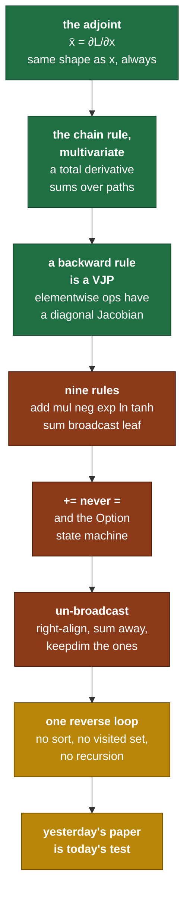

# Day 10 — Backward for elementwise and broadcast

> **Read this file. It replaces the book for today.**
> The page numbers stay as optional depth. This lesson teaches the same material in my own words.
> Tick your boxes in [`RUST_TRACKER.md`](../RUST_TRACKER.md). This file holds no checkboxes.
> The short card is [`RUST_PHASE_0_1.md` Day 10](../RUST_PHASE_0_1.md#day-10--backward-for-elementwise-and-broadcast).

**Time: 3 hours. Claim: R0b. File you extend: `src/autograd.rs`.**
**Your tests are written: move `rust/tests/pending/day10.rs` to `rust/tests/day10.rs` at the start of the session.**
**Bring yesterday's paper. The hand-walked tape for `f = (a + b) * a` is the first test.**

---

## 1. Why this day exists

Yesterday you built the recorder. Today you play it backwards.

The whole backward pass is a `for` loop over a `Vec` in reverse, with one `match` arm per operation. There is no graph traversal, no visited set and no recursion, because Day 9's construction order already sorted the work. If today feels like a lot of code, the tape is the wrong shape and you go back to Day 9.

What is genuinely hard today is not the loop. It is two rules that look like details and are not:

- **A gradient accumulates. It never assigns.** One character decides whether your network trains or quietly learns the wrong thing.
- **The backward of a broadcast is a sum.** Get it wrong and every gradient has the right shape and a factor-of-N error, which no shape check can catch.

Both faults produce code that runs, trains, and is quietly worse. Day 12 builds the only tool that catches them.

### 1.1 What breaks later if you get this wrong

| If this is wrong | What breaks | Day |
|---|---|---|
| `=` instead of `+=` on a gradient | Weight tying, residual connections and any reused activation get a fraction of their real gradient | Day 21 residuals, Day 22 |
| Broadcast backward does not sum | Every bias gradient is wrong by the batch size | Day 17 embeddings, Day 21 |
| `Sum` backward does not restore the reduced axis | LayerNorm's mean and variance paths give shape errors | Day 18 |
| The reverse loop skips nodes with `requires == false` incorrectly | Parameters silently get no gradient and never move | Day 14 |
| `tanh` backward recomputes instead of reusing the forward value | Correct, and about twice the cost of the whole backward pass | Phase 2 |
| The root is not seeded | Every gradient is `None`, and it looks like a tape bug | today |

### 1.2 The map of today



---

## 2. The backward pass, from first principles

### 2.1 The adjoint

Fix one scalar output `L`. For every node `v` on the tape, define

```text
   v̄  =  ∂L/∂v
```

Read `v̄` as "the adjoint of v" or "the gradient at v". Two facts about it are worth stating as rules, because both catch bugs:

- **`v̄` has exactly the same shape as `v`.** A `[3, 4]` value has a `[3, 4]` gradient. Always. Any rule that produces a different shape is wrong, and a shape assertion after every accumulation is the cheapest test in the file.
- **`v̄` is a number, not a function.** It depends on the point the forward pass ran at. This is why the tape must keep the forward values, and it is why you cannot compute a backward pass twice from different starting values without rerunning forward.

The backward pass computes every `v̄` in one sweep. It starts at the root, where `L̄ = ∂L/∂L = 1`, and works down.

### 2.2 The chain rule, with more than one path

The one-variable chain rule is `dL/dx = (dL/du)(du/dx)`. It is not enough here, because a value can feed more than one later node.

The rule you actually need is the **total derivative**. If `L` depends on `x` through several intermediate values `u₁, u₂, ..., u_k`, then

```text
              k
   ∂L/∂x  =  Σ   (∂L/∂u_i) · (∂u_i/∂x)
             i=1
```

The sum is over every place `x` is used. That summation is the mathematical origin of every `+=` in today's code, and it is what self-check 2 asks you to make concrete.

Turn it around and it becomes a rule about the tape:

```text
   node i is consumed by nodes j₁, j₂, ..., j_k

   ī  gets one contribution from each consumer

   the reverse loop visits j₁ ... j_k before it visits i,
   because every consumer has a larger index (Day 9, section 2.4)

   therefore, when the loop arrives at i, ī is already complete
```

**That last line is the invariant of the whole algorithm.** When the loop reaches node `i`, every contribution to `ī` has already been added, so `ī` is final and it is safe to push it down to `i`'s own inputs.

### 2.3 What a backward rule is

Take one node: `y = f(x)`, with `x` of `n` elements and `y` of `m` elements. Its Jacobian is `[m, n]`.

```text
             ∂y₁/∂x₁   ∂y₁/∂x₂   ...   ∂y₁/∂xₙ
      J  =   ∂y₂/∂x₁   ∂y₂/∂x₂   ...   ∂y₂/∂xₙ
                ...
             ∂yₘ/∂x₁   ∂yₘ/∂x₂   ...   ∂yₘ/∂xₙ
```

The chain rule in matrix form gives the backward rule:

```text
   x̄ᵀ  =  ȳᵀ · J           a row vector times a matrix
```

**You never build `J`.** For a `[1024, 768]` activation the Jacobian has 620 billion entries. The backward rule computes the product `ȳᵀ · J` directly, and that product is called a **vector-Jacobian product**, or VJP. Every arm of your `match` today is one VJP.

For an elementwise operation the Jacobian is diagonal, and the VJP collapses to a multiply.

```text
   y_i = f(x_i)     each output depends on exactly one input

            f'(x₁)    0       0       0
     J  =     0     f'(x₂)    0       0            a diagonal matrix
              0       0     f'(x₃)    0
              0       0       0     f'(x₄)

   ȳᵀ · J   =   [ ȳ₁·f'(x₁) ,  ȳ₂·f'(x₂) ,  ȳ₃·f'(x₃) ,  ȳ₄·f'(x₄) ]

   which is just    x̄ = ȳ * f'(x)     elementwise
```

That is the whole reason elementwise backward rules are one line each. **The diagonal is doing the work, not the simplicity of the function.**

### 2.4 The nine rules, derived

Six of them are elementwise, so section 2.3 reduces each to "write `f'`".

**`Leaf`.** No inputs. The adjoint stops here, and this is where a parameter's gradient ends up. Nothing to propagate.

**`Neg`: `y = −x`.** `f'(x) = −1`, so `x̄ = −ȳ`.

**`Add`: `z = x + y`.** Two inputs. `∂z/∂x = 1` and `∂z/∂y = 1`, so `x̄ = z̄` and `ȳ = z̄`. An add is a **fan-out in reverse**: the same gradient goes to both inputs, unchanged.

**`Mul`: `z = x * y`.** Elementwise, so the product rule applies per element. `∂z_i/∂x_i = y_i`, so `x̄ = z̄ * y` and `ȳ = z̄ * x`. **Each input's gradient needs the other input's forward value.** That is the first rule today that reads `values`, and it is why Day 9 stored them.

**`Exp`: `y = exp(x)`.** `f'(x) = exp(x) = y`. So `x̄ = ȳ * y`, and you reuse the **output** value. No `exp` call in the backward pass. That is not a micro-optimisation: `exp` is one of the slowest scalar operations, and a transformer calls it once per attention score.

**`Ln`: `y = ln(x)`.** `f'(x) = 1/x`. So `x̄ = ȳ / x`, and you need the **input** value.

**`Tanh`: `y = tanh(x)`.** Derive it once, because the result is not obvious and it is used at Day 21 for GELU.

```text
                e^x − e^-x                  u
   tanh(x)  =  ------------   =   write as  -   with u = e^x − e^-x
                e^x + e^-x                  v              v = e^x + e^-x

   u' = e^x + e^-x = v          and       v' = e^x − e^-x = u

   quotient rule:

        d      u'v − uv'      v·v − u·u      v² − u²           u²
       --- =  ----------  =  -----------  =  -------  =  1 − -----
       dx        v²              v²             v²           v²

   and  u/v = tanh(x), so

       tanh'(x)  =  1 − tanh²(x)  =  1 − y²
```

So `x̄ = ȳ * (1 − y²)`, and you reuse the **output**.

Look at what that expression does at the ends. When `|x|` is large, `y` is near `±1`, so `1 − y²` is near zero and **the gradient dies**. That is saturation. It is not a bug and there is no fix inside the rule. Day 14's stuck-signal about a spiral loss stuck at `ln(2)` is this paragraph, four days later.

**`Sum`: `y = sum(x, axis)`.** Not elementwise, so go back to the definition. Every output element is a sum of many input elements, and each input appears in exactly one output with coefficient 1.

```text
   x is [2, 3],  sum over axis 1, keepdim = false,  y is [2]

   y₀ = x₀₀ + x₀₁ + x₀₂           ∂y₀/∂x₀ⱼ = 1  for every j
   y₁ = x₁₀ + x₁₁ + x₁₂           ∂y₁/∂x₁ⱼ = 1  for every j

   so   x̄₀ⱼ = ȳ₀   for every j,  and  x̄₁ⱼ = ȳ₁   for every j

   x̄  =  ȳ, copied along the reduced axis        shape [2] -> [2, 3]
```

**The backward of a sum is a broadcast.** One thing must be handled first. When `keepdim` was `false`, `ȳ` has rank one lower than `x`, and `broadcast_to` aligns from the trailing axis, so a plain broadcast puts the values in the wrong place. Reshape `ȳ` to insert the reduced axis back as size 1, and then broadcast. That reshape is the whole difficulty of this arm.

**`Broadcast`: `y = broadcast(x, shape)`.** The `Op` variant carries `from`, the original shape, because the backward rule cannot recover it from `y` alone.

The card states the result: the backward of a broadcast is a sum-reduction over the broadcast axes. **Self-check 1 asks you to derive that from first principles, so I stop here and give you only the procedure you need to implement it.** Section 2.6 is that procedure.

### 2.5 What each rule reads from the tape

Fill this table in your head before you write the `match`. It is the argument for everything Day 9 stored.

| Op | needs the input value | needs the output value | needs extra data |
|---|---|---|---|
| `Leaf` | no | no | no |
| `Add` | no | no | no |
| `Neg` | no | no | no |
| `Mul` | **yes, both inputs** | no | no |
| `Exp` | no | **yes** | no |
| `Ln` | **yes** | no | no |
| `Tanh` | no | **yes** | no |
| `Sum` | no | no | axis, keepdim |
| `Broadcast` | no | no | the source shape |

Two readings of the table are worth having.

- `Add` and `Neg` need nothing. Their backward is free of memory traffic, which is why residual connections are cheap.
- `Mul` needs both operand values live until the backward pass. That row, multiplied by every layer, is most of the tape's memory bill from Day 9 section 2.9.

### 2.6 Un-broadcasting, as a procedure

`ȳ` has the broadcast shape. `x̄` must have the source shape. Two things can differ: the rank, and the axes where the source was 1.

```text
   the Op recorded   from = [3, 1]
   the gradient is   ȳ    = [2, 3, 4]

   step 1   right-align the two shapes

                 ȳ      2   3   4
                 from   -   3   1
                        ^
                        an axis ȳ has and the source does not

   step 2   sum away every leading axis that the source does not have,
            with keepdim = false. One sum_axis(0, false) call here.

                 ȳ          3   4
                 from       3   1

   step 3   for each remaining axis where the source is 1 and ȳ is not,
            sum that axis with keepdim = true.

                 ȳ          3   1
                 from       3   1

   step 4   the shapes now match. Assert it. If they do not, stop.
```

Three traps live in this procedure.

- **Step 2 before step 3.** Do them the other way and the axis numbers shift under you after the first reduction.
- **`keepdim = true` in step 3, `false` in step 2.** They are different steps for a reason, and one shared flag gives shapes that are wrong by a rank.
- **A source axis of 1 where `ȳ` is also 1 is not summed.** Nothing was broadcast there, and summing it is harmless in value and wrong in shape if `keepdim` is false.

Write this as one private function. `Sum` backward and `Broadcast` backward are the only arms that touch shapes, and both call into shape work you already own from Days 4 and 5.

### 2.7 Accumulation, and the `Option` state machine

`grads` is `Vec<Option<Tensor<T>>>`, and the two states mean different things.

```text
   None            no gradient has reached this node yet
   Some(t)         a gradient reached it, and the running total is t
```

The accumulate step is then:

```text
   accumulate(into: NodeId, contribution: Tensor<T>)

       assert  contribution.shape() == values[into].shape()

       match grads[into]
           None      ->  store the contribution
           Some(g)   ->  store  g + contribution
```

**The card's rule is `+=`, never `=`.** Section 2.2 is why: a node with `k` consumers gets `k` contributions, and the total derivative is their sum. Self-check 2 asks you to build the smallest graph where assignment gives a wrong answer, and to state the wrong number. Build it. Do not take my word for the rule.

Two details that are not obvious.

- **The shape assertion belongs inside `accumulate`, not at each call site.** Every backward bug that is not a value bug is a shape bug, and one assertion in one place catches all of them with the node id in the message.
- **`None` is not `Some(zeros)`.** You cannot start with zeros, because you do not know the shape until the first contribution arrives, and allocating a zero tensor per node doubles the tape's memory for nodes that never receive a gradient.

### 2.8 The loop

Put the pieces together and the whole algorithm is:

```text
   backward(root):

     1. check the root is a scalar. Panic with a clear message if it is not.
        Self-check 2 of Day 9 is the argument for this line.

     2. seed:  grads[root] = ones with the root's shape

     3. for id in (0 .. len).rev():

            if requires[id] is false      -> skip
            if grads[id] is None          -> skip, no gradient reached here

            take the gradient at id
            match ops[id]:
                one arm per variant, no wildcard
                each arm calls accumulate() once per input
```

**Step 3's two skips are not the same skip.** The first says "nothing downstream of this node can need a gradient". The second says "this node is upstream of nothing that got one". Both are correct and both are needed, and confusing them gives a pass on every small test and a silent zero on a real model.

**Never write `_ =>` in this match.** Day 14 needs the compiler to break this function when you add an op. A wildcard arm turns that compile error into a silent missing gradient, which is the single most expensive class of bug in this project.

### 2.9 Three numerical traps in the rules

They are not compiler errors and no shape check finds them.

| Rule | The trap | What it looks like |
|---|---|---|
| `Ln` | `x̄ = ȳ / x` blows up as `x` goes to zero | `inf` or `NaN` gradients from a forward pass that looked fine |
| `Exp` | the forward value is already huge, and the backward multiplies by it | `inf` gradients, and the loss was finite |
| `Tanh` | saturation makes `1 − y²` underflow to zero | gradients that are exactly 0.0, and a loss that stops moving |

**`NaN` has a useful property: it spreads.** One `NaN` anywhere in a gradient reaches every parameter within one step. So when a training run turns to `NaN`, the fault is at the first `NaN`, and the way to find it is to check for a non-finite value after each backward step and stop there. Write that check when you need it, not now. Know that it exists.

---

## 3. The Rust you need today

All examples are on data with no connection to tensors.

### 3.1 Matching an enum and binding its data

```rust
#[derive(Debug, Clone)]
enum Fare {
    Flat(u32),
    PerKm { rate: u32, km: u32 },
    Free,
}

fn total(f: &Fare) -> u32 {
    match f {
        Fare::Flat(paise) => *paise,                  // `paise` is &u32
        Fare::PerKm { rate, km } => rate * km,        // both bound by name
        Fare::Free => 0,
    }
}
```

Three points that decide how your `match` arms read.

- Matching on `&Fare` binds each field by reference. `*paise` derefs a `&u32`. For a `Tensor` you do not deref, because that moves it out of the tape. You borrow, or you clone and say why.
- `Fare::PerKm { rate, .. }` binds one field and ignores the rest. `..` inside a struct variant is fine. `_ =>` as a whole arm is what you must not write today.
- The arms are checked for exhaustiveness. Add `Fare::Surge(u32)` and this function fails to compile. That is the property Day 14 depends on.

### 3.2 Reverse iteration

```rust
let stops = ["Panvel", "Karjat", "Lonavala", "Pune"];

for s in stops.iter().rev() {
    println!("{s}");            // Pune, Lonavala, Karjat, Panvel
}

for i in (0..stops.len()).rev() {
    println!("{}", stops[i]);   // the same order, by index
}
```

`.rev()` works on any `DoubleEndedIterator`, and a `Range` is one. **Note the parentheses in `(0..n).rev()`.** Without them the compiler parses `0..n.rev()` and gives an error about `rev` on an integer.

Today you need the **index** form, not the item form, because the loop body reads one `Vec` and writes another at a different index. The item form borrows the `Vec` for the whole loop and blocks that.

### 3.3 Accumulating into an `Option`

```rust
fn add_to(slot: &mut Option<String>, piece: &str) {
    match slot {
        None => *slot = Some(piece.to_string()),
        Some(existing) => existing.push_str(piece),
    }
}
```

There is a shorter form, and it is worth knowing:

```rust
fn add_to(slot: &mut Option<String>, piece: &str) {
    slot.get_or_insert_with(String::new).push_str(piece);
}
```

`get_or_insert_with` gives a `&mut` to the inner value, and it fills the slot with the closure's result when it is `None`. **You cannot use this form for tensors**, because there is no shape-free empty tensor to insert. The `match` form is the one your code needs, and that is a fact about your type, not a style choice.

### 3.4 The borrow split, and `std::mem::take`

This is the hour-costing problem of the day. Read it before you write the loop.

```rust
struct Warehouse {
    incoming: Vec<u32>,
    stored:   Vec<Option<Vec<u32>>>,
}

impl Warehouse {
    fn broken(&mut self) {
        for i in (0..self.stored.len()).rev() {
            // ERROR E0502: `self.stored` is borrowed mutably by the match,
            // and the arm needs another borrow of `self.stored` to write.
            match &mut self.stored[i] {
                Some(batch) => self.stored[0].as_mut().unwrap().extend(batch.iter()),
                None => {}
            }
        }
    }

    fn works(&mut self) {
        for i in (0..self.stored.len()).rev() {
            // take() swaps the slot for its default and gives you the value.
            // For Option<T> the default is None, so the slot is now free.
            let batch = std::mem::take(&mut self.stored[i]);

            if let Some(batch) = batch {
                // no borrow of self.stored is live here, so this is legal
                self.stored[0].get_or_insert_with(Vec::new).extend(batch);
            }
        }
    }
}
```

**The pattern: take the value out of the slot, then use the container freely.** `std::mem::take` needs `Default`, which `Option<T>` has for every `T`. `std::mem::replace(&mut slot, None)` does the same thing without the `Default` bound, and `Option::take()` is the same again with the shortest spelling.

Your backward loop is exactly this shape. Take `grads[id]`, match on `ops[id]`, and call `accumulate` on the inputs. Once the gradient is out of the `Vec`, writing back into the same `Vec` is legal.

**Do not clone the tape to escape this.** The clone is the size of the whole forward pass.

### 3.5 Book pages

*Programming Rust*: "Patterns" p. 221, "Tuple and Struct Patterns" p. 225, "Matching Multiple Possibilities" p. 229, "Reversible Iterators and rev" p. 339. Read pp. 221–233 as the prereq.

---

## 4. What you build today

### 4.1 The function

```rust
// src/autograd.rs
impl<T: Scalar> Tape<T> {
    /// Walks the tape in reverse and fills `grads`. `root` must be a scalar node.
    pub fn backward(&mut self, root: NodeId);
}
```

The signature is unchanged from Day 9. Today the `todo!()` becomes the loop from section 2.8, with one arm per `Op` variant.

You also need two private helpers. Their shapes, with no bodies:

```rust
impl<T: Scalar> Tape<T> {
    /// Adds `contribution` into the gradient of `into`. Never assigns.
    /// Panics when the shape does not match the node's value shape.
    fn accumulate(&mut self, into: NodeId, contribution: Tensor<T>);

    /// Reduces `grad` from the broadcast shape back to `from`.
    /// Section 2.6 is the procedure.
    fn unbroadcast(grad: &Tensor<T>, from: &[usize]) -> Tensor<T>;
}
```

`unbroadcast` takes no `self` on purpose. It is pure shape work, it needs nothing from the tape, and a free function is easier to test and easier to reuse at Day 11 for the batch axes.

### 4.2 The forward helpers you still owe

Day 9 built `add` and `mul`. A test cannot build a graph with an op that has no forward helper, so the rest land today, in the same shape as Day 9's two: compute with the Day 4 or Day 5 tensor method, then `push`.

```rust
pub fn neg<T: Scalar>(tape: &mut Tape<T>, x: NodeId) -> NodeId;
pub fn exp<T: Scalar>(tape: &mut Tape<T>, x: NodeId) -> NodeId;
pub fn ln<T: Scalar>(tape: &mut Tape<T>, x: NodeId) -> NodeId;
pub fn tanh<T: Scalar>(tape: &mut Tape<T>, x: NodeId) -> NodeId;
pub fn sum_axis<T: Scalar>(tape: &mut Tape<T>, x: NodeId, axis: usize, keepdim: bool) -> NodeId;
pub fn broadcast_to<T: Scalar>(tape: &mut Tape<T>, x: NodeId, shape: &[usize]) -> NodeId;

/// Reduces every axis away, one at a time, and gives a rank-0 node.
/// Every backward test needs a scalar root, so this one earns its place.
pub fn sum_all<T: Scalar>(tape: &mut Tape<T>, x: NodeId) -> NodeId;
```

`sum_all` pushes several `Sum` nodes and adds no `Op` variant. `broadcast_to` records the **source** shape in `Op::Broadcast { from }`, because section 2.6 cannot recover it from the result.

### 4.3 Design points to decide, and to record in the commit message

**One. What happens when `backward` is called on a non-scalar root?** A panic with a clear message is the honest answer, and Day 9's self-check 2 is the argument. Whatever you choose, the message must name the shape it got.

**Two. Does `backward` clear the old gradients first, or add to them?** PyTorch adds, which is why every training loop calls `zero_grad`. That choice enables gradient accumulation across micro-batches, and it also causes the most common beginner bug in the framework. You own both sides. Pick, and write one sentence of why.

**Three. Does `Mul` clone the operand values, or borrow them?** Borrowing needs the borrow split from section 3.4 to work through two `Vec`s at once. Cloning a `Tensor` is cheap in bytes, because Day 2 made it an `Rc` clone and not a data copy. **Check that claim in your own code before you rely on it.**

---

## 5. The tests, and the trap in each one

```bash
mv tests/pending/day10.rs tests/day10.rs
cargo test --test day10
```

| Test | What it traps |
|---|---|
| `backward_matches_paper` | The base case, against yesterday's hand derivation. It is the expression from Day 9's self-check, so a mismatch means either your code or your paper is wrong, and you must find out which before you touch anything else. |
| `diamond_accumulates` | `=` instead of `+=`. A node feeds two consumers, so a rule that assigns keeps only the last contribution the loop happened to write. It also checks a second, deeper reuse pattern in the same test, so a fix that special-cases the first shape still fails. |
| `broadcast_backward_sums` | The factor-of-N error. A broadcast backward that returns the gradient unchanged produces the right **shape**, so nothing else in the suite notices. It also runs a leading-axis case, which traps the step-2-before-step-3 ordering from section 2.6. |
| `zero_grad_clears` | A `zero_grad` that writes `Some(zeros)` instead of `None`. Both look cleared. Only one lets the next `accumulate` tell a fresh node from an accumulated one. |
| `sum_backward_restores_axis` | The `keepdim = false` reshape. A plain `broadcast_to` puts the values on the wrong axis whenever the reduced axis is not the last one. |

---

## 6. Order of work

1. Move the test file. Run `cargo test --test day10`. That is the red.
2. Put yesterday's paper next to the keyboard. **Do not start with the code.**
3. Write `accumulate`, with the shape assertion. Nothing else works without it.
4. Write the loop skeleton from section 2.8: the scalar check, the seed, the reverse range, the two skips, and an empty `match` with every arm as `todo!()`. It compiles and every test fails. That is progress.
5. Fill `Leaf`, `Add` and `Neg`. Three arms, no values read. **Commit.**
6. Fill `Mul`. This is the first arm that reads `values`, so this is where the borrow split from section 3.4 arrives. Make `backward_matches_paper` and `diamond_accumulates` pass. **Commit.**
7. Fill `Exp`, `Ln` and `Tanh`. Reuse the output for two of the three, and say in a comment which value each one reads.
8. Write `unbroadcast` on its own, with the procedure from section 2.6 open beside you. Test it in your head at `from = [3,1]`, `grad = [2,3,4]` before you wire it up.
9. Fill `Broadcast` and `Sum`. Make the last three tests pass.
10. Run `cargo clippy`. Fix every warning. **Commit.**
11. Do the self-check on paper. Photograph it into `hand_math/`.

The natural stopping point is after step 6. The three elementwise arms and the two shape arms are separate sittings, and the shape arms are the ones that need a clear head.

---

## 7. Compiler errors and logic faults you will meet today

| Symptom | What it means | Where to look |
|---|---|---|
| `E0502: cannot borrow self.grads as mutable because it is also borrowed as immutable` | The classic. You held a borrow of `values` or `grads` across the `accumulate` call. | Section 3.4. Take the value out first. |
| `E0499: cannot borrow *self as mutable more than once` | Two `&mut self` methods in one statement. | Split the statement. Bind the intermediate to a `let`. |
| `E0004: non-exhaustive patterns: Sum { .. } not covered` | An `Op` arm is missing. | Add the arm. Never add `_ =>`. |
| `E0507: cannot move out of index` | `self.values[i]` where an owned `Tensor` is needed. | Borrow, or clone with a comment. |
| `E0308: expected Tensor<T>, found Result<Tensor<T>, ShapeError>` | A tensor op returns `Result` and you used it directly. | `?` does not work in a function returning `()`. Use `expect` with a message that names the node id. |
| **Logic:** every gradient is `None` | The root was never seeded, or the seed shape is wrong. | Step 2 of section 2.8. |
| **Logic:** `diamond_accumulates` gives exactly the first term or exactly the last | `=` instead of `+=`. **Fix this one yourself.** | `accumulate`. |
| **Logic:** `broadcast_backward_sums` gives `[1,1,1,1]` | The `Broadcast` arm passes the gradient through unchanged. | Section 2.6. |
| **Logic:** the gradient is right for `axis = last` and wrong otherwise | The `keepdim = false` reshape in the `Sum` arm. | Section 2.4, last paragraph. |
| **Logic:** a parameter's gradient is `None` on a real graph and fine on a small one | The `requires` skip is testing the wrong node, or `push` never propagated `requires`. | Day 9, section 4.4. |
| **Logic:** the gradient is `NaN` and the forward value was finite | `Ln` near zero, or `Exp` of something large. | Section 2.9. |

---

## 8. Self-check — on paper, before you close the laptop

I answer neither of these. Both go in `hand_math/`.

1. **Derive the broadcast rule.** Take `y = broadcast([b₁, b₂], [3, 2])` and `L = sum(y)`. Write all six terms of `L` explicitly in terms of `b₁` and `b₂`. Compute `∂L/∂b₁` from first principles, with no rule from this lesson. Then state the general broadcast-backward rule in one sentence, in your own words. Section 2.6 gave you a procedure. This question asks for the reason the procedure is correct.
2. **Why accumulate.** Why must gradients accumulate instead of assign? Draw the smallest graph where assignment gives the wrong answer. It is smaller than `diamond_accumulates`. State the wrong answer that assignment produces, and the right one, as numbers.

---

## 9. Stuck-signals — the points where you ask

- `diamond_accumulates` fails with exactly `2x` or exactly `1`. **That is the `=` against `+=` fault. Fix it yourself.** If it fails with any other value, ask.
- The borrow checker rejects the `Mul` arm and three rearrangements have failed. **Ask after 30 minutes.** Bring the error and the arm.
- Every gradient is `None`. Check the seed first. **Ask after 15 minutes.** This one has two causes and both are in section 2.8.
- `broadcast_backward_sums` passes for a trailing axis and fails for a leading one. That is the step ordering in section 2.6. **Ask after 20 minutes.**
- A gradient shape mismatch fires inside `accumulate` and you cannot tell which node. **Ask after 10 minutes.** The assertion message must carry the node id and both shapes. If it does not, fix the message first, and then you probably do not need to ask.
- You want to write `_ =>` to make it compile. Stop. Read section 2.8, last paragraph.

---

## 10. The post

The hook is at the end of the [Day 10 card](../RUST_PHASE_0_1.md#day-10--backward-for-elementwise-and-broadcast), written in your voice.

---

## 11. Done means all five

1. `cargo test` passes, with Days 1 to 10 green.
2. `cargo clippy` gives no warnings.
3. The backward `match` has no wildcard arm.
4. Both self-check derivations are photographed into `hand_math/`, and the accumulation counterexample states its wrong number.
5. The post is public, and `PROGRESS.md` records what is proven and names nothing else.

> **The gradients are not yet trusted.** Every test today was hand-computed by you, so a rule that is wrong in a way your hand derivation is also wrong in still passes. Day 12 builds the independent oracle. Until then, "the tests pass" and "the gradients are correct" are different claims.
