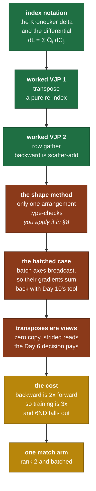

# Day 11 — Backward for matmul

> **Read this file. It replaces the book for today.**
> The page numbers stay as optional depth. This lesson teaches the same material in my own words.
> Tick your boxes in [`RUST_TRACKER.md`](../RUST_TRACKER.md). This file holds no checkboxes.
> The short card is [`RUST_PHASE_0_1.md` Day 11](../RUST_PHASE_0_1.md#day-11--backward-for-matmul).

**Time: 3 hours. Claim: R0b. File you extend: `src/autograd.rs`.**
**Your tests are written: move `rust/tests/pending/day11.rs` to `rust/tests/day11.rs` at the start of the session.**
**Today is easy Rust and hard mathematics. Budget your hours that way.**

---

## 1. Why this day exists

One `match` arm. That is the whole code deliverable today.

That arm is also the arm that every parameter in every transformer passes through. Attention is four matmuls. The feed-forward block is two more. A GPT-2 forward pass is about a hundred of them, and every gradient that reaches a weight matrix came out of the rule you write today.

The card tells you not to memorise the rule, and it is right for a reason that is easy to miss. **The rule is recoverable from the shapes in ten seconds.** A thing you can rederive on demand never needs a lookup, never gets misremembered under pressure, and transfers to every framework and every interview you will ever sit. A thing you memorised is a thing you will get backwards at 2 a.m. on Day 22.

So today has two derivations and one arm. The derivations are yours, in section 8. This lesson gives you the toolkit and two worked examples on operations that are not matmul.

### 1.1 What breaks later if you get this wrong

| If this is wrong | What breaks | Day |
|---|---|---|
| A transpose is on the wrong operand | Shapes still agree in the square case. Every non-square layer is silently wrong. | Day 19, Day 21 |
| The batch axes are not summed back | A `[1, d, d]` shared weight gets `batch` times its real gradient | Day 20 multi-head |
| The backward calls `contiguous()` on every transpose | Correct, and it copies the largest tensors in the model twice per step | Phase 2 |
| The rank-2 and batched paths disagree | Attention works at batch 1 and fails at batch 2 | Day 20 |
| You memorised the rule instead of deriving it | Day 18 and Day 19 each need a new rule you cannot look up | Day 18, Day 19 |

**The square-matrix trap deserves its own line.** If you test only on `[4,4] · [4,4]`, a wrong transpose gives correct shapes and wrong values, and shape-checking finds nothing. Every test today uses shapes where `M`, `K` and `N` are all different, and that is not an accident.

### 1.2 The map of today



---

## 2. The tools, and two worked derivations

### 2.1 What a derivation of a backward rule actually is

Day 10 gave the general form: for `y = f(x)`, the backward rule computes `x̄ᵀ = ȳᵀ · J`, and you never build `J`.

For an elementwise op the Jacobian is diagonal, so the answer is an elementwise multiply and there is nothing to derive. Matmul is the first op where each output touches many inputs, so the Jacobian is not diagonal and you need a method.

The method has three steps, and they work for every op in the rest of this project:

```text
   1.  write the forward in INDEX form, with explicit sums
   2.  differentiate one output element against one input element
   3.  contract that against the incoming adjoint, and read off the
       matrix expression that does the same contraction
```

Step 3 is where the answer turns back into a matmul, a transpose or a sum. It is a pattern-matching step, and it gets fast with practice.

### 2.2 Index notation and the Kronecker delta

Write every tensor with explicit subscripts and every sum with an explicit `Σ`.

```text
   C = A · B          becomes         Cᵢⱼ  =  Σₖ  Aᵢₖ Bₖⱼ
```

The free indices `i` and `j` appear on both sides. The index `k` appears twice on the right and not on the left, so it is summed. Nothing is implicit.

The **Kronecker delta** is the derivative of a variable against itself:

```text
              1   if p == q
   δ_pq  =  {
              0   otherwise

   so       ∂xₚ / ∂x_q   =   δ_pq
```

It has one property, and that property is the only reason it is useful:

```text
   Σₚ  δ_pq · fₚ   =   f_q            "the delta eats the sum"
```

A delta inside a sum deletes the sum and substitutes the index. Every derivation in this project uses that line, usually twice.

The third tool is the **differential**. For a scalar `L` that depends on a tensor `C`:

```text
   dL  =  Σᵢⱼ  (∂L/∂Cᵢⱼ) dCᵢⱼ   =  Σᵢⱼ  C̄ᵢⱼ dCᵢⱼ
```

Read it as bookkeeping: to find `Ā`, write `dL` in terms of `dA`, and whatever multiplies `dAᵢₖ` is `Āᵢₖ`. This form is often faster than differentiating element by element, and it makes the transposes appear on their own.

### 2.3 Worked derivation 1 — the transpose

`Y = Xᵀ`. In index form the forward is a pure re-index with no arithmetic:

```text
   Yⱼᵢ  =  Xᵢⱼ
```

Differentiate one output against one input:

```text
   ∂Y_pq / ∂Xᵢⱼ   =   ∂X_qp / ∂Xᵢⱼ   =   δ_qi · δ_pj
```

Contract against the incoming adjoint:

```text
   X̄ᵢⱼ  =  Σ_pq  Ȳ_pq · (∂Y_pq / ∂Xᵢⱼ)
         =  Σ_pq  Ȳ_pq · δ_qi δ_pj
         =  Ȳⱼᵢ                        both deltas ate their sums
```

And `X̄ᵢⱼ = Ȳⱼᵢ` is the index form of `X̄ = Ȳᵀ`.

**The rule: the backward of a transpose is a transpose.** Read the shape argument too. `Y` is `[n, m]`, so `Ȳ` is `[n, m]`, and `X̄` must be `[m, n]`. Only one operation on a `[n, m]` gives a `[m, n]` with no arithmetic. The shape alone forced it, and the indices confirmed it. **That is the pairing section 8 asks you to repeat on a harder op.**

### 2.4 Worked derivation 2 — a row gather

This one is not matmul either, and you meet it again on Day 17 for the token embeddings.

The forward takes a table `X` of shape `[V, d]` and a list of row numbers `idx` of length `t`, and stacks the chosen rows:

```text
   Y is [t, d]        Y_sc  =  X_{idx[s], c}

   example:  V = 4, d = 2, idx = [2, 0, 2]

        X                    Y
     row 0  [a b]         row 0  [e f]     <- X row 2
     row 1  [c d]         row 1  [a b]     <- X row 0
     row 2  [e f]         row 2  [e f]     <- X row 2, AGAIN
     row 3  [g h]
```

Differentiate:

```text
   ∂Y_sc / ∂X_rk   =   δ_{idx[s], r} · δ_ck
```

Contract:

```text
   X̄_rk  =  Σ_sc  Ȳ_sc · δ_{idx[s], r} · δ_ck

          =  Σ_s  Ȳ_sk  ·  δ_{idx[s], r}

          =  Σ over every s where idx[s] == r  of  Ȳ_sk
```

So row `r` of `X̄` is the **sum** of the gradient rows of every position that selected it. Row 2 of `X` was selected twice, so it gets two gradient rows added. Row 1 and row 3 were never selected, so their gradient is zero.

```text
   X̄                        from
     row 0  [ Ȳ₁ ]           position 1
     row 1  [  0  ]          nothing selected it
     row 2  [ Ȳ₀ + Ȳ₂ ]      positions 0 and 2, ADDED
     row 3  [  0  ]
```

**The backward of a gather is a scatter-add.** Notice the shape of the answer: a value read `k` times gets `k` contributions summed. That is Day 10's accumulation rule again, arriving from a completely different direction. When you see the same rule fall out of three unrelated derivations, that is the sign the rule is structural and not a convention.

### 2.5 The shape method, stated in general

Both derivations above had a shortcut. Here it is as a method, and section 8 asks you to apply it.

```text
   1.  list the shapes you have:  the inputs, and the output adjoint
   2.  write the shape you need:  the same shape as the input
   3.  enumerate every product of two of the available tensors,
       with each one either plain or transposed
   4.  discard every arrangement whose inner dimensions disagree
   5.  usually exactly one survives. That one is the rule.
```

Step 5 is the surprising part and it deserves a caution: **the shape method proves uniqueness, not correctness.** It shows that at most one arrangement can be right. It cannot tell you about a missing scalar factor, a sign, or a case where two arrangements both type-check. That is exactly why the card asks for both derivations and not only the fast one. The index derivation is the proof. The shape derivation is the thing you do in an interview, and the thing you do to check yourself.

For a square matrix, step 4 discards nothing, and the method gives you no information at all. Remember that when you choose test shapes.

### 2.6 The batched case

`matmul` from Day 6 treats the last two axes as the matrix and every earlier axis as a batch axis, and the batch axes broadcast by the Day 4 rule.

```text
   a is [2, 3, 4]     b is [2, 4, 5]      ->    c is [2, 3, 5]
        ^batch                                       ^batch

   a is [1, 3, 4]     b is [2, 4, 5]      ->    c is [2, 3, 5]
        ^ broadcast to 2                        a's single matrix
                                                was used TWICE
```

The second case is the one that matters. `a`'s one matrix took part in two products, so by section 2.2 of Day 10 it gets two contributions, and they add.

**You already wrote the tool for this yesterday.** The backward computes the gradient at the full broadcast batch shape, then calls `unbroadcast` to reduce it back to the operand's real shape. Nothing new is needed, and if you find yourself writing a special case for "batch size 1", stop and use the tool.

```text
   backward of a batched matmul, as a plan:

     1.  compute the gradient of each operand at the BROADCAST batch shape
         (the rank-2 rule, applied per batch element)
     2.  unbroadcast each one back to the operand's own shape
     3.  accumulate
```

Step 1 says "per batch element" and that is the honest description. Whether your code loops over the batch or reuses the batched `matmul` is an implementation choice, and both are correct.

**The transpose in the batched case is of the last two axes only.** `transpose(rank-2, rank-1)` from Day 3, never `transpose(0, 1)`. A batch-axis transpose reorders which matrix pairs with which, and it gives correct shapes when the batch happens to be square. That is a second silent-square trap on the same day.

### 2.7 The transposes are free

Day 3 made `transpose` zero-copy: it swaps two entries in the strides and moves no data. Day 6 fixed that `matmul_naive` reads through the index formula, so it accepts a strided input.

Those two decisions pay today, and they pay at the largest tensor sizes in the model.

```text
   without the Day 6 decision            with it

   b.transpose(0,1).contiguous()         b.transpose(0,1)
        ^ copies K*N floats                   ^ swaps two usize values
          on EVERY backward step                and copies nothing

   for a GPT-2 MLP weight, K*N = 768*3072 = 2.4M floats = 9.4 MB
   twice per matmul, times ~100 matmuls, times every step
```

**If you find yourself typing `.contiguous()` in the backward pass, stop and ask why.** There is one legitimate reason: a kernel that requires contiguous input. `matmul_naive` does not. If `matmul_blocked` does, that is a fact about your Day 7 kernel worth writing down, and it is a design point in section 4.

### 2.8 What the backward costs, and where `6ND` comes from

Count the FLOPs. The forward is `2MNK` (Day 6, self-check 1).

```text
   forward     C   [M,N]  =  A [M,K] · B [K,N]                 2·M·N·K

   backward    Ā   [M,K]  =  C̄ [M,N] · Bᵀ [N,K]                2·M·K·N
               B̄   [K,N]  =  Aᵀ [K,M] · C̄ [M,N]                2·K·N·M

   backward total                                              4·M·N·K
   forward + backward                                          6·M·N·K
```

**The backward pass is exactly twice the forward pass, and the total is three times.** That factor of 3 is not specific to matmul. It holds for the whole model, because matmuls are where essentially all the arithmetic is.

Now put it together with the parameter count. One forward pass through a model with `P` parameters costs about `2P` FLOPs per token, because each weight is used in one multiply and one add. So:

```text
   forward per token          2P
   forward + backward         6P
   for D tokens               6PD FLOPs      <- the training-cost formula
```

That is the `6 * parameters * tokens` from Day 7 section 1.1, derived rather than asserted. Every capacity estimate you will read in a paper uses it.

**One consequence for today.** Speeding up matmul speeds up training by the same factor, in both directions. Day 7 and Day 8 were not a detour before autograd. They were the two thirds of the work that the backward pass spends its time in.

### 2.9 Which kernel the backward calls

Your backward arm calls a matmul. You own three of them.

| Kernel | Case for it | Case against it |
|---|---|---|
| `matmul_naive` | It is the oracle. A backward built on it is as trustworthy as the forward. | It is the slowest code you own, and the backward runs twice per forward. |
| `matmul` (batched) | It handles the batch axes, which the backward needs. | It calls naive underneath, so the speed argument stands. |
| `matmul_blocked` or `matmul_parallel` | Fast. And Day 7 and 8 proved them equal to naive. | Rank 2 only, so the batch loop is yours. |

**The recommendation, and the reason.** Call the batched `matmul` today. Correctness first, and the gradient checker on Day 12 is slow enough already. Write a comment at the call site naming the faster option and the day you take it. In Phase 2 you profile, and then you change one line with evidence in hand.

This is a design point. If you choose otherwise, write the argument in the commit message.

---

## 3. The Rust you need today

The card says it plainly: nothing new. Today is easy Rust and hard mathematics. So this section is short, and it covers the one thing that gets clumsy when a `match` arm calls four operations that all return `Result`.

### 3.1 `?` needs a matching return type

```rust
#[derive(Debug)]
enum FareError { NoRoute, BadZone }

fn zone(station: &str) -> Result<u32, FareError> {
    match station {
        "Dadar" => Ok(1),
        "Thane" => Ok(2),
        _ => Err(FareError::NoRoute),
    }
}

// `?` returns early with the error. It works because THIS function
// also returns Result with the same error type.
fn hops(from: &str, to: &str) -> Result<u32, FareError> {
    let a = zone(from)?;
    let b = zone(to)?;
    Ok(a.abs_diff(b))
}
```

**`?` is not available inside `backward`, because `backward` returns `()`.** That is a real constraint and it decides how the arm reads. Three ways out, and you pick one for the whole file:

```rust
// 1. expect, with a message that names the node. Loud, and it says where.
let ga = matmul(&gc, &bt).expect("MatMul backward: grad_a shape");

// 2. a private helper that returns Result, called once with one expect.
//    The arm body stays clean and there is one panic site.
fn matmul_backward(...) -> Result<(Tensor<T>, Tensor<T>), ShapeError>;

// 3. make backward return Result. Then `?` works, and every caller changes.
```

Option 2 is the one that scales, because Day 13 adds two more arms with the same shape. **Whichever you pick, do not use `.unwrap()`.** A bare `unwrap` gives you a line number and no cause, and the cause is what you need at 2 a.m.

### 3.2 Chaining without nesting

```rust
fn fare(from: &str, to: &str) -> Result<u32, FareError> {
    hops(from, to)
        .map(|h| 10 + h * 5)                    // transform the Ok value
        .and_then(|f| if f > 100 { Err(FareError::BadZone) } else { Ok(f) })
}
```

`map` transforms the success value. `and_then` transforms it into another `Result`, so it flattens. Use them when a chain reads better than four `let ... ?` lines, and use the `let` lines when the intermediate values have names worth reading.

### 3.3 Book pages

Nothing new is required. If `?` and error types still feel loose, *Programming Rust* "Propagating Errors" p. 149 and "Working with Multiple Error Types" p. 152 are half an hour well spent.

The real prereq today is Raschka section 3.4, pp. 64–70. **Read it for the shapes only. Ignore the PyTorch.**

---

## 4. What you build today

### 4.1 The arm

```rust
// src/autograd.rs, inside Tape::backward
//
//   Op::MatMul(x, y) => { ... }
//
// Rank 2 and batched. The batch axes broadcast, so their gradients
// reduce with the same `unbroadcast` you wrote on Day 10.
```

One forward helper comes with it, in the same shape as Day 10's:

```rust
/// Computes the product with the batched `matmul`, then pushes Op::MatMul.
pub fn matmul<T: Scalar>(tape: &mut Tape<T>, x: NodeId, y: NodeId) -> NodeId;
```

That is the whole deliverable. One arm, one helper, no new file and no new `Op` variant.

### 4.2 Design points to decide, and to record in the commit message

**One. Which matmul does the arm call?** Section 2.9 lays out the three options and recommends one. State your choice and the reason.

**Two. Does the arm loop over batches, or call the batched `matmul` twice?** Both are correct. The batched call is shorter. The loop is easier to read when it goes wrong. Say which.

**Three. Where does the `Result` go?** Section 3.1, options 1 to 3. Pick one for the whole file, not per arm.

**Four. Does `matmul_blocked` accept a strided input?** Check your Day 7 kernel. If it assumes contiguous data, then either the backward calls the naive path, or the kernel gets a note in its doc comment saying it requires contiguous input. An undocumented assumption here is a bug waiting for Phase 2.

---

## 5. The tests, and the trap in each one

```bash
mv tests/pending/day11.rs tests/day11.rs
cargo test --test day11
```

| Test | What it traps |
|---|---|
| `matmul_backward_shapes` | The wrong transpose. It uses `[2,3] · [3,4]`, where `M`, `K` and `N` are all different, so the wrong arrangement fails to build a legal product at all instead of producing a wrong number. It is the cheapest test in the file and it fires first. |
| `matmul_backward_2x2_by_hand` | An arrangement that type-checks and is wrong. The values are hand-computed, the matrices are not symmetric, and the incoming adjoint is not all ones, so a rule that swaps the operands gives a different number rather than the same one. |
| `matmul_backward_batched` | Two faults at once. The batch loop, at `[2,3,4] · [2,4,5]`. And the broadcast batch, at `[1,3,4] · [2,4,5]`, where `grad_a` must sum back to `[1,3,4]`. A missing `unbroadcast` gives a shape error, and an `unbroadcast` that averages instead of summing gives half the right answer. |

**On the incoming adjoint.** Two of these tests seed the backward pass through a scalar built from a non-uniform weighting, not a plain sum. A plain sum makes the incoming adjoint all ones, and an all-ones adjoint hides a whole class of transpose faults, for the same reason section 2.5 warns about square matrices.

---

## 6. Order of work

1. Move the test file. Run `cargo test --test day11`. That is the red.
2. **Do self-check 1 on paper now, before any code.** It takes ten minutes and it gives you the rule you are about to implement. Doing it after the code is not the same exercise.
3. Do self-check 2. This one takes longer, and it is the one that transfers.
4. Write the rank-2 path only. Make `matmul_backward_shapes` and `matmul_backward_2x2_by_hand` pass. **Commit.**
5. Add the batch handling. Make `[2,3,4] · [2,4,5]` pass.
6. Add the `unbroadcast` calls. Make `[1,3,4] · [2,4,5]` pass.
7. Run `cargo test`. **All of Days 1 to 11, not just today.** A change in the backward loop touches every earlier gradient test.
8. Run `cargo clippy`. Fix every warning. **Commit.**
9. Photograph both derivations into `hand_math/`.

**Step 2 is not optional and it is not a formality.** The order in this list is the point of the day. If you write the arm first, then the self-check becomes "explain the code you already wrote", which is a different and much easier exercise that teaches you nothing.

---

## 7. Compiler errors and logic faults you will meet today

| Symptom | What it means | Where to look |
|---|---|---|
| `ShapeError::SizeMismatch` from inside the backward | The inner dimensions of your arrangement disagree. | This is the shape method telling you the arrangement is wrong. Redo section 8 question 1. |
| `E0308: expected Tensor, found Result` | A tensor op returns `Result` and the arm used it directly. | Section 3.1. Pick one of the three options. |
| `ShapeError::BadRank` on a rank-3 input | The rank-2 path ran on a batched input. | The dispatch at the top of the arm. |
| **Logic:** correct for square matrices, wrong for `[2,3] · [3,4]` | A transpose is on the wrong operand. | Section 2.5, last paragraph. The square case carries no information. |
| **Logic:** correct at batch 1, wrong at batch 2 | The batch axis is being transposed along with the matrix axes. | Section 2.6, last paragraph. Transpose the last two axes only. |
| **Logic:** `grad_a` has shape `[2,3,4]` when the operand was `[1,3,4]` | The `unbroadcast` call is missing. | Section 2.6, step 2. |
| **Logic:** `grad_a` is exactly half the expected value at `[1,3,4] · [2,4,5]` | `unbroadcast` averaged the batch instead of summing it. | Day 10, section 2.6. It is `sum_axis`, never `mean_axis`. |
| **Logic:** shapes are right, values are wrong, and fixing one test breaks another | You have a batch-dimension fault, not a transpose fault. **Ask.** | Stuck-signals. |
| **Slow:** the test suite takes minutes | The backward calls `contiguous()` on a transpose. | Section 2.7. |

---

## 8. Self-check — on paper, before you close the laptop

I answer neither of these. Both go in `hand_math/`.

1. **Derive from shapes only.** `A` is `[M, K]`. `B` is `[K, N]`. `∂L/∂C` is `[M, N]`. Write down every way to multiply two of those three tensors, with each one either plain or transposed, that produces something of shape `[M, K]`. Show that exactly one arrangement has agreeing inner dimensions. You have now rederived the rule with no calculus at all. Then do the same for `∂L/∂B`.
2. **Derive it properly.** Write `Cᵢⱼ = Σₖ Aᵢₖ Bₖⱼ`. Apply the chain rule to get `∂L/∂Aᵢₖ` in index form, using the Kronecker delta from section 2.2 and the method from section 2.1. Show that your index expression is the same operation as the matrix expression you found in question 1. State, in one sentence, what question 1 cannot tell you on its own.

---

## 9. Stuck-signals — the points where you ask

- Self-check 1 gives you two surviving arrangements, not one. **Ask after 15 minutes.** Check whether you set `M`, `K` and `N` to different symbols, and whether you allowed both operands to transpose.
- The shapes are correct, the values are wrong, and adding a transpose makes a different test fail. **Ask.** That pattern is a batch-dimension fault, not a transpose fault, and more transposing will not find it.
- `matmul_backward_batched` passes for `[2,3,4] · [2,4,5]` and fails for `[1,3,4] · [2,4,5]`. Read section 2.6. **Ask after 20 minutes.**
- You are two hours in and self-check 2 will not close. **Ask after 30 minutes on it.** Bring the index expression you have, however incomplete. The delta step is where people stall, and one line unblocks it.
- You want to write the rule from memory or look it up. That is the one thing today is designed to prevent. Do question 1 instead. It takes ten minutes and it is permanent.

---

## 10. The post

The hook is at the end of the [Day 11 card](../RUST_PHASE_0_1.md#day-11--backward-for-matmul), written in your voice.

---

## 11. Done means all five

1. `cargo test` passes, with Days 1 to 11 green.
2. `cargo clippy` gives no warnings.
3. The backward pass contains no `.contiguous()` call, or it contains one with a comment saying which kernel demands it.
4. Both derivations are photographed into `hand_math/`, and the shape derivation states what it cannot prove.
5. The post is public, and `PROGRESS.md` records what is proven and names nothing else.

> **Three days of gradient rules, and no oracle yet.** Every gradient test so far was hand-computed by you. Tomorrow you build the checker, and its first job is to disagree with you. Do not tidy the code today. Tomorrow tells you where it is wrong.
