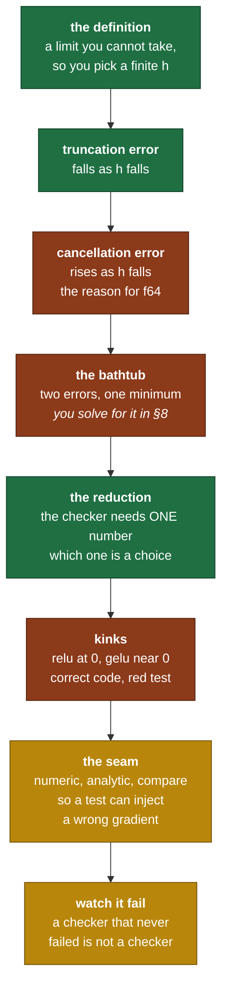

# Day 12 — The gradient checker

> **Read this file. It replaces the book for today.**
> The page numbers stay as optional depth. This lesson teaches the same material in my own words.
> Tick your boxes in [`RUST_TRACKER.md`](../RUST_TRACKER.md). This file holds no checkboxes.
> The short card is [`RUST_PHASE_0_1.md` Day 12](../RUST_PHASE_0_1.md#day-12--the-gradient-checker).

**Time: 3 hours. Claim: R0b. File you create: `src/gradcheck.rs`.**
**Your tests are written: move `rust/tests/pending/day12.rs` to `rust/tests/day12.rs` at the start of the session.**
**This is the day Day 1 was built for. The `Scalar` trait exists so that today can run in `f64`.**

---

## 1. Why this day exists

For three days you wrote gradient rules and checked them against your own arithmetic. That is a closed loop. If you misunderstand the chain rule in a particular way, you write the rule wrong and you write the test wrong in the same way, and everything is green.

Today you break the loop. The finite difference does not know how your autograd works. It only calls the forward pass. Its answer comes from the **definition** of the derivative, so it is right for reasons that have nothing to do with your code.

That independence is the whole value, and it comes with a price that is the real content of the day. **The finite difference is numerically hostile.** It subtracts two nearly equal numbers, which is the one operation floating point is worst at. Done in `f32` it produces noise that looks exactly like a bug, and it also passes on real bugs. Done in `f64` it works.

That single fact is why Day 1 built a `Scalar` trait instead of hardcoding `f32`. If you had skipped it, today is the day you rewrite the library.

**And one more thing, which the card puts in the strongest terms it uses anywhere.** A checker that has never failed is not evidence. It is an untested test. Before you trust today's work, you must watch it go red on a gradient you know is wrong.

### 1.1 What breaks later if you get this wrong

| If this is wrong | What breaks | Day |
|---|---|---|
| The checker runs in `f32` | It cannot separate a real fault from float noise. Every later "gradcheck passes" means nothing. | every day after |
| The checker never fails | Days 13, 18, 19 and 21 all ship a wrong backward and you never learn | Day 13 onward |
| Only a plain sum reduction is checked | Sign and transpose faults that cancel pass forever | Day 19, Day 20 |
| The relative-error formula divides by the analytic value | A correct zero gradient reports infinite error | today |
| Test points sit on a kink | ReLU and GELU report failures for correct code, and you learn to ignore red | Day 21 |
| The API cannot be handed a wrong gradient | `gradcheck_catches_injected_bug` is unwritable through the public API | today |

### 1.2 The map of today



---

## 2. Finite differences, from first principles

### 2.1 The definition, and the compromise

The derivative is a limit.

```text
                    f(x + h) − f(x)
   f'(x)  =   lim   ---------------
              h→0          h
```

A computer cannot take a limit. It picks one small `h` and evaluates the quotient once. That substitution is the whole method, and every difficulty today comes from it.

Two formulas are in common use:

```text
   forward difference     [ f(x + h) − f(x) ]  /  h

   central difference     [ f(x + h) − f(x − h) ]  /  2h
```

The central form costs one extra forward evaluation and is far more accurate. **Self-check 1 asks you to prove exactly how much more accurate, from a Taylor expansion, so I state the two formulas here and stop.**

### 2.2 The first error: the formula is not the limit

`h` is not zero, so the quotient is not the derivative. The difference between them is the **truncation error**, and it comes from the terms of the Taylor series that the quotient does not cancel.

The property you need about it is directional, and it is the easy half:

```text
   truncation error   ->  0   as   h  ->  0
```

Smaller `h` gives a formula closer to the limit. If floating point were exact, you can pick `h = 1e-300` and be done. Section 2.3 is why you cannot.

### 2.3 The second error: subtracting two nearly equal numbers

This is the part that surprises people, so it gets a worked example on unrelated data.

A float stores a fixed number of significant bits. Near a value of magnitude `2^e`, the gap between one representable number and the next is fixed, and that gap is called a ULP, the unit in the last place.

```text
   f32   24 bits of mantissa   ->  about  7.2 decimal digits   eps ≈ 1.19e-7
   f64   53 bits of mantissa   ->  about 15.9 decimal digits   eps ≈ 2.22e-16
```

Now take two account balances in rupees, held in `f32`.

```text
   a  =  12,345,678.00
   b  =  12,345,677.00
   the true difference is 1.00

   12.3 million lies between 2^23 = 8,388,608 and 2^24 = 16,777,216.
   At that magnitude an f32 ULP is exactly 1.0.

   So a and b are adjacent representable numbers, and their difference
   is one ULP. The result 1.0 is stored exactly, and it carries
   ZERO significant digits of information about anything smaller.
   Add 0.4 to either balance and the stored difference is still 1.0.
```

That is catastrophic cancellation. The subtraction itself is exact. What is destroyed is the **relative** accuracy of the result, because the leading digits agreed and cancelled, and what remains is whatever rounding noise the two inputs already carried.

Apply that to the difference quotient. `f(x+h)` and `f(x−h)` agree to more and more digits as `h` shrinks, so their difference keeps fewer and fewer of them. Then you divide by `2h`, which is tiny, so the noise is multiplied up.

```text
   cancellation error   ->  grows   as   h  ->  0
```

**The two errors pull in opposite directions.** That is the entire design problem of the day.

```text
   relative error
   (log scale)
      ^
      |  \                                                   /
      |   \                                                 /
      |    \                                               /
      |     \    cancellation                truncation   /
      |      \   dominates here          dominates here  /
      |       \                                         /
      |        \                                       /
      |         \                                     /
      |          \___                             ___/
      |              \___                     ___/
      |                  \___             ___/
      |                      \___     ___/
      |                          \___/          <- the best h is at the bottom
      +--------------------------------------------------------> h (log scale)
        very small h                                large h

   The floor of the bathtub is the best accuracy the method can reach.
   Its depth, and the h that reaches it, depend on the float type.
   Section 8 question 1 asks you to compute both. Do not guess them.
```

**This picture is the argument for `f64`.** Change `eps` by nine orders of magnitude and the whole left wall moves. In `f32` the two walls meet so early that the floor is shallow, and a wrong gradient hides inside it. In `f64` the floor is deep enough that a real fault stands out by many orders of magnitude.

`src/gradcheck.rs` is `f64` only, hardcoded, with no generic parameter. **That is deliberate and it is not a shortcut.** A gradient checker that a caller can accidentally instantiate at `f32` is a trap, and there is no use for the `f32` version.

### 2.4 The comparison, and the guard

Comparing gradients needs a relative measure, because gradient magnitudes vary by many orders of magnitude across a model.

```text
                     | analytic − numeric |
   rel_err   =   ----------------------------------------
                  max( |analytic| , |numeric| , 1e-8 )
```

The `1e-8` in the denominator is not decoration. Without it, a correct gradient of exactly zero gives `0/0`, and a correct gradient of `1e-30` gives a huge relative error from pure noise. The guard makes the measure behave like an absolute test near zero and like a relative test away from it. **It is the same idea as `assert_all_close` from Day 6, in a different costume.**

The threshold is `1e-5`. In `f64` a correct gradient usually lands near `1e-9`, and a real bug is usually above `1e-2`. There is a wide empty band between them, and that band is what makes the test meaningful.

**Report the worst case, not the average.** One wrong element in a million is a bug, and an average hides it. The report carries the maximum relative error, which input tensor it was in, and the multi-index inside that tensor. All three are needed: an error value with no location sends you reading the whole file.

### 2.5 The checker needs one number, and choosing it is a decision

`backward` requires a scalar root, so the checker must turn the output into one number before it can do anything.

```text
   the graph gives    out,  of some shape

   the checker needs  L = a single number

   the general form:   L  =  Σᵢ  rᵢ · outᵢ        for some weights r
```

The obvious choice is `r = all ones`, which makes `L = sum(out)`. That is `grad_check`.

The card asks for a second checker with `r` a fixed random vector. That is `grad_check_projected`, and the card says plainly that it catches sign errors that cancel under a plain sum.

**Self-check 2 asks you to build a wrong backward that passes the first and fails the second, and to say why the projection catches it.** So this section stops at the general form. Notice what it tells you: the plain check probes exactly one weighted combination of the Jacobian's rows, out of infinitely many. That observation is the whole exercise.

Two practical points on the projection.

- **`r` must be fixed, not fresh per call.** Seed a `Rng` with an argument. A checker whose result changes between runs is a flaky test, and a flaky test gets ignored.
- **`r` must be a leaf with `requires_grad = false`.** It is a constant of the check, not a thing being differentiated.

### 2.6 Kinks: where the method is wrong and your code is right

A finite difference assumes the function is smooth between `x−h` and `x+h`. Some functions are not.

```text
   relu(x) = max(0, x)          at x = 0

           |                       f(0+h) = h        f(0−h) = 0
           |      /
           |     /                 central difference = (h − 0) / 2h = 0.5
   --------+----/---------
           |                       your backward returns 0 or 1, by convention
           |                       so rel_err is 1.0, and the code is CORRECT
```

The derivative does not exist at 0. Any value your code returns disagrees with the finite difference, and neither is wrong. The same happens at `abs(0)` and at ties inside `max_axis`.

**Three defences, in order of preference.**

1. **Sample away from the kink.** Draw the test inputs from a distribution that avoids it, and say so in the test name. This is the card's rule 4 in section 6, and it is the honest one.
2. **Perturb and check.** If a single element fails and it sits within `h` of a kink, report it separately.
3. **Do not add a fudge factor to the tolerance.** A loose tolerance to pass a kink is a loose tolerance for every real bug in the same test.

Kinks are not on today's op list. `relu` is a tensor method and not an `Op`, so nothing today has one. This section is here so that Day 21 does not surprise you, because GELU is smooth and its inflection region still needs care.

### 2.7 What it costs

The numeric gradient perturbs one element at a time, and each perturbation needs a full forward pass.

```text
   cost  =  2  ×  (number of elements across all inputs)  ×  one forward pass

   a [4, 5] and a [5, 3] input   ->  20 + 15 = 35 elements  ->  70 forward passes
   a [64, 64] weight             ->  4096 elements          ->  8192 forward passes
```

**Two consequences for how you write the tests.** Keep the tensors small, in the range of 2 to 6 per axis. And never call the checker inside a training loop. It is a test-time tool, and its cost is exactly what makes reverse mode worth building.

### 2.8 The `build` closure, and why the API takes one

The checker cannot take a finished tape. It has to run the forward pass again for every perturbed input, and a tape is a record of one specific forward pass at one specific set of values.

So the caller hands over a recipe instead:

```text
   build:   (&mut Tape<f64>, &[NodeId])  ->  NodeId

            "given a fresh tape and the ids of my inputs on it,
             wire up the graph and give me back the output node"
```

The checker then runs it many times, on many tapes, with slightly different leaf values each time.

**One fixed decision, and it differs from the card's comment.** The card writes that `build` returns "the scalar output node". The projected checker needs the output **before** any reduction, so it can apply its own weights. So:

```text
   build returns the OUTPUT node, not a scalar.
   The checker owns the reduction, because the reduction is the
   thing the two checkers disagree about.
```

If `build` reduced to a scalar itself, `grad_check_projected` cannot exist. State this in the file header, because it is the one place the code and the card differ.

**A second decision.** The reduction is built from ops you already own. Multiply by the weight leaf, then sum every axis away one at a time. No new `Op` variant is needed today, and adding one is a change to the autograd made for the benefit of a test.

### 2.9 The seam: why five functions and not one

The card lists two entry points. The tests need three more pieces, and the reason is a rule from `AUTHORING.md`: **if a test wants a private item, the seam is wrong.**

`gradcheck_catches_injected_bug` has to hand the comparison a gradient that is deliberately wrong. With one monolithic `grad_check`, the only way to do that is to break the library on purpose, behind a feature flag, and then remember to remove it. That is worse than a wider API.

So the checker splits along its natural joints:

```text
   analytic_grads   run the graph, run backward, return the gradients
   numeric_grads    perturb, rerun forward, return the gradients
   compare_grads    take two gradient sets, decide pass or fail
   grad_check              = compare( analytic , numeric )
   grad_check_projected    = the same, with random weights
```

Every piece is useful on its own. `numeric_grads` is a debugging tool you will reach for at Day 18 when a LayerNorm gradient is wrong and you want the true value printed. `compare_grads` is where the tolerance policy lives, in exactly one place.

**This is a design decision, not a fact.** If you argue it down, the test file changes with it. Say which part and why.

### 2.10 Watching it fail is the deliverable

The card puts it as strongly as it puts anything: *a checker that never fails is not a checker. Prove that yours fails.*

Two of today's three tests exist only to make the checker go red. Read them as the point of the day and not as extra coverage.

This idea has a name outside this repo. Deliberately breaking the code to confirm the tests notice is **mutation testing**, and the fraction of injected faults a suite catches is a far better measure of a test suite than the fraction of lines it runs. You are doing it by hand, on the one component where a silent failure costs the most.

---

## 3. The Rust you need today

Examples are on data with no connection to tensors.

### 3.1 The three closure traits

A closure is a struct the compiler writes for you. It holds the captured variables as fields, and it implements one to three traits depending on what the body does to them.

| Trait | The body does this to its captures | You can call it |
|---|---|---|
| `FnOnce` | consumes them | once |
| `FnMut` | mutates them | many times, needs `&mut` |
| `Fn` | only reads them | many times, needs `&` |

They nest: every `Fn` is also an `FnMut`, and every `FnMut` is also a `FnOnce`.

```rust
let city = String::from("Nagpur");

// Fn — only reads `city`. Callable many times through a shared reference.
let describe = || println!("{} has {} letters", city, city.len());
describe();
describe();

let mut visits = 0;
// FnMut — mutates `visits`. Needs the binding itself to be `mut`.
let mut record = || visits += 1;
record();
record();

// FnOnce — moves `city` out. The second call does not compile.
let consume = move || city.into_bytes();
let _bytes = consume();
```

**Your `build` argument must be `Fn`, not `FnMut`.** The checker calls it once per perturbation, thousands of times, from a loop it does not want to thread a `&mut` through. Take `impl Fn(...) -> NodeId` and the bound documents the requirement.

### 3.2 `impl Trait` in argument position

```rust
fn longest(names: &[String], keep: impl Fn(&str) -> bool) -> usize {
    names.iter().filter(|n| keep(n)).map(|n| n.len()).max().unwrap_or(0)
}

// longest(&cities, |n| n.starts_with('P'))
```

`impl Fn(&str) -> bool` means "some type that implements this, chosen at the call site". It is a generic parameter with a shorter spelling, so the closure is inlined and there is no allocation and no vtable.

The alternative is `Box<dyn Fn(&str) -> bool>`, which is a trait object: one heap allocation and an indirect call. **Use `impl Fn` here.** The checker calls `build` thousands of times, and there is no reason to pay for dynamic dispatch. Day 14 takes the other choice for the optimizer, on purpose, and the contrast is the lesson there.

### 3.3 Printing numbers you can act on

A gradient check that fails must print numbers you can read. `{}` on an `f64` is not enough.

```rust
let got  = 0.000_000_123_456_7_f64;
let want = 0.000_000_123_400_0_f64;

println!("{got}");            // 1.234567e-7   — fine here, unpredictable in general
println!("{got:e}");          // 1.234567e-7   — always scientific
println!("{got:.3e}");        // 1.235e-7      — three digits after the point
println!("{got:>14.6e}");     // right aligned in 14 columns
println!("{:.*}", 9, got);    // precision taken from an argument
println!("{got:.p$}", p = 9); // the same, by name
```

For a report line, put the two values, the relative error and the location on one line, and align them so a column of failures is readable.

```rust
println!("input {i}, index {idx:?}: analytic {a:>12.6e}  numeric {n:>12.6e}  rel {e:.3e}");
```

**Print the location, always.** The card's stuck-signal for today is "print the worst index and the input value there, then ask". A report that cannot do that makes you the debugger.

### 3.4 Book pages

*Programming Rust*: "FnMut" p. 314, "Formatting Values" p. 413, "Dynamic Widths and Precisions" p. 420. Read pp. 312–319 as the prereq.

---

## 4. What you build today

### 4.1 The module

```rust
// src/gradcheck.rs — f64 only, by construction. There is no generic parameter.
use crate::autograd::{NodeId, Tape};
use crate::tensor::Tensor;

#[derive(Debug, Clone)]
pub struct GradCheckReport {
    pub max_rel_err: f64,
    pub worst_input: usize,      // which input tensor the worst error is in
    pub worst_index: Vec<usize>, // the multi-index inside that tensor
    pub passed: bool,
}

/// Analytic gradients from the tape, for the scalar `sum(out * weights)`.
/// `weights` of `None` means all ones, which makes the scalar `sum(out)`.
pub fn analytic_grads(
    build: impl Fn(&mut Tape<f64>, &[NodeId]) -> NodeId,
    inputs: &[Tensor<f64>],
    weights: Option<&Tensor<f64>>,
) -> Vec<Tensor<f64>>;

/// Numeric gradients by central difference, for the same scalar.
/// `h = 1e-5` suits f64.
pub fn numeric_grads(
    build: impl Fn(&mut Tape<f64>, &[NodeId]) -> NodeId,
    inputs: &[Tensor<f64>],
    weights: Option<&Tensor<f64>>,
    h: f64,
) -> Vec<Tensor<f64>>;

/// The only place a pass or a fail is decided. `tol = 1e-5` relative.
pub fn compare_grads(
    analytic: &[Tensor<f64>],
    numeric: &[Tensor<f64>],
    tol: f64,
) -> GradCheckReport;

/// The plain check. Reduces the output with a sum.
pub fn grad_check(
    build: impl Fn(&mut Tape<f64>, &[NodeId]) -> NodeId,
    inputs: &[Tensor<f64>],
    h: f64,
    tol: f64,
) -> GradCheckReport;

/// Projects the output onto a fixed random vector before it reduces.
/// Catches sign errors that cancel under a plain sum.
pub fn grad_check_projected(
    build: impl Fn(&mut Tape<f64>, &[NodeId]) -> NodeId,
    inputs: &[Tensor<f64>],
    h: f64,
    tol: f64,
    seed: u64,
) -> GradCheckReport;
```

The last two are three lines each. All the work is in the three above them.

### 4.2 The shape of `numeric_grads`

Written as a plan, with no bodies:

```text
   for each input tensor t, and each flat position p inside it:

       1.  copy the inputs
       2.  add  h  to element p of copy t          -> forward -> L_plus
       3.  copy the inputs again
       4.  subtract h from element p of copy t     -> forward -> L_minus
       5.  grad[t][p]  =  (L_plus - L_minus) / (2h)
```

Three traps live in those five lines.

- **Perturb a fresh copy each time, not the original.** A perturbation you forget to undo poisons every later element, and the failure looks random.
- **Step 2 and step 4 each need their own full forward pass on their own fresh tape.** Reusing a tape gives you the gradient of a graph that no longer matches its leaf values.
- **`x + h` is not always `h` away from `x`.** At large `|x|` the stored sum rounds, so the real step is not `h`. The robust form computes the actual step from the two stored values. Decide whether you want that today, and write down which you chose.

**One design point to record in the commit message.** The tensor has no public element-write method. You have `to_vec`, `from_vec` and `get`. Perturbing means rebuilding a tensor from a modified `Vec`, once per element. That is `O(numel)` work per perturbation and it makes the checker `O(numel²)`. At the sizes in section 2.7 that is fine. Note the cost. Do not add a mutable setter to `Tensor` today just to avoid it, because Day 12 is not the day to widen the tensor API for a test.

### 4.3 The shape of `analytic_grads`

```text
   1.  fresh Tape
   2.  push every input as a leaf with requires_grad = true, keep the ids
   3.  out = build(&mut tape, &ids)
   4.  reduce: if weights is Some, multiply by a leaf holding them
               then sum every axis away, one at a time
   5.  backward from the scalar root
   6.  read grad(id) for each input id, in order
```

Step 6 has an edge case worth handling explicitly: `grad` returns `Option`. A `None` means no gradient reached that input, which is a real answer and not a crash. Decide whether that becomes a zero tensor or a panic, and say why.

---

## 5. The tests, and the trap in each one

```bash
mv tests/pending/day12.rs tests/day12.rs
cargo test --test day12
```

| Test | What it traps |
|---|---|
| `gradcheck_passes_for_correct_ops` | Any wrong rule from Days 10 and 11. It runs add, mul, matmul, exp, ln, tanh, sum and broadcast, each in its own block with its own inputs, and each one names the op in its assertion message. Inputs for `ln` are drawn away from zero on purpose, which is section 2.6's rule 1. |
| `gradcheck_catches_injected_bug` | A checker that always passes. It hands `compare_grads` the gradient a known-wrong `mul` backward produces, and asserts the report **fails**. If this test ever goes green by passing, the checker is broken and every other green in the repo is worthless. |
| `gradcheck_projected_catches_sign_flip` | The blind spot of a plain sum. It builds one wrong gradient that the sum-reduced check accepts and the projected check rejects, and asserts both facts in the same test. This is the test that justifies having two checkers instead of one. |

**A note on the third test.** It contains one worked instance of the phenomenon. Self-check 2 asks you for a different one, at the level of a wrong **rule** rather than a wrong **vector**. Do that exercise before you read the test body, or it stops being an exercise.

---

## 6. Order of work

1. Move the test file. Run `cargo test --test day12`. That is the red.
2. Create `src/gradcheck.rs`. Add `pub mod gradcheck;` to `src/lib.rs`.
3. Write `GradCheckReport` and `compare_grads`. Start here. It has no dependencies, it holds the whole tolerance policy, and the two failure tests use it directly. **Commit.**
4. Write `analytic_grads`, with `weights = None` only at first.
5. Write `numeric_grads`, with `weights = None` only.
6. Write `grad_check` as the three-line composition. Make `gradcheck_passes_for_correct_ops` pass for `add` and `mul` first, then the rest.
7. Make `gradcheck_catches_injected_bug` pass. **Watch the report go red on a wrong gradient before you believe anything else today.** **Commit.**
8. Add the `weights` path to both gradient functions. Write `grad_check_projected`.
9. Make `gradcheck_projected_catches_sign_flip` pass.
10. **Now break something on purpose.** Change one character in your Day 10 `Mul` backward, run `cargo test`, and confirm `gradcheck_passes_for_correct_ops` goes red. Put it back. This step is the gate item, and no test can do it for you.
11. Run `cargo clippy`. Fix every warning. **Commit.**
12. Do self-check 1 on paper. It is arithmetic, and it takes half an hour, and it is the most reusable half hour in Phase 0.

The natural stopping point is after step 7. Steps 8 and 9 are a separate idea and they deserve a fresh head.

---

## 7. Compiler errors and numerical faults you will meet today

| Symptom | What it means | Where to look |
|---|---|---|
| `E0525: expected a closure that implements Fn` | Your `build` mutates a capture, so it is `FnMut`. | Section 3.1. Move the state inside the closure body. |
| `E0507: cannot move out of ... which is behind a shared reference` | You tried to consume a captured value inside an `Fn` closure. | The same. An `Fn` closure reads and never consumes. |
| `E0382: borrow of moved value` on `build` | You passed `build` by value into a loop. | Take it by reference inside, or call it through `&build`. |
| `E0277: the trait bound f32: ... ` | Something reached `gradcheck` at `f32`. | There is no generic parameter. Find the caller. |
| **Numerical:** every element reports `rel_err` near 1.0 | The analytic and numeric sides ran different graphs, or the reduction differs between them. | Section 4.3 step 4, against section 4.2. |
| **Numerical:** `rel_err` is `NaN` | The denominator guard is missing, or the forward pass produced a `NaN`. | Section 2.4. |
| **Numerical:** `rel_err` near 1e-3, on a few elements only | A saturated `tanh` or a large `exp`, or a test point near a kink. | Section 2.6. Print the input value at the worst index. |
| **Numerical:** `rel_err` near 1e-3 on **every** element | Not a precision problem. That is a real bug with a small effect. | The rule, not the checker. |
| **Numerical:** results change between runs | The projection weights are not seeded. | Section 2.5. |
| **Numerical:** it passes at `h = 1e-5` and fails at `h = 1e-10` | Correct behaviour. You are on the left wall of the bathtub. | Section 2.3. Do not chase it. Do self-check 1. |
| **Logic:** `gradcheck_catches_injected_bug` passes when it must fail | The comparison is not reached, or the tolerance is far too loose. | `compare_grads`. This is the worst failure of the day. |
| **Slow:** the test takes minutes | The test tensors are too large. | Section 2.7. |

---

## 8. Self-check — on paper, before you close the laptop

I answer neither of these. Both go in `hand_math/`.

1. **Derive the best step size.** Expand `f(x + h)` and `f(x − h)` to third order. Show that the central difference has truncation error `O(h²)`, and that the forward difference `[f(x+h) − f(x)]/h` has error `O(h)`. The rounding contribution is about `ε/h` for machine epsilon `ε`, so the total error is about `O(h²) + ε/h`. Minimize that total over `h`. What is the best `h` for `f64` at `ε ≈ 2.2e-16`? What is it for `f32` at `ε ≈ 1.2e-7`? What is the best achievable accuracy in each case? Compare the two numbers. **That comparison is the reason Day 1 exists, and the reason this file has no generic parameter.**
2. **Break the checker's blind spot.** Write a wrong backward rule that passes `grad_check` on `sum(out)` and fails `grad_check_projected`. Yours must be a wrong **rule**, and it must be a different instance from the one in the test file. Then explain why the projection catches it, in terms of what each reduction actually probes.

---

## 9. Stuck-signals — the points where you ask

- The check fails at about `1e-3` relative error. The usual causes are a saturated `tanh`, a large `exp`, or a test point at a kink. **Print the worst index and the input value there first.** **Ask after 20 minutes**, and bring that print.
- Every element fails with `rel_err` near 1.0. The two sides are running different graphs. **Ask after 20 minutes.**
- `gradcheck_catches_injected_bug` will not go red. **Ask after 15 minutes.** This one is urgent, because until it is red the rest of the day proves nothing.
- You cannot make the projected checker disagree with the plain one on any input. **Ask after 30 minutes.** That is self-check 2 and it is genuinely the hardest question of the week.
- You want to loosen the tolerance to make a test pass. Stop. Read section 2.6, defence 3. Then read section 2.3 and decide whether you are on the left wall.
- You want to add a mutable element setter to `Tensor` to speed up the perturbation. **Ask first.** It is a change to the core type for the benefit of a test, and it needs an argument.

---

## 10. The post

The hook is at the end of the [Day 12 card](../RUST_PHASE_0_1.md#day-12--the-gradient-checker), written in your voice. The honest version names what step 10 found, whether that was a bug or nothing.

---

## 11. Done means all six

1. `cargo test` passes, with Days 1 to 12 green.
2. `cargo clippy` gives no warnings.
3. `src/gradcheck.rs` has no generic parameter, and the file header says why.
4. **You broke a backward rule on purpose, watched the checker go red, and put it back.** Step 10.
5. The step-size derivation and the projection counterexample are photographed into `hand_math/`.
6. The post is public, and `PROGRESS.md` records what is proven and names nothing else.

> **From today, "gradcheck passes" is your evidence, and hand arithmetic is not.** Every op you add from here gets a gradient check on the day it lands. Day 14 turns that habit into a test that fails when you forget.
