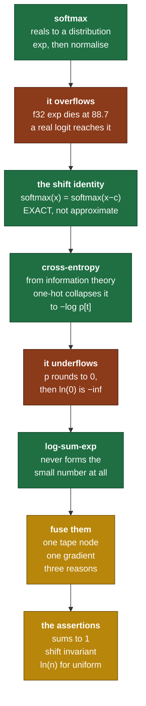

# Day 13 — Softmax and cross-entropy

> **Read this file. It replaces the book for today.**
> The page numbers stay as optional depth. This lesson teaches the same material in my own words.
> Tick your boxes in [`RUST_TRACKER.md`](../RUST_TRACKER.md). This file holds no checkboxes.
> The short card is [`RUST_PHASE_0_1.md` Day 13](../RUST_PHASE_0_1.md#day-13--softmax-and-cross-entropy).

**Time: 3 hours. Claim: R0b. File you extend: `src/autograd.rs`.**
**Your tests are written: move `rust/tests/pending/day13.rs` to `rust/tests/day13.rs` at the start of the session.**
**Every op you add today gets a gradient check on the day it lands. That is the rule from yesterday.**

---

## 1. Why this day exists

Today you build the last two pieces of the loss, and both of them are traps.

**Softmax overflows.** Not at some extreme edge case. At a logit of 89, which a real model reaches inside the first thousand steps. The naive formula gives `inf / inf`, which is `NaN`, which spreads to every parameter in one backward pass.

**Cross-entropy underflows.** Computed as written, it takes a logarithm of a number that has already rounded to zero, and `ln(0)` is `-inf`.

Both faults have the same fix and it is not a hack. There is an exact algebraic identity that makes softmax invariant to a shift, and there is a rearrangement of the logarithm that never forms the small number in the first place. **Neither is an approximation.** The stable code computes the same mathematical function as the unstable code, and that is the part worth understanding: numerical stability here is algebra, not tolerance.

Then the two operations fuse. Separately each has an awkward gradient. Together the gradient collapses into one of the cleanest expressions in machine learning, and that collapse is the most important derivation in Phase 0. It is section 8, and it is yours.

### 1.1 What breaks later if you get this wrong

| If this is wrong | What breaks | Day |
|---|---|---|
| Softmax has no max-shift | Attention scores overflow, and the model gives `NaN` after a few hundred steps | Day 19, Phase 2 |
| Cross-entropy is not log-sum-exp form | The loss is `inf` for confident wrong predictions, which is exactly when you need it | Day 25, Phase 2 |
| The two are not fused | Two backward passes, worse precision, and a gradient you cannot check by hand | Day 25 |
| The batch factor is missing | The learning rate is wrong by the batch size, and every tuned value from a paper fails | Day 14, Phase 2 |
| The reduction axis is wrong | Softmax over the batch instead of the vocabulary. It trains, and it is nonsense. | Day 22 |
| No `ln(n)` assertion in the training loop | You spend an hour of compute before you learn the model is broken | Phase 2 |

### 1.2 The map of today



---

## 2. Softmax and cross-entropy, from first principles

### 2.1 What softmax is for

A model's last layer produces one real number per class. Those numbers are called **logits**, and they are unbounded: any sign, any magnitude.

To train against a probability target, you need a distribution instead. So you need a map from `n` arbitrary reals to `n` numbers that are positive and sum to one.

```text
   requirements                            what they rule out

   1. output is positive                   any plain linear rescaling
   2. outputs sum to 1                     an elementwise map with no
                                           coupling between elements
   3. larger logit -> larger probability   any non-monotone map
   4. differentiable everywhere            max(), argmax, hard clipping
```

Requirement 1 wants a positive function of each logit. Requirement 2 wants a division by the total. Put them together:

```text
                     g(xᵢ)
   softmax(x)ᵢ  =  ---------          for some positive g
                    Σⱼ g(xⱼ)
```

`g = exp` is the choice, and it is not arbitrary. Two properties pick it out.

**It turns addition into multiplication.** `exp(a + b) = exp(a)·exp(b)`. So a constant added to every logit multiplies every numerator by the same factor, which cancels in the division. That gives the shift invariance of section 2.3, and shift invariance is what makes the function well behaved on unbounded inputs.

**It makes the logits log-odds.** Take the ratio of two probabilities:

```text
   pᵢ / pⱼ  =  exp(xᵢ) / exp(xⱼ)  =  exp(xᵢ − xⱼ)

   so       ln(pᵢ / pⱼ)  =  xᵢ − xⱼ
```

The **difference** of two logits is the log of the odds ratio. That is why only differences matter, and it is the same fact as shift invariance seen from the other side.

**Temperature** rescales those differences. `softmax(x / T)` with `T > 1` shrinks the differences and flattens the distribution, and `T < 1` sharpens it. `T → 0` gives argmax. You do not build it today. Day 25 samples with it.

### 2.2 The overflow, with real numbers

`exp` grows fast enough to leave the float range at a modest input.

```text
   f32   largest finite value  ≈ 3.40e38     ln of it  ≈  88.72
   f64   largest finite value  ≈ 1.80e308    ln of it  ≈ 709.78

   so in f32:   exp(88.0)  =  1.65e38        fine
                exp(89.0)  =  inf            gone
```

A logit of 89 is not exotic. An untrained model with a bad initialisation reaches it. A trained model that is confident reaches it. And the failure is total, not gradual:

```text
   x = [1000.0, 1001.0, 1002.0]        the true softmax is about
                                       [0.09003, 0.24473, 0.66524]

   naive:   exp(1000) = inf
            exp(1001) = inf
            exp(1002) = inf
            sum       = inf
            inf / inf = NaN

   every output is NaN, and NaN spreads through the whole backward pass
```

Note what the true answer is. It depends only on the **differences**, which are 0, 1 and 2. The information the function needs is entirely in the small numbers. The overflow destroys it by carrying the large common part into the exponential, where it does not belong.

### 2.3 The shift identity

For any scalar `c`:

```text
                        exp(xᵢ − c)              exp(xᵢ)·exp(−c)
   softmax(x − c)ᵢ  =  ---------------    =    --------------------
                        Σⱼ exp(xⱼ − c)          Σⱼ exp(xⱼ)·exp(−c)


                        exp(−c) · exp(xᵢ)
                    =  ---------------------      exp(−c) is constant
                        exp(−c) · Σⱼ exp(xⱼ)      so it factors out


                        exp(xᵢ)
                    =  ------------    =   softmax(x)ᵢ
                        Σⱼ exp(xⱼ)
```

**This is an identity, not an approximation.** The two expressions are equal as real numbers, for every `c` and every `x`. In floating point they are not equally computable, and that is the entire point: you are free to choose the `c` that makes the computation survive.

Choose `c = max(x)`. Then the largest shifted input is exactly 0, `exp(0) = 1`, and every other term is in `(0, 1]`.

```text
   x = [1000.0, 1001.0, 1002.0]     c = 1002.0

   x − c        = [−2.0, −1.0, 0.0]
   exp(x − c)   = [0.1353, 0.3679, 1.0000]      no term can overflow
   sum          = 1.5032                        and the sum is at least 1
   divide       = [0.09003, 0.24473, 0.66524]   the true answer
```

Two guarantees fall out and both are worth stating.

- **No overflow, ever.** Every shifted input is at most 0, so every exponential is at most 1.
- **The denominator is at least 1**, because the maximum element contributes exactly 1. So the division never divides by zero, and underflow in the small terms is harmless: they were negligible anyway.

`max_axis` from Day 5 is what makes this possible, and the card for Day 5 said so at the time.

### 2.4 Cross-entropy, from information theory

Start with **surprise**. An event of probability `p` carries `−ln(p)` nats of information. A certain event has zero surprise. An impossible event has infinite surprise. The logarithm makes the surprise of two independent events add.

**Entropy** is the expected surprise under the true distribution:

```text
   H(p)  =  − Σᵢ  pᵢ ln pᵢ
```

**Cross-entropy** is the expected surprise when the truth is `p` and your model says `q`:

```text
   H(p, q)  =  − Σᵢ  pᵢ ln qᵢ
```

Read it as the average number of nats you spend when you encode data from `p` using a code built for `q`. It is minimised, over all `q`, exactly at `q = p`. That is why it is a loss: driving it down drives your model toward the truth, and it has no other minimum to get stuck in.

The gap between them is the **KL divergence**, `H(p,q) − H(p)`. `H(p)` does not depend on your model, so minimising cross-entropy and minimising KL are the same optimisation.

Now specialise. In language modelling the target is a single token, so `p` is one-hot at index `t`.

```text
   pᵢ = 1 when i == t,  else 0

   H(p, q)  =  − Σᵢ pᵢ ln qᵢ  =  − ln q_t
```

**The whole sum collapses to one term.** Every non-target class contributes zero to the loss value. It does **not** contribute zero to the gradient, and that difference is the heart of section 8.

**Units.** Natural log gives nats. Log base 2 gives bits, and `1 nat = 1.4427 bits`. Papers quote both. Perplexity is `exp(loss)` in nats, and it reads as "the model is as confused as if it were choosing uniformly among this many tokens".

### 2.5 The underflow, and why you do not compute softmax first

The obvious code is: run softmax, take the target's probability, take its log.

```text
   loss  =  −ln( softmax(x)[t] )
```

It fails whenever the model is confidently wrong, which is exactly when the loss matters most.

```text
   the model gives the target a true probability of 1e-45

   f32 smallest normal value is 1.18e-38, subnormals reach 1.4e-45

   softmax(x)[t]  rounds to  0.0
   ln(0.0)        =  −inf
   loss           =  inf,   and the gradient is NaN
```

There is a second, quieter fault. Even when the probability does not round to zero, you formed a small number by dividing, and then took a logarithm of it. Each step loses precision, and the logarithm of a value near zero amplifies whatever relative error the division introduced.

**The fix is to never form the small number.** Expand the expression:

```text
   −ln( softmax(x)[t] )

        = −ln(  exp(x_t)  /  Σⱼ exp(xⱼ)  )

        = −[ ln exp(x_t)  −  ln Σⱼ exp(xⱼ) ]

        =  ln Σⱼ exp(xⱼ)   −   x_t
```

The last line has no division and no small intermediate. It needs one quantity, `ln Σ exp(x)`, and that quantity has a name.

### 2.6 Log-sum-exp

```text
   logsumexp(x)  =  ln Σⱼ exp(xⱼ)
```

Computed as written it overflows for the same reason softmax does. Apply the same shift, with `m = max(x)`:

```text
   ln Σⱼ exp(xⱼ)  =  ln Σⱼ exp(xⱼ − m + m)

                  =  ln [ exp(m) · Σⱼ exp(xⱼ − m) ]

                  =  ln exp(m)  +  ln Σⱼ exp(xⱼ − m)

                  =  m  +  ln Σⱼ exp(xⱼ − m)
```

Again an exact identity. And again every exponential is now at most 1, and the sum inside the logarithm is at least 1, so the logarithm never sees a value below 1 and never returns `-inf`.

```text
   the stable loss, in three steps:

      m     =  max(x)
      lse   =  m  +  ln Σⱼ exp(xⱼ − m)
      loss  =  lse − x_t
```

Read the last line once more. **The loss is a difference of two numbers of similar size**, both computed accurately, with no division and no logarithm of anything small. It cannot be `inf` for finite logits, and it cannot be `NaN`.

`log_softmax` is the same quantity per element: `log_softmax(x)ᵢ = xᵢ − logsumexp(x)`. Note that it needs no exponential at all in the output path. When you need log probabilities, this is what you compute. **Never `ln(softmax(x))`.**

### 2.7 Fusing, and the three reasons

The card asks for `CrossEntropy` as a single tape node that takes logits and targets, rather than a composition of `softmax`, `ln`, index and `neg`.

Three arguments, in order of weight.

**One, the gradient collapses.** Composed, the backward pass walks four nodes and each one contributes a term. Fused, the gradient of the whole thing is a single short expression. The card states what it is. Section 8 asks you to derive it, and once you have, you will see that the composed version computes the same thing the long way round with more rounding.

**Two, precision.** Each intermediate node is a place to lose digits. Fusing removes the intermediates, so the fused backward is not only faster, it is more accurate.

**Three, memory.** The composed version stores a `[batch, vocab]` tensor at each of four nodes. For GPT-2 at batch 8 and sequence 1024 that is `8 × 1024 × 50257 × 4 bytes`, which is 1.6 GB **per node**. The fused node stores the logits once.

That third number is worth sitting with. The vocabulary axis is the largest axis in the model, and the loss is the only place it appears. Every design decision near the loss is dominated by it.

### 2.8 The batch reduction, and the factor you will get wrong

A batch has many examples. The loss must be one number.

```text
   sum      L = Σ_b loss_b            the gradient scales with the batch size
   mean     L = (1/B) Σ_b loss_b      the gradient does not
```

**Take the mean.** The reason is practical: with `sum`, doubling the batch size doubles every gradient, so every learning rate you read in a paper is wrong for your batch size. With `mean`, the learning rate transfers.

The consequence for the backward arm is one factor:

```text
   the gradient of the fused node carries a  1 / B  factor
```

`B` is the number of predictions, which for a language model is `batch × sequence` and not `batch`. Decide what your `targets` slice length means, write it in the doc comment, and use the same number in the forward and the backward.

**This is the most common single-character bug in the whole file.** The card's stuck-signal names it: if `cross_entropy_gradcheck` fails by the same constant factor on every element, it is this. Fix that one yourself.

### 2.9 The axis, and the shape you actually have

Softmax reduces along one axis, and picking the wrong one gives a model that trains and means nothing.

```text
   logits from a language model:   [batch, seq, vocab]

   softmax over axis 2  (vocab)    correct. "which token comes next"
   softmax over axis 0  (batch)    nonsense. "which example in the batch
                                    is this token most likely for"
```

The two produce the same shapes. No shape check catches the mistake. The only defence is the `softmax_sums_to_one` test, run along the axis you claim to reduce.

For the loss, the usual move is to flatten the leading axes:

```text
   [batch, seq, vocab]  ->  reshape  ->  [batch*seq, vocab]
   targets                              a slice of length batch*seq
```

Then the fused node only ever sees rank 2, and `targets` is a flat list of class indices. That is a decision to make and write down today, because it decides the shape of `cross_entropy` for the rest of the project.

### 2.10 Three assertions worth more than they look

**`softmax` sums to 1 along the reduced axis.** Catches a wrong axis and a wrong denominator.

**`softmax(x) == softmax(x + c)`.** Catches a missing shift, and it catches a shift applied to the numerator and not the denominator.

**Uniform logits over `n` classes give a loss of exactly `ln(n)`.** This is the one that pays for years. Any model whose output carries no information at all must produce this number, and it is the strongest cheap check that exists on a training run.

Self-check 2 asks you to compute the number for GPT-2's vocabulary and to say why it matters. **Do that before you read Phase 2.** Every training run in this project opens by asserting it.

### 2.11 The two backward arms are yours to derive

Today adds two `Op` variants, and each needs a `match` arm.

```text
   LogSumExp { input, axis }        derive this one FIRST
   CrossEntropy { logits, targets } the card states the result;
                                    section 8 asks you to derive it
```

**Neither derivation is in this lesson.** Do `LogSumExp` first: it is a clean application of the Day 11 toolkit, and the cross-entropy result follows from it in two lines once you have it. You have everything you need, which is the chain rule, the Kronecker delta from Day 11 section 2.2, the derivative of `exp`, and the quotient rule you used for `tanh` on Day 10.

When you have both, gradient-check them before you believe them. That is what yesterday was for.

---

## 3. The Rust you need today

Examples are on data with no connection to tensors.

### 3.1 An enum variant that carries a list

```rust
#[derive(Debug, Clone, PartialEq)]
enum Booking {
    Single { seat: u16 },
    Group  { seats: Vec<u16> },      // this variant owns a heap allocation
    Waitlist,
}
```

Three consequences, and all three apply to your `Op`.

**Size.** An enum is as large as its largest variant plus a tag. A `Vec` is 24 bytes on a 64-bit machine, so `Booking` is 32 bytes even for a `Waitlist`. Your `Op` already has `Broadcast { from: Vec<usize> }`, so it already pays this. Adding `CrossEntropy { targets: Vec<usize> }` costs nothing more in the size of `Op`. **It does cost in the heap**, once per node, and that matters for the reason in section 2.7.

**Clone.** `#[derive(Clone)]` on this enum gives a clone that allocates for the `Group` variant and not for the others. So `ops[i].clone()` in your backward loop is cheap for most nodes and a real allocation for two of them. Prefer to match on a reference.

**Pattern matching binds the list by reference.**

```rust
fn seat_count(b: &Booking) -> usize {
    match b {
        Booking::Single { .. } => 1,
        Booking::Group { seats } => seats.len(),   // `seats` is &Vec<u16>
        Booking::Waitlist => 0,
    }
}
```

### 3.2 `matches!` for a one-line test

```rust
let b = Booking::Waitlist;

// long form
let waiting = match b { Booking::Waitlist => true, _ => false };

// short form, same thing
let waiting = matches!(b, Booking::Waitlist);

// with a guard
let big = matches!(&b, Booking::Group { seats } if seats.len() > 4);
```

Useful in tests and in assertion messages. **Do not use it in the backward loop.** The wildcard inside `matches!` is exactly the wildcard Day 10 forbids, and the whole point of the exhaustive `match` is that adding an op breaks the build.

### 3.3 A generic enum

```rust
#[derive(Debug)]
enum Slot<T> {
    Filled(T),
    Empty,
}

impl<T: std::fmt::Debug> Slot<T> {
    fn describe(&self) -> String {
        match self {
            Slot::Filled(v) => format!("{v:?}"),
            Slot::Empty => "empty".to_string(),
        }
    }
}
```

`Option<T>` and `Result<T, E>` are exactly this, in the standard library. Your `Op` is **not** generic over `T`, and that is deliberate: an `Op` records structure, and the values live in `Tape::values`. Keep it that way. A generic `Op` forces a type parameter through every place an op is named, for no gain.

### 3.4 Book pages

*Programming Rust*: "Enums with Data" p. 214, "Generic Enums" p. 218.

The real prereq today is Raschka section 5.1.2, pp. 132–140, for the information-theory framing.

---

## 4. What you build today

### 4.1 The op variants

```rust
// src/autograd.rs — extend the Op enum
//
//   LogSumExp { input: NodeId, axis: usize },
//   CrossEntropy { logits: NodeId, targets: Vec<usize> },   // fused fwd + bwd
```

Adding these breaks every exhaustive `match` in the file until you write the arms. **That is the enum working as designed.** Day 10 section 2.8 promised this, and today is the first time it collects.

### 4.2 The functions

```rust
/// Pushes Op::LogSumExp. This is the one new primitive of the day.
pub fn logsumexp<T: Scalar>(tape: &mut Tape<T>, x: NodeId, axis: usize) -> NodeId;

pub fn softmax<T: Scalar>(tape: &mut Tape<T>, x: NodeId, axis: usize) -> NodeId;
pub fn log_softmax<T: Scalar>(tape: &mut Tape<T>, x: NodeId, axis: usize) -> NodeId;

/// Fused. Backward is softmax(logits) − onehot(targets), scaled by 1/batch.
pub fn cross_entropy<T: Scalar>(tape: &mut Tape<T>, logits: NodeId, targets: &[usize]) -> NodeId;
```

**Note what `softmax` and `log_softmax` are not.** They are not new `Op` variants. They are compositions built from ops you already own plus `LogSumExp`, so their gradients come for free from the existing arms. Only `LogSumExp` and `CrossEntropy` are new nodes.

`log_softmax(x) = x − logsumexp(x, axis)` is a broadcasting subtraction, and `softmax` is its exponential. Both are two lines once `logsumexp` exists.

That leaves one question you must answer before you write them: **does `max` need to be part of the graph?** The shift by the maximum is exact, so the result does not depend on it. Whether the gradient flows through the `max` is therefore a choice, and the two answers give the same numbers for a different amount of work. Decide, and write one sentence of why in the commit message. Your gradient check will hold you to it.

### 4.3 Design points to decide, and to record

**One. What rank does `cross_entropy` accept?** Section 2.9 recommends rank 2 with flattened leading axes. State it in the doc comment and enforce it.

**Two. What is `B` in the `1/B` factor?** The length of `targets`, which is the number of predictions. Write it in the doc comment.

**Three. What happens when a target index is out of range?** A target of 50257 in a 50257-class problem is an off-by-one in the data pipeline, and it is a bug, not a state. Panic with a message that names the index and the bound.

**Four. Does the tape store `targets` by value?** The card's variant owns a `Vec<usize>`. For a `[8, 1024]` batch that is 8192 `usize`, which is 64 KB per node, once per step. That is acceptable. Note it.

**Five. Does `LogSumExp` keep the reduced axis?** Choose, and match Day 5's `keepdim` convention. The subtraction in `log_softmax` broadcasts, so `keepdim = true` composes and `keepdim = false` needs a reshape.

---

## 5. The tests, and the trap in each one

```bash
mv tests/pending/day13.rs tests/day13.rs
cargo test --test day13
```

| Test | What it traps |
|---|---|
| `softmax_sums_to_one` | A wrong reduction axis, and a denominator that is not the sum of the same set the numerator came from. It checks a rank-3 tensor along two different axes, so an implementation hardcoded to the last axis fails. |
| `softmax_overflow_safe` | A missing shift. The naive formula returns `NaN` here. The test asserts every output is finite **and** correct, because a shift applied to the numerator only gives finite garbage. |
| `softmax_shift_invariant` | A shift by the wrong quantity. Adding 500 to the input must change nothing, so a shift by a per-tensor constant instead of a per-row maximum shows up as a row-dependent error. |
| `cross_entropy_uniform_is_ln_n` | Almost everything at once. A wrong base, a missing negation, a sum instead of a mean, and a wrong reduction all move this number. It runs several class counts, so a fault that happens to be right at one `n` fails at another. |
| `cross_entropy_gradcheck` | The fused gradient. It runs your Day 12 checker in `f64` at `1e-5`, and it also compares the analytic gradient against a directly constructed one, so a fault that is wrong in the same way in both places still fails. |
| `logsumexp_gradcheck` | The other new arm, on its own. If this fails and the cross-entropy check also fails, fix this one first. |

**One test the card asks for is not here.** The card lists a fixture test against committed PyTorch reference values. Those fixtures do not exist yet: section 6 of `RUST_PHASE_0_1.md` schedules them for one Colab session before Day 21. **Record it as owed, in `PROGRESS.md`, on the day you read this.** A deferred item that is written down is a plan. One that is not is a hole.

---

## 6. Order of work

1. Move the test file. Run `cargo test --test day13`. That is the red.
2. Add the two `Op` variants. **The build breaks.** Add `todo!()` arms so it compiles again, and read the error list first: it is a complete list of the places that care about the op set.
3. Write `LogSumExp` forward, with the shift from section 2.6. Make the value correct before you touch a gradient.
4. Write `softmax` and `log_softmax` as compositions. Make the first three tests pass. **Commit.**
5. Derive the `LogSumExp` backward on paper. Write the arm. Make `logsumexp_gradcheck` pass. **This is the first gradient today, and it must be checked before you build on it.** **Commit.**
6. Do self-check 1 on paper. **Before you write the cross-entropy arm, not after.**
7. Write `cross_entropy` forward. Make `cross_entropy_uniform_is_ln_n` pass.
8. Write the `CrossEntropy` backward arm. Make `cross_entropy_gradcheck` pass.
9. Run `cargo test`. All of Days 1 to 13.
10. Run `cargo clippy`. Fix every warning. **Commit.**
11. Do self-check 2. It is one logarithm and one paragraph, and the paragraph is the valuable half.
12. Add the owed fixture item to `PROGRESS.md`.

**Step 6 is placed there on purpose.** The derivation is the deliverable of the day, and doing it after the code turns it into a description of what you already typed.

---

## 7. Compiler errors and numerical faults you will meet today

| Symptom | What it means | Where to look |
|---|---|---|
| `E0004: non-exhaustive patterns` in three places | You added the variants. Now write the arms. | This is the enum working. Never add `_ =>`. |
| `E0507: cannot move out of ... Vec<usize>` | The `CrossEntropy` arm tried to take `targets` by value out of a borrowed `Op`. | Match on a reference and borrow the slice. |
| `E0499` in the new arm | The arm reads `values` and writes `grads` in one statement. | Day 10, section 3.4. `std::mem::take`. |
| **Numerical:** softmax gives `NaN` | No shift, or the shift is on the numerator only. | Section 2.3. |
| **Numerical:** softmax outputs are finite and sum to more than 1 | The shift was applied to the numerator and not to the denominator. | The same section. |
| **Numerical:** the loss is `inf` for a confident wrong prediction | You computed `ln(softmax(x))` instead of the log-sum-exp form. | Section 2.5. |
| **Numerical:** `cross_entropy_uniform_is_ln_n` gives `ln(n)` times `n` | A sum where a mean belongs. | Section 2.8. |
| **Numerical:** `cross_entropy_uniform_is_ln_n` gives `log2(n)` | Base 2 instead of natural log. | `T::ln`, not a conversion. |
| **Numerical:** the gradient check fails by the **same** constant factor everywhere | The batch normalisation factor. **Fix this one yourself.** | Section 2.8. |
| **Numerical:** the gradient check fails by a **varying** factor | A real fault in the derivation. **Ask.** | Section 2.11. |
| **Numerical:** the gradient is right for the target class and wrong for the others | You differentiated the collapsed loss value and forgot that the non-target logits still enter through the denominator. | Section 2.4, last line. |
| **Logic:** softmax "works" and the model learns nothing | The reduction axis. | Section 2.9. |

---

## 8. Self-check — on paper, before you close the laptop

I answer neither of these. Both go in `hand_math/`.

1. **The most important derivation in Phase 0.** Start from `L = −log(softmax(x)[t])`. Compute `∂L/∂xᵢ` for the case `i == t` and for the case `i ≠ t`, separately, from first principles. Show that both cases collapse to the single expression `softmax(x)ᵢ − 1[i == t]`. **Do it with no notes**, and do it before you write the cross-entropy backward arm. If you get stuck, derive the gradient of `logsumexp` first: the rest follows from it in two lines.
2. **The number that saves you an hour of compute.** GPT-2 has a vocabulary of 50257. What is the expected cross-entropy of a completely untrained model on it? Compute the number. Then write one paragraph on why this single value is the most valuable assertion in a training loop, and what three different faults it catches at step 0.

---

## 9. Stuck-signals — the points where you ask

- `cross_entropy_gradcheck` fails by a constant factor on every element. **That is the batch normalisation. Fix it yourself.** If the factor varies between elements, ask.
- Softmax gives `NaN` and you have added a shift. Check whether the shift reaches the denominator. **Ask after 15 minutes.**
- `logsumexp_gradcheck` will not pass, and the forward value is correct. **Ask after 30 minutes.** Bring the index-form expression you derived, however incomplete.
- Self-check 1 will not close after 40 minutes. **Ask.** The `i ≠ t` case is where people stall, and the reason is almost always forgetting that the denominator depends on every logit.
- You cannot decide whether the `max` belongs in the graph. **Ask after 20 minutes.** State which way you lean and what you think the gradient check will say.
- You want to compute `softmax` then `ln` because it is shorter. Read section 2.5. Then decide again.

---

## 10. The post

The hook is at the end of the [Day 13 card](../RUST_PHASE_0_1.md#day-13--softmax-and-cross-entropy), written in your voice.

---

## 11. Done means all six

1. `cargo test` passes, with Days 1 to 13 green.
2. `cargo clippy` gives no warnings.
3. Both new backward arms pass a gradient check in `f64`, and neither `match` has a wildcard arm.
4. The cross-entropy derivation is photographed into `hand_math/`, done before the code was written.
5. The `ln(50257)` number and its paragraph are in `hand_math/`, and the owed PyTorch fixture is recorded in `PROGRESS.md`.
6. The post is public, and `PROGRESS.md` records what is proven and names nothing else.

> **Tomorrow closes Phase 0.** Day 14 adds the optimizer, trains a real model on a real dataset, and asserts that every op you own has a passing gradient check. Read the Day 14 card tonight: its capstone test is the acceptance test for the whole R0b claim.
