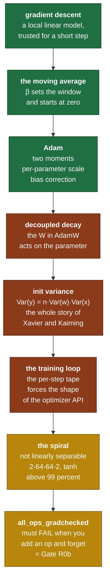

# Day 14 — Optimizers, and the Phase 0 capstone

> **Read this file. It replaces the book for today.**
> The page numbers stay as optional depth. This lesson teaches the same material in my own words.
> Tick your boxes in [`RUST_TRACKER.md`](../RUST_TRACKER.md). This file holds no checkboxes.
> The short card is [`RUST_PHASE_0_1.md` Day 14](../RUST_PHASE_0_1.md#day-14--optimizers-and-the-phase-0-capstone).

**Time: 3.5 hours. Claim: R0b. Files you create: `src/optim.rs` and `src/nn.rs`.**
**Your tests are written: move `rust/tests/pending/day14.rs` to `rust/tests/day14.rs` at the start of the session.**
**Deliverable: `evidence/phase0_spiral_loss.csv` and its plot. Today closes Gate R0b and Phase 0.**

> **The capstone has its own file: [`capstone_r0b/README.md`](../capstone_r0b/README.md).**
> This lesson has 3.5 hours to teach AdamW *and* run the capstone. That file is the
> capstone on its own, with the measured numbers, the failure atlas, and the
> **diagnostic ladder** you work when it does not train. Read it the evening before.

---

## 1. Why this day exists

You have a forward pass, a backward pass and an oracle that proves the backward pass right. You have never trained anything.

Today the loop closes. An optimizer turns gradients into parameter updates, an `nn` module gives you a layer with weights, and a two-spiral dataset makes the whole thing prove itself on a problem that a linear model cannot solve.

Two things make this more than a wiring day.

**AdamW is four lines of arithmetic that everybody copies and few people can defend.** Every hyperparameter in it has a reason. Section 8 makes you trace one step by hand, and after that `β₂ = 0.999` stops being a magic number.

**The capstone test is the acceptance test for the whole R0b claim.** `all_ops_gradchecked` must fail when you add an op and forget its check. Building a test that is guaranteed to break in the future is a different skill from building one that passes now, and Rust gives you a way to make the compiler enforce it.

### 1.1 What breaks later if you get this wrong

| If this is wrong | What breaks | Day |
|---|---|---|
| No bias correction | The first few hundred steps take near-zero steps, and warmup looks broken | Phase 2 |
| Weight decay is coupled into the gradient | Decay is scaled by the second moment, so rarely-updated parameters decay less. Regularisation silently varies per parameter. | Phase 2 |
| `all_ops_gradchecked` can be satisfied by a wildcard | You add an op at Day 18 or Day 21, forget its gradient, and learn at Day 25 | Days 18, 19, 21 |
| Init variance is wrong | tanh saturates at layer 3, gradients die, and the loss sits at chance | Day 22, Phase 2 |
| The optimizer holds `NodeId`s across steps | The tape is per step, so the ids point into a tape that no longer exists | Phase 2 |
| The loss curve is not written to a file | The claim has no artifact, and a claim without its artifact is not done | today |

### 1.2 The map of today



---

## 2. Optimization, from first principles

### 2.1 What a gradient step actually assumes

The gradient gives the direction of steepest increase **at one point**. Around that point, the first-order model of the loss is

```text
   L(θ + Δ)  ≈  L(θ)  +  g · Δ            with  g = ∂L/∂θ
```

Take `Δ = −lr · g` and the model predicts the loss falls by `lr · |g|²`. That is the entire justification of gradient descent, and it says nothing about what happens outside a small neighbourhood.

**So the learning rate is not a speed setting. It is a statement of how far you trust a linear approximation.**

```text
   lr too small     the model is trusted less than it deserves.
                    Progress is slow but monotone.

   lr too large     you step outside the region where the linear model
                    holds. The loss can rise, and it can diverge.
```

Momentum, per-parameter scaling and schedules are all answers to the same question: how do you take the largest step that the local model still supports.

### 2.2 The exponential moving average

The gradient of a mini-batch is a noisy estimate of the gradient of the full dataset. Averaging over recent steps reduces the noise.

An exponential moving average does it with one number of state:

```text
   mₜ  =  β · mₜ₋₁  +  (1 − β) · gₜ
```

Unroll it to see what it holds:

```text
   mₜ  =  (1 − β) · [ gₜ  +  β·gₜ₋₁  +  β²·gₜ₋₂  +  β³·gₜ₋₃  +  ... ]
```

The weights fall off geometrically. The sum of `β^i` for `i` from 0 to infinity is `1/(1−β)`, so the average has an **effective window** of about that many steps.

```text
   β = 0.9      window ≈ 10 steps
   β = 0.99     window ≈ 100 steps
   β = 0.999    window ≈ 1000 steps
```

That is where Adam's defaults come from, and they are the first thing to reach for when a training run behaves strangely. `β₁ = 0.9` smooths the direction over roughly ten batches. `β₂ = 0.999` estimates the gradient scale over roughly a thousand, because a scale estimate needs far more samples than a direction estimate.

**The bias.** The recursion starts at `m₀ = 0`, so early averages are pulled toward zero. Sum the geometric weights for a finite `t`:

```text
   the weights are  (1−β)·(1 + β + β² + ... + β^(t−1))  =  1 − β^t
```

They sum to `1 − β^t`, not to 1. So an EMA of a steady gradient reads **low** by exactly the factor `1 − β^t`, and the shortfall is large in the first steps and vanishes later.

```text
   β = 0.9      t = 1   the weights sum to 0.100     a tenth of the truth
                t = 10  the weights sum to 0.651
                t = 50  the weights sum to 0.995

   β = 0.999    t = 1   the weights sum to 0.001     a thousandth
                t = 1000 the weights sum to 0.632
```

Dividing by `1 − β^t` removes it exactly. That division is **bias correction**, and the `β₂` row is why it matters: without it, the first thousand steps of a run divide by a second-moment estimate that is a thousand times too small.

### 2.3 Why per-parameter scaling

Gradient magnitudes across a network vary by orders of magnitude. An embedding row touched by one rare token has a tiny gradient. A layer-norm gain has a large one. One global learning rate serves neither.

Adam divides each parameter's step by an estimate of that parameter's own gradient scale:

```text
                     m̂
   step   ∝    ---------------
                 sqrt(v̂) + ε
```

`v` is an EMA of the **squared** gradient, so `sqrt(v̂)` is a root-mean-square magnitude. Dividing by it makes the step roughly scale-free: multiply every gradient of one parameter by 1000 and its step barely changes.

`ε` is not a rounding guard bolted on. It sets the point below which the normalisation stops, so a parameter with a genuinely near-zero gradient does not get an enormous step from dividing by nearly nothing. `1e-8` is the usual value, and it goes **outside** the square root in the standard formulation. Inside and outside differ, and papers have been wrong about which they used.

### 2.4 The AdamW update

Here is the whole algorithm, for one parameter, at step `t`.

```text
   input:  g,  the gradient of the loss for this parameter

   mₜ  =  β₁ · mₜ₋₁  +  (1 − β₁) · g
   vₜ  =  β₂ · vₜ₋₁  +  (1 − β₂) · g²

   m̂ₜ  =  mₜ / (1 − β₁ᵗ)
   v̂ₜ  =  vₜ / (1 − β₂ᵗ)

   θₜ  =  θₜ₋₁  −  lr · ( m̂ₜ / (sqrt(v̂ₜ) + ε)  +  wd · θₜ₋₁ )
```

Read the last line carefully. **The decay term uses the parameter, and it is added outside the normalisation.** That is the "W", and it is the only difference from Adam.

The alternative places the decay inside the gradient, before the moments are computed. It has a different name and a long history. **Self-check 2 asks you to write both updates down and find the term that differs, so this lesson gives you only the one you implement.**

`t` counts optimizer steps, starting at 1, and it is state on the optimizer. It is not the epoch, and it does not reset between epochs.

**SGD with momentum, for contrast**, is two lines:

```text
   vₜ  =  μ · vₜ₋₁  +  g
   θₜ  =  θₜ₋₁  −  lr · vₜ
```

No second moment, no bias correction, no decoupling. Build it first today. It makes the first test pass and it gives you the loop shape to hang AdamW on.

### 2.5 Initialisation, derived

A layer computes `yᵢ = Σⱼ wᵢⱼ xⱼ` over `n` inputs. Take `w` and `x` independent with zero mean. Then

```text
   Var(yᵢ)  =  Σⱼ Var(wᵢⱼ · xⱼ)  =  n · Var(w) · Var(x)
```

The activation variance is multiplied by `n · Var(w)` at every layer. That factor compounds.

```text
   factor = 0.5     after 12 layers  0.5¹²  = 0.00024    signal vanishes
   factor = 1.0     after 12 layers  1.0¹²  = 1.0        stable
   factor = 2.0     after 12 layers  2.0¹²  = 4096       signal explodes
```

Set the factor to 1 and solve:

```text
   n · Var(w) = 1        ->      Var(w) = 1 / n_in
```

That is the LeCun and Xavier family. **Kaiming** adjusts it for ReLU, which zeros about half the units and therefore halves the variance, so it uses `2 / n_in` to compensate. The general form is `gain² / n_in`, with the gain chosen for the activation.

**This is a design point today, and the card and the test disagree with each other on purpose.** The card says Kaiming init. The capstone network uses `tanh`, not ReLU, and `tanh` does not zero half its units. So the ReLU gain of `sqrt(2)` is the wrong constant for this network. Choose the gain, write the reason in the commit message, and let the spiral test settle it if you are unsure. Both choices train. One of them trains more reliably, and finding out which by measurement is worth ten minutes.

**The bias starts at zero.** There is no variance argument for a bias, and a non-zero start breaks the symmetry you wanted the weights to break.

### 2.6 The training loop, and why the optimizer signature looks strange

Day 9 established that the tape is per step: build it, run forward, run backward, read the gradients, drop it. That single fact decides the whole shape of the API.

```text
   for each step:

     1.  tape = Tape::new()                    a FRESH tape
     2.  for each parameter tensor:
             id = tape.leaf(param.clone(), requires_grad = true)
         keep the (id, tensor) pairs
     3.  forward the model, producing a loss node
     4.  tape.backward(loss)
     5.  optimizer.step(&tape, &mut params)    reads grads, writes tensors
     6.  drop(tape)                            everything is freed
```

**The parameters live outside the tape and are re-fed as leaves every step.** They must, because the tape dies at step 6 and the parameters do not.

That is why the card's signature is what it is:

```rust
fn step(&mut self, tape: &Tape<T>, params: &mut [(NodeId, Tensor<T>)]);
```

The `NodeId` says where to read the gradient **on this tape**. The `Tensor<T>` is the parameter itself, owned outside. The pairing is rebuilt every step, and a `NodeId` kept across steps is a bug that produces a wrong number rather than a crash. Write that warning in the doc comment.

**One consequence worth seeing now.** The optimizer's own state, the `m` and `v` buffers, is indexed by **position in the params slice**, not by `NodeId`. So the caller must pass the parameters in the same order every step. That is a real precondition. State it.

### 2.7 The spiral, and what it proves

Two interleaved spirals, one class each. Each arm sweeps `4*pi` radians, so it wraps twice, while its radius grows from 0.1 to 1.1. The second arm is the first rotated by `pi`.

```text
              . . o o o
          .            o o
        .    . . o o      o
       .   .        o      o          . = class 0
       .  .   . o    o     o          o = class 1
       .  .  .  x   o     o
       .  .   .    o     o            no straight line separates them
        .   . .  o    o o             no single hidden layer of 2 units
          .    o o  o                 separates them either
              o o o
```

**How hard is it, in a number?** Every direction and every threshold was tried, so this is the exact optimum over all linear classifiers, not a fit:

```text
   chance                                50.0 percent
   the best straight line that exists    60.5 percent
   the capstone bar                      99.0 percent
```

The gap between 60.5 and 99 is the part only a non-linear model reaches. That gap is what your autograd has to earn, and it is why the turn count is `4*pi` and not something milder. `capstone_r0b/README.md` section 2.3 has the sweep that fixed the number.

The dataset is small, it is generated with no download, and it is impossible for a linear model. So a network that reaches above 99 percent on it has proved something specific:

- The forward pass composes correctly through several layers.
- The backward pass carries gradients through all of them, not just the last.
- The optimizer takes steps that actually reduce the loss.
- The initialisation did not kill the signal before training started.

**And there is a diagnostic number.** Two balanced classes with a model that has learned nothing give a cross-entropy of `ln(2) ≈ 0.693`. That is yesterday's `ln(n)` assertion at `n = 2`.

```text
   loss falls to ~0.693 and stops       the model predicts 50/50.
                                        Gradcheck passes, so the autograd
                                        is fine. This is a DEAD GRADIENT
                                        problem, not a correctness problem.

   the two causes, in order:
     1. saturated tanh from an init variance that is too large
        (Day 10 section 2.4: tanh' = 1 − y², which is 0 at the ends)
     2. a learning rate large enough to push the units into saturation
        in the first few steps
```

The card's stuck-signal for today is this paragraph. If a learning-rate sweep does not fix it, the init variance is where to look next.

### 2.8 `all_ops_gradchecked`, and how to make it fail in the future

The card says this test is the R0b acceptance test, and that it **must fail when you add an op and forget its check**. A test that only passes today is not that.

A list of op names in a test file does not work: you add a variant and the list stays valid. The trick is to make the **compiler** own the exhaustiveness.

```text
   inside the test, write a match over Op with one arm per variant
   and NO wildcard arm. Each arm either:

       - builds a small graph using that op, runs grad_check, and
         asserts it passes, or
       - returns a "covered elsewhere" marker with a written reason

   Add a variant on Day 18 and this test file stops compiling.
   A test that does not compile is a failing test, and it names the
   exact variant you forgot.
```

That is the whole idea, and it is the same property Day 10 protected by refusing wildcard arms in the backward pass. **The property is only worth having if nobody adds `_ =>` later**, so write a comment above the match saying what it is for and what a wildcard destroys.

`Op` has no value to match on until you have one, so the arm selection needs a representative `Op` value per variant. Constructing them is cheap and the test file does it.

---

## 3. The Rust you need today

Examples are on data with no connection to tensors.

### 3.1 Generics against trait objects

Two ways to write "a function that works for many types". They compile to different machine code and the difference matters today.

```rust
trait Shape {
    fn area(&self) -> f64;
    fn name(&self) -> &'static str { "shape" }    // a default method
}

struct Circle { r: f64 }
struct Square { side: f64 }

impl Shape for Circle {
    fn area(&self) -> f64 { std::f64::consts::PI * self.r * self.r }
    fn name(&self) -> &'static str { "circle" }
}
impl Shape for Square {
    fn area(&self) -> f64 { self.side * self.side }
    // no name(), so the default is used
}
```

```rust
// STATIC dispatch. One copy of the function per concrete type, at compile
// time. The call is direct, and it inlines.
fn total_static<S: Shape>(shapes: &[S]) -> f64 {
    shapes.iter().map(|s| s.area()).sum()
}

// DYNAMIC dispatch. One copy of the function. Each value carries a pointer
// to its own vtable, and the call goes through it.
fn total_dynamic(shapes: &[Box<dyn Shape>]) -> f64 {
    shapes.iter().map(|s| s.area()).sum()
}
```

| | `impl Trait` / `<S: Shape>` | `Box<dyn Shape>` |
|---|---|---|
| Dispatch | at compile time, inlinable | at runtime, through a vtable |
| Code size | one copy per type used | one copy |
| A heterogeneous collection | **impossible.** `&[S]` is one type. | **possible.** A `Vec<Box<dyn Shape>>` holds both. |
| Cost per call | zero | a pointer load and an indirect jump |

**The choice for the optimizer.** `step` is called once per training step, not once per element, so the vtable cost is nothing. And a `Box<dyn Optimizer<T>>` lets a training function accept either `Sgd` or `AdamW` without being generic over the optimizer, which keeps the signature of everything downstream simple. **Take the trait object here.** Day 12 took the other choice for `impl Fn`, and the reason was the opposite: thousands of calls, one type per call site.

### 3.2 Object safety

Not every trait can become a `dyn Trait`. The rule that bites is that a method with a generic type parameter cannot be dispatched through a vtable, because there is no single compiled version to point at.

```rust
trait Broken {
    fn compare<T: PartialOrd>(&self, a: T, b: T) -> bool;   // NOT object safe
}
// Box<dyn Broken> fails to compile.

trait Fine {
    fn area(&self) -> f64;                    // object safe
    fn scale(&mut self, k: f64);              // object safe
}
```

`Optimizer<T>` is generic over `T` at the **trait** level, not at the method level. That is fine: `Box<dyn Optimizer<f32>>` is a concrete type, and the vtable is built for it. **`Optimizer<T>` being generic in `T` is what keeps it object safe.** Move that parameter onto `step` and it stops working.

### 3.3 Default methods

`name()` above has a body in the trait. Implementors get it free and can override it.

```rust
trait Shape {
    fn area(&self) -> f64;
    fn describe(&self) -> String {
        format!("{} of area {:.2}", self.name(), self.area())   // calls other methods
    }
    fn name(&self) -> &'static str { "shape" }
}
```

A default method can call the trait's other methods, including the ones with no body. That is how `Optimizer::zero_grad` works on the card: it has one obvious implementation, so it lives in the trait and no optimizer repeats it.

### 3.4 `Drop`

```rust
struct Session { name: String }

impl Drop for Session {
    fn drop(&mut self) {
        println!("closing {}", self.name);
    }
}

fn f() {
    let _s = Session { name: "training".into() };
    // "closing training" prints here, at the end of the scope,
    // and it prints on a panic too.
}
```

Two rules that matter.

- **You never call `drop(&mut self)` yourself.** To drop early, call `std::mem::drop(value)`, which takes ownership and lets the value fall out of scope.
- **Drop order inside a scope is reverse declaration order.** Fields drop in declaration order.

You do not need a `Drop` impl today. You need to know that dropping the tape at the end of each step is what frees the forward values, and that it happens on its own with no code.

### 3.5 Book pages

*Programming Rust*: "Trait Objects" p. 238, "Which to Use" p. 243, "Default Methods" p. 246, "Drop" p. 282. Read pp. 237–245 as the prereq.

---

## 4. What you build today

### 4.1 The optimizer

```rust
// src/optim.rs
pub trait Optimizer<T: Scalar> {
    fn step(&mut self, tape: &Tape<T>, params: &mut [(NodeId, Tensor<T>)]);
    fn zero_grad(&mut self, tape: &mut Tape<T>) { tape.zero_grad() }
}

pub struct Sgd<T: Scalar> {
    pub lr: T,
    pub momentum: T,
    // velocity buffers, one per parameter, indexed by position
}

pub struct AdamW<T: Scalar> {
    pub lr: T,
    pub beta1: T,
    pub beta2: T,
    pub eps: T,
    pub weight_decay: T,
    step: u64,
    // m and v buffers, one per parameter, indexed by position
}
```

### 4.2 The layer

```rust
// src/nn.rs
pub struct Linear<T: Scalar> {
    pub w: Tensor<T>,
    pub b: Option<Tensor<T>>,
}

impl<T: Scalar> Linear<T> {
    /// `rng` seeds the init, so a run is reproducible.
    pub fn new(in_f: usize, out_f: usize, bias: bool, rng: &mut Rng) -> Self;

    /// Pushes this layer's parameters as leaves, then its forward pass.
    /// Appends `(id, tensor)` for `w`, then for `b` when present, to `params`.
    /// Returns the output node.
    pub fn forward(
        &self,
        tape: &mut Tape<T>,
        x: NodeId,
        params: &mut Vec<(NodeId, Tensor<T>)>,
    ) -> NodeId;
}
```

**`forward` takes `&self`, not `&mut self`.** The layer is not modified by a forward pass. The tape is. That distinction is the whole architecture in one signature, and if you find yourself needing `&mut self` here, something has moved into the wrong place.

**The fourth argument differs from the card, and the reason is forced.** `forward` must push the weight as a leaf to get a `NodeId` for it, and section 2.6's `step` needs exactly that id to find the gradient. A `forward` that returns only the output makes the caller push its own second set of leaves for the same weights, and only the first set receives a gradient. So the ids come back out with the output.

Each call creates new leaves, which is correct: the tape is new every step. Two rules follow, and both belong in the doc comment:

- **The append order is fixed**, `w` then `b`, layer by layer, so the optimizer's state stays aligned with the parameters across steps.
- **The caller writes the updated tensors back** into the layers after `step`, in the same order. Nothing else connects the optimizer's output to the model.

### 4.3 Design points to decide, and to record in the commit message

**One. What is the weight's shape, `[in, out]` or `[out, in]`?** Both work. HuggingFace's `Conv1D` stores `[in, out]`, and a standard `Linear` stores `[out, in]`. Day 24 loads real GPT-2 weights, and a mismatch there is one of the three traps named in section 6 of `RUST_PHASE_0_1.md`. **Pick now, write it in the doc comment, and put a note in `DECISIONS.md`.** You will thank yourself on Day 24.

**Two. The init gain.** Section 2.5. The card says Kaiming, the network uses tanh, and the two disagree. Choose and defend.

**Three. Where does `forward` put the bias?** A broadcast add over the batch axis. Day 10's broadcast backward already sums it back, so nothing new is needed. Confirm that with the gradient check rather than by reading.

**Four. How does the optimizer index its state?** By position in the `params` slice, per section 2.6. State the precondition in the doc comment: the caller passes the parameters in the same order every step.

**Five. Does `step` handle a `None` gradient?** A parameter that received no gradient this step is a real state, not always a bug. Decide between skipping it and panicking, and say why.

### 4.4 The evidence

```text
   evidence/phase0_spiral_loss.csv      epoch, loss, train_accuracy
   evidence/phase0_spiral_data.csv      x, y, label
   evidence/phase0_spiral_boundary.csv  x, y, p1   on a 200x200 grid over [-1.3, 1.3]
   evidence/phase0_spiral.md            the machine, the seed, the hyperparameters,
                                        the epoch where 99 percent was reached,
                                        the init gain you chose and why
```

Two plotting tools are written for you. They read those CSVs and never touch the crate:

```bash
python3 capstone_r0b/plot_loss.py       evidence/phase0_spiral_loss.csv
python3 capstone_r0b/render_boundary.py evidence/phase0_spiral_data.csv \
                                        evidence/phase0_spiral_boundary.csv

# the honest baseline, measured on YOUR points. Put the number in the write-up.
python3 capstone_r0b/render_boundary.py evidence/phase0_spiral_data.csv --best-line
```

**The seed goes in the write-up.** A loss curve you cannot reproduce is a picture, not evidence.

**The boundary image is the artifact that makes the post worth reading.** It costs one extra forward pass over a grid, and it is the only thing in this repo that shows a stranger what your autograd learned.

---

## 5. The tests, and the trap in each one

```bash
mv tests/pending/day14.rs tests/day14.rs
cargo test --test day14 --release
```

**Note the `--release`.** The spiral test trains a real network, and a debug build takes minutes where release takes seconds. This is the Day 7 lesson arriving in a test suite.

| Test | What it traps |
|---|---|
| `sgd_descends_quadratic` | The sign of the step. On `f(x) = (x−3)²` from `x = 0`, a step in the wrong direction diverges instead of converging, and a missing learning-rate multiply converges far too slowly to make the 200-step budget. |
| `adamw_bias_correction_first_step` | A missing or misplaced bias correction. It runs the first step at three gradient magnitudes that differ by six orders of magnitude, and asserts the step size is nearly the same for all three. Without the correction they differ enormously. |
| `adamw_weight_decay_is_decoupled` | Coupled decay. With a zero gradient and a non-zero decay, the decoupled update shrinks the parameter by exactly `lr · wd · θ`. The coupled version routes the decay through the second moment, so it produces a different and gradient-history-dependent number. A zero gradient is the one input where the two are unmistakably different. |
| `spiral_classification` | Everything, end to end. A 2→64→64→2 tanh MLP trained by your AdamW must exceed 99 percent train accuracy inside 2000 epochs, and write its loss curve to `evidence/`. It has a fixed seed so a failure is reproducible. |
| `all_ops_gradchecked` | A future you. It matches exhaustively over `Op` with no wildcard, so adding a variant on any later day stops this file compiling until the new op has a gradient check. **This is the R0b acceptance test.** |

---

## 6. Order of work

1. Move the test file. Run `cargo test --test day14`. That is the red.
2. **Do self-check 1 on paper now.** One AdamW step by hand, before you implement one. It takes fifteen minutes, and it is the difference between implementing the formula and understanding it.
3. Create `src/optim.rs`. Write the `Optimizer` trait with the default `zero_grad`.
4. Write `Sgd`. Make `sgd_descends_quadratic` pass. **Commit.**
5. Write `AdamW`, in the order of section 2.4's lines: moments, then correction, then the update, then the decay term. Make the two AdamW tests pass. **Commit.**
6. Create `src/nn.rs`. Write `Linear::new` with the init from section 2.5, and `Linear::forward`.
7. **Gradient-check a two-layer MLP before you train it.** The suite does this, and it is also the fastest way to find a wiring fault. A model that fails a gradient check will never train, and a training run is a very slow way to learn that.
8. Write `all_ops_gradchecked`'s missing coverage. Run it. **Commit.**
9. Run `spiral_classification` in release. Expect to tune the learning rate once or twice.
10. If the loss stops near 0.693, **work the diagnostic ladder in `capstone_r0b/README.md` section 7, from rung 0.** Do not tune before rung 5.
11. Write the three CSVs to `evidence/`. Run both plotting tools. Write the notes with the seed and the hyperparameters.
12. Run `cargo test --release`. All of Days 1 to 14.
13. Run `cargo clippy`. Fix every warning. **Commit.**
14. **Inject a fault and watch `all_ops_gradchecked` fail.** Break one backward arm, run it, put it back. This is a gate item.
15. Do self-check 2. Ship the post. Close Gate R0b.

**The natural stopping point is after step 8.** Steps 9 to 11 are the capstone and they deserve a fresh session with time to tune.

---

## 7. Compiler errors and training faults you will meet today

| Symptom | What it means | Where to look |
|---|---|---|
| `E0038: the trait Optimizer cannot be made into an object` | A method has its own generic parameter. | Section 3.2. The `T` belongs on the trait. |
| `E0507: cannot move out of ... behind a mutable reference` | You tried to take a `Tensor` out of the `params` slice. | Replace in place, or `std::mem::replace`. |
| `E0499` inside `step` | You borrowed `tape` and `params` in one expression that also needs `&mut self`. | Bind the gradient to a `let` first. |
| `E0004: non-exhaustive patterns` in `tests/day14.rs` | **The test is working.** You added an `Op` and it has no coverage. | Add the arm. Never add `_ =>`. |
| **Training:** the loss is `NaN` from step 1 | The init variance is far too large, or the learning rate is. | Print the loss at step 0. It must be near `ln(2)`. |
| **Training:** the loss at step 0 is not near 0.693 | The forward pass or the loss is wrong, before any optimizer is involved. | Day 13, section 2.10. Fix this before you tune anything. |
| **Training:** the loss falls and stops at about 0.693 | Dead gradients. Not an autograd fault, because gradcheck passes. | Section 2.7. Init variance first, then the learning rate. |
| **Training:** the loss rises and then diverges | The learning rate is outside the trust region. | Section 2.1. Divide it by 10. |
| **Training:** the first AdamW step is tiny | Bias correction is missing. | Section 2.2, the `β₂` row. |
| **Training:** it works at `wd = 0` and behaves strangely at `wd = 0.01` | The decay is coupled into the gradient. | Section 2.4, the last line. |
| **Training:** two runs with the same seed differ | Something is reading an unseeded `Rng`, or the parameter order changes between steps. | Section 2.6, last paragraph. |
| **Slow:** the spiral test takes minutes | A debug build. | `cargo test --release`. |

---

## 8. Self-check — on paper, before you close the laptop

I answer neither of these. Both go in `hand_math/`.

1. **Trace one AdamW step by hand.** One scalar parameter. `g = 0.1`, `m₀ = v₀ = 0`, `β₁ = 0.9`, `β₂ = 0.999`, `lr = 1e-3`, `ε = 1e-8`, `wd = 0`. Compute `m₁`, `v₁`, the corrected `m̂₁` and `v̂₁`, and the final update, writing every number. Show that the update magnitude is close to `lr`. Then state, in one sentence, why that is true by design and not by coincidence. Section 2.4 gives you the formulas. The arithmetic and the reason are yours.
2. **Decoupled against coupled decay.** Why is decoupled weight decay different from adding `wd · θ` to the gradient? Write both update rules in full, side by side. Name the single term that differs. Then work out what the `sqrt(v̂)` denominator does to an L2 gradient contribution, and say what that means for a parameter whose gradients have been consistently small.

---

## 9. Stuck-signals — the points where you ask

- The spiral loss falls and then sits at about 0.693. **The model predicts 50/50, gradcheck passes, so this is a dead-gradient problem and not an autograd fault.** Try an init-variance change and a learning-rate sweep. **Ask after 40 minutes** if neither moves it.
- The loss at step 0 is not near `ln(2)`. **Ask after 15 minutes.** Do not tune anything until this number is right. It is a forward-pass fault, and tuning cannot fix one.
- `adamw_bias_correction_first_step` passes at one gradient scale and fails at another. **Ask after 20 minutes.** That is the correction applied to one moment and not the other.
- `E0038` and you cannot see which method breaks object safety. **Ask after 15 minutes.**
- `all_ops_gradchecked` compiles but you cannot see how it can ever fail. **Ask.** That means the exhaustiveness trick is not in place, and the gate item is not real.
- You want to add a learning-rate schedule, an lr warmup, or gradient clipping. Stop. None are on this card. Write them in `whats_next.md` and take them in Phase 2 with a measured reason.

---

## 10. The post

The hook is at the end of the [Day 14 card](../RUST_PHASE_0_1.md#day-14--optimizers-and-the-phase-0-capstone), written in your voice. This one closes the claim, so put the spiral plot in it.

---

## 11. Done means all seven

1. `cargo test --release` is fully green, Days 1 to 14.
2. `cargo clippy` gives no warnings.
3. `all_ops_gradchecked` passes, **and you watched it fail after you injected a fault.**
4. `all_ops_gradchecked` matches exhaustively over `Op` with no wildcard arm, so a future op breaks the build.
5. `evidence/phase0_spiral_loss.csv`, the plot, and the notes with the seed are committed.
6. Both self-check derivations are photographed into `hand_math/`, and the AdamW trace shows every intermediate number.
7. The post is public, and **all four Gate R0b boxes are ticked in `RUST_TRACKER.md`**.

> ### Phase 0 ends here
>
> You now own a tensor library, a cache-blocked multithreaded matmul, a reverse-mode
> autograd, an independent gradient oracle, a numerically stable loss and an optimizer.
> Every one of them is proved by a test you watched fail first, and none of them
> depends on a crate.
>
> Phase 1 starts at Day 15 with byte-level BPE. Before you open it, run the Gate R0b
> list once more, mark **R0b ✅** in `PROGRESS.md`, and read section 6 of
> [`RUST_PHASE_0_1.md`](../RUST_PHASE_0_1.md) again. The four verification layers are
> about to matter far more than they did this week, and the Colab session that
> generates the fixtures needs to happen before Day 21.
